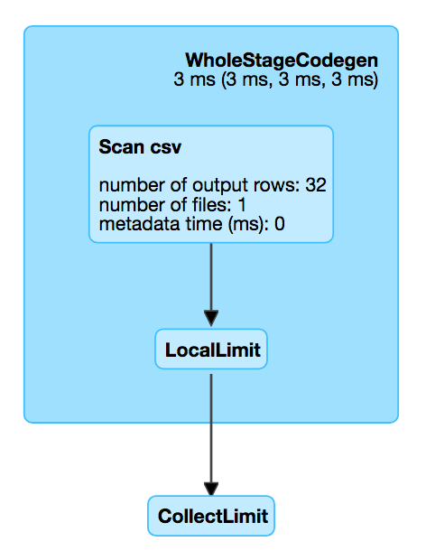

== [[FileSourceScanExec]] FileSourceScanExec Leaf Physical Operator

`FileSourceScanExec` is a link:spark-sql-SparkPlan-DataSourceScanExec.adoc[DataSourceScanExec] (and so indirectly a link:spark-sql-SparkPlan.adoc#LeafExecNode[leaf physical operator]) that...FIXME

`FileSourceScanExec` is <<creating-instance, created>> when `FileSourceStrategy` execution planning strategy link:spark-sql-SparkStrategy-FileSourceStrategy.adoc#apply[resolves] `LogicalRelation` logical operators.

[source, scala]
----
val q = spark.read.option("header", true).csv("../datasets/people.csv")
val logicalPlan = q.queryExecution.logical
scala> println(logicalPlan.numberedTreeString)
00 Relation[id#63,name#64,age#65] csv

import org.apache.spark.sql.execution.datasources.FileSourceStrategy
val sparkPlan = FileSourceStrategy(logicalPlan).head
scala> println(sparkPlan.numberedTreeString)
00 FileScan csv [id#63,name#64,age#65] Batched: false, Format: CSV, Location: InMemoryFileIndex[file:/Users/jacek/dev/oss/datasets/people.csv], PartitionFilters: [], PushedFilters: [], ReadSchema: struct<id:string,name:string,age:string>

import org.apache.spark.sql.execution.FileSourceScanExec
val fileScanExec = sparkPlan.asInstanceOf[FileSourceScanExec]
----

`FileSourceScanExec` supports `ColumnarBatchScan`.

[[inputRDDs]]
`FileSourceScanExec`...FIXME

[[nodeNamePrefix]]
`nodeNamePrefix` is *File* (and is used for the link:spark-sql-SparkPlan-DataSourceScanExec.adoc#simpleString[simple node description]).

[source, scala]
----
val fileScanExec: FileSourceScanExec = ... // see the example earlier
scala> fileScanExec.nodeNamePrefix
res1: String = File

scala> fileScanExec.simpleString
res2: String = FileScan csv [id#63,name#64,age#65] Batched: false, Format: CSV, Location: InMemoryFileIndex[file:/Users/jacek/dev/oss/datasets/people.csv], PartitionFilters: [], PushedFilters: [], ReadSchema: struct<id:string,name:string,age:string>
----

[[metrics]]
.FileSourceScanExec's Performance Metrics
[cols="1,2,2",options="header",width="100%"]
|===
| Key
| Name (in web UI)
| Description

| [[metadataTime]] `metadataTime`
| metadata time (ms)
|

| [[numFiles]] `numFiles`
| number of files
|

| [[numOutputRows]] `numOutputRows`
| number of output rows
|

| [[scanTime]] `scanTime`
| scan time
|
|===

.FileSourceScanExec in web UI (Details for Query)


CAUTION: FIXME Why is the node name of FileSourceScanExec in the diagram above without `File` nodeNamePrefix?

[[internal-registries]]
.FileSourceScanExec's Internal Properties (e.g. Registries, Counters and Flags)
[cols="1,2",options="header",width="100%"]
|===
| Name
| Description

| [[inputRDD]] `inputRDD`
| `RDD` of link:spark-sql-InternalRow.adoc[internal binary rows] (i.e. `InternalRow`)

Used when `FileSourceScanExec` is requested for <<inputRDDs, inputRDDs>> and <<doExecute, execution>>.

| [[metadata]] `metadata`
a| Metadata (as a collection of key-value pairs)

NOTE: `metadata` is a part of link:spark-sql-SparkPlan-DataSourceScanExec.adoc#metadata[DataSourceScanExec Contract] to..FIXME.

| [[needsUnsafeRowConversion]] `needsUnsafeRowConversion`
|

| [[pushedDownFilters]] `pushedDownFilters`
|

| [[supportsBatch]] `supportsBatch`
|
|===

[TIP]
====
Enable `INFO` logging level for `org.apache.spark.sql.execution.FileSourceScanExec` logger to see what happens inside.

Add the following line to `conf/log4j.properties`:

```
log4j.logger.org.apache.spark.sql.execution.FileSourceScanExec=INFO
```

Refer to link:spark-logging.adoc[Logging].
====

=== [[vectorTypes]] `vectorTypes` Method

[source, scala]
----
vectorTypes: Option[Seq[String]]
----

NOTE: `vectorTypes` is a part of link:spark-sql-ColumnarBatchScan.adoc#vectorTypes[ColumnarBatchScan Contract] to..FIXME.

`vectorTypes`...FIXME

=== [[doExecute]] Executing FileSourceScanExec -- `doExecute` Method

[source, scala]
----
doExecute(): RDD[InternalRow]
----

NOTE: `doExecute` is a part of link:spark-sql-SparkPlan.adoc#doExecute[SparkPlan Contract] to produce the result of a structured query as an `RDD` of link:spark-sql-InternalRow.adoc[internal binary rows].

`doExecute`...FIXME

=== [[doProduce]] Generating Java Source Code -- `doProduce` Method

[source, scala]
----
doProduce(ctx: CodegenContext): String
----

NOTE: `doProduce` is a part of link:spark-sql-CodegenSupport.adoc#doProduce[CodegenSupport Contract] to generate a Java source code for...FIXME

`doProduce`...FIXME

=== [[createBucketedReadRDD]] `createBucketedReadRDD` Internal Method

[source, scala]
----
createBucketedReadRDD(
  bucketSpec: BucketSpec,
  readFile: (PartitionedFile) => Iterator[InternalRow],
  selectedPartitions: Seq[PartitionDirectory],
  fsRelation: HadoopFsRelation): RDD[InternalRow]
----

`createBucketedReadRDD`...FIXME

NOTE: `createBucketedReadRDD` is used when...FIXME

=== [[createNonBucketedReadRDD]] `createNonBucketedReadRDD` Internal Method

[source, scala]
----
createNonBucketedReadRDD(
  readFile: (PartitionedFile) => Iterator[InternalRow],
  selectedPartitions: Seq[PartitionDirectory],
  fsRelation: HadoopFsRelation): RDD[InternalRow]
----

`createNonBucketedReadRDD`...FIXME

NOTE: `createNonBucketedReadRDD` is used when...FIXME

=== [[selectedPartitions]] `selectedPartitions` Internal Lazy-Initialized Property

[source, scala]
----
selectedPartitions: Seq[PartitionDirectory]
----

`selectedPartitions`...FIXME

[NOTE]
====
`selectedPartitions` is used when `FileSourceScanExec` calculates:

* <<outputPartitioning, outputPartitioning>> and <<outputOrdering, outputOrdering>> when `spark.sql.sources.bucketing.enabled` Spark property is turned on (which is on by default) and the optional link:spark-sql-BaseRelation-HadoopFsRelation.adoc#bucketSpec[BucketSpec] for <<relation, HadoopFsRelation>> is defined
* <<metadata, metadata>>
* <<inputRDD, inputRDD>>
====

=== [[creating-instance]] Creating FileSourceScanExec Instance

`FileSourceScanExec` takes the following when created:

* [[relation]] link:spark-sql-BaseRelation-HadoopFsRelation.adoc[HadoopFsRelation]
* [[output]] Output schema link:spark-sql-Expression-Attribute.adoc[attributes]
* [[requiredSchema]] link:spark-sql-StructType.adoc[Schema]
* [[partitionFilters]] `partitionFilters` Catalyst link:spark-sql-Expression.adoc[expressions]
* [[dataFilters]] `dataFilters` Catalyst link:spark-sql-Expression.adoc[expressions]
* [[tableIdentifier]] Optional `TableIdentifier`

`FileSourceScanExec` initializes the <<internal-registries, internal registries and counters>>.
