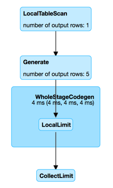

== [[GenerateExec]] GenerateExec Unary Physical Operator

`GenerateExec` is a link:spark-sql-SparkPlan.adoc#UnaryExecNode[unary physical operator] (i.e. with one <<child, child>> physical operator) that is <<creating-instance, created>> exclusively when `BasicOperators` execution planning strategy resolves link:spark-sql-SparkStrategy-BasicOperators.adoc#Generate[Generate] logical operator.

[source, scala]
----
val nums = Seq((0 to 4).toArray).toDF("nums")
val q = nums.withColumn("explode", explode($"nums"))
scala> q.explain
== Physical Plan ==
Generate explode(nums#15), true, false, [explode#24]
+- LocalTableScan [nums#15]

val sparkPlan = q.queryExecution.executedPlan
import org.apache.spark.sql.execution.GenerateExec
val ge = sparkPlan.asInstanceOf[GenerateExec]

scala> ge.supportCodegen
res2: Boolean = false
----

NOTE: <<child, child>> physical operator has to support link:spark-sql-CodegenSupport.adoc[CodegenSupport].

`GenerateExec` supports link:spark-sql-CodegenSupport.adoc[Java code generation] (aka _codegen_).

[[supportCodegen]]
`GenerateExec` does not support link:spark-sql-whole-stage-codegen.adoc[Java code generation] (aka _whole-stage codegen_), i.e. link:spark-sql-CodegenSupport.adoc#supportCodegen[supportCodegen] flag is turned off.

CAUTION: FIXME Why would a physical operator be `CodegenSupport` and have `supportCodegen` turned off?

[source, scala]
----
// Turn spark.sql.codegen.comments on to see comments in the code
// ./bin/spark-shell --conf spark.sql.codegen.comments=true
// inline function gives Inline expression
val q = spark.range(1)
  .selectExpr("inline(array(struct(1, 'a'), struct(2, 'b')))")

scala> q.explain
== Physical Plan ==
Generate inline([[1,a],[2,b]]), false, false, [col1#47, col2#48]
+- *Project
   +- *Range (0, 1, step=1, splits=8)

val sparkPlan = q.queryExecution.executedPlan
import org.apache.spark.sql.execution.GenerateExec
val ge = sparkPlan.asInstanceOf[GenerateExec]

import org.apache.spark.sql.execution.WholeStageCodegenExec
val wsce = ge.child.asInstanceOf[WholeStageCodegenExec]

import org.apache.spark.sql.catalyst.expressions.codegen.CodegenContext
val (ctx, code) = wsce.doCodeGen

import org.apache.spark.sql.catalyst.expressions.codegen.CodeFormatter
val formattedCode = CodeFormatter.format(code)
scala> println(formattedCode)
/* 001 */ public Object generate(Object[] references) {
/* 002 */   return new GeneratedIterator(references);
/* 003 */ }
/* 004 */
/* 005 */ /**
 * Codegend pipeline for
 * Project
 * +- Range (0, 1, step=1, splits=8)
 */
/* 006 */ final class GeneratedIterator extends org.apache.spark.sql.execution.BufferedRowIterator {
/* 007 */   private Object[] references;
/* 008 */   private scala.collection.Iterator[] inputs;
/* 009 */   private org.apache.spark.sql.execution.metric.SQLMetric range_numOutputRows;
/* 010 */   private boolean range_initRange;
/* 011 */   private long range_number;
/* 012 */   private TaskContext range_taskContext;
/* 013 */   private InputMetrics range_inputMetrics;
/* 014 */   private long range_batchEnd;
/* 015 */   private long range_numElementsTodo;
/* 016 */   private scala.collection.Iterator range_input;
/* 017 */   private UnsafeRow range_result;
/* 018 */   private org.apache.spark.sql.catalyst.expressions.codegen.BufferHolder range_holder;
/* 019 */   private org.apache.spark.sql.catalyst.expressions.codegen.UnsafeRowWriter range_rowWriter;
/* 020 */
/* 021 */   public GeneratedIterator(Object[] references) {
/* 022 */     this.references = references;
/* 023 */   }
/* 024 */
/* 025 */   public void init(int index, scala.collection.Iterator[] inputs) {
/* 026 */     partitionIndex = index;
/* 027 */     this.inputs = inputs;
/* 028 */     range_numOutputRows = (org.apache.spark.sql.execution.metric.SQLMetric) references[0];
/* 029 */     range_initRange = false;
/* 030 */     range_number = 0L;
/* 031 */     range_taskContext = TaskContext.get();
/* 032 */     range_inputMetrics = range_taskContext.taskMetrics().inputMetrics();
/* 033 */     range_batchEnd = 0;
/* 034 */     range_numElementsTodo = 0L;
/* 035 */     range_input = inputs[0];
/* 036 */     range_result = new UnsafeRow(1);
/* 037 */     range_holder = new org.apache.spark.sql.catalyst.expressions.codegen.BufferHolder(range_result, 0);
/* 038 */     range_rowWriter = new org.apache.spark.sql.catalyst.expressions.codegen.UnsafeRowWriter(range_holder, 1);
/* 039 */
/* 040 */   }
/* 041 */
/* 042 */   private void initRange(int idx) {
/* 043 */     java.math.BigInteger index = java.math.BigInteger.valueOf(idx);
/* 044 */     java.math.BigInteger numSlice = java.math.BigInteger.valueOf(8L);
/* 045 */     java.math.BigInteger numElement = java.math.BigInteger.valueOf(1L);
/* 046 */     java.math.BigInteger step = java.math.BigInteger.valueOf(1L);
/* 047 */     java.math.BigInteger start = java.math.BigInteger.valueOf(0L);
/* 048 */     long partitionEnd;
/* 049 */
/* 050 */     java.math.BigInteger st = index.multiply(numElement).divide(numSlice).multiply(step).add(start);
/* 051 */     if (st.compareTo(java.math.BigInteger.valueOf(Long.MAX_VALUE)) > 0) {
/* 052 */       range_number = Long.MAX_VALUE;
/* 053 */     } else if (st.compareTo(java.math.BigInteger.valueOf(Long.MIN_VALUE)) < 0) {
/* 054 */       range_number = Long.MIN_VALUE;
/* 055 */     } else {
/* 056 */       range_number = st.longValue();
/* 057 */     }
/* 058 */     range_batchEnd = range_number;
/* 059 */
/* 060 */     java.math.BigInteger end = index.add(java.math.BigInteger.ONE).multiply(numElement).divide(numSlice)
/* 061 */     .multiply(step).add(start);
/* 062 */     if (end.compareTo(java.math.BigInteger.valueOf(Long.MAX_VALUE)) > 0) {
/* 063 */       partitionEnd = Long.MAX_VALUE;
/* 064 */     } else if (end.compareTo(java.math.BigInteger.valueOf(Long.MIN_VALUE)) < 0) {
/* 065 */       partitionEnd = Long.MIN_VALUE;
/* 066 */     } else {
/* 067 */       partitionEnd = end.longValue();
/* 068 */     }
/* 069 */
/* 070 */     java.math.BigInteger startToEnd = java.math.BigInteger.valueOf(partitionEnd).subtract(
/* 071 */       java.math.BigInteger.valueOf(range_number));
/* 072 */     range_numElementsTodo  = startToEnd.divide(step).longValue();
/* 073 */     if (range_numElementsTodo < 0) {
/* 074 */       range_numElementsTodo = 0;
/* 075 */     } else if (startToEnd.remainder(step).compareTo(java.math.BigInteger.valueOf(0L)) != 0) {
/* 076 */       range_numElementsTodo++;
/* 077 */     }
/* 078 */   }
/* 079 */
/* 080 */   protected void processNext() throws java.io.IOException {
/* 081 */     // PRODUCE: Project
/* 082 */     // PRODUCE: Range (0, 1, step=1, splits=8)
/* 083 */     // initialize Range
/* 084 */     if (!range_initRange) {
/* 085 */       range_initRange = true;
/* 086 */       initRange(partitionIndex);
/* 087 */     }
/* 088 */
/* 089 */     while (true) {
/* 090 */       long range_range = range_batchEnd - range_number;
/* 091 */       if (range_range != 0L) {
/* 092 */         int range_localEnd = (int)(range_range / 1L);
/* 093 */         for (int range_localIdx = 0; range_localIdx < range_localEnd; range_localIdx++) {
/* 094 */           long range_value = ((long)range_localIdx * 1L) + range_number;
/* 095 */
/* 096 */           // CONSUME: Project
/* 097 */           // CONSUME: WholeStageCodegen
/* 098 */           append(unsafeRow);
/* 099 */
/* 100 */           if (shouldStop()) { range_number = range_value + 1L; return; }
/* 101 */         }
/* 102 */         range_number = range_batchEnd;
/* 103 */       }
/* 104 */
/* 105 */       range_taskContext.killTaskIfInterrupted();
/* 106 */
/* 107 */       long range_nextBatchTodo;
/* 108 */       if (range_numElementsTodo > 1000L) {
/* 109 */         range_nextBatchTodo = 1000L;
/* 110 */         range_numElementsTodo -= 1000L;
/* 111 */       } else {
/* 112 */         range_nextBatchTodo = range_numElementsTodo;
/* 113 */         range_numElementsTodo = 0;
/* 114 */         if (range_nextBatchTodo == 0) break;
/* 115 */       }
/* 116 */       range_numOutputRows.add(range_nextBatchTodo);
/* 117 */       range_inputMetrics.incRecordsRead(range_nextBatchTodo);
/* 118 */
/* 119 */       range_batchEnd += range_nextBatchTodo * 1L;
/* 120 */     }
/* 121 */   }
/* 122 */
/* 123 */ }
----

[[output]]
The link:spark-sql-catalyst-QueryPlan.adoc#output[output schema] of a `GenerateExec` is...FIXME

[[metrics]]
.GenerateExec's Performance Metrics
[cols="1,2,2",options="header",width="100%"]
|===
| Key
| Name (in web UI)
| Description

| [[numOutputRows]] `numOutputRows`
| number of output rows
|
|===

.GenerateExec in web UI (Details for Query)

[[producedAttributes]]
`producedAttributes`...FIXME

[[outputPartitioning]]
`outputPartitioning`...FIXME

[[boundGenerator]]
`boundGenerator`...FIXME

[[inputRDDs]]
`GenerateExec` gives <<child, child>>'s link:spark-sql-CodegenSupport.adoc#inputRDDs[input RDDs] (when `WholeStageCodegenExec` is link:spark-sql-SparkPlan-WholeStageCodegenExec.adoc#doExecute[executed]).

[[needCopyResult]]
`GenerateExec` requires that...FIXME

=== [[doProduce]] Generating Java Source Code -- `doProduce` Method

[source, scala]
----
doProduce(ctx: CodegenContext): String
----

NOTE: `doProduce` is a part of link:spark-sql-CodegenSupport.adoc#doProduce[CodegenSupport Contract] to generate a Java source code for...FIXME

`doProduce`...FIXME

=== [[doExecute]] Executing GenerateExec -- `doExecute` Method

[source, scala]
----
doExecute(): RDD[InternalRow]
----

NOTE: `doExecute` is a part of link:spark-sql-SparkPlan.adoc#doExecute[SparkPlan Contract] to produce the result of a structured query as an `RDD` of link:spark-sql-InternalRow.adoc[internal binary rows].

`doExecute`...FIXME

=== [[doConsume]] `doConsume` Method

[source, scala]
----
doConsume(ctx: CodegenContext, input: Seq[ExprCode], row: ExprCode): String
----

NOTE: `doConsume` is a part of link:spark-sql-CodegenSupport.adoc#doConsume[CodegenSupport Contract] to generate Java source code for...FIXME.

`doConsume`...FIXME

=== [[codeGenCollection]] `codeGenCollection` Internal Method

[source, scala]
----
codeGenCollection(
  ctx: CodegenContext,
  e: CollectionGenerator,
  input: Seq[ExprCode],
  row: ExprCode): String
----

`codeGenCollection`...FIXME

NOTE: `codeGenCollection` is used exclusively when `GenerateExec` <<doConsume, doConsume>>

=== [[codeGenTraversableOnce]] `codeGenTraversableOnce` Internal Method

[source, scala]
----
codeGenTraversableOnce(
  ctx: CodegenContext,
  e: Expression,
  input: Seq[ExprCode],
  row: ExprCode): String
----

`codeGenTraversableOnce`...FIXME

NOTE: `codeGenTraversableOnce` is used...FIXME

=== [[codeGenAccessor]] `codeGenAccessor` Internal Method

[source, scala]
----
codeGenAccessor(
  ctx: CodegenContext,
  source: String,
  name: String,
  index: String,
  dt: DataType,
  nullable: Boolean,
  initialChecks: Seq[String]): ExprCode
----

`codeGenAccessor`...FIXME

NOTE: `codeGenAccessor` is used...FIXME

=== [[creating-instance]] Creating GenerateExec Instance

`GenerateExec` takes the following when created:

* [[generator]] link:spark-sql-Expression-Generator.adoc[Generator]
* [[join]] `join` flag
* [[outer]] `outer` flag
* [[generatorOutput]] Generator's output schema
* [[child]] Child link:spark-sql-SparkPlan.adoc[physical plan]
