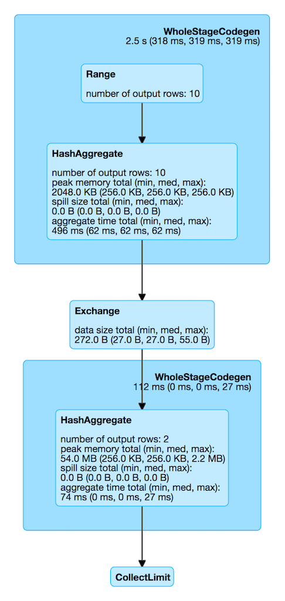

== [[HashAggregateExec]] HashAggregateExec Aggregate Physical Operator for Hash-Based Aggregation

`HashAggregateExec` is a link:spark-sql-SparkPlan.adoc#UnaryExecNode[unary physical operator] for **hash-based aggregation** that is <<creating-instance, created>> (indirectly through link:spark-sql-SparkStrategy-Aggregation.adoc#AggUtils-createAggregate[AggUtils.createAggregate]) when:

* link:spark-sql-SparkStrategy-Aggregation.adoc[Aggregation] execution planning strategy selects the aggregate physical operator for an link:spark-sql-LogicalPlan-Aggregate.adoc[Aggregate] logical operator
* Structured Streaming's `StatefulAggregationStrategy` strategy creates plan for streaming `EventTimeWatermark` or link:spark-sql-LogicalPlan-Aggregate.adoc[Aggregate] logical operators

NOTE: `HashAggregateExec` is the link:spark-sql-SparkStrategy-Aggregation.adoc#aggregate-physical-operator-preference[preferred aggregate physical operator] for link:spark-sql-SparkStrategy-Aggregation.adoc[Aggregation] execution planning strategy (over `ObjectHashAggregateExec` and `SortAggregateExec`).

`HashAggregateExec` link:spark-sql-CodegenSupport.adoc[supports code generation] (aka _codegen_).

[source, scala]
----
// HashAggregateExec selected due to:
// sum uses mutable types for aggregate expression
// just a single id column reference of LongType data type
val q = spark.range(10).
  groupBy('id % 2 as "group").
  agg(sum("id") as "sum")
scala> q.explain
== Physical Plan ==
*HashAggregate(keys=[(id#57L % 2)#69L], functions=[sum(id#57L)])
+- Exchange hashpartitioning((id#57L % 2)#69L, 200)
   +- *HashAggregate(keys=[(id#57L % 2) AS (id#57L % 2)#69L], functions=[partial_sum(id#57L)])
      +- *Range (0, 10, step=1, splits=8)

scala> println(q.queryExecution.sparkPlan.numberedTreeString)
00 HashAggregate(keys=[(id#57L % 2)#72L], functions=[sum(id#57L)], output=[group#60L, sum#64L])
01 +- HashAggregate(keys=[(id#57L % 2) AS (id#57L % 2)#72L], functions=[partial_sum(id#57L)], output=[(id#57L % 2)#72L, sum#74L])
02    +- Range (0, 10, step=1, splits=8)

// Going low level...watch your steps :)

import q.queryExecution.optimizedPlan
import org.apache.spark.sql.catalyst.plans.logical.Aggregate
val aggLog = optimizedPlan.asInstanceOf[Aggregate]
import org.apache.spark.sql.catalyst.planning.PhysicalAggregation
import org.apache.spark.sql.catalyst.expressions.aggregate.AggregateExpression
val aggregateExpressions: Seq[AggregateExpression] = PhysicalAggregation.unapply(aggLog).get._2
val aggregateBufferAttributes = aggregateExpressions.
 flatMap(_.aggregateFunction.aggBufferAttributes)
import org.apache.spark.sql.execution.aggregate.HashAggregateExec
// that's the exact reason why HashAggregateExec was selected
// Aggregation execution planning strategy prefers HashAggregateExec
scala> val useHash = HashAggregateExec.supportsAggregate(aggregateBufferAttributes)
useHash: Boolean = true

val execPlan = q.queryExecution.sparkPlan
val hashAggExec = execPlan.asInstanceOf[HashAggregateExec]
scala> println(execPlan.numberedTreeString)
00 HashAggregate(keys=[(id#39L % 2)#50L], functions=[sum(id#39L)], output=[group#42L, sum#46L])
01 +- HashAggregate(keys=[(id#39L % 2) AS (id#39L % 2)#50L], functions=[partial_sum(id#39L)], output=[(id#39L % 2)#50L, sum#52L])
02    +- Range (0, 10, step=1, splits=8)

val hashAggExecRDD = hashAggExec.execute // <-- calls doExecute
scala> println(hashAggExecRDD.toDebugString)
(8) MapPartitionsRDD[14] at execute at <console>:35 []
 |  MapPartitionsRDD[13] at execute at <console>:35 []
 |  MapPartitionsRDD[12] at execute at <console>:35 []
 |  ParallelCollectionRDD[11] at execute at <console>:35 []
----

[[metrics]]
.HashAggregateExec's SQLMetrics (in alphabetical order)
[cols="1,2",options="header",width="100%"]
|===
| Name
| Description

| `aggTime`
| aggregate time

| `numOutputRows`
| number of output rows

| `peakMemory`
| peak memory

| `spillSize`
| spill size
|===

.HashAggregateExec in web UI (Details for Query)

[[properties]]
.HashAggregateExec's Properties (in alphabetical order)
[width="100%",cols="1,2",options="header"]
|===
| Name
| Description

| [[aggregateBufferAttributes]] `aggregateBufferAttributes`
| Collection of `AttributeReference` references of the aggregate functions of the input <<aggregateExpressions, AggregateExpressions>>

| [[output]] `output`
| link:spark-sql-catalyst-QueryPlan.adoc#output[Output schema] for the input <<resultExpressions, NamedExpressions>>
|===

[[requiredChildDistribution]]
`requiredChildDistribution` varies per the input <<requiredChildDistributionExpressions, required child distribution expressions>>.

.HashAggregateExec's Required Child Output Distributions
[cols="1,2",options="header",width="100%"]
|===
| requiredChildDistributionExpressions
| Distribution

| Defined, but empty
| `AllTuples`

| Non-empty
| `ClusteredDistribution(exprs)`

| Undefined (`None`)
| `UnspecifiedDistribution`
|===

[NOTE]
====
`requiredChildDistributionExpressions` is exactly `requiredChildDistributionExpressions` from link:spark-sql-SparkStrategy-Aggregation.adoc#AggUtils-createAggregate[AggUtils.createAggregate] and is undefined by default.

---

(No distinct in aggregation) `requiredChildDistributionExpressions` is undefined when `HashAggregateExec` is created for partial aggregations (i.e. `mode` is `Partial` for aggregate expressions).

`requiredChildDistributionExpressions` is defined, but could possibly be empty, when `HashAggregateExec` is created for final aggregations (i.e. `mode` is `Final` for aggregate expressions).

---

(one distinct in aggregation) `requiredChildDistributionExpressions` is undefined when `HashAggregateExec` is created for partial aggregations (i.e. `mode` is `Partial` for aggregate expressions) with one distinct in aggregation.

`requiredChildDistributionExpressions` is defined, but could possibly be empty, when `HashAggregateExec` is created for partial merge aggregations (i.e. `mode` is `PartialMerge` for aggregate expressions).

*FIXME* for the following two cases in aggregation with one distinct.
====

NOTE: The prefix for variable names for `HashAggregateExec` operators in link:spark-sql-CodegenSupport.adoc[CodegenSupport]-generated code is *agg*.

=== [[testFallbackStartsAt]] `testFallbackStartsAt` Internal Value

CAUTION: FIXME

=== [[supportsAggregate]] `supportsAggregate` Method

[source, scala]
----
supportsAggregate(aggregateBufferAttributes: Seq[Attribute]): Boolean
----

`supportsAggregate` first link:spark-sql-StructType.adoc#fromAttributes[builds the schema] of the aggregation buffer (from the input `aggregateBufferAttributes` attributes) and checks if `UnsafeFixedWidthAggregationMap` supports it (i.e. the schema uses link:spark-sql-UnsafeRow.adoc#mutableFieldTypes[mutable field data types] only that have fixed length and can be mutated in place in an link:spark-sql-UnsafeRow.adoc[UnsafeRow]).

NOTE: `supportsAggregate` is used exclusively when `AggUtils.createAggregate` link:spark-sql-SparkStrategy-Aggregation.adoc#AggUtils-createAggregate[selects an aggregate physical operator given aggregate expressions].

=== [[creating-instance]] Creating HashAggregateExec Instance

`HashAggregateExec` takes the following when created:

* [[requiredChildDistributionExpressions]] Required child distribution link:spark-sql-Expression.adoc[expressions]
* [[groupingExpressions]] Grouping link:spark-sql-Expression.adoc#NamedExpression[named expressions]
* [[aggregateExpressions]] link:spark-sql-Expression-AggregateExpression.adoc[Aggregate expressions]
* [[aggregateAttributes]] Aggregate link:spark-sql-Expression-Attribute.adoc[attributes]
* [[initialInputBufferOffset]] Initial input buffer offset
* [[resultExpressions]] Output link:spark-sql-Expression.adoc#NamedExpression[named expressions]
* [[child]] Child link:spark-sql-SparkPlan.adoc[physical operator]

=== [[doExecute]] Executing HashAggregateExec -- `doExecute` Method

[source, scala]
----
doExecute(): RDD[InternalRow]
----

`doExecute` executes the input <<child, child SparkPlan>> (to produce link:spark-sql-InternalRow.adoc[InternalRow] objects) and applies calculation over partitions (using `RDD.mapPartitions`).

IMPORTANT: `RDD.mapPartitions` does *not* preserve partitioning and neither does `HashAggregateExec` when executed.

In the `mapPartitions` block, `doExecute` creates one of the following:

* an empty iterator for no-record partitions with at least one grouping expression

* link:spark-sql-TungstenAggregationIterator.adoc[TungstenAggregationIterator]

NOTE: `doExecute` is a part of link:spark-sql-SparkPlan.adoc#doExecute[SparkPlan Contract] to produce the result of a structured query as an `RDD` of link:spark-sql-InternalRow.adoc[InternalRow] objects.

=== [[doProduce]] `doProduce` Method

[source, scala]
----
doProduce(ctx: CodegenContext): String
----

`doProduce` executes <<doProduceWithoutKeys, doProduceWithoutKeys>> when no <<groupingExpressions, groupingExpressions>> were specified for the `HashAggregateExec` or <<doProduceWithKeys, doProduceWithKeys>> otherwise.

NOTE: `doProduce` is a part of link:spark-sql-CodegenSupport.adoc#doProduce[CodegenSupport Contract].
