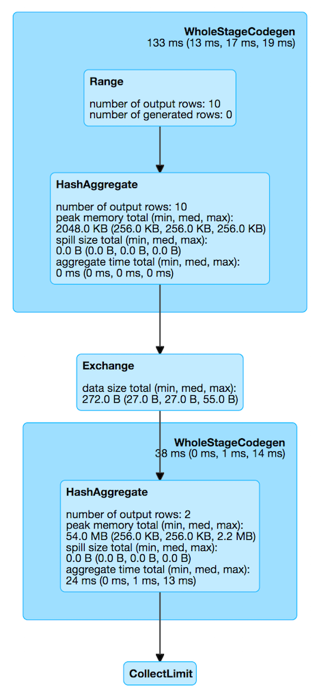

== [[HashAggregateExec]] HashAggregateExec Aggregate Physical Operator

`HashAggregateExec` is a link:spark-sql-SparkPlan.adoc#UnaryExecNode[unary physical operator] that link:spark-sql-CodegenSupport.adoc[supports code generation] (aka _codegen_).

`HashAggregateExec` is <<creating-instance, created>> (indirectly through link:spark-sql-SparkStrategy-Aggregation.adoc#AggUtils-createAggregate[AggUtils.createAggregate]) when:

* link:spark-sql-SparkStrategy-Aggregation.adoc[Aggregation] execution planning strategy creates link:spark-sql-SparkPlan.adoc[physical plans] for an link:spark-sql-LogicalPlan-Aggregate.adoc[Aggregate] unary logical operator (with or no distinct)
* Structured Streaming's `StatefulAggregationStrategy` strategy creates plan for streaming `EventTimeWatermark` or link:spark-sql-LogicalPlan-Aggregate.adoc[Aggregate] unary logical operators

[source, scala]
----
// groupBy aggregate logical operator mapped to HashAggregateExec
val q = spark.range(10).groupBy('id % 2 as "group").sum("id")
scala> q.explain
== Physical Plan ==
*HashAggregate(keys=[(id#109L % 2)#121L], functions=[sum(id#109L)])
+- Exchange hashpartitioning((id#109L % 2)#121L, 200)
   +- *HashAggregate(keys=[(id#109L % 2) AS (id#109L % 2)#121L], functions=[partial_sum(id#109L)])
      +- *Range (0, 10, step=1, splits=Some(8))

scala> q.queryExecution.sparkPlan
res11: org.apache.spark.sql.execution.SparkPlan =
HashAggregate(keys=[(id#109L % 2)#124L], functions=[sum(id#109L)], output=[group#112L, sum(id)#116L])
+- HashAggregate(keys=[(id#109L % 2) AS (id#109L % 2)#124L], functions=[partial_sum(id#109L)], output=[(id#109L % 2)#124L, sum#123L])
   +- Range (0, 10, step=1, splits=Some(8))

import org.apache.spark.sql.execution.aggregate.HashAggregateExec
scala> val agg = q.queryExecution.sparkPlan.children(0).asInstanceOf[HashAggregateExec]
agg: org.apache.spark.sql.execution.aggregate.HashAggregateExec =
HashAggregate(keys=[(id#109L % 2) AS (id#109L % 2)#124L], functions=[partial_sum(id#109L)], output=[(id#109L % 2)#124L, sum#123L])
+- Range (0, 10, step=1, splits=Some(8))
----

[[metrics]]
.HashAggregateExec SQLMetrics (in alphabetical order)
[cols="1,2",options="header",width="100%"]
|===
| Name
| Description

| `aggTime`
| aggregate time

| `numOutputRows`
| number of output rows

| `peakMemory`
| peak memory

| `spillSize`
| spill size
|===

.HashAggregateExec in web UI (Details for Query)

[[properties]]
.HashAggregateExec's Properties (in alphabetical order)
[width="100%",cols="1,2",options="header"]
|===
| Name
| Description

| [[aggregateBufferAttributes]] `aggregateBufferAttributes`
| Collection of `AttributeReference` references of the aggregate functions of the input <<aggregateExpressions, AggregateExpressions>>

| [[output]] `output`
| link:spark-sql-catalyst-QueryPlan.adoc#output[Output schema] for the input <<resultExpressions, NamedExpressions>>
|===

NOTE: The prefix for variable names for `HashAggregateExec` operators in link:spark-sql-CodegenSupport.adoc[CodegenSupport]-generated code is *agg*.

=== [[creating-instance]] Creating HashAggregateExec Instance

`HashAggregateExec` takes the following when created:

* [[requiredChildDistributionExpressions]] Optional `requiredChildDistribution` link:spark-sql-Expression.adoc[expressions]
* [[groupingExpressions]] Grouping link:spark-sql-Expression.adoc#NamedExpression[named expressions]
* [[aggregateExpressions]] Collection of link:spark-sql-Expression-AggregateExpression.adoc[AggregateExpressions]
* [[aggregateAttributes]] Aggregate link:spark-sql-Expression-Attribute.adoc[attributes]
* [[initialInputBufferOffset]] Initial offset
* [[resultExpressions]] Output link:spark-sql-Expression.adoc#NamedExpression[named expressions]
* [[child]] Child link:spark-sql-SparkPlan.adoc[physical plan]

=== [[doExecute]] Generating Internal Binary Rows (using TungstenAggregationIterator) -- `doExecute` Method

[source, scala]
----
doExecute(): RDD[InternalRow]
----

`doExecute` executes the input <<child, child SparkPlan>> (to produce link:spark-sql-InternalRow.adoc[InternalRow] objects) and applies calculation over partitions (using `RDD.mapPartitions`).

In the `mapPartitions` block, `doExecute` creates one of the following:

* an empty iterator for no-record partitions with at least one grouping expression

* `TungstenAggregationIterator`

NOTE: `doExecute` is a part of link:spark-sql-SparkPlan.adoc#doExecute[SparkPlan Contract] to produce the result of a structured query as an `RDD` of link:spark-sql-InternalRow.adoc[InternalRow] objects.

=== [[doProduce]] `doProduce` Method

[source, scala]
----
doProduce(ctx: CodegenContext): String
----

`doProduce` executes <<doProduceWithoutKeys, doProduceWithoutKeys>> when no <<groupingExpressions, groupingExpressions>> were specified for the `HashAggregateExec` or <<doProduceWithKeys, doProduceWithKeys>> otherwise.

NOTE: `doProduce` is a part of link:spark-sql-CodegenSupport.adoc#doProduce[CodegenSupport Contract].
