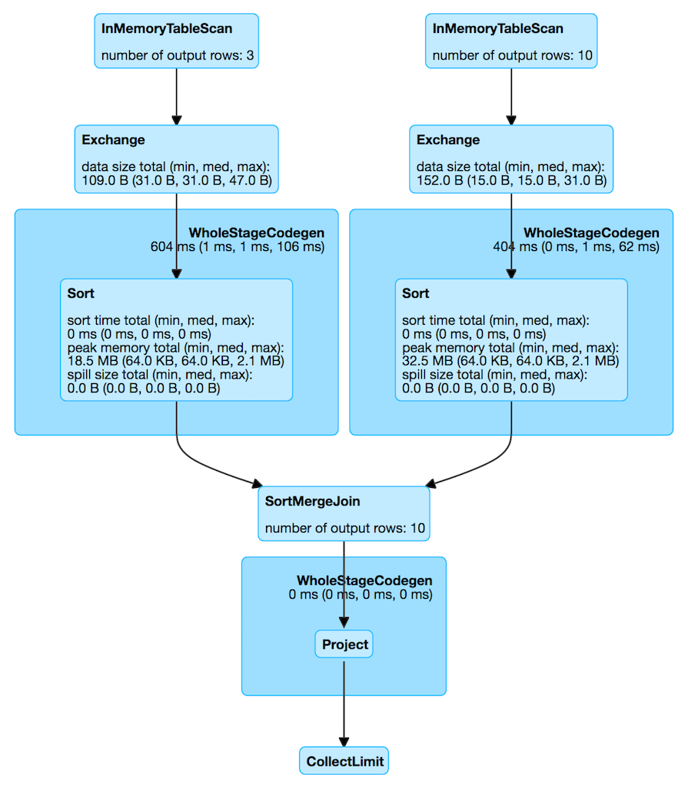

== [[InMemoryTableScanExec]] InMemoryTableScanExec Physical Operator

`InMemoryTableScanExec` is a link:spark-sql-SparkPlan.adoc#LeafExecNode[leaf physical operator] that...FIXME

`InMemoryTableScanExec` is <<creating-instance, created>> exclusively when link:spark-sql-SparkStrategy-InMemoryScans.adoc[InMemoryScans] execution planning strategy finds `InMemoryRelation` logical operators.

[source, scala]
----
// Sample DataFrames
val tokens = Seq(
  (0, "playing"),
  (1, "with"),
  (2, "InMemoryTableScanExec")
).toDF("id", "token")
val ids = spark.range(10)

// Cache DataFrames
tokens.cache
ids.cache

val q = tokens.join(ids, Seq("id"), "outer")
scala> q.explain
== Physical Plan ==
*Project [coalesce(cast(id#5 as bigint), id#10L) AS id#33L, token#6]
+- SortMergeJoin [cast(id#5 as bigint)], [id#10L], FullOuter
   :- *Sort [cast(id#5 as bigint) ASC NULLS FIRST], false, 0
   :  +- Exchange hashpartitioning(cast(id#5 as bigint), 200)
   :     +- InMemoryTableScan [id#5, token#6]
   :           +- InMemoryRelation [id#5, token#6], true, 10000, StorageLevel(disk, memory, deserialized, 1 replicas)
   :                 +- LocalTableScan [id#5, token#6]
   +- *Sort [id#10L ASC NULLS FIRST], false, 0
      +- Exchange hashpartitioning(id#10L, 200)
         +- InMemoryTableScan [id#10L]
               +- InMemoryRelation [id#10L], true, 10000, StorageLevel(disk, memory, deserialized, 1 replicas)
                     +- *Range (0, 10, step=1, splits=8)
----

[[metrics]]
.InMemoryTableScanExec SQLMetrics (in alphabetical order)
[cols="1,2",options="header",width="100%"]
|===
| Name
| Description

| [[numOutputRows]] `numOutputRows`
| Number of output rows
|===

.InMemoryTableScanExec in web UI (Details for Query)

`InMemoryTableScanExec` uses `spark.sql.inMemoryTableScanStatistics.enable` flag (default: disabled) to enable accumulators (that appears exclusively for testing purposes).

=== [[creating-instance]] Creating InMemoryTableScanExec Instance

`InMemoryTableScanExec` takes the following when created:

* [[attributes]] link:spark-sql-Expression-Attribute.adoc[Attribute] expressions
* [[predicates]] Predicate link:spark-sql-Expression.adoc[expressions]
* [[relation]] link:spark-sql-LogicalPlan-InMemoryRelation.adoc[InMemoryRelation] logical operator
