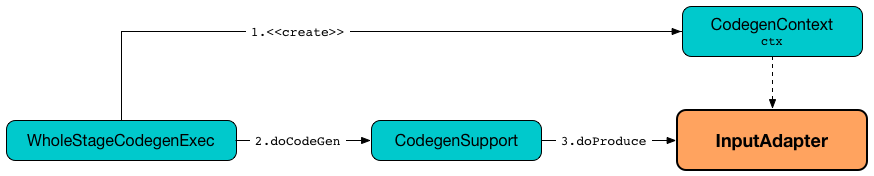

== [[InputAdapter]] InputAdapter Unary Physical Operator

`InputAdapter` is a link:spark-sql-SparkPlan.adoc#UnaryExecNode[unary physical operator] that is an adapter for the <<child, child>> physical operator that does not meet the requirements for link:spark-sql-CodegenSupport.adoc[whole-stage Java code generation] (possibly due to link:spark-sql-CodegenSupport.adoc#supportCodegen[supportCodegen] flag turned off) but is in-between operators that participate in whole-stage Java code generation for a structured query.

.InputAdapter's doProduce

`InputAdapter` is created exclusively when `CollapseCodegenStages` link:spark-sql-CollapseCodegenStages.adoc#insertInputAdapter[inserts] one into a physical plan with whole-stage Java code generation.

[[generateTreeString]]
`InputAdapter` makes sure that the prefix in the _stringified tree representation_ of a physical plan is an empty string (and so it removes the star from the tree representation that link:spark-sql-SparkPlan-WholeStageCodegenExec.adoc[WholeStageCodegenExec] adds), e.g. for link:spark-sql-dataset-operators.adoc#explain[explain] or link:spark-sql-catalyst-TreeNode.adoc#numberedTreeString[TreeNode.numberedTreeString] operators.

[[needCopyResult]]
`InputAdapter` requires that...FIXME, i.e. `needCopyResult` flag is turned off.

[[inputRDDs]]
`InputAdapter` link:spark-sql-SparkPlan.adoc#execute[executes] the <<child, child>> physical operator to get the one and only one `RDD[InternalRow]` as its own link:spark-sql-CodegenSupport.adoc#inputRDDs[input RDDs] for <<doProduce, whole-stage produce path code generation>>.

[[child]]
`InputAdapter` takes a single `child` physical plan when created.

[source, scala]
----
scala> spark.version
res0: String = 2.3.0-SNAPSHOT

// explode expression (that uses Generate operator) does not support codegen
val ids = Seq(Seq(0,1,2,3)).toDF("ids").select(explode($"ids") as "id")
val q = spark.range(1).join(ids, "id")
scala> q.explain
== Physical Plan ==
*Project [id#10L]
+- *BroadcastHashJoin [id#10L], [cast(id#7 as bigint)], Inner, BuildRight
   :- *Range (0, 1, step=1, splits=8)
   +- BroadcastExchange HashedRelationBroadcastMode(List(cast(input[0, int, false] as bigint)))
      +- Generate explode(ids#3), false, false, [id#7]
         +- LocalTableScan [ids#3]
scala> println(q.queryExecution.executedPlan.numberedTreeString)
00 *Project [id#10L]
01 +- *BroadcastHashJoin [id#10L], [cast(id#7 as bigint)], Inner, BuildRight
02    :- *Range (0, 1, step=1, splits=8)
03    +- BroadcastExchange HashedRelationBroadcastMode(List(cast(input[0, int, false] as bigint)))
04       +- Generate explode(ids#3), false, false, [id#7]
05          +- LocalTableScan [ids#3]
----

=== [[doProduce]] Generating Java Source Code for Whole-Stage Produce Path Code Generation -- `doProduce` Method

[source, scala]
----
doProduce(ctx: CodegenContext): String
----

NOTE: `doProduce` is a part of link:spark-sql-CodegenSupport.adoc#doProduce[CodegenSupport Contract] to generate the Java source code for link:spark-sql-whole-stage-codegen.adoc#produce-path[whole-stage-codegen produce code path].

`doProduce` generates a Java source code that consumes link:spark-sql-InternalRow.adoc[internal row] of a single input `RDD` one at a time (in a `while` loop).

NOTE: `doProduce` supports one input RDD only (that the single <<child, child>> physical operator creates when link:spark-sql-SparkPlan.adoc#execute[executed]).

Internally, `doProduce` generates two `input` and `row` "fresh" terms and registers `input` as a mutable state (in the generated class).

`doProduce` gives a plain Java source code that uses `input` and `row` terms as well as the code from link:spark-sql-CodegenSupport.adoc#consume[consume] code generator to iterate over the link:spark-sql-InternalRow.adoc[internal binary rows] from the first <<inputRDDs, input RDD>> only.

[source, scala]
----
val q = spark.range(1)
  .select(explode(lit((0 to 1).toArray)) as "n")  // <-- explode expression does not support codegen
  .join(spark.range(2))
  .where($"n" === $"id")
scala> q.explain
== Physical Plan ==
*BroadcastHashJoin [cast(n#4 as bigint)], [id#7L], Inner, BuildRight
:- *Filter isnotnull(n#4)
:  +- Generate explode([0,1]), false, false, [n#4]
:     +- *Project
:        +- *Range (0, 1, step=1, splits=8)
+- BroadcastExchange HashedRelationBroadcastMode(List(input[0, bigint, false]))
   +- *Range (0, 2, step=1, splits=8)

val plan = q.queryExecution.executedPlan
import org.apache.spark.sql.execution.InputAdapter
// there are two InputAdapters (for Generate and BroadcastExchange operators) so get is safe
val adapter = plan.collectFirst { case a: InputAdapter => a }.get

import org.apache.spark.sql.execution.CodegenSupport
val code = adapter.produce(ctx, plan.asInstanceOf[CodegenSupport])
scala> println(code)

/*inputadapter_c5*/

 while (inputadapter_input2.hasNext() && !stopEarly()) {
   InternalRow inputadapter_row2 = (InternalRow) inputadapter_input2.next();
   /*wholestagecodegen_c1*/

append(inputadapter_row2);
   if (shouldStop()) return;
 }
----

[source, scala]
----
import org.apache.spark.sql.catalyst.plans.logical.Range
val r = Range(start = 0, end = 1, step = 1, numSlices = 1)
import org.apache.spark.sql.execution.RangeExec
val re = RangeExec(r)

import org.apache.spark.sql.execution.InputAdapter
val ia = InputAdapter(re)

import org.apache.spark.sql.catalyst.expressions.codegen.CodegenContext
val ctx = new CodegenContext

// You cannot call doProduce directly
// CodegenSupport.parent is not set up
// and so consume will throw NPE (that's used in doProduce)
// That's why you're supposed to call produce final method that does this
import org.apache.spark.sql.execution.CodegenSupport
ia.produce(ctx, parent = ia.asInstanceOf[CodegenSupport])

// produce however will lead to java.lang.UnsupportedOperationException
// which is due to doConsume throwing it by default
// and InputAdapter does not override it!
// That's why InputAdapter has to be under a WholeStageCodegenExec-enabled physical operator
//    which happens in CollapseCodegenStages.insertWholeStageCodegen
//    when a physical operator is CodegenSupport and meets codegen requirements
//    CollapseCodegenStages.supportCodegen
//    Most importantly it is CodegenSupport with supportCodegen flag on
//    The following physical operators turn supportCodegen flag off (and require InputAdapter wrapper)
//    1. GenerateExec
//    1. HashAggregateExec with a ImperativeAggregate aggregate function expression
//    1. SortMergeJoinExec with InnerLike joins, i.e. CROSS and INNER
//    1. InMemoryTableScanExec with output schema with primitive types only,
//       i.e. BooleanType, ByteType, ShortType, IntegerType, LongType, FloatType, DoubleType

FIXME Make the code working
----
