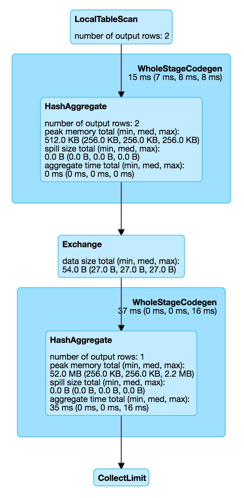

== [[LocalTableScanExec]] LocalTableScanExec Physical Operator

`LocalTableScanExec` is a link:spark-sql-SparkPlan.adoc#LeafExecNode[leaf physical operator] (i.e. no link:spark-sql-catalyst-TreeNode.adoc#children[children]) and `producedAttributes` being `outputSet`.

`LocalTableScanExec` is <<creating-instance, created>> when link:spark-sql-SparkStrategy-BasicOperators.adoc[BasicOperators] execution planning strategy resolves (aka _converts_) link:spark-sql-LogicalPlan-LocalRelation.adoc[LocalRelation] and Spark Structured Streaming's `MemoryPlan` logical operators.

TIP: Read on `MemoryPlan` logical operator in the https://jaceklaskowski.gitbooks.io/spark-structured-streaming/spark-sql-streaming-MemoryPlan.html[Spark Structured Streaming] gitbook.

[source, scala]
----
val names = Seq("Jacek", "Agata").toDF("name")
val optimizedPlan = names.queryExecution.optimizedPlan

scala> println(optimizedPlan.numberedTreeString)
00 LocalRelation [name#9]

// Physical plan with LocalTableScanExec operator (shown as LocalTableScan)
scala> names.explain
== Physical Plan ==
LocalTableScan [name#9]

// Going fairly low-level...you've been warned

val plan = names.queryExecution.executedPlan
import org.apache.spark.sql.execution.LocalTableScanExec
val ltse = plan.asInstanceOf[LocalTableScanExec]

val ltseRDD = ltse.execute()
scala> :type ltseRDD
org.apache.spark.rdd.RDD[org.apache.spark.sql.catalyst.InternalRow]

scala> println(ltseRDD.toDebugString)
(2) MapPartitionsRDD[1] at execute at <console>:30 []
 |  ParallelCollectionRDD[0] at execute at <console>:30 []

// no computation on the source dataset has really occurred yet
// Let's trigger a RDD action
scala> ltseRDD.first
res6: org.apache.spark.sql.catalyst.InternalRow = [0,1000000005,6b6563614a]

// Low-level "show"
scala> ltseRDD.foreach(println)
[0,1000000005,6b6563614a]
[0,1000000005,6174616741]

// High-level show
scala> names.show
+-----+
| name|
+-----+
|Jacek|
|Agata|
+-----+
----

[[metrics]]
.LocalTableScanExec's SQLMetrics
[cols="1,2",options="header",width="100%"]
|===
| Name
| Description

| [[numOutputRows]] `numOutputRows`
| Number of output rows
|===

[NOTE]
====
It _appears_ that when no Spark job is used to execute a `LocalTableScanExec` the <<numOutputRows, numOutputRows>> metric is not displayed in the web UI.

[source, scala]
----
val names = Seq("Jacek", "Agata").toDF("name")

// The following query gives no numOutputRows metric in web UI's Details for Query (SQL tab)
scala> names.show
+-----+
| name|
+-----+
|Jacek|
|Agata|
+-----+

// The query gives numOutputRows metric in web UI's Details for Query (SQL tab)
scala> names.groupBy(length($"name")).count.show
+------------+-----+
|length(name)|count|
+------------+-----+
|           5|    2|
+------------+-----+

// The (type-preserving) query does also give numOutputRows metric in web UI's Details for Query (SQL tab)
scala> names.as[String].map(_.toUpperCase).show
+-----+
|value|
+-----+
|JACEK|
|AGATA|
+-----+
----
====

When <<doExecute, executed>>, `LocalTableScanExec`...FIXME

.LocalTableScanExec in web UI (Details for Query)

[[internal-registries]]
.LocalTableScanExec's Internal Properties
[cols="1,2",options="header",width="100%"]
|===
| Name
| Description

| [[unsafeRows]] `unsafeRows`
| link:spark-sql-InternalRow.adoc[Internal binary rows] for...FIXME

| [[numParallelism]] `numParallelism`
|

| [[rdd]] `rdd`
|
|===

=== [[doExecute]] Executing LocalTableScanExec -- `doExecute` Method

[source, scala]
----
doExecute(): RDD[InternalRow]
----

NOTE: `doExecute` is a part of link:spark-sql-SparkPlan.adoc#doExecute[SparkPlan Contract] to produce the result of a structured query as an `RDD` of link:spark-sql-InternalRow.adoc[internal binary rows].

`doExecute`...FIXME

=== [[creating-instance]] Creating LocalTableScanExec Instance

`LocalTableScanExec` takes the following when created:

* [[output]] Output link:spark-sql-Expression-Attribute.adoc[attributes]
* [[rows]] link:spark-sql-InternalRow.adoc[Internal binary rows]
