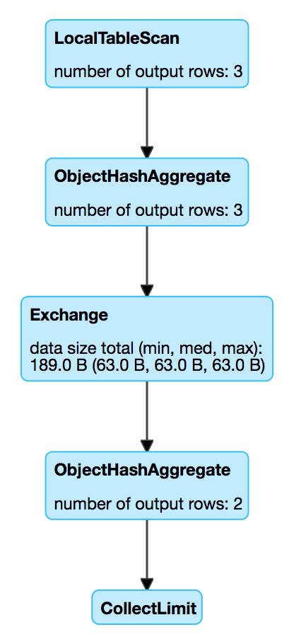

== [[ObjectHashAggregateExec]] ObjectHashAggregateExec Aggregate Physical Operator

`ObjectHashAggregateExec` is a link:spark-sql-SparkPlan.adoc#UnaryExecNode[unary physical operator] that is <<creating-instance, created>> (indirectly through link:spark-sql-SparkStrategy-Aggregation.adoc#AggUtils-createAggregate[AggUtils.createAggregate]) when:

* ...

CAUTION: FIXME

[source, scala]
----
// ObjectHashAggregateExec selected due to:
// 1. spark.sql.execution.useObjectHashAggregateExec internal flag is enabled
scala> val objectHashEnabled = spark.conf.get("spark.sql.execution.useObjectHashAggregateExec")
objectHashEnabled: String = true

// 2. The following data types are used in aggregateBufferAttributes
// BinaryType
// StringType
// ArrayType
// MapType
// ObjectType
// StructType
val dataset = Seq(
  (0, Seq.empty[Int]),
  (1, Seq(1, 1)),
  (2, Seq(2, 2))).toDF("id", "nums")
import org.apache.spark.sql.functions.size
val q = dataset.
  groupBy(size($"nums") as "group"). // <-- size over array
  agg(collect_list("id") as "ids")
scala> q.explain
== Physical Plan ==
ObjectHashAggregate(keys=[size(nums#113)#127], functions=[collect_list(id#112, 0, 0)])
+- Exchange hashpartitioning(size(nums#113)#127, 200)
   +- ObjectHashAggregate(keys=[size(nums#113) AS size(nums#113)#127], functions=[partial_collect_list(id#112, 0, 0)])
      +- LocalTableScan [id#112, nums#113]

scala> println(q.queryExecution.sparkPlan.numberedTreeString)
00 ObjectHashAggregate(keys=[size(nums#113)#130], functions=[collect_list(id#112, 0, 0)], output=[group#117, ids#122])
01 +- ObjectHashAggregate(keys=[size(nums#113) AS size(nums#113)#130], functions=[partial_collect_list(id#112, 0, 0)], output=[size(nums#113)#130, buf#132])
02    +- LocalTableScan [id#112, nums#113]

// Going low level...watch your steps :)

// copied from HashAggregateExec as it is the preferred aggreate physical operator
// and HashAggregateExec is checked first
// When the check fails, ObjectHashAggregateExec is then checked
import q.queryExecution.optimizedPlan
import org.apache.spark.sql.catalyst.plans.logical.Aggregate
val aggLog = optimizedPlan.asInstanceOf[Aggregate]
import org.apache.spark.sql.catalyst.planning.PhysicalAggregation
import org.apache.spark.sql.catalyst.expressions.aggregate.AggregateExpression
val aggregateExpressions: Seq[AggregateExpression] = PhysicalAggregation.unapply(aggLog).get._2
val aggregateBufferAttributes = aggregateExpressions.
 flatMap(_.aggregateFunction.aggBufferAttributes)
import org.apache.spark.sql.execution.aggregate.HashAggregateExec
// that's one of the reasons why ObjectHashAggregateExec was selected
// HashAggregateExec did not meet the requirements
scala> val useHash = HashAggregateExec.supportsAggregate(aggregateBufferAttributes)
useHash: Boolean = true

// collect_list aggregate function uses CollectList TypedImperativeAggregate under the covers
import org.apache.spark.sql.execution.aggregate.ObjectHashAggregateExec
scala> val useObjectHash = ObjectHashAggregateExec.supportsAggregate(aggregateExpressions)
useObjectHash: Boolean = true

val aggExec = q.queryExecution.sparkPlan.children.head.asInstanceOf[ObjectHashAggregateExec]
scala> println(aggExec.aggregateExpressions.head.numberedTreeString)
00 partial_collect_list(id#112, 0, 0)
01 +- collect_list(id#112, 0, 0)
02    +- id#112: int
----

[[metrics]]
.ObjectHashAggregateExec's SQLMetrics
[cols="1,2",options="header",width="100%"]
|===
| Name
| Description

| `numOutputRows`
| number of output rows
|===

.ObjectHashAggregateExec in web UI (Details for Query)

=== [[doExecute]] `doExecute` Method

CAUTION: FIXME

=== [[supportsAggregate]] `supportsAggregate` Method

[source, scala]
----
supportsAggregate(aggregateExpressions: Seq[AggregateExpression]): Boolean
----

`supportsAggregate` is enabled (i.e. returns `true`) if there is at least one link:spark-sql-Expression-AggregateFunction-TypedImperativeAggregate.adoc[TypedImperativeAggregate] aggregate function in the input `aggregateExpressions` link:spark-sql-Expression-AggregateExpression.adoc[aggregate expressions].

NOTE: `supportsAggregate` is used exclusively when `AggUtils.createAggregate` link:spark-sql-SparkStrategy-Aggregation.adoc#AggUtils-createAggregate[selects an aggregate physical operator given aggregate expressions].

=== [[creating-instance]] Creating ObjectHashAggregateExec Instance

`ObjectHashAggregateExec` takes the following when created:

* [[requiredChildDistributionExpressions]] Required child distribution link:spark-sql-Expression.adoc[expressions]
* [[groupingExpressions]] Grouping link:spark-sql-Expression.adoc#NamedExpression[named expressions]
* [[aggregateExpressions]] link:spark-sql-Expression-AggregateExpression.adoc[Aggregate expressions]
* [[aggregateAttributes]] Aggregate link:spark-sql-Expression-Attribute.adoc[attributes]
* [[initialInputBufferOffset]] Initial input buffer offset
* [[resultExpressions]] Output link:spark-sql-Expression.adoc#NamedExpression[named expressions]
* [[child]] Child link:spark-sql-SparkPlan.adoc[physical operator]
