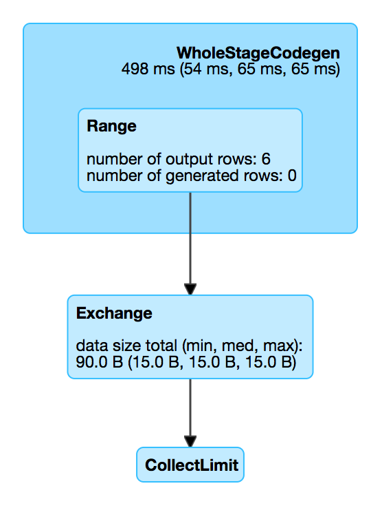

== [[ShuffleExchange]] ShuffleExchange Unary Physical Operator

`ShuffleExchange` is a link:spark-sql-SparkPlan.adoc#UnaryExecNode[physical operator] (with one <<child, child>> physical operator) to perform a shuffle.

`ShuffleExchange` corresponds to `Repartition` (with shuffle enabled) and `RepartitionByExpression` logical operators (as translated in link:spark-sql-SparkStrategy-BasicOperators.adoc[BasicOperators] execution planning strategy).

NOTE: `ShuffleExchange` shows as *Exchange* in physical plans.

[source, scala]
----
// Uses Repartition logical operator
// ShuffleExchange with RoundRobinPartitioning
val q1 = spark.range(6).repartition(2)
scala> q1.explain
== Physical Plan ==
Exchange RoundRobinPartitioning(2)
+- *Range (0, 6, step=1, splits=Some(8))

// Uses RepartitionByExpression logical operator
// ShuffleExchange with HashPartitioning
val q2 = spark.range(6).repartition(2, 'id % 2)
scala> q2.explain
== Physical Plan ==
Exchange hashpartitioning((id#38L % 2), 2)
+- *Range (0, 6, step=1, splits=Some(8))
----

[[coordinator]]
When created, `ShuffleExchange` takes a `Partitioning`, a single `child` link:spark-sql-SparkPlan.adoc[physical operator] and an optional link:spark-sql-ExchangeCoordinator.adoc[ExchangeCoordinator].

[[metrics]]
.ShuffleExchange SQLMetrics (in alphabetical order)
[cols="1,2",options="header",width="100%"]
|===
| Name
| Description

| [[dataSize]] `dataSize`
| data size
|===

.ShuffleExchange in web UI (Details for Query)

`nodeName` is computed based on the optional link:spark-sql-ExchangeCoordinator.adoc[ExchangeCoordinator] with *Exchange* prefix and possibly *(coordinator id: [coordinator-hash-code])*.

[[outputPartitioning]]
`outputPartitioning` is the input `Partitioning`.

While link:spark-sql-SparkPlan.adoc#doPrepare[preparing execution] (using `doPrepare`), `ShuffleExchange` registers itself with the link:spark-sql-ExchangeCoordinator.adoc[ExchangeCoordinator] if available.

When <<doExecute, doExecute>>, `ShuffleExchange` computes a link:spark-sql-ShuffledRowRDD.adoc[ShuffledRowRDD] and caches it (to reuse avoiding possibly expensive executions).

[[internal-registries]]
.ShuffleExchange's Internal Registries and Counters (in alphabetical order)
[cols="1,2",options="header",width="100%"]
|===
| Name
| Description

| [[cachedShuffleRDD]] `cachedShuffleRDD`
| link:spark-sql-ShuffledRowRDD.adoc[ShuffledRowRDD] that is cached after `ShuffleExchange` has been <<doExecute, executed>>.
|===

=== [[doExecute]] Executing ShuffleExchange (and Creating ShuffledRowRDD with Internal Binary Rows Using Optional ExchangeCoordinator) -- `doExecute` Method

[source, scala]
----
doExecute(): RDD[InternalRow]
----

`doExecute` creates a new link:spark-sql-ShuffledRowRDD.adoc[ShuffledRowRDD] or takes <<cachedShuffleRDD, cached one>>.

`doExecute` branches off per optional <<coordinator, ExchangeCoordinator>>.

If `ExchangeCoordinator` was specified, `doExecute` link:spark-sql-ExchangeCoordinator.adoc#postShuffleRDD[requests `ExchangeCoordinator` for a `ShuffledRowRDD`].

Otherwise (with no `ExchangeCoordinator` specified), `doExecute` <<prepareShuffleDependency, prepareShuffleDependency>> and <<preparePostShuffleRDD, preparePostShuffleRDD>>.

In the end, `doExecute` <<cachedShuffleRDD, saves the result `ShuffledRowRDD` for later use>>.

NOTE: `doExecute` is a part of link:spark-sql-SparkPlan.adoc#doExecute[SparkPlan Contract] to produce the result of a structured query as an `RDD` of link:spark-sql-InternalRow.adoc[internal binary rows].

=== [[preparePostShuffleRDD]] `preparePostShuffleRDD` Method

CAUTION: FIXME

=== [[prepareShuffleDependency]] `prepareShuffleDependency` Internal Method

[source, scala]
----
prepareShuffleDependency(): ShuffleDependency[Int, InternalRow, InternalRow]
----

CAUTION: FIXME

=== [[prepareShuffleDependency-helper]] `prepareShuffleDependency` Helper Method

[source, scala]
----
prepareShuffleDependency(
  rdd: RDD[InternalRow],
  outputAttributes: Seq[Attribute],
  newPartitioning: Partitioning,
  serializer: Serializer): ShuffleDependency[Int, InternalRow, InternalRow]
----

`prepareShuffleDependency` creates a link:spark-rdd-ShuffleDependency.adoc[ShuffleDependency] dependency.

NOTE: `prepareShuffleDependency` is used when `ShuffleExchange` <<prepareShuffleDependency, prepares a `ShuffleDependency`>> (as part of...FIXME), `CollectLimitExec` and `TakeOrderedAndProjectExec` physical operators are executed.
