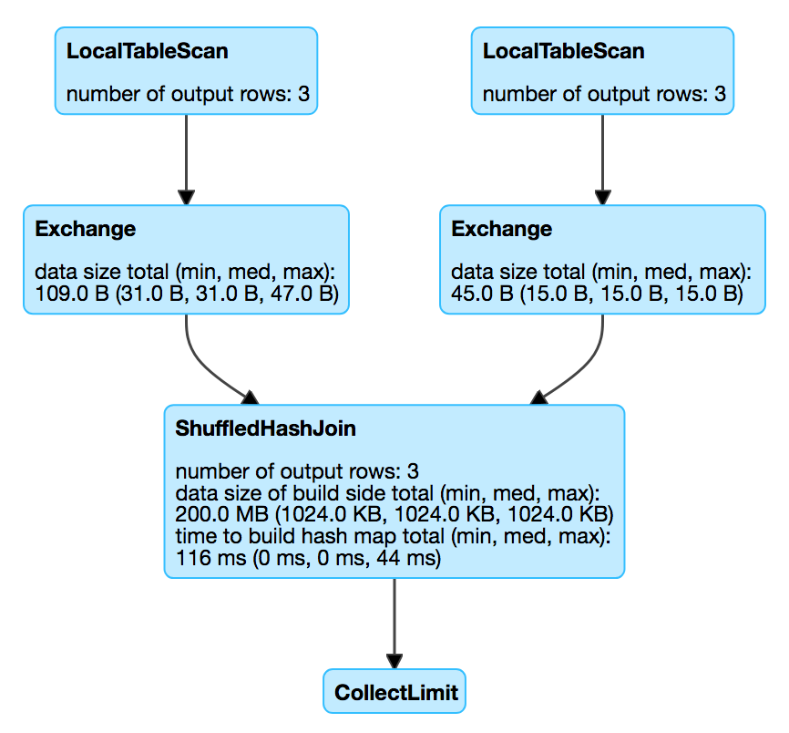

== [[ShuffledHashJoinExec]] ShuffledHashJoinExec Binary Physical Operator

`ShuffledHashJoinExec` is a link:spark-sql-SparkPlan.adoc#BinaryExecNode[binary physical operator] for hash-based joins.

`ShuffledHashJoinExec` is <<creating-instance, created>> for joins with joining keys and one of the following holds:

* link:spark-sql-SQLConf.adoc#spark.sql.join.preferSortMergeJoin[spark.sql.join.preferSortMergeJoin] is disabled, link:spark-sql-SparkStrategy-JoinSelection.adoc#canBuildRight[canBuildRight], link:spark-sql-SparkStrategy-JoinSelection.adoc#canBuildLocalHashMap[canBuildLocalHashMap] for right join side and finally right join side is link:spark-sql-SparkStrategy-JoinSelection.adoc#muchSmaller[much smaller] than left side

* link:spark-sql-SQLConf.adoc#spark.sql.join.preferSortMergeJoin[spark.sql.join.preferSortMergeJoin] is disabled, link:spark-sql-SparkStrategy-JoinSelection.adoc#canBuildLeft[canBuildLeft], link:spark-sql-SparkStrategy-JoinSelection.adoc#canBuildLocalHashMap[canBuildLocalHashMap] for left join side and finally left join side is link:spark-sql-SparkStrategy-JoinSelection.adoc#muchSmaller[much smaller] than right

* Left join keys are *not* link:spark-sql-SparkPlan-SortMergeJoinExec.adoc#orderable[orderable]

[source, scala]
----
***********
Start spark-shell with ShuffledHashJoinExec's selection requirements

./bin/spark-shell \
    -c spark.sql.join.preferSortMergeJoin=false \
    -c spark.sql.autoBroadcastJoinThreshold=1
***********

scala> spark.conf.get("spark.sql.join.preferSortMergeJoin")
res0: String = false

scala> spark.conf.get("spark.sql.autoBroadcastJoinThreshold")
res1: String = 1

scala> spark.conf.get("spark.sql.shuffle.partitions")
res2: String = 200

val dataset = Seq(
  (0, "playing"),
  (1, "with"),
  (2, "ShuffledHashJoinExec")
).toDF("id", "token")
val query = dataset.join(dataset, Seq("id"), "leftsemi")

scala> query.queryExecution.optimizedPlan.stats(spark.sessionState.conf).sizeInBytes
res3: BigInt = 72

scala> query.explain
== Physical Plan ==
ShuffledHashJoin [id#15], [id#20], LeftSemi, BuildRight
:- Exchange hashpartitioning(id#15, 200)
:  +- LocalTableScan [id#15, token#16]
+- Exchange hashpartitioning(id#20, 200)
   +- LocalTableScan [id#20]
----

NOTE: `ShuffledHashJoinExec` operator is chosen in link:spark-sql-SparkStrategy-JoinSelection.adoc[JoinSelection] execution planning strategy.

[[metrics]]
.ShuffledHashJoinExec's SQLMetrics
[cols="1,2",options="header",width="100%"]
|===
| Name
| Description

| [[buildDataSize]] `buildDataSize`
| data size of build side

| [[buildTime]] `buildTime`
| time to build hash map

| [[numOutputRows]] `numOutputRows`
| number of output rows
|===

.ShuffledHashJoinExec in web UI (Details for Query)

[[requiredChildDistribution]]
.ShuffledHashJoinExec's Required Child Output Distributions
[cols="1,1",options="header",width="100%"]
|===
| Left Child
| Right Child

| `ClusteredDistribution` (per <<leftKeys, left join key expressions>>)
| `ClusteredDistribution` (per <<rightKeys, right join key expressions>>)
|===

=== [[doExecute]] Executing ShuffledHashJoinExec -- `doExecute` Method

[source, scala]
----
doExecute(): RDD[InternalRow]
----

CAUTION: FIXME

NOTE: `doExecute` is a part of link:spark-sql-SparkPlan.adoc#doExecute[SparkPlan Contract] to produce the result of a structured query as an `RDD` of link:spark-sql-InternalRow.adoc[internal binary rows].

=== [[buildHashedRelation]] `buildHashedRelation` Internal Method

CAUTION: FIXME

=== [[creating-instance]] Creating ShuffledHashJoinExec Instance

`ShuffledHashJoinExec` takes the following when created:

* [[leftKeys]] Left join key link:spark-sql-Expression.adoc[expressions]
* [[rightKeys]] Right join key link:spark-sql-Expression.adoc[expressions]
* [[joinType]] link:spark-sql-joins.adoc#join-types[Join type]
* [[buildSide]] `BuildSide`
* [[condition]] Optional join condition link:spark-sql-Expression.adoc[expression]
* [[left]] Left link:spark-sql-SparkPlan.adoc[physical operator]
* [[right]] Right link:spark-sql-SparkPlan.adoc[physical operator]
