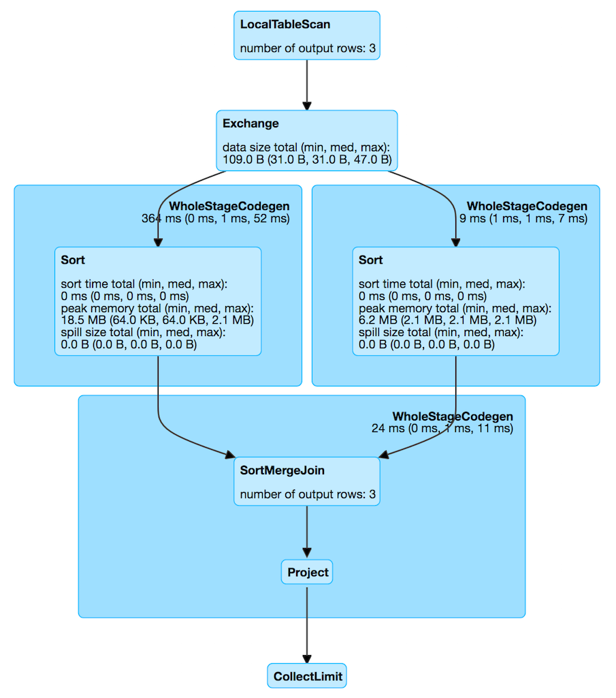

== [[SortMergeJoinExec]] SortMergeJoinExec Binary Physical Operator

`SortMergeJoinExec` is a link:spark-sql-SparkPlan.adoc#BinaryExecNode[binary physical operator] that link:spark-sql-CodegenSupport.adoc[supports code generation] (aka _whole-stage codegen_).

`SortMergeJoinExec` is <<creating-instance, created>> exclusively for joins with <<leftKeys, left join keys>> orderable, i.e. that can be ordered (sorted).

[[orderable]]
[NOTE]
====
A join key is *orderable* when is of one of the following link:spark-sql-DataType.adoc[data types]:

* `NullType`
* link:spark-sql-DataType.adoc#AtomicType[AtomicType] (that represents all the available types except `NullType`, `StructType`, `ArrayType`, `UserDefinedType`, `MapType`, and `ObjectType`)
* `StructType` with orderable fields
* `ArrayType` of orderable type
* `UserDefinedType` of orderable type

Therefore, a join key is *not* orderable when is of the following data type:

* `MapType`
* `ObjectType`
====

[source, scala]
----
// Start spark-shell with broadcast hash join disabled, i.e. spark.sql.autoBroadcastJoinThreshold=-1
// ./bin/spark-shell -c spark.sql.autoBroadcastJoinThreshold=-1
// Mind the data types so ShuffledHashJoinExec is not selected
val dataset = Seq(
  (0, "playing"),
  (1, "with"),
  (2, "SortMergeJoinExec")
).toDF("id", "token")

// all data types are orderable
scala> dataset.printSchema
root
 |-- id: integer (nullable = false)
 |-- token: string (nullable = true)

scala> spark.conf.get("spark.sql.autoBroadcastJoinThreshold")
res0: String = -1

val q = dataset.join(tokens, Seq("id"), "inner")
scala> q.explain
== Physical Plan ==
*Project [id#27, token#28, token#6]
+- *SortMergeJoin [id#27], [id#5], Inner
   :- *Sort [id#27 ASC NULLS FIRST], false, 0
   :  +- Exchange hashpartitioning(id#27, 200)
   :     +- LocalTableScan [id#27, token#28]
   +- *Sort [id#5 ASC NULLS FIRST], false, 0
      +- ReusedExchange [id#5, token#6], Exchange hashpartitioning(id#27, 200)
----

[[metrics]]
.SortMergeJoinExec's SQLMetrics
[cols="1,2",options="header",width="100%"]
|===
| Name
| Description

| [[numOutputRows]] `numOutputRows`
| number of output rows
|===

.SortMergeJoinExec in web UI (Details for Query)

NOTE: The prefix for variable names for `SortMergeJoinExec` operators in link:spark-sql-CodegenSupport.adoc[CodegenSupport]-generated code is *smj*.

[source, scala]
----
scala> q.queryExecution.debug.codegen
Found 3 WholeStageCodegen subtrees.
== Subtree 1 / 3 ==
*Project [id#5, token#6, token#11]
+- *SortMergeJoin [id#5], [id#10], Inner
   :- *Sort [id#5 ASC NULLS FIRST], false, 0
   :  +- Exchange hashpartitioning(id#5, 200)
   :     +- LocalTableScan [id#5, token#6]
   +- *Sort [id#10 ASC NULLS FIRST], false, 0
      +- ReusedExchange [id#10, token#11], Exchange hashpartitioning(id#5, 200)

Generated code:
/* 001 */ public Object generate(Object[] references) {
/* 002 */   return new GeneratedIterator(references);
/* 003 */ }
/* 004 */
/* 005 */ final class GeneratedIterator extends org.apache.spark.sql.execution.BufferedRowIterator {
/* 006 */   private Object[] references;
/* 007 */   private scala.collection.Iterator[] inputs;
/* 008 */   private scala.collection.Iterator smj_leftInput;
/* 009 */   private scala.collection.Iterator smj_rightInput;
/* 010 */   private InternalRow smj_leftRow;
/* 011 */   private InternalRow smj_rightRow;
/* 012 */   private int smj_value2;
/* 013 */   private org.apache.spark.sql.execution.ExternalAppendOnlyUnsafeRowArray smj_matches;
/* 014 */   private int smj_value3;
/* 015 */   private int smj_value4;
/* 016 */   private UTF8String smj_value5;
/* 017 */   private boolean smj_isNull2;
/* 018 */   private org.apache.spark.sql.execution.metric.SQLMetric smj_numOutputRows;
/* 019 */   private UnsafeRow smj_result;
/* 020 */   private org.apache.spark.sql.catalyst.expressions.codegen.BufferHolder smj_holder;
/* 021 */   private org.apache.spark.sql.catalyst.expressions.codegen.UnsafeRowWriter smj_rowWriter;
...
----

NOTE: `SortMergeJoinExec` operator is chosen in link:spark-sql-SparkStrategy-JoinSelection.adoc[JoinSelection] execution planning strategy (after link:spark-sql-SparkPlan-BroadcastHashJoinExec.adoc[BroadcastHashJoinExec] and link:spark-sql-SparkPlan-ShuffledHashJoinExec.adoc[ShuffledHashJoinExec] physical join operators have not met the requirements).

=== [[doExecute]] `doExecute` Method

CAUTION: FIXME

=== [[creating-instance]] Creating SortMergeJoinExec Instance

`SortMergeJoinExec` takes the following when created:

* [[leftKeys]] Left join key link:spark-sql-Expression.adoc[expressions]
* [[rightKeys]] Right join key link:spark-sql-Expression.adoc[expressions]
* [[joinType]] link:spark-sql-joins.adoc#join-types[Join type]
* [[condition]] Optional join condition link:spark-sql-Expression.adoc[expression]
* [[left]] Left link:spark-sql-SparkPlan.adoc[physical operator]
* [[right]] Right link:spark-sql-SparkPlan.adoc[physical operator]
