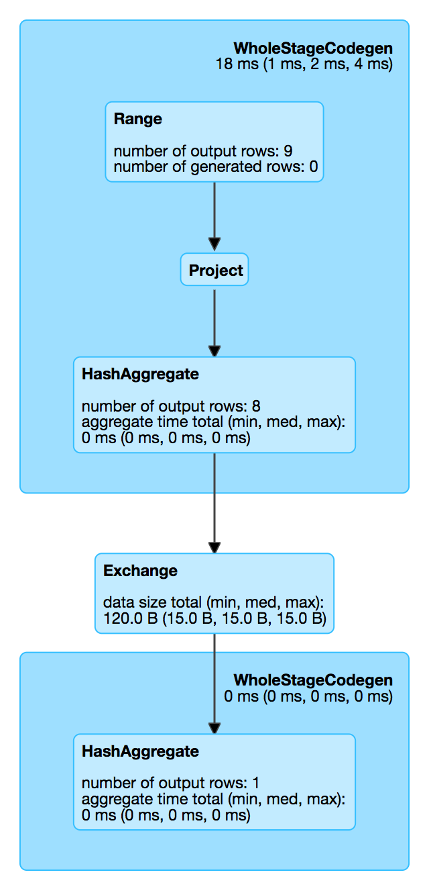

== [[WholeStageCodegenExec]] WholeStageCodegenExec Unary Operator with Java Code Generation

`WholeStageCodegenExec` is a link:spark-sql-SparkPlan.adoc#UnaryExecNode[unary physical operator] that link:spark-sql-CodegenSupport.adoc[supports code generation] for a *codegened pipeline* of a single physical operator.

`WholeStageCodegenExec` is created when link:spark-sql-CollapseCodegenStages.adoc[CollapseCodegenStages] physical preparation rule transforms a link:spark-sql-SparkPlan.adoc[physical plan] and link:spark-sql-SQLConf.adoc#spark.sql.codegen.wholeStage[spark.sql.codegen.wholeStage] is enabled.

NOTE: link:spark-sql-SQLConf.adoc#spark.sql.codegen.wholeStage[spark.sql.codegen.wholeStage] property is enabled by default.

[[generateTreeString]]
`WholeStageCodegenExec` is marked with `*` prefix in the tree output of a physical plan.

NOTE: Use link:spark-sql-QueryExecution.adoc#executedPlan[executedPlan] phase of a query execution to see `WholeStageCodegenExec` in the plan.

[source, scala]
----
val q = spark.range(9)
val plan = q.queryExecution.executedPlan
scala> println(plan.numberedTreeString)
00 *Range (0, 9, step=1, splits=8)
----

[[metrics]]
.WholeStageCodegenExec SQLMetrics (in alphabetical order)
[cols="1,2",options="header",width="100%"]
|===
| Name
| Description

| [[pipelineTime]] `pipelineTime`
| duration
|===

.WholeStageCodegenExec in web UI (Details for Query)


TIP: Use link:spark-sql-Dataset.adoc#explain[explain] operator to know the physical plan of a query and find out whether or not `WholeStageCodegen` is in use.

[source, scala]
----
val q = spark.range(10).where('id === 4)
// Note the stars in the output that are for codegened operators
scala> q.explain
== Physical Plan ==
*Filter (id#0L = 4)
+- *Range (0, 10, step=1, splits=8)
----

TIP: Consider using link:spark-sql-debugging-execution.adoc[Debugging Query Execution facility] to deep dive into whole stage codegen.

[source, scala]
----
scala> q.queryExecution.debug.codegen
Found 1 WholeStageCodegen subtrees.
== Subtree 1 / 1 ==
*Filter (id#5L = 4)
+- *Range (0, 10, step=1, splits=8)
----

NOTE: link:spark-sql-SparkPlan.adoc[Physical plans] that support code generation extend link:spark-sql-CodegenSupport.adoc[CodegenSupport].

[TIP]
====
Enable `DEBUG` logging level for `org.apache.spark.sql.execution.WholeStageCodegenExec` logger to see what happens inside.

Add the following line to `conf/log4j.properties`:

```
log4j.logger.org.apache.spark.sql.execution.WholeStageCodegenExec=DEBUG
```

Refer to link:spark-logging.adoc[Logging].
====

=== [[doConsume]] `doConsume` Method

CAUTION: FIXME

=== [[doExecute]] Executing WholeStageCodegenExec -- `doExecute` Method

[source, scala]
----
doExecute(): RDD[InternalRow]
----

`doExecute` <<doCodeGen, generates the Java code>> that is link:spark-sql-CodeGenerator.adoc#compile[compiled] right afterwards.

If compilation fails and link:spark-sql-settings.adoc#spark.sql.codegen.fallback[spark.sql.codegen.fallback] is enabled, you should see the following WARN message in the logs and `doExecute` returns the link:spark-sql-SparkPlan.adoc#execute[result of executing the child physical operator].

```
WARN WholeStageCodegenExec: Whole-stage codegen disabled for this plan:
[tree]
```

If however code generation and compilation went well, `doExecute` branches off per the number of link:spark-sql-CodegenSupport.adoc#inputRDDs[input RDDs].

NOTE: `doExecute` only supports up to two link:spark-sql-CodegenSupport.adoc#inputRDDs[input RDDs].

CAUTION: FIXME

NOTE: `doExecute` is a part of link:spark-sql-SparkPlan.adoc#doExecute[SparkPlan Contract] to produce the result of a structured query as an `RDD` of link:spark-sql-InternalRow.adoc[internal binary rows].

=== [[doCodeGen]] Generating Java Code for Child Subtree -- `doCodeGen` Method

[source, scala]
----
doCodeGen(): (CodegenContext, CodeAndComment)
----

CAUTION: FIXME

You should see the following DEBUG message in the logs:

```
DEBUG WholeStageCodegenExec:
[cleanedSource]
```

NOTE: `doCodeGen` is used when `WholeStageCodegenExec` <<doExecute, doExecute>> (and for link:spark-sql-debugging-execution.adoc#debugCodegen[debugCodegen]).
