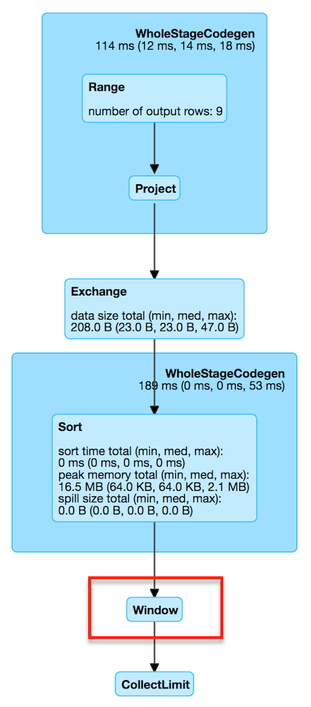

== [[WindowExec]] WindowExec Unary Physical Operator

`WindowExec` is a link:spark-sql-SparkPlan.adoc#UnaryExecNode[unary physical operator] for *window function execution* that represents link:spark-sql-LogicalPlan-Window.adoc[Window] unary logical operator at execution.

[source, scala]
----
// arguably the most trivial example
// just a dataset of 3 rows per group
// to demo how partitions and frames work
// note the rows per groups are not consecutive (in the middle)
val metrics = Seq(
  (0, 0, 0), (1, 0, 1), (2, 5, 2), (3, 0, 3), (4, 0, 1), (5, 5, 3), (6, 5, 0)
).toDF("id", "device", "level")
scala> metrics.show
+---+------+-----+
| id|device|level|
+---+------+-----+
|  0|     0|    0|
|  1|     0|    1|
|  2|     5|    2|  // <-- this row for device 5 is among the rows of device 0
|  3|     0|    3|  // <-- as above but for device 0
|  4|     0|    1|  // <-- almost as above but there is a group of two rows for device 0
|  5|     5|    3|
|  6|     5|    0|
+---+------+-----+

// create windows of rows to use window aggregate function over every window
import org.apache.spark.sql.expressions.Window
val rangeWithTwoDevicesById = Window.
  partitionBy('device).
  orderBy('id).
  rangeBetween(start = -1, end = Window.currentRow) // <-- use rangeBetween first
val sumOverRange = metrics.withColumn("sum", sum('level) over rangeWithTwoDevicesById)

// Logical plan with Window unary logical operator
val optimizedPlan = sumOverRange.queryExecution.optimizedPlan
scala> println(optimizedPlan)
Window [sum(cast(level#9 as bigint)) windowspecdefinition(device#8, id#7 ASC NULLS FIRST, RANGE BETWEEN 1 PRECEDING AND CURRENT ROW) AS sum#15L], [device#8], [id#7 ASC NULLS FIRST]
+- LocalRelation [id#7, device#8, level#9]

// Physical plan with WindowExec unary physical operator (shown as Window)
scala> sumOverRange.explain
== Physical Plan ==
Window [sum(cast(level#9 as bigint)) windowspecdefinition(device#8, id#7 ASC NULLS FIRST, RANGE BETWEEN 1 PRECEDING AND CURRENT ROW) AS sum#15L], [device#8], [id#7 ASC NULLS FIRST]
+- *Sort [device#8 ASC NULLS FIRST, id#7 ASC NULLS FIRST], false, 0
   +- Exchange hashpartitioning(device#8, 200)
      +- LocalTableScan [id#7, device#8, level#9]

// Going fairly low-level...you've been warned

val plan = sumOverRange.queryExecution.executedPlan
import org.apache.spark.sql.execution.window.WindowExec
val we = plan.asInstanceOf[WindowExec]

val windowRDD = we.execute()
scala> :type windowRDD
org.apache.spark.rdd.RDD[org.apache.spark.sql.catalyst.InternalRow]

scala> windowRDD.toDebugString
res0: String =
(200) MapPartitionsRDD[5] at execute at <console>:35 []
  |   MapPartitionsRDD[4] at execute at <console>:35 []
  |   ShuffledRowRDD[3] at execute at <console>:35 []
  +-(7) MapPartitionsRDD[2] at execute at <console>:35 []
     |  MapPartitionsRDD[1] at execute at <console>:35 []
     |  ParallelCollectionRDD[0] at execute at <console>:35 []

// no computation on the source dataset has really occurred
// i.e. as a RDD action
// Let's trigger one
scala> windowRDD.first
res0: org.apache.spark.sql.catalyst.InternalRow = [0,2,5,2,2]

scala> windowRDD.foreach(println)
[0,2,5,2,2]
[0,0,0,0,0]
[0,5,5,3,3]
[0,6,5,0,3]
[0,1,0,1,1]
[0,3,0,3,3]
[0,4,0,1,4]

scala> sumOverRange.show
+---+------+-----+---+
| id|device|level|sum|
+---+------+-----+---+
|  2|     5|    2|  2|
|  5|     5|    3|  3|
|  6|     5|    0|  3|
|  0|     0|    0|  0|
|  1|     0|    1|  1|
|  3|     0|    3|  3|
|  4|     0|    1|  4|
+---+------+-----+---+

// use rowsBetween
val rowsWithTwoDevicesById = Window.
  partitionBy('device).
  orderBy('id).
  rowsBetween(start = -1, end = Window.currentRow)
val sumOverRows = metrics.withColumn("sum", sum('level) over rowsWithTwoDevicesById)

// let's see the result first to have them close
// and compare row- vs range-based windows
scala> sumOverRows.show
+---+------+-----+---+
| id|device|level|sum|
+---+------+-----+---+
|  2|     5|    2|  2|
|  5|     5|    3|  5| <-- a difference
|  6|     5|    0|  3|
|  0|     0|    0|  0|
|  1|     0|    1|  1|
|  3|     0|    3|  4| <-- another difference
|  4|     0|    1|  4|
+---+------+-----+---+

val rowsOptimizedPlan = sumOverRows.queryExecution.optimizedPlan
scala> println(rowsOptimizedPlan)
Window [sum(cast(level#901 as bigint)) windowspecdefinition(device#900, id#899 ASC NULLS FIRST, ROWS BETWEEN 1 PRECEDING AND CURRENT ROW) AS sum#1458L], [device#900], [id#899 ASC NULLS FIRST]
+- LocalRelation [id#899, device#900, level#901]

scala> sumOverRows.explain
== Physical Plan ==
Window [sum(cast(level#901 as bigint)) windowspecdefinition(device#900, id#899 ASC NULLS FIRST, ROWS BETWEEN 1 PRECEDING AND CURRENT ROW) AS sum#1458L], [device#900], [id#899 ASC NULLS FIRST]
+- *Sort [device#900 ASC NULLS FIRST, id#899 ASC NULLS FIRST], false, 0
   +- Exchange hashpartitioning(device#900, 200)
      +- LocalTableScan [id#899, device#900, level#901]
----

`WindowExec` is <<creating-instance, created>> exclusively when link:spark-sql-SparkStrategy-BasicOperators.adoc#Window[BasicOperators] execution planning strategy converts link:spark-sql-LogicalPlan-Window.adoc[Window] unary logical operator.

[source, scala]
----
// a more involved example
val dataset = spark.range(start = 0, end = 13, step = 1, numPartitions = 4)

import org.apache.spark.sql.expressions.Window
val groupsOrderById = Window.partitionBy('group).rangeBetween(-2, Window.currentRow).orderBy('id)
val query = dataset.
  withColumn("group", 'id % 4).
  select('*, sum('id) over groupsOrderById as "sum")

scala> query.explain
== Physical Plan ==
Window [sum(id#25L) windowspecdefinition(group#244L, id#25L ASC NULLS FIRST, RANGE BETWEEN 2 PRECEDING AND CURRENT ROW) AS sum#249L], [group#244L], [id#25L ASC NULLS FIRST]
+- *Sort [group#244L ASC NULLS FIRST, id#25L ASC NULLS FIRST], false, 0
   +- Exchange hashpartitioning(group#244L, 200)
      +- *Project [id#25L, (id#25L % 4) AS group#244L]
         +- *Range (0, 13, step=1, splits=4)

val plan = query.queryExecution.executedPlan
import org.apache.spark.sql.execution.window.WindowExec
val we = plan.asInstanceOf[WindowExec]
----

.WindowExec in web UI (Details for Query)


[[output]]
The link:spark-sql-catalyst-QueryPlan.adoc#output[output schema] of `WindowExec` are the link:spark-sql-Expression-Attribute.adoc[attributes] of <<child, child>> physical operator and <<windowExpression, window expressions>>.

[source, scala]
----
val schema = query.queryExecution.executedPlan.output.toStructType
scala> println(schema.treeString)
root
 |-- id: long (nullable = false)
 |-- group: long (nullable = true)
 |-- sum: long (nullable = true)

// we is WindowExec created earlier
// child's output
scala> println(we.child.output.toStructType.treeString)
root
 |-- id: long (nullable = false)
 |-- group: long (nullable = true)

// window expressions' output
scala> println(we.windowExpression.map(_.toAttribute).toStructType.treeString)
root
 |-- sum: long (nullable = true)
----

[[requiredChildDistribution]]
.WindowExec's Required Child Output Distribution
[cols="1",options="header",width="100%"]
|===
| Single Child

| `ClusteredDistribution` (per <<partitionSpec, window partition specifications expressions>>)
|===

If no window partition specification is specified, `WindowExec` prints out the following WARN message to the logs (and the child's distribution requirement is `AllTuples`):

```
WARN WindowExec: No Partition Defined for Window operation! Moving all data to a single partition, this can cause serious performance degradation.
```

[TIP]
====
Enable `WARN` logging level for `org.apache.spark.sql.execution.WindowExec` logger to see what happens inside.

Add the following line to `conf/log4j.properties`:

```
log4j.logger.org.apache.spark.sql.execution.WindowExec=WARN
```

Refer to link:spark-logging.adoc[Logging].
====

=== [[doExecute]] Executing WindowExec -- `doExecute` Method

[source, scala]
----
doExecute(): RDD[InternalRow]
----

`doExecute` link:spark-sql-SparkPlan.adoc#execute[executes] the single <<child, child>> physical operator and link:spark-rdd-transformations.adoc#mapPartitions[maps over partitions] using a custom `Iterator[InternalRow]`.

NOTE: `doExecute` is a part of link:spark-sql-SparkPlan.adoc#doExecute[SparkPlan Contract] to produce the result of a physical operator as an `RDD` of link:spark-sql-InternalRow.adoc[internal binary rows].

NOTE: When executed, `doExecute` creates a `MapPartitionsRDD` with the `child` physical operator's `RDD[InternalRow]`.

```
scala> :type we
org.apache.spark.sql.execution.window.WindowExec

val windowRDD = we.execute
scala> :type windowRDD
org.apache.spark.rdd.RDD[org.apache.spark.sql.catalyst.InternalRow]

scala> println(windowRDD.toDebugString)
(200) MapPartitionsRDD[5] at execute at <console>:35 []
  |   MapPartitionsRDD[4] at execute at <console>:35 []
  |   ShuffledRowRDD[3] at execute at <console>:35 []
  +-(7) MapPartitionsRDD[2] at execute at <console>:35 []
     |  MapPartitionsRDD[1] at execute at <console>:35 []
     |  ParallelCollectionRDD[0] at execute at <console>:35 []
```

Internally, `doExecute` first takes link:spark-sql-Expression-WindowExpression.adoc[WindowExpressions] and their link:spark-sql-WindowFunctionFrame.adoc[WindowFunctionFrame] factory functions (from <<windowFrameExpressionFactoryPairs, windowFrameExpressionFactoryPairs>>) followed by link:spark-sql-SparkPlan.adoc#execute[executing] the single `child` physical operator and mapping over partitions (using `RDD.mapPartitions` operator).

`doExecute` creates an `Iterator[InternalRow]` (of link:spark-sql-UnsafeRow.adoc[UnsafeRow] exactly).

==== [[iterator]] Mapping Over UnsafeRows per Partition -- `Iterator[InternalRow]`

[[result]]
When created, `Iterator[InternalRow]` first creates two link:spark-sql-UnsafeProjection.adoc[UnsafeProjection] conversion functions (to convert `InternalRows` to `UnsafeRows`) as <<createResultProjection, result>> and `grouping`.

[[grouping]]
NOTE: `grouping` conversion function is link:spark-sql-GenerateUnsafeProjection.adoc#create[created] for <<partitionSpec, window partition specifications expressions>> and used exclusively to create <<nextGroup, nextGroup>> when `Iterator[InternalRow]` is requested <<fetchNextRow, next row>>.

[TIP]
====
Enable `DEBUG` logging level for `org.apache.spark.sql.catalyst.expressions.codegen.CodeGenerator` logger to see the code generated for `grouping` conversion function.

Add the following line to `conf/log4j.properties`:

```
log4j.logger.org.apache.spark.sql.catalyst.expressions.codegen.CodeGenerator=DEBUG
```

Refer to link:spark-logging.adoc[Logging].
====

`Iterator[InternalRow]` then <<fetchNextRow, fetches the first row>> from the upstream RDD and initializes `nextRow` and `nextGroup` link:spark-sql-UnsafeRow.adoc[UnsafeRows].

[[nextGroup]]
NOTE: `nextGroup` is the result of converting `nextRow` using <<grouping, grouping>> conversion function.

[[buffer]]
`doExecute` creates a link:spark-sql-ExternalAppendOnlyUnsafeRowArray.adoc[ExternalAppendOnlyUnsafeRowArray] buffer using link:spark-sql-SQLConf.adoc#spark.sql.windowExec.buffer.spill.threshold[spark.sql.windowExec.buffer.spill.threshold] property (default: `4096`) as the threshold for the number of rows buffered.

[[windowFunctionResult]]
`doExecute` creates a `SpecificInternalRow` for the window function result (as `windowFunctionResult`).

NOTE: `SpecificInternalRow` is also used in the generated code for the `UnsafeProjection` for the result.

[[frames]]
`doExecute` takes the <<windowFrameExpressionFactoryPairs, window frame factories>> and generates link:spark-sql-WindowFunctionFrame.adoc[WindowFunctionFrame] per factory (using the <<windowFunctionResult, SpecificInternalRow>> created earlier).

CAUTION: FIXME

NOTE: link:spark-sql-ExternalAppendOnlyUnsafeRowArray.adoc[ExternalAppendOnlyUnsafeRowArray] is used to collect `UnsafeRow` objects from the child's partitions (one partition per buffer and up to `spark.sql.windowExec.buffer.spill.threshold`).

==== [[next]] `next` Method

[source, scala]
----
override final def next(): InternalRow
----

NOTE: `next` is a part of Scala's http://www.scala-lang.org/api/2.11.11/#scala.collection.Iterator[scala.collection.Iterator] interface that returns the next element and discards it from the iterator.

`next` method of the final `Iterator` is...FIXME

`next` first <<fetchNextPartition, fetches a new partition>>, but only when...FIXME

NOTE: `next` loads all the rows in `nextGroup`.

CAUTION: FIXME What's `nextGroup`?

`next` takes one link:spark-sql-UnsafeRow.adoc[UnsafeRow] from `bufferIterator`.

CAUTION: FIXME `bufferIterator` seems important for the iteration.

`next` then requests every link:spark-sql-WindowFunctionFrame.adoc[WindowFunctionFrame] to write the current `rowIndex` and `UnsafeRow`.

CAUTION: FIXME `rowIndex`?

`next` joins the current `UnsafeRow` and `windowFunctionResult` (i.e. takes two `InternalRows` and makes them appear as a single concatenated `InternalRow`).

`next` increments `rowIndex`.

In the end, `next` uses the `UnsafeProjection` function (that was created using <<createResultProjection, createResultProjection>>) and projects the joined `InternalRow` to the result `UnsafeRow`.

==== [[fetchNextPartition]] Fetching All Rows In Partition -- `fetchNextPartition` Internal Method

[source, scala]
----
fetchNextPartition(): Unit
----

`fetchNextPartition` first copies the current <<nextGroup, nextGroup UnsafeRow>> (that was created using <<grouping, grouping>> projection function) and clears the internal <<buffer, buffer>>.

`fetchNextPartition` then collects all `UnsafeRows` for the current `nextGroup` in <<buffer, buffer>>.

With the `buffer` filled in (with `UnsafeRows` per partition), `fetchNextPartition` link:spark-sql-WindowFunctionFrame.adoc#prepare[prepares every WindowFunctionFrame function] in <<frames, frames>> one by one (and passing <<buffer, buffer>>).

In the end, `fetchNextPartition` resets `rowIndex` to `0` and requests `buffer` to generate an iterator (available as `bufferIterator`).

NOTE: `fetchNextPartition` is used internally when <<doExecute, doExecute>>'s `Iterator` is requested for the <<next, next UnsafeRow>> (when `bufferIterator` is uninitialized or was drained, i.e. holds no elements, but there are still rows in the upstream operator's partition).

==== [[fetchNextRow]] `fetchNextRow` Internal Method

[source, scala]
----
fetchNextRow(): Unit
----

`fetchNextRow` checks whether there is the next row available (using the upstream `Iterator.hasNext`) and sets `nextRowAvailable` mutable internal flag.

If there is a row available, `fetchNextRow` sets `nextRow` internal variable to the next link:spark-sql-UnsafeRow.adoc[UnsafeRow] from the upstream's RDD.

`fetchNextRow` also sets `nextGroup` internal variable as an link:spark-sql-UnsafeRow.adoc[UnsafeRow] for `nextRow` using `grouping` function.

[[grouping]]
[NOTE]
====
`grouping` is a link:spark-sql-UnsafeProjection.adoc[UnsafeProjection] function that is link:spark-sql-UnsafeProjection.adoc#create[created] for <<partitionSpec, window partition specifications expressions>> to be bound to the single <<child, child>>'s output schema.

`grouping` uses link:spark-sql-GenerateUnsafeProjection.adoc[GenerateUnsafeProjection] to link:spark-sql-GenerateUnsafeProjection.adoc#canonicalize[canonicalize] the bound expressions and link:spark-sql-GenerateUnsafeProjection.adoc#create[create] the `UnsafeProjection` function.
====

If no row is available, `fetchNextRow` nullifies `nextRow` and `nextGroup` internal variables.

NOTE: `fetchNextRow` is used internally when <<doExecute, doExecute>>'s `Iterator` is created and <<fetchNextPartition, fetchNextPartition>> is called.

=== [[createResultProjection]] `createResultProjection` Internal Method

[source, scala]
----
createResultProjection(expressions: Seq[Expression]): UnsafeProjection
----

`createResultProjection` creates a link:spark-sql-UnsafeProjection.adoc[UnsafeProjection] function for `expressions` window function link:spark-sql-Expression.adoc[Catalyst expressions] so that the window expressions are on the right side of child's output.

NOTE: link:spark-sql-UnsafeProjection.adoc[UnsafeProjection] is a Scala function that produces link:spark-sql-UnsafeRow.adoc[UnsafeRow] for an link:spark-sql-InternalRow.adoc[InternalRow].

Internally, `createResultProjection` first creates a translation table with a link:spark-sql-Expression-BoundReference.adoc[BoundReference] per expression (in the input `expressions`).

NOTE: `BoundReference` is a Catalyst expression that is a reference to a value in link:spark-sql-InternalRow.adoc[internal binary row] at a specified position and of specified data type.

`createResultProjection` then creates a window function bound references for <<windowExpression, window expressions>> so unbound expressions are transformed to the `BoundReferences`.

In the end, `createResultProjection` link:spark-sql-UnsafeProjection.adoc#create[creates a UnsafeProjection] with:

* `exprs` expressions from <<child, child>>'s output and the collection of window function bound references
* `inputSchema` input schema per <<child, child>>'s output

NOTE: `createResultProjection` is used exclusively when `WindowExec` is <<doExecute, executed>>.

=== [[creating-instance]] Creating WindowExec Instance

`WindowExec` takes the following when created:

* [[windowExpression]] Window link:spark-sql-Expression.adoc#NamedExpression[named expressions]
* [[partitionSpec]] Window partition specifications link:spark-sql-Expression.adoc[expressions]
* [[orderSpec]] Collection of `SortOrder` objects for window order specifications
* [[child]] Child link:spark-sql-SparkPlan.adoc[physical operator]

=== [[windowFrameExpressionFactoryPairs]] Lookup Table for WindowExpressions and Factory Functions for WindowFunctionFrame -- `windowFrameExpressionFactoryPairs` Lazy Value

[source, scala]
----
windowFrameExpressionFactoryPairs:
  Seq[(mutable.Buffer[WindowExpression], InternalRow => WindowFunctionFrame)]
----

`windowFrameExpressionFactoryPairs` is a lookup table with <<windowFrameExpressionFactoryPairs-two-element-expression-list-value, window expressions>> and <<windowFrameExpressionFactoryPairs-factory-functions, factory functions>> for link:spark-sql-WindowFunctionFrame.adoc[WindowFunctionFrame] (per key-value pair in `framedFunctions` lookup table).

A factory function is a function that takes an link:spark-sql-InternalRow.adoc[InternalRow] and produces a link:spark-sql-WindowFunctionFrame.adoc[WindowFunctionFrame] (described in the table below)

Internally, `windowFrameExpressionFactoryPairs` first builds `framedFunctions` lookup table with <<windowFrameExpressionFactoryPairs-four-element-tuple-key, 4-element tuple keys>> and <<windowFrameExpressionFactoryPairs-two-element-expression-list-value, 2-element expression list values>> (described in the table below).

`windowFrameExpressionFactoryPairs` finds link:spark-sql-Expression-WindowExpression.adoc[WindowExpression] expressions in the input <<windowExpression, windowExpression>> and for every `WindowExpression` takes the link:spark-sql-Expression-WindowSpecDefinition.adoc#frameSpecification[window frame specification] (of type `SpecifiedWindowFrame` that is used to find frame type and start and end frame positions).

[[windowFrameExpressionFactoryPairs-four-element-tuple-key]]
.framedFunctions's FrameKey -- 4-element Tuple for Frame Keys (in positional order)
[cols="1,2",options="header",width="100%"]
|===
| Element
| Description

| Name of the kind of function
a|

* *AGGREGATE* for link:spark-sql-Expression-AggregateFunction.adoc[AggregateFunction] (in link:spark-sql-Expression-AggregateExpression.adoc[AggregateExpression]s) or link:spark-sql-Expression-AggregateWindowFunction.adoc[AggregateWindowFunction]

* *OFFSET* for `OffsetWindowFunction`

| `FrameType`
| `RangeFrame` or `RowFrame`

| Window frame's start position
a|

* Positive number for `CurrentRow` (0) and `ValueFollowing`
* Negative number for `ValuePreceding`
* Empty when unspecified

| Window frame's end position
a|

* Positive number for `CurrentRow` (0) and `ValueFollowing`
* Negative number for `ValuePreceding`
* Empty when unspecified
|===

[[windowFrameExpressionFactoryPairs-two-element-expression-list-value]]
.framedFunctions's 2-element Tuple Values (in positional order)
[cols="1,2",options="header",width="100%"]
|===
| Element
| Description

| Collection of window expressions
| link:spark-sql-Expression-WindowExpression.adoc[WindowExpression]

| Collection of window functions
a|

* link:spark-sql-Expression-AggregateFunction.adoc[AggregateFunction] (in link:spark-sql-Expression-AggregateExpression.adoc[AggregateExpression]s) or `AggregateWindowFunction`

* `OffsetWindowFunction`
|===

`windowFrameExpressionFactoryPairs` creates a link:spark-sql-AggregateProcessor.adoc[AggregateProcessor] for `AGGREGATE` frame keys in `framedFunctions` lookup table.

[[windowFrameExpressionFactoryPairs-factory-functions]]
.windowFrameExpressionFactoryPairs' Factory Functions (in creation order)
[cols="1,2,2",options="header",width="100%"]
|===
| Frame Name
| FrameKey
| WindowFunctionFrame

| Offset Frame
| `("OFFSET", RowFrame, Some(offset), Some(h))`
| `OffsetWindowFunctionFrame`

| Growing Frame
| `("AGGREGATE", frameType, None, Some(high))`
| `UnboundedPrecedingWindowFunctionFrame`

| Shrinking Frame
| `("AGGREGATE", frameType, Some(low), None)`
| `UnboundedFollowingWindowFunctionFrame`

| Moving Frame
| `("AGGREGATE", frameType, Some(low), Some(high))`
| `SlidingWindowFunctionFrame`

| [[entire-partition-frame]] Entire Partition Frame
| `("AGGREGATE", frameType, None, None)`
| link:spark-sql-WindowFunctionFrame.adoc#UnboundedWindowFunctionFrame[UnboundedWindowFunctionFrame]
|===

NOTE: `lazy val` in Scala is computed when first accessed and once only (for the entire lifetime of the owning object instance).

NOTE: `windowFrameExpressionFactoryPairs` is used exclusively when `WindowExec` is <<doExecute, executed>>.
