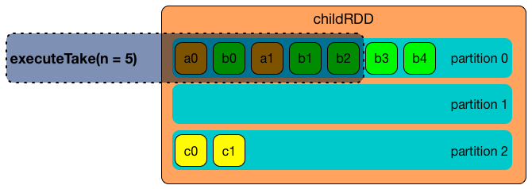

== [[SparkPlan]] SparkPlan -- Physical Execution Query Plan / Physical Operator

`SparkPlan` is the base link:spark-sql-catalyst-QueryPlan.adoc[Catalyst query plan] for *physical operators* that used (_composed_) together build the *physical execution query plan* (aka _query execution plan_) of a structured query.

NOTE: A structured query is created using Spark SQL's high-level strongly-typed link:spark-sql-Dataset.adoc[Dataset] API.

[NOTE]
====
A physical operator is a link:spark-sql-catalyst-TreeNode.adoc[Catalyst tree node] that may have zero or more link:spark-sql-catalyst-TreeNode.adoc#children[child physical operators].

In other words, a structured query is basically a single `SparkPlan` with link:spark-sql-catalyst-TreeNode.adoc#children[child physical operators].

Spark SQL uses link:spark-sql-catalyst.adoc[Catalyst] tree manipulation framework to compose nodes to build a tree of (logical or physical) operators that, in this particular case, is composing `SparkPlan` physical operator nodes to build the physical execution plan tree of a structured query.
====

When <<execute, executed>>, a physical operator produces an RDD of link:spark-sql-InternalRow.adoc[internal binary rows] (i.e. `RDD[InternalRow]`).

[NOTE]
====
<<execute, execute>> is called when `QueryExecution` is requested for the link:spark-sql-QueryExecution.adoc#toRdd[RDD] that is Spark Core's physical execution plan (as a RDD lineage) that triggers query execution (i.e. physical planning, but not execution of the plan) and _could_ be considered execution of a structured query.

The _could_ part above refers to the fact that the final execution of a structured query happens only when a RDD action is executed on the RDD of a structured query. And hence the need for Spark SQL's high-level Dataset API in which the Dataset operators simply execute a RDD action on the corresponding RDD. _Easy, isn't it?_
====

[TIP]
====
Use link:spark-sql-dataset-operators.adoc#explain[explain] operator to see the execution plan of a structured query.

[source, scala]
----
val q = // your query here
q.explain
----

You may also access the execution plan of a `Dataset` using its link:spark-sql-Dataset.adoc#queryExecution[queryExecution] property.

[source, scala]
----
val q = // your query here
q.queryExecution.sparkPlan
----
====

The <<contract, SparkPlan contract>> assumes that concrete physical operators define <<doExecute, doExecute>> method (with optional <<hooks, hooks>> like <<doPrepare, doPrepare>>) which is executed when the physical operator is <<execute, executed>>.

CAUTION: FIXME A picture with methods/hooks called.

CAUTION: FIXME `SparkPlan` is `Serializable`. Why?

`SparkPlan` has the following `final` methods that prepare execution environment and pass calls to corresponding methods (that constitute <<contract, SparkPlan Contract>>).

[[final-methods]]
.SparkPlan's Final Methods
[cols="1,3",options="header",width="100%"]
|===
| Name
| Description

| [[execute]] `execute`
a| Executes a physical operator that generates an `RDD` of link:spark-sql-InternalRow.adoc[internal binary rows] (i.e. `RDD[InternalRow]`).

[source, scala]
----
final def execute(): RDD[InternalRow]
----

Used _most importantly_ when `QueryExecution` is requested for a <<toRdd, RDD>> (that in turn triggers execution of any children the physical operator may have).

Internally, `execute` executes <<doExecute, doExecute>> in a <<executeQuery, named scope>>.

NOTE: Executing `doExecute` in a named scope happens only after the operator is <<prepare, prepared for execution>> followed by <<waitForSubqueries, waiting for any subqueries to finish>>.

| <<executeQuery, executeQuery>>
a| Executes a physical operator in a single RDD scope, i.e. all RDDs created during execution of the physical operator have the same scope.

[source, scala]
----
protected final def executeQuery[T](query: => T): T
----

`executeQuery` executes the input `query` after the following methods (in order):

1. <<prepare, prepare>>
2. <<waitForSubqueries, waitForSubqueries>>

[NOTE]
====
`executeQuery` is used when:

* `SparkPlan` is <<execute, executed>> (in which the input `query` is just <<doExecute, doExecute>>)
* `SparkPlan` is requested to <<executeBroadcast, executeBroadcast>> (in which the input `query` is just <<doExecuteBroadcast, doExecuteBroadcast>>)
* `CodegenSupport` is requested for the link:spark-sql-CodegenSupport.adoc#produce[Java source code] of a physical operator (in which the input `query` is <<doProduce, doProduce>>)
====

| [[prepare]] `prepare`
a| Prepares a physical operator for execution

[source, scala]
----
final def prepare(): Unit
----

`prepare` is used mainly when a physical operator is requested to <<executeQuery, execute a structured query>>

`prepare` is also used recursively for every link:spark-sql-catalyst-TreeNode.adoc#children[child] physical operator (down the physical plan) and when a physical operator is requested to <<prepareSubqueries, prepare subqueries>>.

NOTE: `prepare` is idempotent, i.e. can be called multiple times with no change to the final result. It uses <<prepared, prepared>> internal flag to execute the physical operator once only.

Internally, `prepare` calls <<doPrepare, doPrepare>> of its link:spark-sql-catalyst-TreeNode.adoc#children[children] before <<prepareSubqueries, prepareSubqueries>> and <<doPrepare, doPrepare>>.

| <<executeBroadcast, executeBroadcast>>
| Calls <<doExecuteBroadcast, doExecuteBroadcast>>
|===

[[specialized-spark-plans]]
.Physical Query Operators / Specialized SparkPlans
[cols="1,2",options="header",width="100%"]
|===
| Name
| Description

| [[BinaryExecNode]] `BinaryExecNode`
| Binary physical operator with two child `left` and `right` physical operators

| [[LeafExecNode]] `LeafExecNode`
| Leaf physical operator with no children

By default, the link:spark-sql-catalyst-QueryPlan.adoc#producedAttributes[set of all attributes that are produced] is exactly the link:spark-sql-catalyst-QueryPlan.adoc#outputSet[set of attributes that are output].

| [[UnaryExecNode]] `UnaryExecNode`
| Unary physical operator with one `child` physical operator
|===

NOTE: The naming convention for physical operators in Spark's source code is to have their names end with the *Exec* prefix, e.g. `DebugExec` or link:spark-sql-SparkPlan-LocalTableScanExec.adoc[LocalTableScanExec] that is however removed when the operator is displayed, e.g. in link:spark-webui-sql.adoc[web UI].

[[internal-registries]]
.SparkPlan's Internal Properties (e.g. Registries, Counters and Flags)
[cols="1,2",options="header",width="100%"]
|===
| Name
| Description

| [[prepared]] `prepared`
| Flag that controls that <<prepare, prepare>> is executed only once.
|===

=== [[outputOrdering]] `outputOrdering` Method

CAUTION: FIXME

=== [[decodeUnsafeRows]] `decodeUnsafeRows` Method

CAUTION: FIXME

=== [[prepareSubqueries]] `prepareSubqueries` Method

CAUTION: FIXME

=== [[getByteArrayRdd]] `getByteArrayRdd` Internal Method

[source, scala]
----
getByteArrayRdd(n: Int = -1): RDD[Array[Byte]]
----

CAUTION: FIXME

=== [[waitForSubqueries]] `waitForSubqueries` Method

CAUTION: FIXME

=== [[executeCollect]] `executeCollect` Method

CAUTION: FIXME

NOTE: `executeCollect` does not convert data to JVM types.

=== [[executeToIterator]] `executeToIterator` Method

CAUTION: FIXME

=== [[contract]] SparkPlan Contract

`SparkPlan` contract requires that concrete physical operators define their own custom `doExecute`.

[[doExecute]]
[source, scala]
----
doExecute(): RDD[InternalRow]
----

`doExecute` produces the result of a structured query as an `RDD` of link:spark-sql-InternalRow.adoc[internal binary rows].

[[hooks]]
.SparkPlan's Extension Hooks (in alphabetical order)
[cols="1,2",options="header",width="100%"]
|===
| Name
| Description

| [[doExecuteBroadcast]] `doExecuteBroadcast`
a|

By default reports a `UnsupportedOperationException`.

```
[nodeName] does not implement doExecuteBroadcast
```

Executed exclusively as part of <<executeBroadcast, executeBroadcast>> to return the result of a structured query as a broadcast variable.

| [[doPrepare]] `doPrepare`
| Prepares a physical operator for execution.

Executed exclusively as part of <<prepare, prepare>> and is supposed to set some state up before executing a query (e.g. link:spark-sql-SparkPlan-BroadcastExchangeExec.adoc#doPrepare[BroadcastExchangeExec] to broadcast asynchronously).

| [[outputPartitioning]] `outputPartitioning`
| Specifies how data is partitioned across different nodes in the cluster

| [[requiredChildDistribution]] `requiredChildDistribution`
a| Required *partition requirements* (_aka_ *child output distributions*) of the input data, i.e. how link:spark-sql-catalyst-TreeNode.adoc#children[children] physical operators' output is split across partitions.

[source, scala]
----
requiredChildDistribution: Seq[Distribution]
----

Defaults to `UnspecifiedDistribution` for all of the physical operator's link:spark-sql-catalyst-TreeNode.adoc#children[children].

Used exclusively when `EnsureRequirements` physical preparation rule link:spark-sql-EnsureRequirements.adoc#ensureDistributionAndOrdering[enforces partition requirements of a physical operator].

| [[requiredChildOrdering]] `requiredChildOrdering`
a| Specifies required sort ordering for each partition requirement (from link:spark-sql-catalyst-TreeNode.adoc#children[children] operators)

[source, scala]
----
requiredChildOrdering: Seq[Seq[SortOrder]]
----

Defaults to no sort ordering for all of the physical operator's link:spark-sql-catalyst-TreeNode.adoc#children[children].

Used exclusively when `EnsureRequirements` physical preparation rule link:spark-sql-EnsureRequirements.adoc#ensureDistributionAndOrdering[enforces sort requirements of a physical operator].
|===

=== [[executeQuery]] Preparing SparkPlan for Query Execution -- `executeQuery` Final Method

[source, scala]
----
executeQuery[T](query: => T): T
----

`executeQuery` executes the input `query` in a scope (i.e. so that all RDDs created will have the same scope for visualization like web UI).

Internally, `executeQuery` calls <<prepare, prepare>> and <<waitForSubqueries, waitForSubqueries>> followed by executing `query`.

NOTE: `executeQuery` is executed as part of <<execute, execute>>, <<executeBroadcast, executeBroadcast>> and when ``CodegenSupport``-enabled physical operator link:spark-sql-CodegenSupport.adoc#produce[produces a Java source code].

=== [[executeBroadcast]] Broadcasting Result of Structured Query -- `executeBroadcast` Final Method

[source, scala]
----
executeBroadcast[T](): broadcast.Broadcast[T]
----

`executeBroadcast` returns the result of a structured query as a broadcast variable.

Internally, `executeBroadcast` calls <<doExecuteBroadcast, doExecuteBroadcast>> inside <<executeQuery, executeQuery>>.

NOTE: `executeBroadcast` is called in link:spark-sql-SparkPlan-BroadcastHashJoinExec.adoc[BroadcastHashJoinExec], link:spark-sql-SparkPlan-BroadcastNestedLoopJoinExec.adoc[BroadcastNestedLoopJoinExec] and link:spark-sql-SparkPlan-ReusedExchangeExec.adoc[ReusedExchangeExec] physical operators.

=== [[metrics]] `metrics` Internal Registry

[source, scala]
----
metrics: Map[String, SQLMetric] = Map.empty
----

`metrics` is a registry of supported link:spark-sql-SQLMetric.adoc[SQLMetrics] by their names.

=== [[executeTake]] Taking First N UnsafeRows -- `executeTake` Method

[source, scala]
----
executeTake(n: Int): Array[InternalRow]
----

`executeTake` gives an array of up to `n` first link:spark-sql-InternalRow.adoc[internal rows].

.SparkPlan's executeTake takes 5 elements


Internally, `executeTake` <<getByteArrayRdd, gets an RDD of byte array of `n` unsafe rows>> and scans the RDD partitions one by one until `n` is reached or all partitions were processed.

`executeTake` runs Spark jobs that take all the elements from requested number of partitions, starting from the 0th partition and increasing their number by link:spark-sql-SQLConf.adoc#spark.sql.limit.scaleUpFactor[spark.sql.limit.scaleUpFactor] property (but minimum twice as many).

NOTE: `executeTake` uses `SparkContext.runJob` to run a Spark job.

In the end, `executeTake` <<decodeUnsafeRows, decodes the unsafe rows>>.

NOTE: `executeTake` gives an empty collection when `n` is 0 (and no Spark job is executed).

NOTE: `executeTake` may take and decode more unsafe rows than really needed since all unsafe rows from a partition are read (if the partition is included in the scan).

[source, scala]
----
import org.apache.spark.sql.internal.SQLConf.SHUFFLE_PARTITIONS
spark.sessionState.conf.setConf(SHUFFLE_PARTITIONS, 10)

// 8 groups over 10 partitions
// only 7 partitions are with numbers
val nums = spark.
  range(start = 0, end = 20, step = 1, numPartitions = 4).
  repartition($"id" % 8)

import scala.collection.Iterator
val showElements = (it: Iterator[java.lang.Long]) => {
  val ns = it.toSeq
  import org.apache.spark.TaskContext
  val pid = TaskContext.get.partitionId
  println(s"[partition: $pid][size: ${ns.size}] ${ns.mkString(" ")}")
}
// ordered by partition id manually for demo purposes
scala> nums.foreachPartition(showElements)
[partition: 0][size: 2] 4 12
[partition: 1][size: 2] 7 15
[partition: 2][size: 0]
[partition: 3][size: 0]
[partition: 4][size: 0]
[partition: 5][size: 5] 0 6 8 14 16
[partition: 6][size: 0]
[partition: 7][size: 3] 3 11 19
[partition: 8][size: 5] 2 5 10 13 18
[partition: 9][size: 3] 1 9 17

scala> println(spark.sessionState.conf.limitScaleUpFactor)
4

// Think how many Spark jobs will the following queries run?
// Answers follow
scala> nums.take(13)
res0: Array[Long] = Array(4, 12, 7, 15, 0, 6, 8, 14, 16, 3, 11, 19, 2)

// The number of Spark jobs = 3

scala> nums.take(5)
res34: Array[Long] = Array(4, 12, 7, 15, 0)

// The number of Spark jobs = 4

scala> nums.take(3)
res38: Array[Long] = Array(4, 12, 7)

// The number of Spark jobs = 2
----

[NOTE]
====
`executeTake` is used when:

* `CollectLimitExec` is requested to <<executeCollect, executeCollect>>
* `AnalyzeColumnCommand` is executed
====
