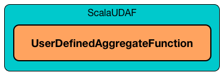

== [[UserDefinedAggregateFunction]] UserDefinedAggregateFunction -- Contract for User-Defined Aggregate Functions (UDAFs)

`UserDefinedAggregateFunction` is the <<contract, contract>> to define *user-defined aggregate functions (UDAFs)*.

[source, scala]
----
// Custom UDAF to count rows

import org.apache.spark.sql.Row
import org.apache.spark.sql.expressions.{MutableAggregationBuffer, UserDefinedAggregateFunction}
import org.apache.spark.sql.types.{DataType, LongType, StructType}

class MyCountUDAF extends UserDefinedAggregateFunction {
  override def inputSchema: StructType = {
    new StructType().add("id", LongType, nullable = true)
  }

  override def bufferSchema: StructType = {
    new StructType().add("count", LongType, nullable = true)
  }

  override def dataType: DataType = LongType

  override def deterministic: Boolean = true

  override def initialize(buffer: MutableAggregationBuffer): Unit = {
    println(s">>> initialize (buffer: $buffer)")
    // NOTE: Scala's update used under the covers
    buffer(0) = 0L
  }

  override def update(buffer: MutableAggregationBuffer, input: Row): Unit = {
    println(s">>> update (buffer: $buffer -> input: $input)")
    buffer(0) = buffer.getLong(0) + 1
  }

  override def merge(buffer: MutableAggregationBuffer, row: Row): Unit = {
    println(s">>> merge (buffer: $buffer -> row: $row)")
    buffer(0) = buffer.getLong(0) + row.getLong(0)
  }

  override def evaluate(buffer: Row): Any = {
    println(s">>> evaluate (buffer: $buffer)")
    buffer.getLong(0)
  }
}
----

`UserDefinedAggregateFunction` is created using <<apply, apply>> or <<distinct, distinct>> factory methods.

[source, scala]
----
val dataset = spark.range(start = 0, end = 4, step = 1, numPartitions = 2)

// Use the UDAF
val mycount = new MyCountUDAF
val q = dataset.
  withColumn("group", 'id % 2).
  groupBy('group).
  agg(mycount.distinct('id) as "count")
scala> q.show
+-----+-----+
|group|count|
+-----+-----+
|    0|    2|
|    1|    2|
+-----+-----+
----

The <<contract, lifecycle>> of `UserDefinedAggregateFunction` is entirely managed using link:spark-sql-Expression-ScalaUDAF.adoc[ScalaUDAF] expression container.

.UserDefinedAggregateFunction and ScalaUDAF Expression Container

[NOTE]
====
Use link:spark-sql-UDFRegistration.adoc[UDFRegistration] to register a (temporary) `UserDefinedAggregateFunction` and use it in link:spark-sql-SparkSession.adoc#sql[SQL mode].

[source, scala]
----
import org.apache.spark.sql.expressions.UserDefinedAggregateFunction
val mycount: UserDefinedAggregateFunction = ...
spark.udf.register("mycount", mycount)

spark.sql("SELECT mycount(*) FROM range(5)")
----
====

=== [[contract]] UserDefinedAggregateFunction Contract

[source, scala]
----
package org.apache.spark.sql.expressions

abstract class UserDefinedAggregateFunction {
  // only required methods that have no implementation
  def bufferSchema: StructType
  def dataType: DataType
  def deterministic: Boolean
  def evaluate(buffer: Row): Any
  def initialize(buffer: MutableAggregationBuffer): Unit
  def inputSchema: StructType
  def merge(buffer1: MutableAggregationBuffer, buffer2: Row): Unit
  def update(buffer: MutableAggregationBuffer, input: Row): Unit
}
----

.(Subset of) UserDefinedAggregateFunction Contract (in alphabetical order)
[cols="1,2",options="header",width="100%"]
|===
| Method
| Description

| [[bufferSchema]] `bufferSchema`
|

| [[dataType]] `dataType`
|

| [[deterministic]] `deterministic`
|

| [[evaluate]] `evaluate`
|

| [[initialize]] `initialize`
|

| [[inputSchema]] `inputSchema`
|

| [[merge]] `merge`
|

| [[update]] `update`
|
|===

=== [[apply]] Creating Column for UDAF -- `apply` Method

[source, scala]
----
apply(exprs: Column*): Column
----

`apply` creates a link:spark-sql-Column.adoc[Column] with link:spark-sql-Expression-ScalaUDAF.adoc[ScalaUDAF] (inside link:spark-sql-Expression-AggregateExpression.adoc[AggregateExpression]).

NOTE: `AggregateExpression` uses `Complete` mode and `isDistinct` flag is disabled.

[source, scala]
----
import org.apache.spark.sql.expressions.UserDefinedAggregateFunction
val myUDAF: UserDefinedAggregateFunction = ...
val myUdafCol = myUDAF.apply($"id", $"name")
scala> myUdafCol.explain(extended = true)
mycountudaf('id, 'name, $line17.$read$$iw$$iw$MyCountUDAF@4704b66a, 0, 0)

scala> println(myUdafCol.expr.numberedTreeString)
00 mycountudaf('id, 'name, $line17.$read$$iw$$iw$MyCountUDAF@4704b66a, 0, 0)
01 +- MyCountUDAF('id,'name)
02    :- 'id
03    +- 'name

import org.apache.spark.sql.catalyst.expressions.aggregate.AggregateExpression
myUdafCol.expr.asInstanceOf[AggregateExpression]

import org.apache.spark.sql.execution.aggregate.ScalaUDAF
val scalaUdaf = myUdafCol.expr.children.head.asInstanceOf[ScalaUDAF]
scala> println(scalaUdaf.toString)
MyCountUDAF('id,'name)
----

=== [[distinct]] Creating Column for UDAF with Distinct Values -- `distinct` Method

[source, scala]
----
distinct(exprs: Column*): Column
----

`distinct` creates a link:spark-sql-Column.adoc[Column] with link:spark-sql-Expression-ScalaUDAF.adoc[ScalaUDAF] (inside link:spark-sql-Expression-AggregateExpression.adoc[AggregateExpression]).

NOTE: `AggregateExpression` uses `Complete` mode and `isDistinct` flag is enabled.

NOTE: `distinct` is like <<apply, apply>> but has `isDistinct` flag enabled.

[source, scala]
----
import org.apache.spark.sql.expressions.UserDefinedAggregateFunction
val myUDAF: UserDefinedAggregateFunction = ...
scala> val myUdafCol = myUDAF.distinct($"id", $"name")
myUdafCol: org.apache.spark.sql.Column = mycountudaf(DISTINCT id, name)

scala> myUdafCol.explain(extended = true)
mycountudaf(distinct 'id, 'name, $line17.$read$$iw$$iw$MyCountUDAF@4704b66a, 0, 0)

import org.apache.spark.sql.catalyst.expressions.aggregate.AggregateExpression
val aggExpr = myUdafCol.expr
scala> println(aggExpr.numberedTreeString)
00 mycountudaf(distinct 'id, 'name, $line17.$read$$iw$$iw$MyCountUDAF@4704b66a, 0, 0)
01 +- MyCountUDAF('id,'name)
02    :- 'id
03    +- 'name

scala> aggExpr.asInstanceOf[AggregateExpression].isDistinct
res0: Boolean = true
----
