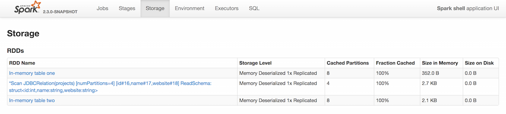

== User-Friendly Names Of Cached Queries in web UI's Storage Tab

As you may have noticed, web UI's Storage tab displays some link:spark-sql-caching.adoc#cache[cached queries] with user-friendly RDD names (e.g. "In-memory table [name]") while others not (e.g. "Scan JDBCRelation...").

.Cached Queries in web UI (Storage Tab)

"In-memory table [name]" RDD names are the result of SQL's link:spark-sql-caching.adoc#cache-table[CACHE TABLE] or when `Catalog` is requested to link:spark-sql-Catalog.adoc#cacheTable[cache a table].

[source, scala]
----
// register Dataset as temporary view (table)
spark.range(1).createOrReplaceTempView("one")
// caching is lazy and won't happen until an action is executed
val one = spark.table("one").cache
// The following gives "*Range (0, 1, step=1, splits=8)"
// WHY?!
one.show

scala> spark.catalog.isCached("one")
res0: Boolean = true

one.unpersist

import org.apache.spark.storage.StorageLevel
// caching is lazy
spark.catalog.cacheTable("one", StorageLevel.MEMORY_ONLY)
// The following gives "In-memory table one"
one.show

spark.range(100).createOrReplaceTempView("hundred")
// SQL's CACHE TABLE is eager
// The following gives "In-memory table `hundred`"
// WHY single quotes?
spark.sql("CACHE TABLE hundred")

// register Dataset under name
val ds = spark.range(20)
spark.sharedState.cacheManager.cacheQuery(ds, Some("twenty"))
// trigger an action
ds.head
----

The other RDD names are due to link:spark-sql-caching.adoc#cache[caching a Dataset].

[source, scala]
----
val ten = spark.range(10).cache
ten.head
----
