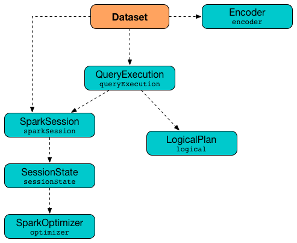

== Datasets -- Strongly-Typed DataFrames with Encoders

*Dataset* is Spark SQL's strongly-typed API for working with structured data, i.e. records with a known link:spark-sql-schema.adoc[schema].

Datasets are _lazy_ and structured query expressions are only triggered when an action is invoked. Internally, a `Dataset` represents a link:spark-sql-catalyst-LogicalPlan.adoc[logical plan] that describes the computation query required to produce the data (for a given link:spark-sql-sparksession.adoc[Spark SQL session]).

.Dataset's Internals


A Dataset is a result of executing a query expression against data storage like files, Hive tables or JDBC databases. The structured query expression can be described by a SQL query, a Column-based SQL expression or a Scala/Java lambda function. And that is why Dataset operations are available in three variants.

[source, scala]
----
scala> val dataset = (0 to 4).toDS
dataset: org.apache.spark.sql.Dataset[Int] = [value: int]

// Variant 1: filter operator accepts a Scala function
dataset.filter(n => n % 2 == 0).count

// Variant 2: filter operator accepts a Column-based SQL expression
dataset.filter('value % 2 === 0).count

// Variant 3: filter operator accepts a SQL query
dataset.filter("value % 2 = 0").count
----

The Dataset API offers declarative and type-safe operators that makes for an improved experience for data processing (comparing to link:spark-sql-dataframe.adoc[DataFrames] that were a set of index- or column name-based link:spark-sql-dataframe-row.adoc[Rows]).

[NOTE]
====
`Dataset` was first introduced in Apache Spark *1.6.0* as an experimental feature, and has since turned itself into a fully supported API.

As of Spark *2.0.0*, link:spark-sql-dataframe.adoc[DataFrame] - the flagship data abstraction of previous versions of Spark SQL - is currently a _mere_ type alias for `Dataset[Row]`:

[source, scala]
----
type DataFrame = Dataset[Row]
----

See https://github.com/apache/spark/blob/master/sql/core/src/main/scala/org/apache/spark/sql/package.scala#L45[package object sql].
====

`Dataset` offers convenience of RDDs with the performance optimizations of DataFrames and the strong static type-safety of Scala. The last feature of bringing the strong type-safety to link:spark-sql-dataframe.adoc[DataFrame] makes Dataset so appealing. All the features together give you a more functional programming interface to work with structured data.

[source, scala]
----
scala> spark.range(1).filter('id === 0).explain(true)
== Parsed Logical Plan ==
'Filter ('id = 0)
+- Range (0, 1, splits=8)

== Analyzed Logical Plan ==
id: bigint
Filter (id#51L = cast(0 as bigint))
+- Range (0, 1, splits=8)

== Optimized Logical Plan ==
Filter (id#51L = 0)
+- Range (0, 1, splits=8)

== Physical Plan ==
*Filter (id#51L = 0)
+- *Range (0, 1, splits=8)

scala> spark.range(1).filter(_ == 0).explain(true)
== Parsed Logical Plan ==
'TypedFilter <function1>, class java.lang.Long, [StructField(value,LongType,true)], unresolveddeserializer(newInstance(class java.lang.Long))
+- Range (0, 1, splits=8)

== Analyzed Logical Plan ==
id: bigint
TypedFilter <function1>, class java.lang.Long, [StructField(value,LongType,true)], newInstance(class java.lang.Long)
+- Range (0, 1, splits=8)

== Optimized Logical Plan ==
TypedFilter <function1>, class java.lang.Long, [StructField(value,LongType,true)], newInstance(class java.lang.Long)
+- Range (0, 1, splits=8)

== Physical Plan ==
*Filter <function1>.apply
+- *Range (0, 1, splits=8)
----

It is only with Datasets to have syntax and analysis checks at compile time (that was not possible using link:spark-sql-dataframe.adoc[DataFrame], regular SQL queries or even RDDs).

Using `Dataset` objects turns `DataFrames` of link:spark-sql-dataframe-row.adoc[Row] instances into a `DataFrames` of case classes with proper names and types (following their equivalents in the case classes). Instead of using indices to access respective fields in a DataFrame and cast it to a type, all this is automatically handled by Datasets and checked by the Scala compiler.

Datasets use link:spark-sql-catalyst-Optimizer.adoc[Catalyst Query Optimizer] and link:spark-sql-tungsten.adoc[Tungsten] to optimize query performance.

A `Dataset` object requires a link:spark-sql-sparksession.adoc[SparkSession], a link:spark-sql-query-execution.adoc[QueryExecution] plan, and an link:spark-sql-Encoder.adoc[Encoder] (for fast serialization to and deserialization from link:spark-sql-InternalRow.adoc[InternalRow]).

If however a link:spark-sql-catalyst-LogicalPlan.adoc[LogicalPlan] is used to <<creating-instance, create a `Dataset`>>, the logical plan is first link:spark-sql-sessionstate.adoc#executePlan[executed] (using the current link:spark-sql-sessionstate.adoc#executePlan[SessionState] in the `SparkSession`) that yields the link:spark-sql-query-execution.adoc[QueryExecution] plan.

A `Dataset` is <<Queryable, Queryable>> and `Serializable`, i.e. can be saved to a persistent storage.

NOTE: link:spark-sql-sparksession.adoc[SparkSession] and link:spark-sql-query-execution.adoc[QueryExecution] are transient attributes of a `Dataset` and therefore do not participate in Dataset serialization. The only _firmly-tied_ feature of a `Dataset` is the link:spark-sql-Encoder.adoc[Encoder].

It also has a <<schema, schema>>.

You can convert a type-safe Dataset to a "untyped" DataFrame (see <<implicits, Type Conversions to Dataset[T]>>) or access the RDD that sits underneath (see <<rdd, Converting Datasets into RDDs (using rdd method)>>). It is supposed to give you a more pleasant experience while transitioning from the legacy RDD-based or DataFrame-based APIs you may have used in the earlier versions of Spark SQL or encourage migrating from Spark Core's RDD API to Spark SQL's Dataset API.

The default storage level for `Datasets` is link:spark-rdd-caching.adoc[MEMORY_AND_DISK] because recomputing the in-memory columnar representation of the underlying table is expensive. See <<persist, Persisting Dataset (persist method)>> in this document.

Spark 2.0 has introduced a new query model called link:spark-sql-structured-streaming.adoc[Structured Streaming] for continuous incremental execution of structured queries. That made possible to consider Datasets a static and bounded as well as streaming and unbounded data sets with a single unified API for different execution models.

A `Dataset` is <<isLocal, local>> if it was created from local collections using link:spark-sql-sparksession.adoc#emptyDataset[SparkSession.emptyDataset] or link:spark-sql-sparksession.adoc#createDataset[SparkSession.createDataset] methods and their derivatives like link:spark-sql-dataset.adoc#toDF[toDF]. If so, the queries on the Dataset can be optimized and run locally, i.e. without using Spark executors.

=== [[transform]] Transforming Datasets -- `transform` method

[source, scala]
----
transform[U](t: Dataset[T] => Dataset[U]): Dataset[U]
----

`transform` applies `t` function to the source `Dataset[T]` and produces a `Dataset[U]`. It is for chaining custom transformations.

[source, scala]
----
val dataset = spark.range(5)

// Transformation t
import org.apache.spark.sql.Dataset
def withDoubled(longs: Dataset[java.lang.Long]) = longs.withColumn("doubled", 'id * 2)

scala> dataset.transform(withDoubled).show
+---+-------+
| id|doubled|
+---+-------+
|  0|      0|
|  1|      2|
|  2|      4|
|  3|      6|
|  4|      8|
+---+-------+
----

Internally, `transform` executes `t` function on the current `Dataset[T]`.

=== [[queryExecution]] `queryExecution` Attribute

`queryExecution` is a required parameter of a `Dataset`.

[source, scala]
----
val dataset: Dataset[Int] = ...
dataset.queryExecution
----

It is a part of the Developer API of the `Dataset` class.

=== [[creating-instance]] Creating Datasets

If link:spark-sql-catalyst-LogicalPlan.adoc[LogicalPlan] is used to <<creating-instance, create a `Dataset`>>, it is link:spark-sql-sessionstate.adoc#executePlan[executed] (using the current link:spark-sql-sessionstate.adoc#executePlan[SessionState]) to create a corresponding link:spark-sql-query-execution.adoc[QueryExecution].

=== [[col]] Creating Column -- `col` method

[source, scala]
----
val spark: SparkSession = ...
case class Word(id: Long, text: String)
val dataset = Seq(Word(0, "hello"), Word(1, "spark")).toDS

scala> val textCol = dataset.col("text")
textCol: org.apache.spark.sql.Column = text
----

=== [[apply]] Referencing Column -- `apply` method

[source, scala]
----
val spark: SparkSession = ...
case class Word(id: Long, text: String)
val dataset = Seq(Word(0, "hello"), Word(1, "spark")).toDS

scala> val idCol = dataset.apply("id")
idCol: org.apache.spark.sql.Column = id

// or using Scala's magic a little bit
// the following is equivalent to the above explicit apply call
scala> val idCol = dataset("id")
idCol: org.apache.spark.sql.Column = id
----

=== [[withColumn]] Adding Column -- `withColumn` method

[source, scala]
----
withColumn(colName: String, col: Column): DataFrame
----

`withColumn` method returns a new DataFrame with the new column `col` with `colName` name added.

NOTE: `withColumn` can replace an existing `colName` column.

[source, scala]
----
scala> val df = Seq((1, "jeden"), (2, "dwa")).toDF("number", "polish")
df: org.apache.spark.sql.DataFrame = [number: int, polish: string]

scala> df.show
+------+------+
|number|polish|
+------+------+
|     1| jeden|
|     2|   dwa|
+------+------+


scala> df.withColumn("polish", lit(1)).show
+------+------+
|number|polish|
+------+------+
|     1|     1|
|     2|     1|
+------+------+
----

=== [[write]] Accessing `DataFrameWriter` -- `write` method

[source, scala]
----
write: DataFrameWriter[T]
----

`write` method returns link:spark-sql-dataframewriter.adoc[DataFrameWriter] for records of type `T`.

[source, scala]
----
import org.apache.spark.sql.{DataFrameWriter, Dataset}
val ints: Dataset[Int] = (0 to 5).toDS

val writer: DataFrameWriter[Int] = ints.write
----

=== [[writeStream]] Accessing `DataStreamWriter` -- `writeStream` method

[source, scala]
----
writeStream: DataStreamWriter[T]
----

`writeStream` method returns link:spark-sql-streaming-DataStreamWriter.adoc[DataStreamWriter] for records of type `T`.

[source, scala]
----
val papers = spark.readStream.text("papers").as[String]

import org.apache.spark.sql.streaming.DataStreamWriter
val writer: DataStreamWriter[String] = papers.writeStream
----

=== [[show]] Display Records -- `show` methods

CAUTION: FIXME

Internally, `show` relays to a private `showString` to do the formatting. It turns the `Dataset` into a `DataFrame` (by calling `toDF()`) and <<take, takes first `n` records>>.

=== [[take]] Taking First n Records -- `take` method

[source, scala]
----
take(n: Int): Array[T]
----

`take` is an action on a `Dataset` that returns a collection of `n` records.

WARNING: `take` loads all the data into the memory of the Spark application's driver process and for a large `n` could result in `OutOfMemoryError`.

Internally, `take` creates a new `Dataset` with `Limit` logical plan for `Literal` expression and the current `LogicalPlan`. It then runs the link:spark-sql-catalyst-SparkPlan.adoc[SparkPlan] that produces a `Array[InternalRow]` that is in turn decoded to `Array[T]` using a bounded link:spark-sql-Encoder.adoc[encoder].

=== [[join]] `join`

CAUTION: FIXME

=== [[where]] `where`

CAUTION: FIXME

=== [[groupBy]] Grouping by Columns -- `groupBy` method

TIP: Read to link:spark-sql-aggregation.adoc[Aggregation -- Typed and Untyped Grouping].

=== [[foreachPartition]] `foreachPartition` method

[source, scala]
----
foreachPartition(f: Iterator[T] => Unit): Unit
----

`foreachPartition` applies the `f` function to each partition of the `Dataset`.

[source, scala]
----
case class Record(id: Int, city: String)
val ds = Seq(Record(0, "Warsaw"), Record(1, "London")).toDS

ds.foreachPartition { iter: Iterator[Record] => iter.foreach(println) }
----

NOTE: `foreachPartition` is used to link:spark-sql-dataframewriter.adoc#jdbc[save a `DataFrame` to a JDBC table] (indirectly through `JdbcUtils.saveTable`) and link:spark-sql-streaming-ForeachSink.adoc[ForeachSink].

=== [[mapPartitions]] `mapPartitions` method

[source, scala]
----
mapPartitions[U: Encoder](func: Iterator[T] => Iterator[U]): Dataset[U]
----

`mapPartitions` returns a new `Dataset` (of type `U`) with the function `func` applied to each partition.

CAUTION: FIXME Example

=== [[flatMap]] Creating Zero or More Records -- `flatMap` method

[source, scala]
----
flatMap[U: Encoder](func: T => TraversableOnce[U]): Dataset[U]
----

`flatMap` returns a new `Dataset` (of type `U`) with all records (of type `T`) mapped over using the function `func` and then flattening the results.

NOTE: `flatMap` can create new records. It deprecated `explode`.

[source, scala]
----
final case class Sentence(id: Long, text: String)
val sentences = Seq(Sentence(0, "hello world"), Sentence(1, "witaj swiecie")).toDS

scala> sentences.flatMap(s => s.text.split("\\s+")).show
+-------+
|  value|
+-------+
|  hello|
|  world|
|  witaj|
|swiecie|
+-------+
----

Internally, `flatMap` calls <<mapPartitions, mapPartitions>> with the partitions `flatMap(ped)`.

=== [[cache]] Caching Dataset -- `cache` method

[source, scala]
----
cache(): this.type
----

`cache` merely passes the calls to no-argument <<persist, persist>> method.

=== [[persist]] Persisting Dataset -- `persist` method

[source, scala]
----
persist(): this.type
persist(newLevel: StorageLevel): this.type
----

`persist` caches the `Dataset` using the default storage level `MEMORY_AND_DISK` or `newLevel`.

Internally, it requests the link:spark-sql-CacheManager.adoc#cacheQuery[`CacheManager` to cache the query] (that is accessible through link:spark-sql-sparksession.adoc#SharedState[SharedState] of the current link:spark-sql-sparksession.adoc[SparkSession]).

=== [[unpersist]] Unpersisting Dataset -- `unpersist` method

[source, scala]
----
unpersist(blocking: Boolean): this.type
----

`unpersist` uncache the `Dataset` possibly by `blocking` the call.

Internally, it requests the link:spark-cachemanager.adoc#uncacheQuery[`CacheManager` to uncache the query].

=== [[repartition]] Repartitioning Dataset -- `repartition` method

[source, scala]
----
repartition(numPartitions: Int): Dataset[T]
----

`repartition` repartition the `Dataset` to exactly `numPartitions` partitions.

=== [[features]] Features of Dataset API

The features of the Dataset API in Spark SQL:

* **Type-safety** as Datasets are Scala domain objects and operations operate on their attributes. All is checked by the Scala compiler at compile time.

=== [[implicits]][[toDS]][[toDF]] Implicit Type Conversions to Datasets -- `toDS` and `toDF` methods

`DatasetHolder` case class offers three methods that do the conversions from `Seq[T]` or `RDD[T]` types to a `Dataset[T]`:

* `toDS(): Dataset[T]`
* `toDF(): DataFrame`
* `toDF(colNames: String*): DataFrame`

NOTE: `DataFrame` is a _mere_ type alias for `Dataset[Row]` since Spark *2.0.0*.

`DatasetHolder` is used by `SQLImplicits` that is available to use after link:spark-sql-sparksession.adoc#implicits[importing `implicits` object of `SparkSession`].

[source, scala]
----
val spark: SparkSession = ...
import spark.implicits._

scala> val ds = Seq("I am a shiny Dataset!").toDS
ds: org.apache.spark.sql.Dataset[String] = [value: string]

scala> val df = Seq("I am an old grumpy DataFrame!").toDF
df: org.apache.spark.sql.DataFrame = [value: string]

scala> val df = Seq("I am an old grumpy DataFrame!").toDF("text")
df: org.apache.spark.sql.DataFrame = [text: string]

scala> val ds = sc.parallelize(Seq("hello")).toDS
ds: org.apache.spark.sql.Dataset[String] = [value: string]
----

[NOTE]
====
This import of `implicits` object's values is automatically executed in link:spark-shell.adoc[Spark Shell] and so you don't need to do anything but use the conversions.

```
scala> spark.version
res11: String = 2.0.0

scala> :imports
 1) import spark.implicits._  (59 terms, 38 are implicit)
 2) import spark.sql          (1 terms)
```
====

[source, scala]
----
val spark: SparkSession = ...
import spark.implicits._

case class Token(name: String, productId: Int, score: Double)
val data = Seq(
  Token("aaa", 100, 0.12),
  Token("aaa", 200, 0.29),
  Token("bbb", 200, 0.53),
  Token("bbb", 300, 0.42))

// Transform data to a Dataset[Token]
// It doesn't work with type annotation
// https://issues.apache.org/jira/browse/SPARK-13456
val ds = data.toDS

// ds: org.apache.spark.sql.Dataset[Token] = [name: string, productId: int ... 1 more field]

// Transform data into a DataFrame with no explicit schema
val df = data.toDF

// Transform DataFrame into a Dataset
val ds = df.as[Token]

scala> ds.show
+----+---------+-----+
|name|productId|score|
+----+---------+-----+
| aaa|      100| 0.12|
| aaa|      200| 0.29|
| bbb|      200| 0.53|
| bbb|      300| 0.42|
+----+---------+-----+

scala> ds.printSchema
root
 |-- name: string (nullable = true)
 |-- productId: integer (nullable = false)
 |-- score: double (nullable = false)

// In DataFrames we work with Row instances
scala> df.map(_.getClass.getName).show(false)
+--------------------------------------------------------------+
|value                                                         |
+--------------------------------------------------------------+
|org.apache.spark.sql.catalyst.expressions.GenericRowWithSchema|
|org.apache.spark.sql.catalyst.expressions.GenericRowWithSchema|
|org.apache.spark.sql.catalyst.expressions.GenericRowWithSchema|
|org.apache.spark.sql.catalyst.expressions.GenericRowWithSchema|
+--------------------------------------------------------------+

// In Datasets we work with case class instances
scala> ds.map(_.getClass.getName).show(false)
+---------------------------+
|value                      |
+---------------------------+
|$line40.$read$$iw$$iw$Token|
|$line40.$read$$iw$$iw$Token|
|$line40.$read$$iw$$iw$Token|
|$line40.$read$$iw$$iw$Token|
+---------------------------+
----

==== [[toDS-internals]] Internals of toDS

Internally, the Scala compiler makes `toDS` implicitly available to any `Seq[T]` (using `SQLImplicits.localSeqToDatasetHolder` implicit method).

NOTE: This and other implicit methods are in scope whenever you do `import spark.implicits._`.

The input `Seq[T]` is converted into `Dataset[T]` by means of link:spark-sql-sqlcontext.adoc#createDataset[SQLContext.createDataset] that in turn passes all calls on to link:spark-sql-sparksession.adoc#createDataset[SparkSession.createDataset]. Once created, the `Dataset[T]` is wrapped in `DatasetHolder[T]` with `toDS` that just returns the input `ds`.

=== [[rdd]] Converting Datasets into RDDs -- `rdd` method

Whenever you are in need to convert a `Dataset` into a `RDD`, executing `rdd` method gives you the RDD of the proper input object type (not link:spark-sql-dataframe.adoc#features[Row as in DataFrames]) that sits behind the `Dataset`.

[source, scala]
----
scala> val rdd = tokens.rdd
rdd: org.apache.spark.rdd.RDD[Token] = MapPartitionsRDD[11] at rdd at <console>:30
----

Internally, it looks link:spark-sql-Encoder.adoc#ExpressionEncoder[ExpressionEncoder] (for the `Dataset`) up and accesses the `deserializer` expression. That gives the link:spark-sql-DataType.adoc[DataType] of the result of evaluating the expression.

NOTE: A deserializer expression is used to decode an link:spark-sql-InternalRow.adoc[InternalRow] to an object of type `T`. See link:spark-sql-Encoder.adoc#ExpressionEncoder[ExpressionEncoder].

It then executes a `DeserializeToObject` logical plan that will produce a `RDD[InternalRow]` that is converted into the proper `RDD[T]` using the `DataType` and `T`.

NOTE: It is a lazy operation that "produces" a `RDD[T]`.

=== [[schema]] Schema

A `Dataset` has a *schema*.

[source, scala]
----
schema: StructType
----

[TIP]
====
You may also use the following methods to learn about the schema:

* `printSchema(): Unit`
* <<explain, explain>>
====

=== [[types]] Supported Types

CAUTION: FIXME What types are supported by Encoders

=== [[toJSON]] `toJSON` method

`toJSON` maps the content of `Dataset` to a `Dataset` of JSON strings.

NOTE: A new feature in Spark **2.0.0**.

[source, scala]
----
scala> val ds = Seq("hello", "world", "foo bar").toDS
ds: org.apache.spark.sql.Dataset[String] = [value: string]

scala> ds.toJSON.show
+-------------------+
|              value|
+-------------------+
|  {"value":"hello"}|
|  {"value":"world"}|
|{"value":"foo bar"}|
+-------------------+
----

Internally, `toJSON` grabs the `RDD[InternalRow]` (of the link:spark-sql-query-execution.adoc#toRdd[QueryExecution] of the `Dataset`) and link:spark-rdd-transformations.adoc#mapPartitions[maps the records (per RDD partition)] into JSON.

NOTE: `toJSON` uses Jackson's JSON parser -- https://github.com/FasterXML/jackson-module-scala[jackson-module-scala].

=== [[explain]] `explain` method

[source, scala]
----
explain(): Unit
explain(extended: Boolean): Unit
----

`explain` prints the link:spark-sql-catalyst-LogicalPlan.adoc[logical] and physical plans to the console. Use it for debugging structured queries.

TIP: If you are serious about query debugging you could also use the link:spark-sql-debugging-execution.adoc[Debugging Query Execution facility].

Internally, `explain` link:spark-sql-catalyst-SparkPlan.adoc#executeCollect[executes] a link:spark-sql-catalyst-LogicalPlan.adoc#ExplainCommand[ExplainCommand] logical command.

[source, scala]
----
scala> spark.range(10).explain(extended = true)
== Parsed Logical Plan ==
Range (0, 10, step=1, splits=Some(8))

== Analyzed Logical Plan ==
id: bigint
Range (0, 10, step=1, splits=Some(8))

== Optimized Logical Plan ==
Range (0, 10, step=1, splits=Some(8))

== Physical Plan ==
*Range (0, 10, step=1, splits=Some(8))
----

=== [[select]] Projecting Columns -- `select` method

[source, scala]
----
select[U1: Encoder](c1: TypedColumn[T, U1]): Dataset[U1]
select[U1, U2](c1: TypedColumn[T, U1], c2: TypedColumn[T, U2]): Dataset[(U1, U2)]
select[U1, U2, U3](
  c1: TypedColumn[T, U1],
  c2: TypedColumn[T, U2],
  c3: TypedColumn[T, U3]): Dataset[(U1, U2, U3)]
select[U1, U2, U3, U4](
  c1: TypedColumn[T, U1],
  c2: TypedColumn[T, U2],
  c3: TypedColumn[T, U3],
  c4: TypedColumn[T, U4]): Dataset[(U1, U2, U3, U4)]
select[U1, U2, U3, U4, U5](
  c1: TypedColumn[T, U1],
  c2: TypedColumn[T, U2],
  c3: TypedColumn[T, U3],
  c4: TypedColumn[T, U4],
  c5: TypedColumn[T, U5]): Dataset[(U1, U2, U3, U4, U5)]
----

CAUTION: FIXME

=== [[filter]] `filter` method

CAUTION: FIXME

=== [[selectExpr]] Projecting Columns using Expressions -- `selectExpr` method

[source, scala]
----
selectExpr(exprs: String*): DataFrame
----

`selectExpr` is like `select`, but accepts SQL expressions `exprs`.

[source, scala]
----
val ds = spark.range(5)

scala> ds.selectExpr("rand() as random").show
16/04/14 23:16:06 INFO HiveSqlParser: Parsing command: rand() as random
+-------------------+
|             random|
+-------------------+
|  0.887675894185651|
|0.36766085091074086|
| 0.2700020856675186|
| 0.1489033635529543|
| 0.5862990791950973|
+-------------------+
----

Internally, it executes `select` with every expression in `exprs` mapped to link:spark-sql-columns.adoc[Column] (using link:spark-sql-sql-parsers.adoc[SparkSqlParser.parseExpression]).

[source, scala]
----
scala> ds.select(expr("rand() as random")).show
+------------------+
|            random|
+------------------+
|0.5514319279894851|
|0.2876221510433741|
|0.4599999092045741|
|0.5708558868374893|
|0.6223314406247136|
+------------------+
----

NOTE: A new feature in Spark **2.0.0**.

=== [[isLocal]] Is Dataset Local -- `isLocal` method

[source, scala]
----
isLocal: Boolean
----

`isLocal` is a boolean flag that says whether operators like `collect` or `take` could be run locally, i.e. without using executors.

Internally, `isLocal` checks whether the logical query plan of a `Dataset` is link:spark-sql-logical-plan-LocalRelation.adoc[LocalRelation].

=== [[isStreaming]] `isStreaming` method

`isStreaming` returns `true` when `Dataset` contains link:spark-sql-streaming-streamingrelation.adoc[StreamingRelation] or link:spark-sql-streaming-streamingrelation.adoc#StreamingExecutionRelation[StreamingExecutionRelation] *streaming sources*.

NOTE: Streaming datasets are created using link:spark-sql-dataframereader.adoc#stream[DataFrameReader.stream] method (for link:spark-sql-streaming-streamingrelation.adoc[StreamingRelation]) and contain link:spark-sql-streaming-streamingrelation.adoc#StreamingExecutionRelation[StreamingExecutionRelation] after link:spark-sql-streaming-DataStreamWriter.adoc#start[DataStreamWriter.start].

[source, scala]
----
val reader = spark.read
val helloStream = reader.stream("hello")

scala> helloStream.isStreaming
res9: Boolean = true
----

NOTE: A new feature in Spark **2.0.0**.

=== [[randomSplit]] `randomSplit` methods

[source, scala]
----
randomSplit(weights: Array[Double]): Array[Dataset[T]]
randomSplit(weights: Array[Double], seed: Long): Array[Dataset[T]]
----

`randomSplit` randomly splits the `Dataset` per `weights`.

`weights` doubles should sum up to `1` and will be normalized if they do not.

You can define `seed` and if you don't, a random `seed` will be used.

NOTE: It is used in link:spark-mllib/spark-mllib-estimators.adoc#TrainValidationSplit[TrainValidationSplit] to split dataset into training and validation datasets.

[source, scala]
----
val ds = spark.range(10)
scala> ds.randomSplit(Array[Double](2, 3)).foreach(_.show)
+---+
| id|
+---+
|  0|
|  1|
|  2|
+---+

+---+
| id|
+---+
|  3|
|  4|
|  5|
|  6|
|  7|
|  8|
|  9|
+---+
----

NOTE: A new feature in Spark **2.0.0**.

=== [[Queryable]] Queryable

CAUTION: FIXME

=== [[withNewExecutionId]] Tracking Multi-Job SQL Query Executions -- `withNewExecutionId` internal method

[source, scala]
----
withNewExecutionId[U](body: => U): U
----

`withNewExecutionId` is a `private[sql]` operator that executes the input `body` action using link:spark-sql-SQLExecution.adoc#withNewExecutionId[SQLExecution.withNewExecutionId] that sets the *execution id* local property set.

NOTE: It is used in `foreach`, <<foreachPartition, foreachPartition>>, and (private) `collect`.

=== [[ofRows]] Creating DataFrame -- `ofRows` internal method

[source, scala]
----
ofRows(sparkSession: SparkSession, logicalPlan: LogicalPlan): DataFrame
----

NOTE: `ofRows` is a `private[sql]` operator that can only be accessed from code in `org.apache.spark.sql` package. It is not a part of ``Dataset``'s public API.

`ofRows` returns link:spark-sql-dataframe.adoc[DataFrame] (which is the type alias for `Dataset[Row]`). `ofRows` uses link:spark-sql-RowEncoder.adoc[RowEncoder] to convert the schema (based on the input `logicalPlan` logical plan).

Internally, `ofRows` link:spark-sql-sessionstate.adoc#executePlan[prepares the input `logicalPlan` for execution] and creates a `Dataset[Row]` with the current link:spark-sql-sparksession.adoc[SparkSession], the link:spark-sql-query-execution.adoc[QueryExecution] and link:spark-sql-RowEncoder.adoc[RowEncoder].

=== [[i-want-more]] Further reading or watching

* (video) https://youtu.be/i7l3JQRx7Qw[Structuring Spark: DataFrames, Datasets, and Streaming]
