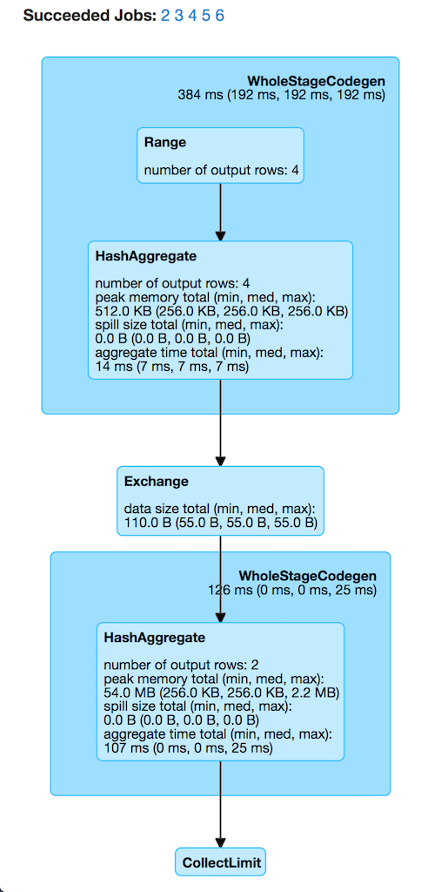
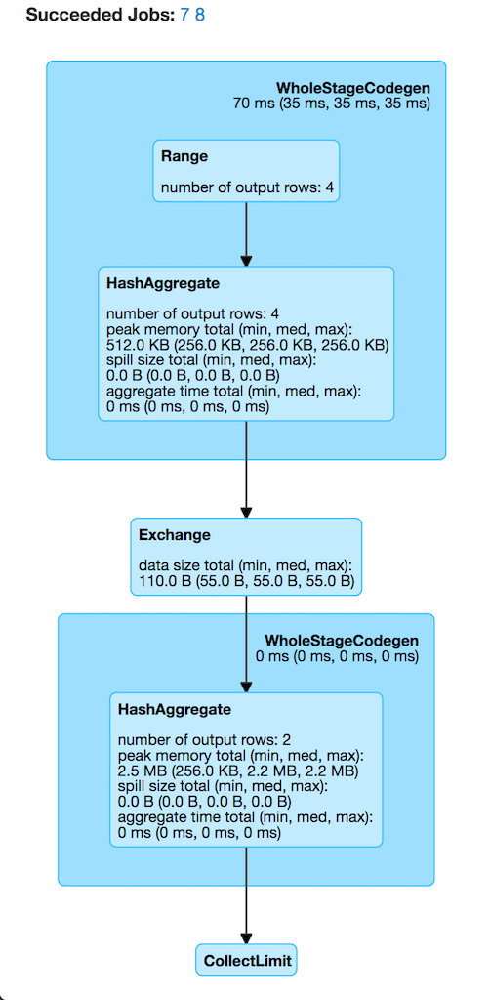

== Case Study: Number of Partitions for groupBy Aggregation

[IMPORTANT]
====
As it fairly often happens in my life, right after I had described the discovery I found out I was wrong and the "Aha moment" was gone.

Until I thought about the issue again and took the shortest path possible. See <<case_4, Case 4>> for the definitive solution.

I'm leaving the page with no changes in-between so you can read it and learn from my mistakes.
====

The goal of the case study is to fine tune the number of partitions used for `groupBy` aggregation.

Given the following 2-partition dataset the task is to write a structured query so there are no empty partitions (or as little as possible).

[source, scala]
----
// 2-partition dataset
val ids = spark.range(start = 0, end = 4, step = 1, numPartitions = 2)
scala> ids.show
+---+
| id|
+---+
|  0|
|  1|
|  2|
|  3|
+---+

scala> ids.rdd.toDebugString
res1: String =
(2) MapPartitionsRDD[8] at rdd at <console>:26 []
 |  MapPartitionsRDD[7] at rdd at <console>:26 []
 |  MapPartitionsRDD[6] at rdd at <console>:26 []
 |  MapPartitionsRDD[5] at rdd at <console>:26 []
 |  ParallelCollectionRDD[4] at rdd at <console>:26 []
----

[NOTE]
====
By default Spark SQL uses link:spark-sql-SQLConf.adoc#spark.sql.shuffle.partitions[spark.sql.shuffle.partitions] number of partitions for aggregations and joins, i.e. `200` by default.

That often leads to explosion of partitions for nothing that does impact the performance of a query since these 200 tasks (per partition) have all to start and finish before you get the result.

_Less is more_ remember?
====

=== [[case_1]] Case 1: Default Number of Partitions -- spark.sql.shuffle.partitions Property

This is the moment when you learn that _sometimes_ relying on defaults may lead to poor performance.

Think how many partitions the following query really requires?

[source, scala]
----
val groupingExpr = 'id % 2 as "group"
val q = ids.
  groupBy(groupingExpr).
  agg(count($"id") as "count")
----

You may have expected to have at most 2 partitions given the number of groups.

_Wrong!_

[source, scala]
----
scala> q.explain
== Physical Plan ==
*HashAggregate(keys=[(id#0L % 2)#17L], functions=[count(1)])
+- Exchange hashpartitioning((id#0L % 2)#17L, 200)
   +- *HashAggregate(keys=[(id#0L % 2) AS (id#0L % 2)#17L], functions=[partial_count(1)])
      +- *Range (0, 4, step=1, splits=2)

scala> q.rdd.toDebugString
res5: String =
(200) MapPartitionsRDD[16] at rdd at <console>:30 []
  |   MapPartitionsRDD[15] at rdd at <console>:30 []
  |   MapPartitionsRDD[14] at rdd at <console>:30 []
  |   ShuffledRowRDD[13] at rdd at <console>:30 []
  +-(2) MapPartitionsRDD[12] at rdd at <console>:30 []
     |  MapPartitionsRDD[11] at rdd at <console>:30 []
     |  MapPartitionsRDD[10] at rdd at <console>:30 []
     |  ParallelCollectionRDD[9] at rdd at <console>:30 []
----

When you execute the query you should see 200 or so partitions in use in web UI.

[source, scala]
----
scala> q.show
+-----+-----+
|group|count|
+-----+-----+
|    0|    2|
|    1|    2|
+-----+-----+
----

.Case 1's Physical Plan with Default Number of Partitions

NOTE: The number of *Succeeded Jobs* is 5.

=== Case 2: Using repartition Operator

Let's rewrite the query to use `repartition` operator.

`repartition` operator is indeed a step in a right direction when used with caution as it may lead to an unnecessary shuffle (aka exchange in Spark SQL's parlance).

Think how many partitions the following query really requires?

[source, scala]
----
val groupingExpr = 'id % 2 as "group"
val q = ids.
  repartition(groupingExpr). // <-- repartition per groupBy expression
  groupBy(groupingExpr).
  agg(count($"id") as "count")
----

You may have expected 2 partitions again?!

_Wrong!_

[source, scala]
----
scala> q.explain
== Physical Plan ==
*HashAggregate(keys=[(id#6L % 2)#105L], functions=[count(1)])
+- Exchange hashpartitioning((id#6L % 2)#105L, 200)
   +- *HashAggregate(keys=[(id#6L % 2) AS (id#6L % 2)#105L], functions=[partial_count(1)])
      +- Exchange hashpartitioning((id#6L % 2), 200)
         +- *Range (0, 4, step=1, splits=2)

scala> q.rdd.toDebugString
res1: String =
(200) MapPartitionsRDD[57] at rdd at <console>:30 []
  |   MapPartitionsRDD[56] at rdd at <console>:30 []
  |   MapPartitionsRDD[55] at rdd at <console>:30 []
  |   ShuffledRowRDD[54] at rdd at <console>:30 []
  +-(200) MapPartitionsRDD[53] at rdd at <console>:30 []
      |   MapPartitionsRDD[52] at rdd at <console>:30 []
      |   ShuffledRowRDD[51] at rdd at <console>:30 []
      +-(2) MapPartitionsRDD[50] at rdd at <console>:30 []
         |  MapPartitionsRDD[49] at rdd at <console>:30 []
         |  MapPartitionsRDD[48] at rdd at <console>:30 []
         |  ParallelCollectionRDD[47] at rdd at <console>:30 []
----

Compare the physical plans of the two queries and you will surely regret using `repartition` operator in the latter as you _did_ cause an extra shuffle stage (!)

=== Case 3: Using repartition Operator With Explicit Number of Partitions

The discovery of the day is to notice that `repartition` operator accepts an additional parameter for...the number of partitions (!)

As a matter of fact, there are two variants of `repartition` operator with the number of partitions and the trick is to use the one with partition expressions (that will be used for grouping as well as...hash partitioning).

[source, scala]
----
repartition(numPartitions: Int, partitionExprs: Column*): Dataset[T]
----

Can you think of the number of partitions the following query uses? I'm sure you have guessed correctly!

[source, scala]
----
val groupingExpr = 'id % 2 as "group"
val q = ids.
  repartition(numPartitions = 2, groupingExpr). // <-- repartition per groupBy expression
  groupBy(groupingExpr).
  agg(count($"id") as "count")
----

You may have expected 2 partitions again?!

_Correct!_

[source, scala]
----
scala> q.explain
== Physical Plan ==
*HashAggregate(keys=[(id#6L % 2)#129L], functions=[count(1)])
+- Exchange hashpartitioning((id#6L % 2)#129L, 200)
   +- *HashAggregate(keys=[(id#6L % 2) AS (id#6L % 2)#129L], functions=[partial_count(1)])
      +- Exchange hashpartitioning((id#6L % 2), 2)
         +- *Range (0, 4, step=1, splits=2)

scala> q.rdd.toDebugString
res14: String =
(200) MapPartitionsRDD[78] at rdd at <console>:30 []
  |   MapPartitionsRDD[77] at rdd at <console>:30 []
  |   MapPartitionsRDD[76] at rdd at <console>:30 []
  |   ShuffledRowRDD[75] at rdd at <console>:30 []
  +-(2) MapPartitionsRDD[74] at rdd at <console>:30 []
     |  MapPartitionsRDD[73] at rdd at <console>:30 []
     |  ShuffledRowRDD[72] at rdd at <console>:30 []
     +-(2) MapPartitionsRDD[71] at rdd at <console>:30 []
        |  MapPartitionsRDD[70] at rdd at <console>:30 []
        |  MapPartitionsRDD[69] at rdd at <console>:30 []
        |  ParallelCollectionRDD[68] at rdd at <console>:30 []
----

Congratulations! You _are_ done.

Not quite. Read along!

=== [[case_4]] Case 4: Remember spark.sql.shuffle.partitions Property? Set It Up Properly

[source, scala]
----
import org.apache.spark.sql.internal.SQLConf.SHUFFLE_PARTITIONS
spark.sessionState.conf.setConf(SHUFFLE_PARTITIONS, 2)
// spark.conf.set(SHUFFLE_PARTITIONS.key, 2)

scala> spark.sessionState.conf.numShufflePartitions
res8: Int = 2

val q = ids.
  groupBy(groupingExpr).
  agg(count($"id") as "count")
----

[source, scala]
----
scala> q.explain
== Physical Plan ==
*HashAggregate(keys=[(id#0L % 2)#40L], functions=[count(1)])
+- Exchange hashpartitioning((id#0L % 2)#40L, 2)
   +- *HashAggregate(keys=[(id#0L % 2) AS (id#0L % 2)#40L], functions=[partial_count(1)])
      +- *Range (0, 4, step=1, splits=2)

scala> q.rdd.toDebugString
res10: String =
(2) MapPartitionsRDD[31] at rdd at <console>:31 []
 |  MapPartitionsRDD[30] at rdd at <console>:31 []
 |  MapPartitionsRDD[29] at rdd at <console>:31 []
 |  ShuffledRowRDD[28] at rdd at <console>:31 []
 +-(2) MapPartitionsRDD[27] at rdd at <console>:31 []
    |  MapPartitionsRDD[26] at rdd at <console>:31 []
    |  MapPartitionsRDD[25] at rdd at <console>:31 []
    |  ParallelCollectionRDD[24] at rdd at <console>:31 []
----

.Case 4's Physical Plan with Custom Number of Partitions

NOTE: The number of *Succeeded Jobs* is 2.

Congratulations! You _are_ done now.
