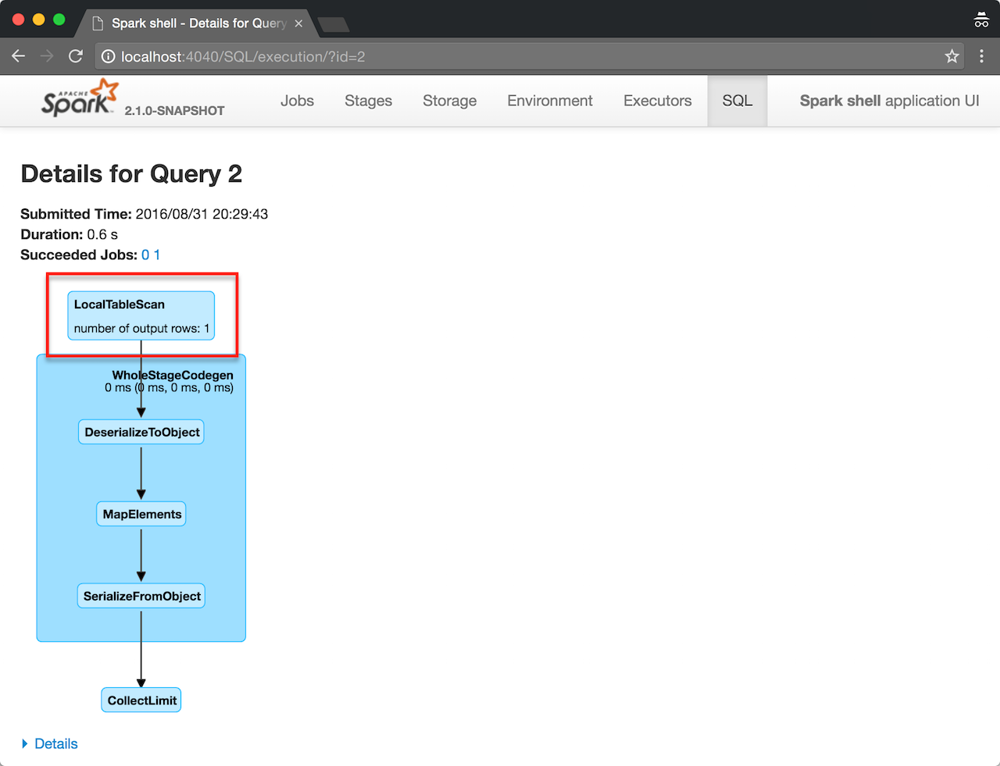

== [[LocalTableScanExec]] `LocalTableScanExec` Physical Operator

`LocalTableScanExec` is a link:spark-sql-SparkPlan.adoc#LeafExecNode[leaf physical operator] with no `children` and `producedAttributes` being `outputSet`.

`LocalTableScanExec` is a result of applying link:spark-sql-BasicOperators.adoc[`BasicOperators` strategy] to link:spark-sql-logical-plan-LocalRelation.adoc[LocalRelation] and link:spark-sql-streaming-MemoryPlan.adoc[MemoryPlan] logical query plans.

[source, scala]
----
scala> Seq(1).toDS.explain(extended = true)
== Parsed Logical Plan ==
LocalRelation [value#1]

== Analyzed Logical Plan ==
value: int
LocalRelation [value#1]

== Optimized Logical Plan ==
LocalRelation [value#1]

== Physical Plan ==
LocalTableScan [value#1]
----

.LocalTableScanExec's Metrics
[width="100%",options="header"]
|===
|name |description
|*numOutputRows* | the number of output rows
|===

When executed (as `doExecute`), `LocalTableScanExec` link:spark-sparkcontext.adoc#parallelize[creates an `RDD` of ``InternalRow``s].

.LocalTableScanExec in SQL tab in web UI

