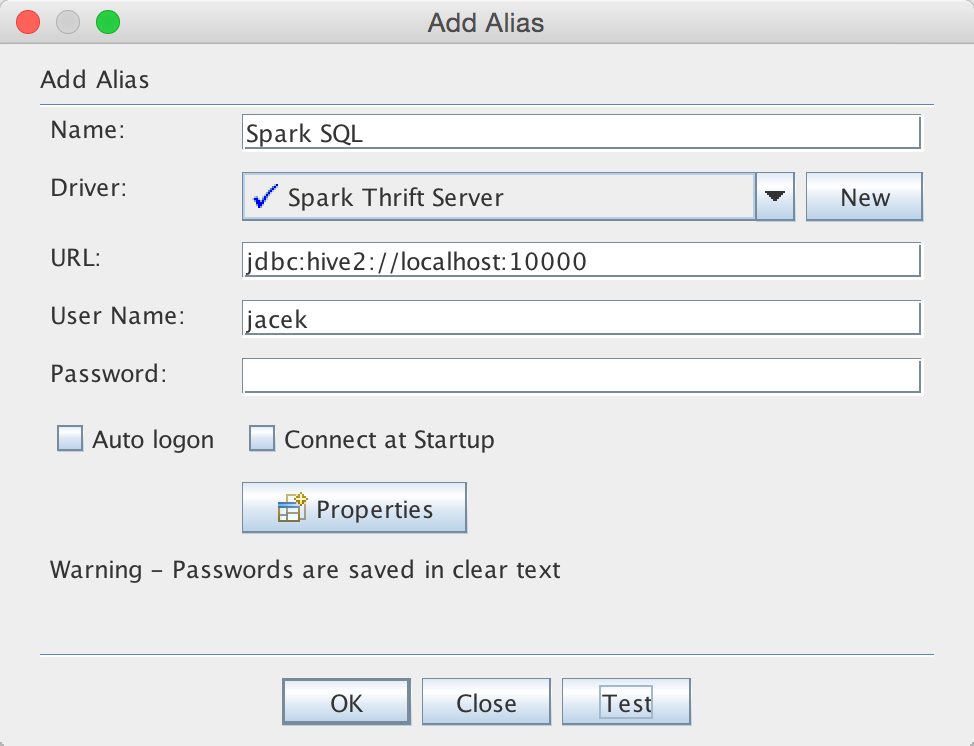

== Thrift JDBC/ODBC Server -- Spark Thrift Server (STS)

*Thrift JDBC/ODBC Server* (aka _Spark Thrift Server_ or _STS_) is Spark SQL's port of https://cwiki.apache.org/confluence/display/Hive/HiveServer2+Overview[Apache Hive's HiveServer2] that allows JDBC/ODBC clients to execute SQL queries over JDBC and ODBC protocols on Apache Spark (that go through all the link:spark-sql-catalyst.adoc[Catalyst's query optimizations] you surely like very much).

Spark Thrift Server is a Spark standalone application that you start using <<start-thriftserver, `start-thriftserver.sh`>> and stop using <<stop-thriftserver, `stop-thriftserver.sh`>> shell scripts.

Spark Thrift Server has its own tab in web UI -- <<webui, JDBC/ODBC Server>> available at `/sqlserver`.

.Spark Thrift Server's web UI
image::images/spark-thriftserver-webui.png[align="center"]

Thrift JDBC/ODBC Server can work in <<transport-mode, HTTP or binary transport modes>>. Use <<beeline, beeline command-line tool>> to connect to Thrift JDBC/ODBC Server.

Thrift JDBC/ODBC Server extends spark-submit's command-line options with `--hiveconf [prop=value]`.

IMPORTANT: All client requests to Spark Thrift Server share the same link:spark-sparkcontext.adoc[SparkContext].

[IMPORTANT]
====
You have to enable `hive-thriftserver` build profile to include Spark Thrift Server in your build.

Refer to link:spark-building-from-sources.adoc#hive-thriftserver[Building Apache Spark from Sources].
====

[TIP]
====
Enable `INFO` or `DEBUG` logging levels for `org.apache.spark.sql.hive.thriftserver` and `org.apache.hive.service.server` loggers to see what happens inside.

Add the following line to `conf/log4j.properties`:

```
log4j.logger.org.apache.spark.sql.hive.thriftserver=DEBUG
log4j.logger.org.apache.hive.service.server=INFO
```

Refer to link:spark-logging.adoc[Logging].
====

=== [[start-thriftserver]] Starting Thrift JDBC/ODBC Server -- `start-thriftserver.sh`

You can start Thrift JDBC/ODBC Server using `./sbin/start-thriftserver.sh` shell script.

With `INFO` logging level enabled, when you execute the script you should see the following INFO messages in the logs:

```
INFO HiveThriftServer2: Started daemon with process name: 16633@japila.local
INFO HiveThriftServer2: Starting SparkContext
...
INFO HiveThriftServer2: HiveThriftServer2 started
```

Internally, `start-thriftserver` script submits `org.apache.spark.sql.hive.thriftserver.HiveThriftServer2` standalone application for execution (using link:spark-submit.adoc[spark-submit]).

```
$ ./bin/spark-submit --class org.apache.spark.sql.hive.thriftserver.HiveThriftServer2
```

=== [[beeline]] Beeline JDBC Client

`beeline` is a command-line tool to connect to Thrift JDBC/ODBC Server.

```
$ ./bin/beeline
Beeline version 1.2.1.spark2 by Apache Hive
beeline>
```

You can connect to Thrift JDBC/ODBC Server using `connect` command as follows:

```
beeline> !connect jdbc:hive2://localhost:10000
```

In non-secure mode, simply enter the username on your machine and a blank password.

```
beeline> !connect jdbc:hive2://localhost:10000
Connecting to jdbc:hive2://localhost:10000
Enter username for jdbc:hive2://localhost:10000: jacek
Enter password for jdbc:hive2://localhost:10000: [press ENTER]
Connected to: Spark SQL (version 2.1.0-SNAPSHOT)
Driver: Hive JDBC (version 1.2.1.spark2)
Transaction isolation: TRANSACTION_REPEATABLE_READ
0: jdbc:hive2://localhost:10000>
```

Once connected, you can send SQL queries (as if Spark SQL were a JDBC-compliant database).

```
0: jdbc:hive2://localhost:10000> show databases;
+---------------+--+
| databaseName  |
+---------------+--+
| default       |
+---------------+--+
1 row selected (0.074 seconds)
```

=== [[webui]][[ThriftServerTab]] `ThriftServerTab` -- web UI's Tab for Spark Thrift Server

`ThriftServerTab` is...FIXME

CAUTION: FIXME Describe me

=== [[SQuirreL-SQL-Client]] Connecting to Spark Thrift Server using SQuirreL SQL Client 3.7.1

Spark Thrift Server allows for remote access to Spark SQL using JDBC protocol.

NOTE: This section was tested with http://squirrel-sql.sourceforge.net/[SQuirreL SQL Client 3.7.1] (`squirrelsql-3.7.1-standard.zip`) on Mac OS X.

SQuirreL SQL Client is a Java SQL client for JDBC-compliant databases.

Run the client using `java -jar squirrel-sql.jar`.

.SQuirreL SQL Client
image::images/spark-thriftserver-squirrel.png[align="center"]

You first have to configure a JDBC driver for Spark Thrift Server. Spark Thrift Server uses `org.spark-project.hive:hive-jdbc:1.2.1.spark2` dependency that is the JDBC driver (that also downloads transitive dependencies).

TIP: The Hive JDBC Driver, i.e. `hive-jdbc-1.2.1.spark2.jar` and other jar files are in `jars` directory of the Apache Spark distribution (or `assembly/target/scala-2.11/jars` for local builds).

Use the following connection information:

1. *Name*: Spark Thrift Server
2. *Example URL*: `jdbc:hive2://localhost:10000`
3. *Extra Class Path* should reference all the jar files of your Spark distribution.
4. *Class Name*: `org.apache.hive.jdbc.HiveDriver`

.Adding Hive JDBC Driver in SQuirreL SQL Client
image::images/spark-thriftserver-squirrel-adddriver.png[align="center"]

With the Hive JDBC Driver defined, you can connect to Spark SQL Thrift Server.

.Adding Hive JDBC Driver in SQuirreL SQL Client


Since you did not specify the database to use, Spark SQL's `default` is used.

.SQuirreL SQL Client Connected to Spark Thrift Server (Metadata Tab)
image::images/spark-thriftserver-squirrel-metadata.png[align="center"]

Below is `show tables` SQL query in SQuirrel SQL Client executed in Spark SQL through Spark Thrift Server.

.`show tables` SQL Query in SQuirrel SQL Client using Spark Thrift Server
image::images/spark-thriftserver-squirrel-show-tables.png[align="center"]

=== [[stop-thriftserver]] Stopping Thrift JDBC/ODBC Server -- `stop-thriftserver.sh`

You can stop a running instance of Thrift JDBC/ODBC Server using `./sbin/stop-thriftserver.sh` shell script.

With `DEBUG` logging level enabled, you should see the following messages in the logs:

```
ERROR HiveThriftServer2: RECEIVED SIGNAL TERM
DEBUG SparkSQLEnv: Shutting down Spark SQL Environment
INFO HiveServer2: Shutting down HiveServer2
INFO BlockManager: BlockManager stopped
INFO SparkContext: Successfully stopped SparkContext
```

TIP: You can also send `SIGTERM` signal to the process of Thrift JDBC/ODBC Server, i.e. `kill [PID]` that triggers the same sequence of shutdown steps as `stop-thriftserver.sh`.

=== [[transport-mode]] Transport Mode

Spark Thrift Server can be configured to listen in two modes (aka _transport modes_):

1. *Binary mode* -- clients should send thrift requests in binary

2. *HTTP mode* -- clients send thrift requests over HTTP.

You can control the transport modes using
`HIVE_SERVER2_TRANSPORT_MODE=http` or `hive.server2.transport.mode` (default: `binary`). It can be `binary` (default) or `http`.

=== [[main]] `main` method

Thrift JDBC/ODBC Server is a Spark standalone application that you...

CAUTION: FIXME

=== [[HiveThriftServer2Listener]] HiveThriftServer2Listener

CAUTION: FIXME
