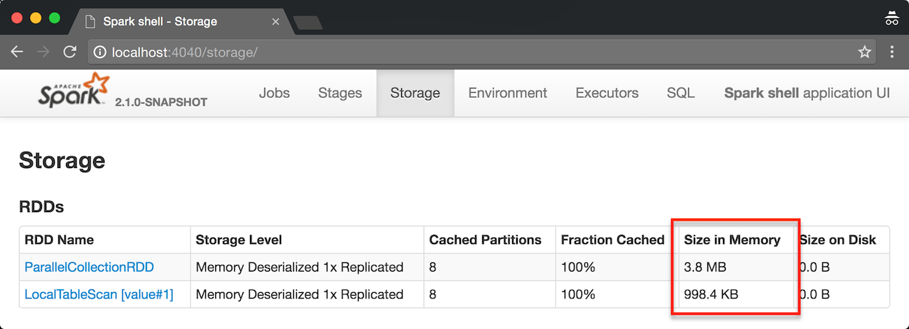

== Tungsten Execution Backend (aka Project Tungsten)

The goal of *Project Tungsten* is to improve Spark execution by optimizing Spark jobs for *CPU and memory efficiency* (as opposed to network and disk I/O which are considered fast enough). Tungsten focuses on the hardware architecture of the platform Spark runs on, including but not limited to JVM, LLVM, GPU, NVRAM, etc. It does so by offering the following optimization features:

1. <<off-heap-memory-management, Off-Heap Memory Management>> using binary in-memory data representation aka *Tungsten row format* and managing memory explicitly,
2. <<cache-locality, Cache Locality>> which is about cache-aware computations with cache-aware layout for high cache hit rates,
3. <<whole-stage-code-generation, Whole-Stage Code Generation>> (aka _CodeGen_).

IMPORTANT: Project Tungsten uses `sun.misc.unsafe` API for direct memory access to bypass the JVM in order to avoid garbage collection.

[source, scala]
----
// million integers
val intsMM = 1 to math.pow(10, 6).toInt

// that gives ca 3.8 MB in memory
scala> sc.parallelize(intsMM).cache.count
res0: Long = 1000000

// that gives ca 998.4 KB in memory
scala> intsMM.toDF.cache.count
res1: Long = 1000000
----

.RDD vs DataFrame Size in Memory in web UI -- Thank you, Tungsten!

=== [[off-heap-memory-management]] Off-Heap Memory Management

Project Tungsten aims at substantially reducing the usage of JVM objects (and therefore JVM garbage collection) by introducing its own off-heap binary memory management. Instead of working with Java objects, Tungsten uses `sun.misc.Unsafe` to manipulate raw memory.

Tungsten uses the compact storage format called Tungsten's <<UnsafeRow, UnsafeRow>> for data representation that further reduces memory footprint.

Since link:spark-sql-dataset.adoc[Datasets] have known link:spark-sql-schema.adoc[schema], Tungsten properly and in a more compact and efficient way lays out the objects on its own. That brings benefits similar to using extensions written in low-level and hardware-aware languages like C or assembler.

It is possible immediately with the data being already serialized (that further reduces or completely avoids serialization between JVM object representation and Spark's internal one).

==== [[UnsafeRow]] UnsafeRow Format

`UnsafeRow` format is composed of three regions:

1. Null Bit Set Bitmap Region (1 bit/field) for tracking null values
2. Fixed-Length 8-Byte Values Region
3. Variable-Length Data Section

That gives the property of rows being always 8-byte word aligned and so their size is always a multiple of 8 bytes.

Equality comparision and hashing of rows can be performed on raw bytes since if two rows are identical so should be their bit-wise representation. No type-specific interpretation is required.

=== [[cache-locality]] Cache Locality

Tungsten uses algorithms and *cache-aware data structures* that exploit the physical machine caches at different levels - L1, L2, L3.

==== [[BytesToBytesMap]] BytesToBytesMap

1. Low space overhead,
2. Good memory locality, esp. for scans.

=== [[whole-stage-code-generation]] Whole-Stage Code Generation

Tungsten does code generation at compile time and generates JVM bytecode to access Tungsten-managed memory structures that gives a very fast access. It uses the http://www.janino.net[Janino compiler] -- a super-small, super-fast Java compiler.

NOTE: The code generation was tracked under https://issues.apache.org/jira/browse/SPARK-8159[SPARK-8159 Improve expression function coverage (Spark 1.5)].

TIP: Read link:spark-sql-whole-stage-codegen.adoc[Whole-Stage Code Generation].

=== [[i-want-more]] Further reading or watching

1. https://databricks.com/blog/2015/04/28/project-tungsten-bringing-spark-closer-to-bare-metal.html[Project Tungsten: Bringing Spark Closer to Bare Metal]

2. (video) https://youtu.be/VbSar607HM0[From DataFrames to Tungsten: A Peek into Spark's Future] by Reynold Xin (Databricks)

3. (video) https://youtu.be/5ajs8EIPWGI[Deep Dive into Project Tungsten: Bringing Spark Closer to Bare Metal] by Josh Rosen (Databricks)
