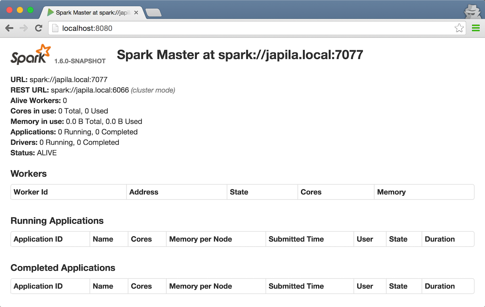
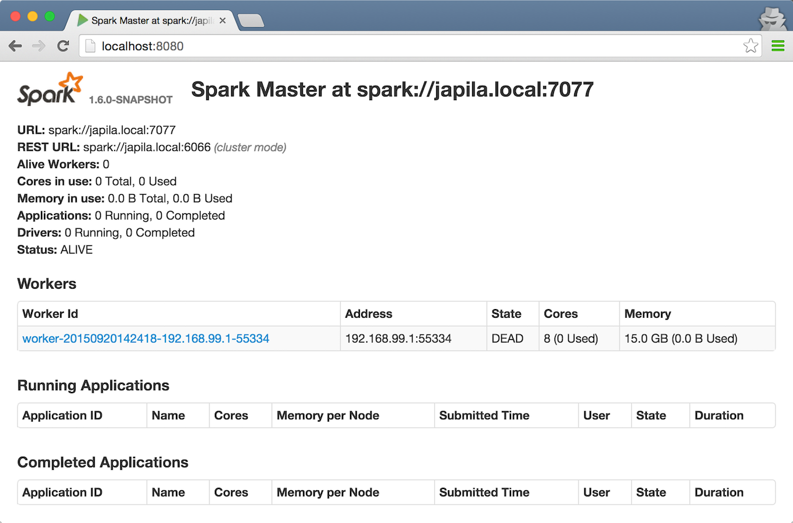
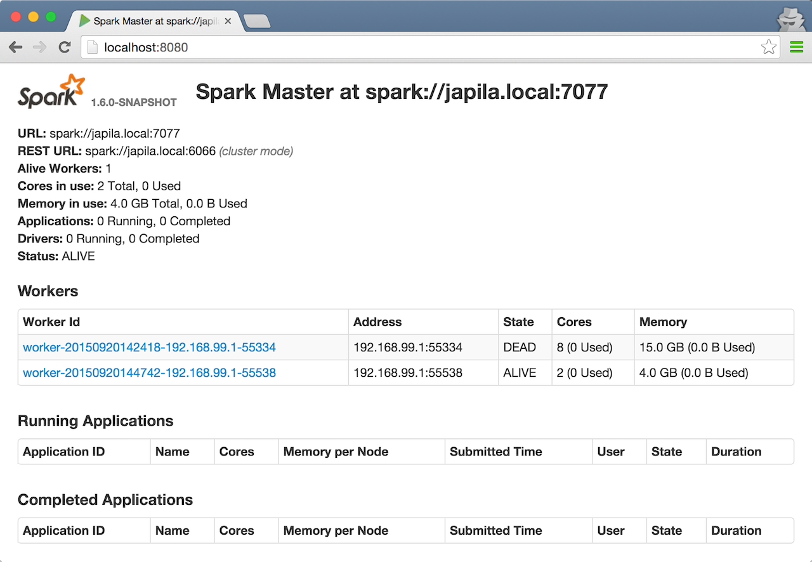

== Example 2-workers-on-1-node Standalone Cluster (one executor per worker)

The following steps are a recipe for a Spark Standalone cluster with 2 workers on a single machine.

The aim is to have a complete Spark-clustered environment at your laptop.

[TIP]
====
Consult the following documents:

* link:spark-standalone-master-scripts.adoc[Operating Spark master]
* link:spark-standalone-worker-scripts.adoc[Starting Spark workers on node using sbin/start-slave.sh]
====

[IMPORTANT]
====
You can use the Spark Standalone cluster in the following ways:

* Use `spark-shell` with `--master MASTER_URL`
* Use http://spark.apache.org/docs/latest/api/scala/index.html#org.apache.spark.SparkConf[SparkConf.setMaster(MASTER_URL)] in your Spark application

For our learning purposes, `MASTER_URL` is `spark://localhost:7077`.
====

1. Start a standalone master server.

  ./sbin/start-master.sh
+
Notes:

* Read link:spark-standalone-master-scripts.adoc[Operating Spark Standalone master]
* Use `SPARK_CONF_DIR` for the configuration directory (defaults to `$SPARK_HOME/conf`).
* Use `spark.deploy.retainedApplications` (default: `200`)
* Use `spark.deploy.retainedDrivers` (default: `200`)
* Use `spark.deploy.recoveryMode` (default: `NONE`)
* Use `spark.deploy.spreadOut` (default: `true`) to allow users to set a flag that will perform round-robin scheduling across the nodes (spreading out each app among all the nodes) instead of trying to consolidate each app onto a small # of nodes.
* Use `spark.deploy.defaultCores` (default: `Int.MaxValue`)

2. Open master’s web UI at http://localhost:8080 to know the current setup - no workers and applications.
+
.Master's web UI with no workers and applications

3. Start the first worker.

  ./sbin/start-slave.sh spark://japila.local:7077
+
NOTE: The command above in turn executes `org.apache.spark.deploy.worker.Worker --webui-port 8081 spark://japila.local:7077`

4. Check out master’s web UI at http://localhost:8080 to know the current setup - one worker.
+
.Master's web UI with one worker ALIVE
image::images/spark-standalone-console-one-worker.png[]
+
Note the number of CPUs and memory, 8 and 15 GBs, respectively (one gigabyte left for the OS -- _oh, how generous, my dear Spark!_).

5. Let's stop the worker to start over with custom configuration. You use `./sbin/stop-slave.sh` to stop the worker.

  ./sbin/stop-slave.sh

6. Check out master’s web UI at http://localhost:8080 to know the current setup - one worker in *DEAD* state.
+
.Master's web UI with one worker DEAD

7. Start a worker using `--cores 2` and `--memory 4g` for two CPU cores and 4 GB of RAM.

  ./sbin/start-slave.sh spark://japila.local:7077 --cores 2 --memory 4g
+
NOTE: The command translates to `org.apache.spark.deploy.worker.Worker --webui-port 8081 spark://japila.local:7077 --cores 2 --memory 4g`

8. Check out master’s web UI at http://localhost:8080 to know the current setup - one worker *ALIVE* and another *DEAD*.
+
.Master's web UI with one worker ALIVE and one DEAD

9. Configuring cluster using `conf/spark-env.sh`
+
There's the `conf/spark-env.sh.template` template to start from.
+
We're going to use the following `conf/spark-env.sh`:
+
[source,shell]
.conf/spark-env.sh
----
SPARK_WORKER_CORES=2 # <1>
SPARK_WORKER_INSTANCES=2 # <2>
SPARK_WORKER_MEMORY=2g
----
<1> the number of cores per worker
<2> the number of workers per node (a machine)

10. Start the workers.

  ./sbin/start-slave.sh spark://japila.local:7077
+
As the command progresses, it prints out _starting org.apache.spark.deploy.worker.Worker, logging to_ for each worker. You defined two workers in `conf/spark-env.sh` using `SPARK_WORKER_INSTANCES`, so you should see two lines.
+
  $ ./sbin/start-slave.sh spark://japila.local:7077
  starting org.apache.spark.deploy.worker.Worker, logging to ../logs/spark-jacek-org.apache.spark.deploy.worker.Worker-1-japila.local.out
  starting org.apache.spark.deploy.worker.Worker, logging to ../logs/spark-jacek-org.apache.spark.deploy.worker.Worker-2-japila.local.out

11. Check out master’s web UI at http://localhost:8080 to know the current setup - at least two workers should be *ALIVE*.
+
.Master's web UI with two workers ALIVE
image::images/spark-standalone-console-two-workers-alive.png[]
+
[NOTE]
====
Use `jps` on master to see the instances given they all run on the same machine, e.g. `localhost`).

....
$ jps
6580 Worker
4872 Master
6874 Jps
6539 Worker
....
====

12. Stop all instances - the driver and the workers.

  ./sbin/stop-all.sh
