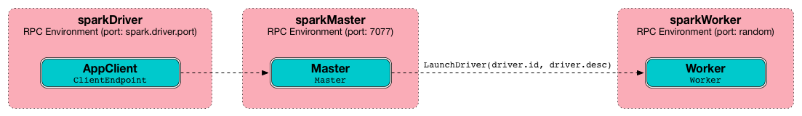

== Standalone Master

*Standalone Master* (often written _standalone Master_) is the cluster manager for Spark Standalone cluster. It can be started and stopped using link:spark-standalone-master-scripts.adoc[custom management scripts for standalone Master].

A standalone Master is pretty much the Master RPC Endpoint that you can access using RPC port (low-level operation communication) or link:spark-webui.adoc[Web UI].

Application ids follows the pattern `app-yyyyMMddHHmmss`.

Master keeps track of the following:

* workers (`workers`)
* mapping between ids and applications (`idToApp`)
* waiting applications (`waitingApps`)
* applications (`apps`)
* mapping between ids and workers (`idToWorker`)
* mapping between RPC address and workers (`addressToWorker`)
* `endpointToApp`
* `addressToApp`
* `completedApps`
* `nextAppNumber`
* mapping between application ids and their Web UIs (`appIdToUI`)
* drivers (`drivers`)
* `completedDrivers`
* drivers currently spooled for scheduling (`waitingDrivers`)
* `nextDriverNumber`

The following INFO shows up when the Master endpoint starts up (`Master#onStart` is called):

```
INFO Master: Starting Spark master at spark://japila.local:7077
INFO Master: Running Spark version 1.6.0-SNAPSHOT
```

=== [[creating-instance]] Creating Master Instance

CAUTION: FIXME

=== [[startRpcEnvAndEndpoint]] `startRpcEnvAndEndpoint` Method

CAUTION: FIXME

=== Master WebUI

FIXME MasterWebUI

`MasterWebUI` is the Web UI server for the standalone master. Master starts Web UI to listen to `http://[master's hostname]:webUIPort`, e.g. `http://localhost:8080`.

```
INFO Utils: Successfully started service 'MasterUI' on port 8080.
INFO MasterWebUI: Started MasterWebUI at http://192.168.1.4:8080
```

=== States

Master can be in the following states:

* `STANDBY` - the initial state while Master is initializing
* `ALIVE` - start scheduling resources among applications.
* `RECOVERING`
* `COMPLETING_RECOVERY`

CAUTION: FIXME

=== [[rpcenv]] RPC Environment

The `org.apache.spark.deploy.master.Master` class starts link:spark-rpc.adoc[sparkMaster RPC environment].

```
INFO Utils: Successfully started service 'sparkMaster' on port 7077.
```

It then registers `Master` endpoint.

.sparkMaster - the RPC Environment for Spark Standalone's master


Master endpoint is a link:spark-rpc.adoc#ThreadSafeRpcEndpoint[ThreadSafeRpcEndpoint] and `LeaderElectable` (see <<leader-election, Leader Election>>).

The Master endpoint starts the daemon single-thread scheduler pool `master-forward-message-thread`. It is used for worker management, i.e. removing any timed-out workers.

```
"master-forward-message-thread" #46 daemon prio=5 os_prio=31 tid=0x00007ff322abb000 nid=0x7f03 waiting on condition [0x000000011cad9000]
```

=== [[metrics]] Metrics

Master uses link:spark-MetricsSystem.adoc[Spark Metrics System] (via `MasterSource`) to report metrics about internal status.

The name of the source is *master*.

It emits the following metrics:

* `workers` - the number of all workers (any state)
* `aliveWorkers` - the number of alive workers
* `apps` - the number of applications
* `waitingApps` - the number of waiting applications

The name of the other source is *applications*

[CAUTION]
====
FIXME

* Review `org.apache.spark.metrics.MetricsConfig`
* How to access the metrics for master? See `Master#onStart`
* Review `masterMetricsSystem` and `applicationMetricsSystem`
====

=== [[rest-server]] REST Server

The standalone Master starts the REST Server service for alternative application submission that is supposed to work across Spark versions. It is enabled by default (see <<settings, spark.master.rest.enabled>>) and used by link:spark-submit.adoc[spark-submit] for the link:spark-standalone.adoc#deployment-modes[standalone cluster mode], i.e. `--deploy-mode` is `cluster`.

`RestSubmissionClient` is the client.

The server includes a JSON representation of `SubmitRestProtocolResponse` in the HTTP body.

The following INFOs show up when the Master Endpoint starts up (`Master#onStart` is called) with REST Server enabled:

```
INFO Utils: Successfully started service on port 6066.
INFO StandaloneRestServer: Started REST server for submitting applications on port 6066
```

=== [[recovery-mode]] Recovery Mode

A standalone Master can run with *recovery mode* enabled and be able to recover state among the available swarm of masters. By default, there is no recovery, i.e. no persistence and no election.

NOTE: Only a master can schedule tasks so having one always on is important for cases where you want to launch new tasks. Running tasks are unaffected by the state of the master.

Master uses `spark.deploy.recoveryMode` to set up the recovery mode (see <<settings, spark.deploy.recoveryMode>>).

The Recovery Mode enables <<leader-election, election of the leader master>> among the masters.

TIP: Check out the exercise link:exercises/spark-exercise-standalone-master-ha.adoc[Spark Standalone - Using ZooKeeper for High-Availability of Master].


=== [[leader-election]] Leader Election

Master endpoint is `LeaderElectable`, i.e. FIXME

CAUTION: FIXME

=== RPC Messages

Master communicates with drivers, executors and configures itself using *RPC messages*.

The following message types are accepted by master (see `Master#receive` or `Master#receiveAndReply` methods):

* `ElectedLeader` for <<leader-election, Leader Election>>
* `CompleteRecovery`
* `RevokedLeadership`
* <<RegisterApplication, RegisterApplication>>
* `ExecutorStateChanged`
* `DriverStateChanged`
* `Heartbeat`
* `MasterChangeAcknowledged`
* `WorkerSchedulerStateResponse`
* `UnregisterApplication`
* `CheckForWorkerTimeOut`
* `RegisterWorker`
* `RequestSubmitDriver`
* `RequestKillDriver`
* `RequestDriverStatus`
* `RequestMasterState`
* `BoundPortsRequest`
* `RequestExecutors`
* `KillExecutors`

==== [[RegisterApplication]] RegisterApplication event

A *RegisterApplication* event is sent by link:spark-standalone.adoc#AppClient[AppClient] to the standalone Master. The event holds information about the application being deployed (`ApplicationDescription`) and the driver's endpoint reference.

`ApplicationDescription` describes an application by its name, maximum number of cores, executor's memory, command, appUiUrl, and user with optional eventLogDir and eventLogCodec for Event Logs, and the number of cores per executor.

CAUTION: FIXME Finish

A standalone Master receives `RegisterApplication` with a `ApplicationDescription` and the driver's link:spark-RpcEndpointRef.adoc[RpcEndpointRef].

```
INFO Registering app " + description.name
```

Application ids in Spark Standalone are in the format of `app-[yyyyMMddHHmmss]-[4-digit nextAppNumber]`.

Master keeps track of the number of already-scheduled applications (`nextAppNumber`).

ApplicationDescription (AppClient) --> ApplicationInfo (Master) - application structure enrichment

`ApplicationSource` metrics + `applicationMetricsSystem`

```
INFO Registered app " + description.name + " with ID " + app.id
```

CAUTION: FIXME `persistenceEngine.addApplication(app)`

`schedule()` schedules the currently available resources among waiting apps.

FIXME When is `schedule()` method called?

It's only executed when the Master is in `RecoveryState.ALIVE` state.

Worker in `WorkerState.ALIVE` state can accept applications.

A driver has a state, i.e. `driver.state` and when it's in `DriverState.RUNNING` state the driver has been assigned to a worker for execution.

==== [[LaunchDriver]] LaunchDriver RPC message

WARNING: It seems a dead message. Disregard it for now.

A *LaunchDriver* message is sent by an active standalone Master to a worker to launch a driver.

.Master finds a place for a driver (posts LaunchDriver)


You should see the following INFO in the logs right before the message is sent out to a worker:

```
INFO Launching driver [driver.id] on worker [worker.id]
```

The message holds information about the id and name of the driver.

A driver can be running on a single worker while a worker can have many drivers running.

When a worker receives a `LaunchDriver` message, it prints out the following INFO:

```
INFO Asked to launch driver [driver.id]
```

It then creates a `DriverRunner` and starts it. It starts a separate JVM process.

Workers' free memory and cores are considered when assigning some to waiting drivers (applications).

CAUTION: FIXME Go over `waitingDrivers`...

=== [[DriverRunner]] DriverRunner

WARNING: It seems a dead piece of code. Disregard it for now.

A `DriverRunner` manages the execution of one driver.

It is a `java.lang.Process`

When started, it spawns a thread `DriverRunner for [driver.id]` that:

1. Creates the working directory for this driver.
2. Downloads the user jar FIXME `downloadUserJar`
3. Substitutes variables like `WORKER_URL` or `USER_JAR` that are set when...FIXME

=== [[startup-internals]] Internals of org.apache.spark.deploy.master.Master

[TIP]
====
You can debug a Standalone master using the following command:

[source]
----
java -agentlib:jdwp=transport=dt_socket,server=y,suspend=y,address=5005 -cp /Users/jacek/dev/oss/spark/conf/:/Users/jacek/dev/oss/spark/assembly/target/scala-2.11/spark-assembly-1.6.0-SNAPSHOT-hadoop2.7.1.jar:/Users/jacek/dev/oss/spark/lib_managed/jars/datanucleus-api-jdo-3.2.6.jar:/Users/jacek/dev/oss/spark/lib_managed/jars/datanucleus-core-3.2.10.jar:/Users/jacek/dev/oss/spark/lib_managed/jars/datanucleus-rdbms-3.2.9.jar -Xms1g -Xmx1g org.apache.spark.deploy.master.Master --ip japila.local --port 7077 --webui-port 8080
----

The above command suspends (`suspend=y`) the process until a JPDA debugging client, e.g. your IDE, is connected, and that Spark is available under `/Users/jacek/dev/oss/spark`. Change it to meet your environment.
====

When `Master` starts, it first creates the <<spark-SparkConf.adoc#default-configuration, default SparkConf configuration>> whose values it then overrides using  <<environment-variables, environment variables>> and <<command-line-options, command-line options>>.

A fully-configured master instance requires `host`, `port` (default: `7077`), `webUiPort` (default: `8080`) settings defined.

TIP: When in troubles, consult link:spark-tips-and-tricks.adoc[Spark Tips and Tricks] document.

It starts <<rpcenv, RPC Environment>> with necessary endpoints and lives until the RPC environment terminates.

=== [[worker-management]] Worker Management

Master uses `master-forward-message-thread` to schedule a thread every `spark.worker.timeout` to check workers' availability and remove timed-out workers.

It is that Master sends `CheckForWorkerTimeOut` message to itself to trigger verification.

When a worker hasn't responded for `spark.worker.timeout`, it is assumed dead and the following WARN message appears in the logs:

```
WARN Removing [worker.id] because we got no heartbeat in [spark.worker.timeout] seconds
```

=== [[environment-variables]] System Environment Variables

Master uses the following system environment variables (directly or indirectly):

* `SPARK_LOCAL_HOSTNAME` - the custom host name
* `SPARK_LOCAL_IP` - the custom IP to use when `SPARK_LOCAL_HOSTNAME` is not set
* `SPARK_MASTER_HOST` (not `SPARK_MASTER_IP` as used in `start-master.sh` script above!) - the master custom host
* `SPARK_MASTER_PORT` (default: `7077`) - the master custom port
* `SPARK_MASTER_IP` (default: `hostname` command's output)
* `SPARK_MASTER_WEBUI_PORT` (default: `8080`) - the port of the master's WebUI. Overriden by `spark.master.ui.port` if set in the properties file.
* `SPARK_PUBLIC_DNS` (default: hostname) - the custom master hostname for WebUI's http URL and master's address.
* `SPARK_CONF_DIR` (default: `$SPARK_HOME/conf`) - the directory of the default properties file link:spark-properties.adoc#spark-defaults-conf[spark-defaults.conf] from which all properties that start with `spark.` prefix are loaded.

=== [[settings]] Settings

[CAUTION]
====
FIXME

* Where are `RETAINED_`'s properties used?
====

Master uses the following properties:

* `spark.cores.max` (default: `0`) - total expected number of cores. When set, an application could get executors of different sizes (in terms of cores).
* `spark.worker.timeout` (default: `60`) - time (in seconds) when no heartbeat from a worker means it is lost. See <<worker-management, Worker Management>>.
* `spark.deploy.retainedApplications` (default: `200`)
* `spark.deploy.retainedDrivers` (default: `200`)
* `spark.dead.worker.persistence` (default: `15`)
* `spark.deploy.recoveryMode` (default: `NONE`) - possible modes: `ZOOKEEPER`, `FILESYSTEM`, or `CUSTOM`. Refer to <<recovery-mode, Recovery Mode>>.
* `spark.deploy.recoveryMode.factory` - the class name of the custom `StandaloneRecoveryModeFactory`.
* `spark.deploy.recoveryDirectory` (default: empty) - the directory to persist recovery state
* link:spark-standalone.adoc#spark.deploy.spreadOut[spark.deploy.spreadOut] to perform link:spark-standalone.adoc#round-robin-scheduling[round-robin scheduling across the nodes].
* `spark.deploy.defaultCores` (default: `Int.MaxValue`, i.e. unbounded)- the number of maxCores for applications that don't specify it.
* `spark.master.rest.enabled` (default: `true`) - <<rest-server, master's REST Server>> for alternative application submission that is supposed to work across Spark versions.
* `spark.master.rest.port` (default: `6066`) - the port of <<rest-server, master's REST Server>>
