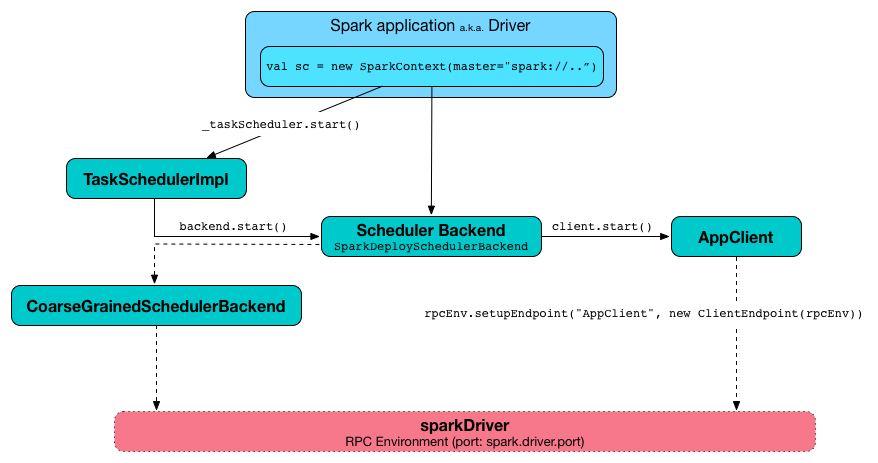
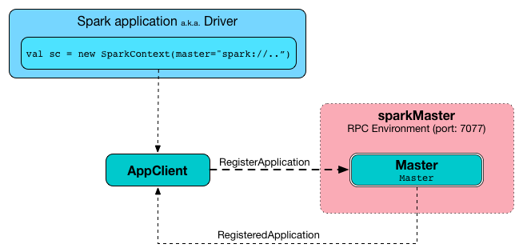

== Spark Standalone cluster

*Spark Standalone cluster* (aka _Spark deploy cluster_ or _standalone cluster_) is Spark's own built-in clustered environment. Since Spark Standalone is available in the default distribution of Apache Spark it is the easiest way to run your Spark applications in a clustered environment in many cases.

*Standalone Master* (often written _standalone Master_) is the resource manager for the Spark Standalone cluster (read link:spark-standalone-master.adoc[Standalone Master] for in-depth coverage).

*Standalone Worker* (aka _standalone slave_) is the worker in the Spark Standalone cluster (read link:spark-standalone-worker.adoc[Standalone Worker] for in-depth coverage).

NOTE: Spark Standalone cluster is one of the three available clustering options in Spark (refer to link:spark-cluster.adoc[Running Spark on cluster]).

[CAUTION]
====
FIXME A figure with SparkDeploySchedulerBackend sending messages to AppClient and AppClient RPC Endpoint and later to Master.

SparkDeploySchedulerBackend --> AppClient --> AppClient RPC Endpoint --> Master

Add SparkDeploySchedulerBackend as AppClientListener in the picture
====

In Standalone cluster mode Spark allocates resources based on cores. By default, an application will grab all the cores in the cluster (read <<settings, Settings>>).

Standalone cluster mode is subject to the constraint that only one executor can be allocated on each worker per application.

Once a Spark Standalone cluster has been started, you can access it using `spark://` master URL (read link:spark-deployment-environments.adoc#master-urls[Master URLs]).

CAUTION: FIXME That might be *very* confusing!

You can deploy, i.e. `spark-submit`, your applications to Spark Standalone in `client` or `cluster` deploy mode (read <<deployment-modes, Deployment modes>>).

=== [[deployment-modes]] Deployment modes

CAUTION: FIXME

Refer to `--deploy-mode` in link:spark-submit.adoc[spark-submit script].

=== [[initialization]] SparkContext initialization in Standalone cluster

When you create a `SparkContext` using `spark://` master URL...FIXME

Keeps track of task ids and executor ids, executors per host, hosts per rack

You can give one or many comma-separated masters URLs in `spark://` URL.

A pair of backend and scheduler is returned.

The result is two have a pair of a backend and a scheduler.

=== [[application-management-spark-submit]] Application Management using spark-submit

CAUTION: FIXME

```
➜  spark git:(master) ✗ ./bin/spark-submit --help
...
Usage: spark-submit --kill [submission ID] --master [spark://...]
Usage: spark-submit --status [submission ID] --master [spark://...]
...
```

Refer to link:spark-submit.adoc#command-line-options[Command-line Options] in `spark-submit`.

=== [[round-robin-scheduling]] Round-robin Scheduling Across Nodes

If enabled (using <<spark.deploy.spreadOut, spark.deploy.spreadOut>>), standalone Master attempts to spread out an application's executors on as many workers as possible (instead of trying to consolidate it onto a small number of nodes).

NOTE: It is enabled by default.

==== [[scheduleExecutorsOnWorkers]] scheduleExecutorsOnWorkers

CAUTION: FIXME

[source, scala]
----
scheduleExecutorsOnWorkers(
  app: ApplicationInfo,
  usableWorkers: Array[WorkerInfo],
  spreadOutApps: Boolean): Array[Int]
----

`scheduleExecutorsOnWorkers` schedules executors on workers.

=== SPARK_WORKER_INSTANCES (and SPARK_WORKER_CORES)

There is really no need to run multiple workers per machine in Spark 1.5 (perhaps in 1.4, too). You can run multiple executors on the same machine with one worker.

Use `SPARK_WORKER_INSTANCES` (default: `1`) in `spark-env.sh` to define the number of worker instances.

If you use `SPARK_WORKER_INSTANCES`, make sure to set `SPARK_WORKER_CORES` explicitly to limit the cores per worker, or else each worker will try to use all the cores.

You can set up the number of cores as an command line argument when you start a worker daemon using `--cores`.

=== Multiple executors per worker in Standalone mode

CAUTION: It can be a duplicate of the above section.

Since the change https://issues.apache.org/jira/browse/SPARK-1706[SPARK-1706 Allow multiple executors per worker in Standalone mode] in Spark 1.4 it's currently possible to start multiple executors in a single JVM process of a worker.

To launch multiple executors on a machine you start multiple standalone workers, each with its own JVM. It introduces unnecessary overhead due to these JVM processes, provided that there are enough cores on that worker.

If you are running Spark in standalone mode on memory-rich nodes it can be beneficial to have multiple worker instances on the same node as a very large heap size has two disadvantages:

* Garbage collector pauses can hurt throughput of Spark jobs.
* Heap size of >32 GB can’t use CompressedOoops. So https://blog.codecentric.de/en/2014/02/35gb-heap-less-32gb-java-jvm-memory-oddities/[35 GB is actually less than 32 GB].

Mesos and YARN can, out of the box, support packing multiple, smaller executors onto the same physical host, so requesting smaller executors doesn’t mean your application will have fewer overall resources.

=== [[SparkDeploySchedulerBackend]] SparkDeploySchedulerBackend

`SparkDeploySchedulerBackend` is the link:spark-SchedulerBackend.adoc[Scheduler Backend] for Spark Standalone, i.e. it is used when you link:spark-sparkcontext.adoc#creating-instance[create a SparkContext] using `spark://` link:spark-deployment-environments.adoc#master-urls[master URL].

It requires a link:spark-TaskScheduler.adoc[Task Scheduler], a link:spark-sparkcontext.adoc[Spark context], and a collection of link:spark-deployment-environments.adoc#master-urls[master URLs].

It is a specialized link:spark-CoarseGrainedSchedulerBackend.adoc[CoarseGrainedSchedulerBackend] that uses <<AppClient, AppClient>> and is a `AppClientListener`.

.SparkDeploySchedulerBackend.start() (while SparkContext starts)


CAUTION: FIXME `AppClientListener` & `LauncherBackend` & `ApplicationDescription`

It uses <<AppClient, AppClient>> to talk to executors.

=== [[AppClient]] AppClient

`AppClient` is an interface to allow Spark applications to talk to a Standalone cluster (using a RPC Environment). It takes an RPC Environment, a collection of master URLs, a `ApplicationDescription`, and a `AppClientListener`.

It is solely used by <<SparkDeploySchedulerBackend, SparkDeploySchedulerBackend>>.

`AppClient` registers *AppClient* RPC endpoint (using `ClientEndpoint` class) to a given RPC Environment.

`AppClient` uses a daemon cached thread pool (`askAndReplyThreadPool`) with threads' name in the format of `appclient-receive-and-reply-threadpool-ID`, where `ID` is a unique integer for asynchronous asks and replies. It is used for requesting executors (via `RequestExecutors` message) and kill executors (via `KillExecutors`).

`sendToMaster` sends one-way `ExecutorStateChanged` and `UnregisterApplication` messages to master.

==== [[appclient-initialization]] Initialization - AppClient.start() method

When AppClient starts, `AppClient.start()` method is called that merely registers <<appclient-rpc-endpoint, AppClient RPC Endpoint>>.

==== Others

* killExecutors
* start
* stop

==== [[appclient-rpc-endpoint]] AppClient RPC Endpoint

*AppClient* RPC endpoint is started as part of <<appclient-initialization, AppClient's initialization>> (that is in turn part of <<SparkDeploySchedulerBackend, SparkDeploySchedulerBackend's initialization, i.e. the scheduler backend for Spark Standalone>>).

It is a link:spark-rpc.adoc#ThreadSafeRpcEndpoint[ThreadSafeRpcEndpoint] that knows about the RPC endpoint of the primary active standalone Master (there can be a couple of them, but only one can be active and hence primary).

When it starts, it sends <<RegisterApplication, RegisterApplication>> message to register an application and itself.

===== [[RegisterApplication]] RegisterApplication RPC message

An AppClient registers the Spark application to a single master (regardless of link:spark-deployment-environments.adoc#master-urls[the number of the standalone masters given in the master URL]).

.AppClient registers application to standalone Master


It uses a dedicated thread pool *appclient-register-master-threadpool* to asynchronously send `RegisterApplication` messages, one per standalone master.

```
INFO AppClient$ClientEndpoint: Connecting to master spark://localhost:7077...
```

An AppClient tries connecting to a standalone master 3 times every 20 seconds per master before giving up. They are not configurable parameters.

The appclient-register-master-threadpool thread pool is used until the registration is finished, i.e. AppClient is connected to the primary standalone Master or the registration fails. It is then `shutdown`.

===== [[RegisteredApplication]] RegisteredApplication RPC message

`RegisteredApplication` is a one-way message from the primary master to confirm successful application registration. It comes with the application id and the master's RPC endpoint reference.

The `AppClientListener` gets notified about the event via `listener.connected(appId)` with `appId` being an application id.

===== [[ApplicationRemoved]] ApplicationRemoved RPC message

`ApplicationRemoved` is received from the primary master to inform about having removed the application. AppClient RPC endpoint is stopped afterwards.

It can come from the standalone Master after a kill request from Web UI, application has finished properly or the executor where the application was still running on has been killed, failed, lost or exited.

===== [[ExecutorAdded]] ExecutorAdded RPC message

`ExecutorAdded` is received from the primary master to inform about...FIXME

CAUTION: FIXME the message

```
INFO Executor added: %s on %s (%s) with %d cores
```

===== [[ExecutorUpdated]] ExecutorUpdated RPC message

`ExecutorUpdated` is received from the primary master to inform about...FIXME

CAUTION: FIXME the message

```
INFO Executor updated: %s is now %s%s
```

===== [[MasterChanged]] MasterChanged RPC message

`MasterChanged` is received from the primary master to inform about...FIXME

CAUTION: FIXME the message

```
INFO Master has changed, new master is at
```

===== [[StopAppClient]] StopAppClient RPC message

`StopAppClient` is a reply-response message from the SparkDeploySchedulerBackend to stop the AppClient after the SparkContext has been stopped (and so should the running application on the standalone cluster).

It stops the AppClient RPC endpoint.

===== [[RequestExecutors]] RequestExecutors RPC message

`RequestExecutors` is a reply-response message from the SparkDeploySchedulerBackend that is passed on to the master to request executors for the application.

===== [[KillExecutors]] KillExecutors RPC message

`KillExecutors` is a reply-response message from the SparkDeploySchedulerBackend that is passed on to the master to kill executors assigned to the application.

=== [[settings]] Settings

==== [[spark.deploy.spreadOut]] spark.deploy.spreadOut

`spark.deploy.spreadOut` (default: `true`) controls whether standalone Master should perform <<round-robin-scheduling, round-robin scheduling across the nodes>>.
