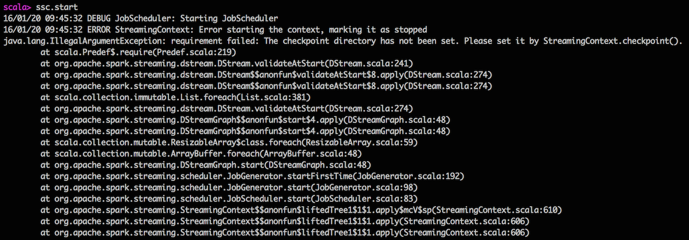

== Checkpointing

*Checkpointing* is a process that allows you to create *fault-tolerant stream processing pipelines* by <<CheckpointWriter-write, writing received records>> to a <<streamingcontext-checkpoint, highly-available HDFS-compatible storage>>.

link:spark-streaming-dstreams.adoc[DStreams] can checkpoint <<checkpoint-data, input data>> at specified <<checkpoing-interval, time intervals>>.

=== [[streamingcontext-checkpoint]] Marking StreamingContext as  Checkpointed

You use link:spark-streaming-streamingcontext.adoc#checkpoint[StreamingContext.checkpoint] method to set up a HDFS-compatible *checkpoint directory* where <<checkpoint-data, checkpoint data>> will be persisted, as follows:

[source, scala]
----
ssc.checkpoint("_checkpoint")
----

=== [[checkpoing-interval]] Checkpoint Interval

You can set up periodic checkpointing every *checkpoint interval* using `checkpoint(interval: Duration)` method.

[source, scala]
----
checkpoint(interval: Duration): DStream[T]
----

NOTE: You can only enable checkpointing and set the checkpoint interval before link:spark-streaming-streamingcontext.adoc#start[StreamingContext is started]. Otherwise, `UnsupportedOperationException` is thrown.

CAUTION: FIXME the exception

Internally, `checkpoint` method calls link:spark-streaming-dstreams.adoc#cache-persist[persist] (that sets the default `MEMORY_ONLY_SER` storage level).

If checkpoint interval has been enabled, the <<streamingcontext-checkpoint, checkpoint directory>> is mandatory. Spark validates it when link:spark-streaming-streamingcontext.adoc#start[StreamingContext starts]. Otherwise, `IllegalArgumentException` is thrown  (as depicted in the following figure).

.StreamingContext refuses to start when checkpoint directory not set


You can see the checkpoint interval for a stream in the logs when the link:spark-streaming-dstreams.adoc#validateAtStart[DStream is validated]:

```
INFO Checkpoint interval = [checkpointDuration]
```

=== [[checkpoint-data]] Checkpoint Data

CAUTION: What is checkpoint data? Code review `DStreamCheckpointData`.

`DStreamCheckpointData` works with a single dstream. An instance of `DStreamCheckpointData` is created when a dstream is.

It is used in `updateCheckpointData`, `clearCheckpointData` or `restoreCheckpointData`.

It tracks checkpoint data in the internal `data` registry that records batch time and the checkpoint data at that time. The internal checkpoint data can be anything that a dstream wants to checkpoint. `DStreamCheckpointData` returns the registry when `currentCheckpointFiles` method is called.

NOTE: By default, `DStreamCheckpointData` records the checkpoint files to which the generated RDDs of the DStream has been saved.

=== [[Checkpoint]] Checkpoint

`Checkpoint` class requires a link:spark-streaming-streamingcontext.adoc[StreamingContext] and `checkpointTime` time to be instantiated.

NOTE: `Checkpoint` class is written to a persistent storage (aka _serialized_) using <<CheckpointWriter-write, CheckpointWriter.write>> method and read back (aka _deserialize_) using <<Checkpoint-deserialize, Checkpoint.deserialize>>.

NOTE: link:spark-streaming-streamingcontext.adoc#initial-checkpoint[Initial checkpoint] is the checkpoint a StreamingContext was started with.

It is merely a collection of the settings of the current streaming runtime environment that is supposed to recreate the environment after it goes down due to a failure or when the link:spark-streaming-streamingcontext.adoc#stop[streaming context is stopped immediately].

It collects the settings from the input `StreamingContext` (and indirectly from the corresponding link:spark-streaming-jobscheduler.adoc[JobScheduler] and link:spark-sparkcontext.adoc[SparkContext]):

* The link:spark-sparkcontext.adoc#master-url[master URL from SparkContext] as `master`.
* The link:spark-sparkcontext.adoc#application-name[mandatory application name from SparkContext] as `framework`.
* The link:spark-sparkcontext.adoc#jars[jars to distribute to workers from SparkContext] as `jars`.
* The link:spark-streaming-dstreamgraph.adoc[DStreamGraph] as `graph`
* The link:spark-streaming-streamingcontext.adoc#checkpoint-directory[checkpoint directory] as `checkpointDir`
* The link:spark-streaming-streamingcontext.adoc#checkpoint-interval[checkpoint interval] as `checkpointDuration`
* The link:spark-streaming-jobscheduler.adoc#getPendingTimes[collection of pending batches to process] as `pendingTimes`
* The link:spark-sparkcontext.adoc#spark-configuration[Spark configuration (aka SparkConf)] as `sparkConfPairs`

[TIP]
====
Enable `INFO` logging level for `org.apache.spark.streaming.Checkpoint` logger to see what happens inside.

Add the following line to `conf/log4j.properties`:

```
log4j.logger.org.apache.spark.streaming.Checkpoint=INFO
```

Refer to link:spark-logging.adoc[Logging].
====

==== [[Checkpoint-serialize]] Serializing Checkpoint (serialize method)

[source, scala]
----
serialize(checkpoint: Checkpoint, conf: SparkConf): Array[Byte]
----

`serialize` serializes the `checkpoint` object. It does so by creating a compression codec to write the input `checkpoint` object with and returns the result as a collection of bytes.

CAUTION: FIXME Describe compression codecs in Spark.

==== [[Checkpoint-deserialize]] Deserializing Checkpoint (deserialize method)

[source, scala]
----
deserialize(inputStream: InputStream, conf: SparkConf): Checkpoint
----

`deserialize` reconstructs a <<Checkpoint, Checkpoint>> object from the input `inputStream`. It uses a compression codec and once read <<Checkpoint-validate, the just-built Checkpoint object is validated>> and returned back.

==== [[Checkpoint-validate]] Validating Checkpoint (validate method)

[source, scala]
----
validate()
----

`validate` validates the <<Checkpoint, Checkpoint>>. It ensures that `master`, `framework`, `graph`, and `checkpointTime` are defined, i.e. not `null`.

You should see the following INFO message in the logs when the object passes the validation:

```
INFO Checkpoint for time [checkpointTime] validated
```

=== [[CheckpointWriter]] CheckpointWriter

An instance of `CheckpointWriter` is created (lazily) when `JobGenerator` is, but only when link:spark-streaming-jobgenerator.adoc#shouldCheckpoint[JobGenerator is configured for checkpointing].

It uses the internal <<CheckpointWriter-executor, single-thread thread pool executor>> to <<CheckpointWriteHandler, process checkpoint writes asynchronously>>.

==== [[CheckpointWriter-executor]] Single-Thread Thread Pool Executor

`executor` is the internal single-thread thread pool executor for executing ...FIXME

==== [[CheckpointWriter-write]] Writing Checkpoint for Batch Time (write method)

[source, scala]
----
write(checkpoint: Checkpoint, clearCheckpointDataLater: Boolean): Unit
----

`write` method <<Checkpoint-serialize, serializes the checkpoint object>> and passes the serialized form to <<CheckpointWriteHandler, CheckpointWriteHandler>> to write asynchronously (i.e. on a separate thread) using <<CheckpointWriter-executor, single-thread thread pool executor>>.

NOTE: It is called when link:spark-streaming-jobgenerator.adoc#checkpointing[checkpointing is enabled] and link:spark-streaming-jobgenerator.adoc#DoCheckpoint[JobGenerator processes a DoCheckpoint event].

You should see the following INFO message in the logs:

```
INFO Submitted checkpoint of time [checkpoint.checkpointTime] writer queue
```

If the asynchronous checkpoint write fails, you should see the following ERROR in the logs:

```
ERROR Could not submit checkpoint task to the thread pool executor
```

=== [[CheckpointWriteHandler]] CheckpointWriteHandler

`CheckpointWriteHandler` is an internal thread of execution that...

NOTE: It is used by ... when ...

CAUTION: FIXME

=== [[CheckpointReader]] CheckpointReader

CAUTION: FIXME Describe me!
