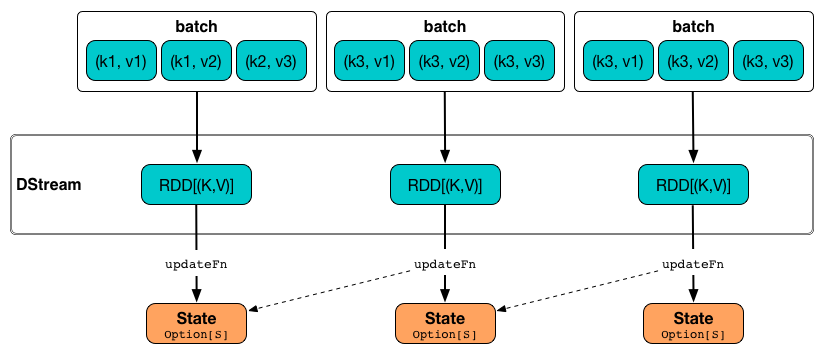

== Working with State using Stateful Operators

> Building Stateful Stream Processing Pipelines using Spark (Streaming)

*Stateful operators* (like <<mapWithState, mapWithState>> or <<updateStateByKey, updateStateByKey>>) are part of the set of additional operators available on link:spark-streaming-dstreams.adoc[DStreams] of key-value pairs, i.e. instances of `DStream[(K, V)]`. They allow you to build *stateful stream processing pipelines*.

NOTE: These additional operators are available automatically on pair DStreams through the Scala implicit conversion `DStream.toPairDStreamFunctions`.

=== [[mapWithState]] mapWithState Operator

[source, scala]
----
mapWithState(spec: StateSpec[K, V, ST, MT]): MapWithStateDStream[K, V, ST, MT]
----

You create <<StateSpec, StateSpec>> instances for `mapWithState` operator using the factory methods <<StateSpec-function, StateSpec.function>>.

`mapWithState` creates a link:spark-streaming-mapwithstatedstreams.adoc[MapWithStateDStream] dstream.

==== [[mapWithState-example]] mapWithState Example

[source, scala]
----
val clicks: InputDStream[(String, String)] = messages

import org.apache.spark.streaming.StateSpec
val updateState = (batchTime: Time, key: String, value: Option[String], state: State[Int]) => {
  println(s">>> batchTime = $batchTime")
  println(s">>> key       = $key")
  println(s">>> value     = $value")
  println(s">>> state     = $state")
  val sum = value.getOrElse("").size + state.getOption.getOrElse(0)
  state.update(sum)
  Some((key, value, sum)) // mapped value
}
val spec = StateSpec.function(updateState)
val mappedStatefulStream: MapWithStateDStream[String,String,Int,(String, Option[String], Int)] = clicks.mapWithState(spec)

mappedStatefulStream.print()
----

==== [[StateSpec]] StateSpec - Specification of mapWithState

`StateSpec` is a state specification of <<mapWithState, mapWithState>> and describes how the corresponding state RDD should work (RDD-wise) and maintain a state (streaming-wise).

NOTE: `StateSpec` is a Scala `sealed abstract class` and hence all the implementations are in the same compilation unit, i.e. source file.

It requires the following:

* `initialState` which is the initial state of the transformation, i.e. paired `RDD[(KeyType, StateType)`.

* `numPartitions` which is the number of partitions of the state RDD. It uses link:spark-rdd-partitions.adoc#HashPartitioner[HashPartitioner] with the given number of partitions.

* `partitioner` which is the partitioner of the state RDD.

* `timeout` that sets the idle duration after which the state of an _idle_ key will be removed. A key and its state is considered _idle_ if it has not received any data for at least the given idle duration.

===== [[StateSpec-function]] StateSpec.function Factory Methods

You create `StateSpec` instances using the factory methods `StateSpec.function` (that differ in whether or not you want to access a batch time and return an optional mapped value):

[source, scala]
----
// batch time and optional mapped return value
StateSpec.function(f: (Time, K, Option[V], State[S]) => Option[M]): StateSpec[K, V, S, M]

// no batch time and mandatory mapped value
StateSpec.function(f: (K, Option[V], State[S]) => M): StateSpec[K, V, S, M]
----

Internally, the `StateSpec.function` executes `ClosureCleaner.clean` to clean up the input function `f` and makes sure that `f` can be serialized and sent over the wire (cf. link:spark-sparkcontext.adoc#closure-cleaning[Closure Cleaning (clean method)]). It will throw an exception when the input function cannot be serialized.

=== [[updateStateByKey]] updateStateByKey Operator

[source, scala]
----
updateStateByKey(updateFn: (Seq[V], Option[S]) => Option[S]): DStream[(K, S)] // <1>
updateStateByKey(updateFn: (Seq[V], Option[S]) => Option[S], numPartitions: Int): DStream[(K, S)] // <2>
updateStateByKey(
  updateFn: (Seq[V], Option[S]) => Option[S],
  partitioner: Partitioner): DStream[(K, S)]  // <3>
updateStateByKey(
  updateFn: (Iterator[(K, Seq[V], Option[S])]) => Iterator[(K, S)],
  partitioner: Partitioner,
  rememberPartitioner: Boolean): DStream[(K, S)]
----

<1> When not specified explicitly, the partitioner used is link:spark-rdd-partitions.adoc#HashPartitioner[HashPartitioner] with the number of partitions being the default level of parallelism of a link:spark-taskscheduler.adoc[Task Scheduler].
<2> You may however specify the number of partitions explicitly for link:spark-rdd-partitions.adoc#HashPartitioner[HashPartitioner] to use.
<3> This is the "canonical" `updateStateByKey` the other two variants (without a partitioner or the number of partitions) use that allows specifying a partitioner explicitly. It then executes the "last" `updateStateByKey` with `rememberPartitioner` enabled.

The state update function `updateFn` generates a new state for every key given a collection of values per key in a batch and the current state for the key (if exists).

.updateStateByKey in motion

Internally, `updateStateByKey` executes  link:spark-sparkcontext.adoc#closure-cleaning[SparkContext.clean] on the input function `updateFn`.

`updateStateByKey` creates a link:spark-streaming-statedstreams.adoc[StateDStream] stream.

==== [[updateStateByKey-example]] updateStateByKey Example

[source, scala]
----
val clicks: InputDStream[(String, String)] = messages

// helper functions
val inc = (n: Int) => n + 1
def buildState: Option[Int] = {
  println(s">>> >>> Initial execution to build state or state is deliberately uninitialized yet")
  println(s">>> >>> Building the state being the number of calls to update state function, i.e. the number of batches")
  Some(1)
}

// the state update function
val updateFn: (Seq[String], Option[Int]) => Option[Int] = { case (vs, state) =>
  println(s">>> update state function with values only, i.e. no keys")
  println(s">>> vs    = $vs")
  println(s">>> state = $state")
  state.map(inc).orElse(buildState)
}
val statefulStream = clicks.updateStateByKey(updateFn)
statefulStream.print()
----
