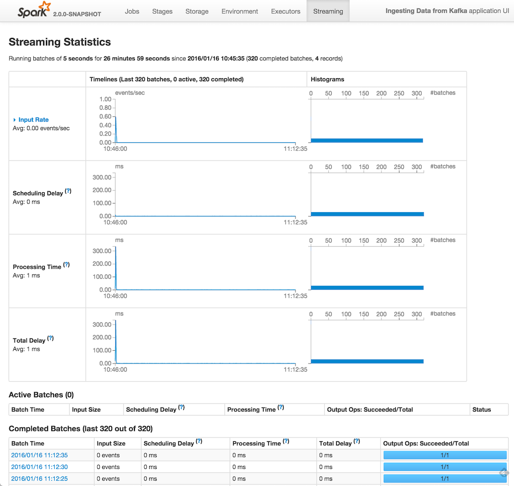
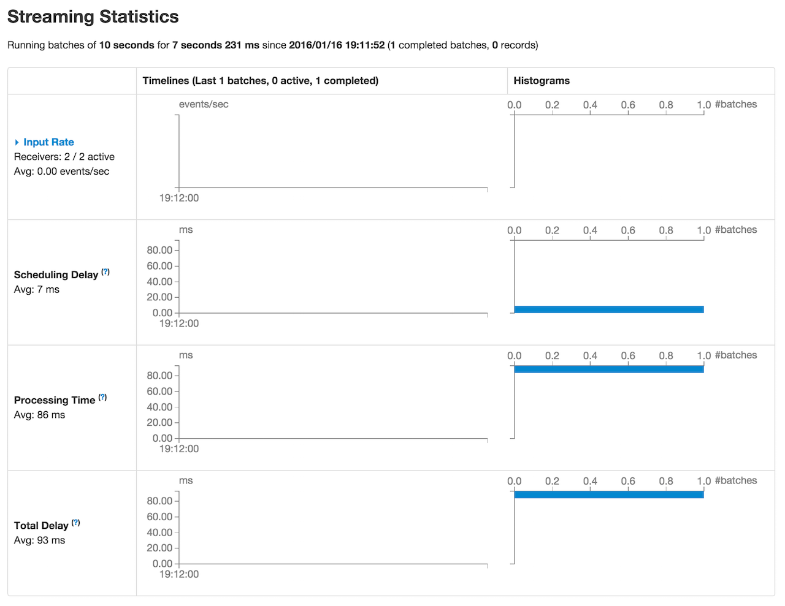
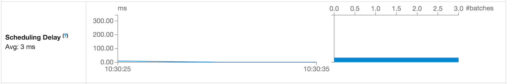
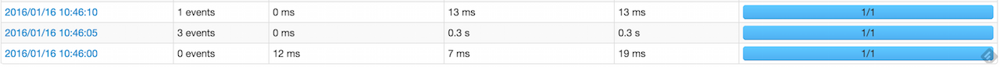
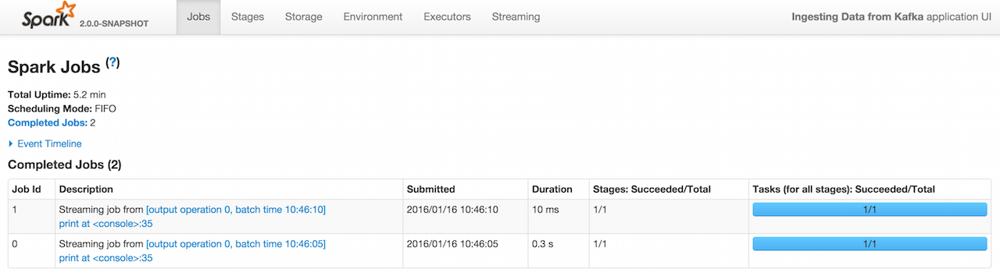

== web UI and Streaming Statistics Page

When you link:spark-streaming-streamingcontext.adoc#start[start a Spark Streaming application], you can use link:spark-webui.adoc[web UI] to monitor streaming statistics in *Streaming* tab (aka _page_).

.Streaming Tab in web UI

The page is made up of three sections (aka _tables_) - the unnamed, top-level one with <<basic-info, basic information>> about the streaming application (right below the title *Streaming Statistics*), <<active-batches, Active Batches>> and <<catched-batches, Completed Batches>>.

NOTE: The Streaming page uses link:spark-streaming-streaminglisteners.adoc#StreamingJobProgressListener[StreamingJobProgressListener] for most of the information displayed.

=== [[basic-info]] Basic Information

*Basic Information* section is the top-level section in the Streaming page that offers basic information about the streaming application.

.Basic Information section in Streaming Page (with Receivers)

The section shows the link:spark-streaming-dstreamgraph.adoc#batchDuration[batch duration] (in _Running batches of [batch duration]_), and the time it runs for and since link:spark-streaming-streamingcontext.adoc#creating-instance[StreamingContext was created] (_not_ when this streaming application has been started!).

It shows the number of *completed batches* and *received records* (in parenthesis). These information are later displayed in detail in <<active-batches, Active Batches>> and <<catched-batches, Completed Batches>> sections.

Below is the table for link:spark-streaming-streaminglisteners.adoc#retainedBatches[retained batches] (i.e. waiting, running, and completed batches).

In *Input Rate* row, you can show and hide details of each input stream.

If there are link:spark-streaming-receiverinputdstreams.adoc[input streams with receivers], the numbers of all the receivers and active ones are displayed (as depicted in the Figure 2 above).

The average event rate for all registered streams is displayed (as _Avg: [avg] events/sec_).

*Scheduling Delay* is the time spent from link:spark-streaming-jobscheduler.adoc#submitJobSet[when the collection of streaming jobs for a batch was submitted] to link:spark-streaming-jobscheduler.adoc#JobStarted[when the first streaming job (out of possibly many jobs in the collection) was started].

.Scheduling Delay in Streaming Page

*Processing Time* is the time spent to run all jobs of a batch.

*Total Delay* is the time spent from submitting to complete all jobs of a batch.

CAUTION: FIXME Check these times and their definitions out _again_!

=== [[active-batches]] Active Batches

*Active Batches* section presents `waitingBatches` and `runningBatches` together.

=== [[completed-batches]] Completed Batches

*Completed Batches* section presents `completedBatchUIData`.

=== Example - Kafka Direct Stream in web UI

.Two Batches with Incoming Data inside for Kafka Direct Stream in web UI (Streaming tab)

.Two Jobs for Kafka Direct Stream in web UI (Jobs tab)

