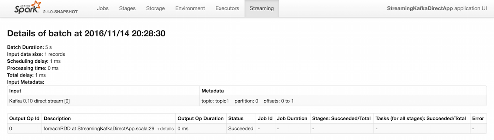

== [[InputInfoTracker]] InputInfoTracker

`InputInfoTracker` tracks batch times and <<StreamInputInfo, input record statistics>> for all registered input dstreams. It is used when link:spark-streaming-jobgenerator.adoc#generateJobs[`JobGenerator` submits streaming jobs for a batch interval] and in turn propagated to link:spark-streaming-streaminglisteners.adoc[streaming listeners] (as link:spark-streaming-streaminglisteners.adoc#StreamingListenerEvent[StreamingListenerBatchSubmitted] events).

NOTE: `InputInfoTracker` is managed by link:spark-streaming-jobscheduler.adoc[JobScheduler], i.e. it is created when link:spark-streaming-jobscheduler.adoc#starting[JobScheduler starts] and link:spark-streaming-jobscheduler.adoc#stopping[is stopped alongside].

`InputInfoTracker` uses internal registry <<batchTimeToInputInfos, batchTimeToInputInfos>> to maintain the mapping of batch times and link:spark-streaming-inputdstreams.adoc[input dstreams] (i.e. another mapping between input stream ids and <<StreamInputInfo, StreamInputInfo>>).

`InputInfoTracker` accumulates batch statistics for every batch when link:spark-streaming-dstreams.adoc#contract[input streams are computing RDDs] (and call <<reportInfo, reportInfo>>).

[NOTE]
====
It is up to input dstreams to have these batch statistics collected (and requires calling <<reportInfo, reportInfo>> method explicitly).

The following input streams report information:

* link:spark-streaming-kafka-DirectKafkaInputDStream.adoc#compute[DirectKafkaInputDStream]
* link:spark-streaming-receiverinputdstreams.adoc[ReceiverInputDStreams -- Input Streams with Receivers]
* FileInputDStream
====

[TIP]
====
Enable `INFO` logging level for `org.apache.spark.streaming.scheduler.InputInfoTracker` logger to see what happens inside.

Add the following line to `conf/log4j.properties`:

```
log4j.logger.org.apache.spark.streaming.scheduler.InputInfoTracker=INFO
```

Refer to link:../spark-logging.adoc[Logging].
====

=== [[batchTimeToInputInfos]] Batch Intervals and Input DStream Statistics -- `batchTimeToInputInfos` Registry

[source, scala]
----
batchTimeToInputInfos: HashMap[Time, HashMap[Int, StreamInputInfo]]
----

`batchTimeToInputInfos` keeps track of batches (`Time`) with input dstreams (`Int`) that reported their <<StreamInputInfo, statistics>> per batch.

=== [[reportInfo]] Reporting Input DStream Statistics for Batch -- `reportInfo` Method

[source, scala]
----
reportInfo(batchTime: Time, inputInfo: StreamInputInfo): Unit
----

`reportInfo` adds the input `inputInfo` for the `batchTime` to <<batchTimeToInputInfos, batchTimeToInputInfos>>.

Internally, `reportInfo` accesses the input dstream reports for `batchTime` using the internal `batchTimeToInputInfos` registry (creating a new empty one if `batchTime` has not been registered yet).

`reportInfo` then makes sure that the `inputInfo` input dstream has not been registered already for the input `batchTime` and throws a `IllegalStateException` otherwise.

```
Input stream [inputStreamId] for batch [batchTime] is already added into InputInfoTracker, this is an illegal state
```

Ultimatelly, `reportInfo` adds the input report to `batchTimeToInputInfos`.

=== [[getInfo]] Requesting Statistics For Input DStreams For Batch -- `getInfo` Method

[source, scala]
----
getInfo(batchTime: Time): Map[Int, StreamInputInfo]
----

`getInfo` returns all the <<reportInfo, reported input dstream statistics>> for `batchTime`. It returns an empty collection if there are no reports for a batch.

NOTE: `getInfo` is used when link:spark-streaming-jobgenerator.adoc#generateJobs[`JobGenerator` has successfully generated streaming jobs (and submits the jobs to `JobScheduler`)].

=== [[cleanup]] Removing Batch Statistics -- `cleanup` Method

[source, scala]
----
cleanup(batchThreshTime: Time): Unit
----

`cleanup` removes statistics for batches older than `batchThreshTime`. It removes the batches from <<batchTimeToInputInfos, batchTimeToInputInfos>> registry.

When executed, you should see the following INFO message (akin to _garbage collection_):

```
INFO InputInfoTracker: remove old batch metadata: [timesToCleanup]
```

=== [[StreamInputInfo]] `StreamInputInfo` -- Input Record Statistics

`StreamInputInfo` is used by link:spark-streaming-inputdstreams.adoc[input dstreams] to <<reportInfo, report their statistics with `InputInfoTracker`>>.

`StreamInputInfo` contains:

1. The id of the input dstream
2. The number of records in a batch
3. A metadata (with `Description`)

NOTE: `Description` is used in `BatchPage` (Details of batch) in web UI for Streaming under `Input Metadata`.

.Details of batch in web UI for Kafka 0.10 direct stream with Metadata

