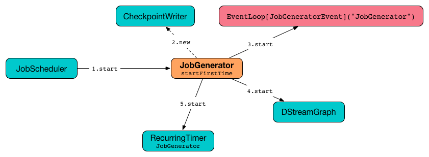
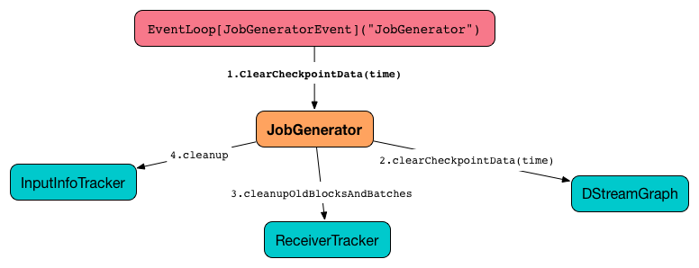

== JobGenerator

`JobGenerator` asynchronously <<generateJobs, generates streaming jobs>> every link:spark-streaming-dstreamgraph.adoc#batchDuration[batch interval] (using <<timer, recurring timer>>) that <<doCheckpoint, may or may not be checkpointed>> afterwards. It also periodically requests <<clearMetadata, clearing up metadata>> and <<clearCheckpointData, checkpoint data>> for each input dstream.

NOTE: `JobGenerator` is completely owned and managed by link:spark-streaming-jobscheduler.adoc[JobScheduler], i.e. `JobScheduler` creates an instance of JobGenerator and starts it (while link:spark-streaming-jobscheduler.adoc#starting[being started itself]).

[TIP]
====
Enable `INFO` or `DEBUG` logging level for `org.apache.spark.streaming.scheduler.JobGenerator` logger to see what happens inside.

Add the following line to `conf/log4j.properties`:

```
log4j.logger.org.apache.spark.streaming.scheduler.JobGenerator=DEBUG
```

Refer to link:../spark-logging.adoc[Logging].
====

=== [[start]][[starting]] Starting JobGenerator (start method)

[source, scala]
----
start(): Unit
----

`start` method creates and starts the internal <<eventLoop, JobGeneratorEvent handler>>.

NOTE: `start` is called when link:spark-streaming-jobscheduler.adoc#starting[JobScheduler starts].

.JobGenerator Start (First Time) procedure (tip: follow the numbers)


It first checks whether or not the internal event loop has already been created which is the way to know that the JobScheduler was started. If so, it does nothing and exits.

Only if <<shouldCheckpoint, checkpointing is enabled>>, it creates link:spark-streaming-checkpointing.adoc#CheckpointWriter[CheckpointWriter].

It then creates and starts the internal <<eventLoop, JobGeneratorEvent handler>>.

Depending on whether link:spark-streaming-streamingcontext.adoc#isCheckpointPresent[checkpoint directory is available or not] it <<restarting, restarts itself>> or <<startFirstTime, starts>>, respectively.

=== [[startFirstTime]] Start Time and startFirstTime Method

[source, scala]
----
startFirstTime(): Unit
----

`startFirstTime` starts link:spark-streaming-dstreamgraph.adoc[DStreamGraph] and the <<timer, timer>>.

NOTE: `startFirstTime` is called when <<starting, JobGenerator starts (and no checkpoint directory is available)>>.

It first requests <<timer, timer>> for the *start time* and passes the start time along to link:spark-streaming-dstreamgraph.adoc#start[DStreamGraph.start] and link:spark-streaming-recurringtimer.adoc[RecurringTimer.start].

NOTE: The start time has the property of being a multiple of link:spark-streaming-dstreamgraph.adoc#batchDuration[batch interval] and after the current system time. It is in the hands of link:spark-streaming-recurringtimer.adoc[recurring timer] to calculate a time with the property given a batch interval.

NOTE: Because of the property of the start time, link:spark-streaming-dstreamgraph.adoc#start[DStreamGraph.start] is passed the time of one batch interval before the calculated start time.

[NOTE]
====
When link:spark-streaming-recurringtimer.adoc[recurring timer] starts for `JobGenerator`, you should see the following INFO message in the logs:

```
INFO RecurringTimer: Started timer for JobGenerator at time [nextTime]
```
====

Right before the method finishes, you should see the following INFO message in the logs:

```
INFO JobGenerator: Started JobGenerator at [startTime] ms
```

=== [[stop]] Stopping JobGenerator (stop method)

[source, scala]
----
stop(processReceivedData: Boolean): Unit
----

`stop` stops a `JobGenerator`. The `processReceivedData` flag tells whether to stop `JobGenerator` gracefully, i.e. after having processed all received data and pending streaming jobs, or not.

[NOTE]
====
`JobGenerator` is stopped as link:spark-streaming-jobscheduler.adoc#stop[JobScheduler stops].

`processReceivedData` flag in `JobGenerator` corresponds to the value of `processAllReceivedData` in `JobScheduler`.
====

It first checks whether `eventLoop` internal event loop was ever started (through checking `null`).

WARNING: It doesn't set `eventLoop` to `null` (but it is assumed to be the marker).

When `JobGenerator` should stop immediately, i.e. ignoring unprocessed data and pending streaming jobs (`processReceivedData` flag is disabled), you should see the following INFO message in the logs:

```
INFO JobGenerator: Stopping JobGenerator immediately
```

It requests link:spark-streaming-recurringtimer.adoc#stop[the timer to stop forcefully] (`interruptTimer` is enabled) and link:spark-streaming-dstreamgraph.adoc#stop[stops the graph].

Otherwise, when `JobGenerator` should stop gracefully, i.e. `processReceivedData` flag is enabled, you should see the following INFO message in the logs:

```
INFO JobGenerator: Stopping JobGenerator gracefully
```

You should immediately see the following INFO message in the logs:

```
INFO JobGenerator: Waiting for all received blocks to be consumed for job generation
```

`JobGenerator` waits link:spark-streaming-settings.adoc[spark.streaming.gracefulStopTimeout] milliseconds or until link:spark-streaming-receivertracker.adoc#hasUnallocatedBlocks[ReceiverTracker has any blocks left to be processed] (whatever is shorter) before continuing.

NOTE: Poll (sleeping) time is `100` milliseconds and is not configurable.

When a timeout occurs, you should see the WARN message in the logs:

```
WARN JobGenerator: Timed out while stopping the job generator (timeout = [stopTimeoutMs])
```

After the waiting is over, you should see the following INFO message in the logs:

```
INFO JobGenerator: Waited for all received blocks to be consumed for job generation
```

It requests link:spark-streaming-recurringtimer.adoc#stop[timer to stop generating streaming jobs] (`interruptTimer` flag is disabled) and link:spark-streaming-dstreamgraph.adoc#stop[stops the graph].

You should see the following INFO message in the logs:

```
INFO JobGenerator: Stopped generation timer
```

You should immediately see the following INFO message in the logs:

```
INFO JobGenerator: Waiting for jobs to be processed and checkpoints to be written
```

`JobGenerator` waits link:spark-streaming-settings.adoc[spark.streaming.gracefulStopTimeout] milliseconds or until all the batches have been processed (whatever is shorter) before continuing. It waits for batches to complete using <<lastProcessedBatch, last processed batch>> internal property that should eventually be exactly the time when the link:spark-streaming-recurringtimer.adoc#stop[timer was stopped] (it returns the last time for which the streaming job was generated).

NOTE: link:spark-streaming-settings.adoc[spark.streaming.gracefulStopTimeout] is ten times the link:spark-streaming-dstreamgraph.adoc#batch-interval[batch interval] by default.

After the waiting is over, you should see the following INFO message in the logs:

```
INFO JobGenerator: Waited for jobs to be processed and checkpoints to be written
```

Regardless of `processReceivedData` flag, if <<checkpointing, checkpointing was enabled>>, it stops link:spark-streaming-checkpointing.adoc#CheckpointWriter[CheckpointWriter].

It then stops the <<eventLoop, event loop>>.

As the last step, when `JobGenerator` is assumed to be stopped completely, you should see the following INFO message in the logs:

```
INFO JobGenerator: Stopped JobGenerator
```

=== [[restarting]] Starting from Checkpoint (restart method)

[source, scala]
----
restart(): Unit
----

`restart` starts `JobGenerator` from link:spark-streaming-checkpointing.adoc[checkpoint]. It basically reconstructs the runtime environment of the past execution that may have stopped immediately, i.e. without waiting for all the streaming jobs to complete when checkpoint was enabled, or due to a abrupt shutdown (a unrecoverable failure or similar).

NOTE: `restart` is called when <<start, JobGenerator starts and checkpoint is present>>.

`restart` first calculates the batches that may have been missed while `JobGenerator` was down, i.e. batch times between the current restart time and the time of link:spark-streaming-streamingcontext.adoc#initialCheckpoint[initial checkpoint].

WARNING: `restart` doesn't check whether the initial checkpoint exists or not that may lead to NPE.

You should see the following INFO message in the logs:

```
INFO JobGenerator: Batches during down time ([size] batches): [downTimes]
```

It then ask the initial checkpoint for pending batches, i.e. the times of streaming job sets.

CAUTION: FIXME What are the pending batches? Why would they ever exist?

You should see the following INFO message in the logs:

```
INFO JobGenerator: Batches pending processing ([size] batches): [pendingTimes]
```

It then computes the batches to reschedule, i.e. pending and down time batches that are before restart time.

You should see the following INFO message in the logs:

```
INFO JobGenerator: Batches to reschedule ([size] batches): [timesToReschedule]
```

For each batch to reschedule, `restart` requests link:spark-streaming-receivertracker.adoc#allocateBlocksToBatch[ReceiverTracker to allocate blocks to batch] and link:spark-streaming-jobscheduler.adoc#submitJobSet[submits streaming job sets for execution].

NOTE: `restart` mimics <<generateJobs, generateJobs>> method.

It link:spark-streaming-recurringtimer.adoc#start[restarts the timer] (by using `restartTime` as `startTime`).

You should see the following INFO message in the logs:

```
INFO JobGenerator: Restarted JobGenerator at [restartTime]
```

=== [[lastProcessedBatch]] Last Processed Batch (aka lastProcessedBatch)

JobGenerator tracks the last batch time for which the batch was completed and cleanups performed as `lastProcessedBatch` internal property.

The only purpose of the `lastProcessedBatch` property is to allow for <<stop, stopping the streaming context gracefully>>, i.e. to wait until all generated streaming jobs are completed.

NOTE: It is set to the batch time after <<ClearMetadata, ClearMetadata Event>> is processed (when <<checkpointing, checkpointing is disabled>>).

=== [[JobGeneratorEvent]][[eventLoop]] JobGenerator eventLoop and JobGeneratorEvent Handler

`JobGenerator` uses the internal `EventLoop` event loop to process `JobGeneratorEvent` events asynchronously (one event at a time) on a separate dedicated _single_ thread.

NOTE: `EventLoop` uses unbounded https://docs.oracle.com/javase/8/docs/api/java/util/concurrent/LinkedBlockingDeque.html[java.util.concurrent.LinkedBlockingDeque].

For every `JobGeneratorEvent` event, you should see the following DEBUG message in the logs:

```
DEBUG JobGenerator: Got event [event]
```

There are 4 `JobGeneratorEvent` event types:

* <<GenerateJobs, GenerateJobs>>
* <<DoCheckpoint, DoCheckpoint>>
* <<ClearMetadata, ClearMetadata>>
* <<ClearCheckpointData, ClearCheckpointData>>

See below in the document for the extensive coverage of the supported `JobGeneratorEvent` event types.

==== [[generateJobs]][[GenerateJobs]] `GenerateJobs` Event and `generateJobs` method

NOTE: `GenerateJobs` events are posted regularly by the internal `timer` link:spark-streaming-recurringtimer.adoc[RecurringTimer] every link:spark-streaming-dstreamgraph.adoc#batchDuration[batch interval]. The `time` parameter is exactly the current batch time.

When `GenerateJobs(time: Time)` event is received the internal `generateJobs` method is called that link:spark-streaming-jobscheduler.adoc#submitJobSet[submits a collection of streaming jobs for execution].

[source, scala]
----
generateJobs(time: Time)
----

It first calls link:spark-streaming-receivertracker.adoc#allocateBlocksToBatch[ReceiverTracker.allocateBlocksToBatch] (it does nothing when there are no link:spark-streaming-receiverinputdstreams.adoc[receiver input streams] in use), and then requests link:spark-streaming-dstreamgraph.adoc#generateJobs[DStreamGraph for streaming jobs for a given batch time].

If the above two calls have finished successfully, link:spark-streaming-InputInfoTracker.adoc#getInfo[`InputInfoTracker` is requested for record statistics of every registered input dstream for the given batch `time`] that, together with the collection of streaming jobs (from link:spark-streaming-dstreamgraph.adoc#generateJobs[DStreamGraph]), is then passed on to link:spark-streaming-jobscheduler.adoc#submitJobSet[JobScheduler.submitJobSet] (as a link:spark-streaming-jobscheduler.adoc[JobSet]).

In case of failure, `JobScheduler.reportError` is called.

Ultimately, <<DoCheckpoint, DoCheckpoint>> event is posted (with `clearCheckpointDataLater` being disabled, i.e. `false`).

==== [[DoCheckpoint]][[doCheckpoint]] DoCheckpoint Event and doCheckpoint method

NOTE: `DoCheckpoint` events are posted by JobGenerator itself as part of <<generateJobs, generating streaming jobs>> (with `clearCheckpointDataLater` being disabled, i.e. `false`) and <<clearMetadata, clearing metadata>> (with `clearCheckpointDataLater` being enabled, i.e. `true`).

`DoCheckpoint` events trigger execution of `doCheckpoint` method.

[source, scala]
----
doCheckpoint(time: Time, clearCheckpointDataLater: Boolean)
----

If <<checkpointing, checkpointing is disabled>> or the current batch `time` is not eligible for checkpointing, the method does nothing and exits.

NOTE: A current batch is *eligible for checkpointing* when the time interval between current batch `time` and link:spark-streaming-dstreamgraph.adoc#zero-time[zero time] is a multiple of link:spark-streaming-streamingcontext.adoc#checkpoint-interval[checkpoint interval].

CAUTION: FIXME Who checks and when whether checkpoint interval is greater than batch interval or not? What about checking whether a checkpoint interval is a multiple of batch time?

CAUTION: FIXME What happens when you start a StreamingContext with a checkpoint directory that was used before?

Otherwise, when checkpointing should be performed, you should see the following INFO message in the logs:

```
INFO JobGenerator: Checkpointing graph for time [time] ms
```

It requests link:spark-streaming-dstreamgraph.adoc#updateCheckpointData[DStreamGraph for updating checkpoint data] and link:spark-streaming-checkpointing.adoc#CheckpointWriter-write[CheckpointWriter for writing a new checkpoint]. Both are given the current batch `time`.

==== [[clearMetadata]][[ClearMetadata]] ClearMetadata Event and clearMetadata method

NOTE: `ClearMetadata` are posted after a micro-batch for a batch time has completed.

It removes old RDDs that have been generated and collected so far by output streams (managed by link:spark-streaming-dstreamgraph.adoc[DStreamGraph]). It is a sort of _garbage collector_.

When `ClearMetadata(time)` arrives, it first asks link:spark-streaming-dstreamgraph.adoc#clearMetadata[DStreamGraph to clear metadata for the given time].

If <<checkpointing, checkpointing is enabled>>, it posts a <<DoCheckpoint, DoCheckpoint>> event (with `clearCheckpointDataLater` being enabled, i.e. `true`) and exits.

Otherwise, when checkpointing is disabled, it asks link:spark-streaming-dstreamgraph.adoc[DStreamGraph for the maximum remember duration across all the input streams] and requests ReceiverTracker and the link:spark-streaming-InputInfoTracker.adoc[InputInfoTracker] to do their cleanups.

CAUTION: FIXME Describe cleanups of ReceiverTracker.

Eventually, it marks the batch as fully processed, i.e. that the batch completed as well as checkpointing or metadata cleanups, using the <<lastProcessedBatch, internal lastProcessedBatch marker>>.

==== [[ClearCheckpointData]][[clearCheckpointData]] ClearCheckpointData Event and clearCheckpointData method

NOTE: `ClearCheckpointData` event is posted after  link:spark-streaming-checkpointing.adoc#CheckpointWriter-write[checkpoint is saved] and <<clearMetadata, checkpoint cleanup is requested>>.

`ClearCheckpointData` events trigger execution of `clearCheckpointData` method.

[source, scala]
----
clearCheckpointData(time: Time)
----

In short, `clearCheckpointData` requests the link:spark-streaming-dstreamgraph.adoc#clearCheckpointData[DStreamGraph], link:spark-streaming-receivertracker.adoc#cleanupOldBlocksAndBatches[ReceiverTracker], and link:spark-streaming-InputInfoTracker.adoc#cleanup[InputInfoTracker] to do their cleaning and marks the current batch `time` as <<lastProcessedBatch, fully processed>>.

.JobGenerator and ClearCheckpointData event


When executed, `clearCheckpointData` first requests link:spark-streaming-dstreamgraph.adoc#clearCheckpointData[DStreamGraph to clear checkpoint data for the given batch time].

It then asks link:spark-streaming-dstreamgraph.adoc#maximum-remember-interval[`DStreamGraph` for the maximum remember interval]. Given the maximum remember interval `JobGenerator` requests link:spark-streaming-receivertracker.adoc#cleanupOldBlocksAndBatches[`ReceiverTracker` to cleanup old blocks and batches] and link:spark-streaming-InputInfoTracker.adoc#cleanup[`InputInfoTracker` to do cleanup] for data accumulated before the maximum remember interval (from `time`).

Having done that, the current batch `time` is marked as <<lastProcessedBatch, fully processed>>.

=== [[shouldCheckpoint]][[checkpointing]] Whether or Not to Checkpoint (aka shouldCheckpoint)

`shouldCheckpoint` flag is used to control a link:spark-streaming-checkpointing.adoc#CheckpointWriter[CheckpointWriter] as well as whether to <<clearMetadata, post DoCheckpoint in clearMetadata or not>>.

`shouldCheckpoint` flag is enabled (i.e. `true`) when link:spark-streaming-streamingcontext.adoc#checkpointDuration[checkpoint interval] and link:spark-streaming-streamingcontext.adoc#checkpointDir[checkpoint directory] are defined (i.e. not `null`) in StreamingContext.

NOTE: However the flag is completely based on the properties of StreamingContext, these dependent properties are used by JobScheduler only. _Really?_

[CAUTION]
====
FIXME Report an issue

When and what for are they set? Can one of `ssc.checkpointDuration` and `ssc.checkpointDir` be `null`? Do they all have to be set and is this checked somewhere?

Answer: See link:spark-streaming-streamingcontext.adoc#validate[Setup Validation].
====

CAUTION: Potential bug: Can `StreamingContext` have no checkpoint duration set? At least, the batch interval *must* be set. In other words, it's StreamingContext to say whether to checkpoint or not and there should be a method in StreamingContext _not_ JobGenerator.

=== [[onCheckpointCompletion]] onCheckpointCompletion

CAUTION: FIXME

=== [[timer]] timer RecurringTimer

`timer` link:spark-streaming-recurringtimer.adoc[RecurringTimer] (with the name being `JobGenerator`) is used to posts <<GenerateJobs, GenerateJobs>> events to the internal <<eventLoop, JobGeneratorEvent handler>> every link:spark-streaming-dstreamgraph.adoc#batchDuration[batch interval].

NOTE: `timer` is created when `JobGenerator` is. It starts when <<startFirstTime, JobGenerator starts (for the first time only)>>.
