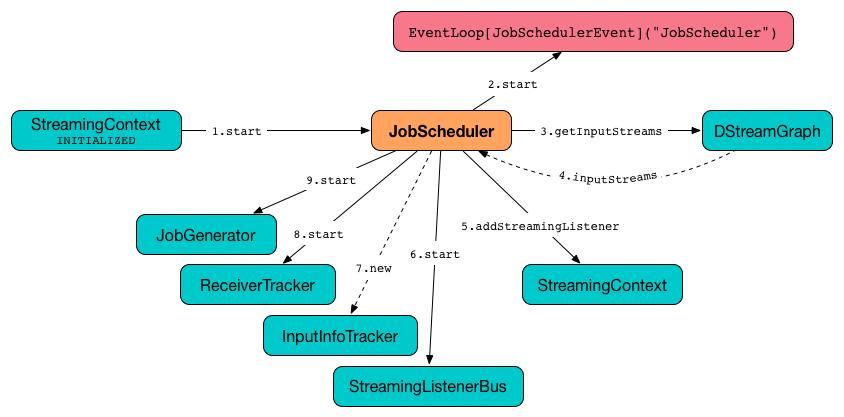
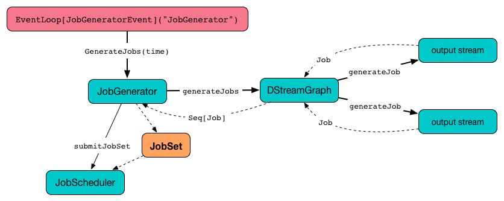
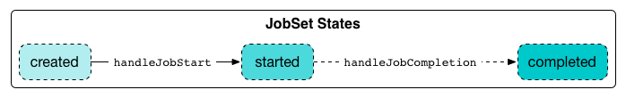

== JobScheduler

*Streaming scheduler* (`JobScheduler`) schedules streaming jobs to be run as Spark jobs. It is created as part of link:spark-streaming-streamingcontext.adoc#creating-instance[creating a StreamingContext] and starts with it.

.JobScheduler and Dependencies
image::../images/streaming-jobscheduler.png[align="center"]

It tracks jobs submitted for execution (as <<JobSet, JobSets>> via <<submitJobSet, submitJobSet>> method) in <<internal-registries, jobSets>> internal map.

NOTE: JobSets are submitted by link:spark-streaming-jobgenerator.adoc[JobGenerator].

It uses a *streaming scheduler queue* for streaming jobs to be executed.

[TIP]
====
Enable `DEBUG` logging level for `org.apache.spark.streaming.scheduler.JobScheduler` logger to see what happens in JobScheduler.

Add the following line to `conf/log4j.properties`:

```
log4j.logger.org.apache.spark.streaming.scheduler.JobScheduler=DEBUG
```

Refer to link:../spark-logging.adoc[Logging].
====

=== [[start]][[starting]] Starting JobScheduler (start method)

[source, scala]
----
start(): Unit
----

When `JobScheduler` starts (i.e. when `start` is called), you should see the following DEBUG message in the logs:

```
DEBUG JobScheduler: Starting JobScheduler
```

It then goes over all the dependent services and starts them one by one as depicted in the figure.

.JobScheduler Start procedure


It first starts <<eventLoop, JobSchedulerEvent Handler>>.

It asks link:spark-streaming-dstreamgraph.adoc#input-dstream-registry[DStreamGraph for input dstreams] and registers link:spark-streaming-backpressure.adoc#RateController[their RateControllers] (if defined) as link:spark-streaming-streamingcontext.adoc#addStreamingListener[streaming listeners]. It starts <<StreamingListenerBus, StreamingListenerBus>> afterwards.

It creates link:spark-streaming-receivertracker.adoc[ReceiverTracker] and link:spark-streaming-InputInfoTracker.adoc[InputInfoTracker]. It then starts the `ReceiverTracker`.

It starts link:spark-streaming-jobgenerator.adoc[JobGenerator].

Just before `start` finishes, you should see the following INFO message in the logs:

```
INFO JobScheduler: Started JobScheduler
```

=== [[getPendingTimes]] Pending Batches to Process (getPendingTimes method)

CAUTION: FIXME

=== [[stop]][[stopping]] Stopping JobScheduler (stop method)

[source, scala]
----
stop(processAllReceivedData: Boolean): Unit
----

`stop` stops `JobScheduler`.

NOTE: It is called when link:spark-streaming-streamingcontext.adoc#stopping[StreamingContext is being stopped].

You should see the following DEBUG message in the logs:

```
DEBUG JobScheduler: Stopping JobScheduler
```

link:spark-streaming-receivertracker.adoc#stopping[ReceiverTracker is stopped].

NOTE: link:spark-streaming-receivertracker.adoc[ReceiverTracker] is only assigned (and started) while JobScheduler is starting.

It link:spark-streaming-jobgenerator.adoc#stop[stops generating jobs].

You should see the following DEBUG message in the logs:

```
DEBUG JobScheduler: Stopping job executor
```

<<streaming-job-executor, jobExecutor Thread Pool>> is shut down (using `jobExecutor.shutdown()`).

If the stop should wait for all received data to be processed (the input parameter `processAllReceivedData` is `true`), `stop` awaits termination of <<streaming-job-executor, jobExecutor Thread Pool>> for *1 hour* (it is assumed that it is enough and is not configurable). Otherwise, it waits for *2 seconds*.

<<streaming-job-executor, jobExecutor Thread Pool>>  is forcefully shut down (using `jobExecutor.shutdownNow()`) unless it has terminated already.

You should see the following DEBUG message in the logs:

```
DEBUG JobScheduler: Stopped job executor
```

<<StreamingListenerBus, StreamingListenerBus>> and <<eventLoop, eventLoop - JobSchedulerEvent Handler>> are stopped.

You should see the following INFO message in the logs:

```
INFO JobScheduler: Stopped JobScheduler
```

=== [[submitJobSet]] Submitting Collection of Jobs for Execution -- `submitJobSet` method

When `submitJobSet(jobSet: JobSet)` is called, it reacts appropriately per `jobSet` <<JobSet, JobSet>> given.

NOTE: The method is called by link:spark-streaming-jobgenerator.adoc[JobGenerator] only (as part of link:spark-streaming-jobgenerator.adoc#generateJobs[JobGenerator.generateJobs] and link:spark-streaming-jobgenerator.adoc#restarting[JobGenerator.restart]).

When no streaming jobs are inside the `jobSet`, you should see the following INFO in the logs:

```
INFO JobScheduler: No jobs added for time [jobSet.time]
```

Otherwise, when there is at least one streaming job inside the `jobSet`, link:spark-streaming-streaminglisteners.adoc#StreamingListenerEvent[StreamingListenerBatchSubmitted] (with data statistics of every registered input stream for which the streaming jobs were generated) is posted to <<StreamingListenerBus, StreamingListenerBus>>.

The JobSet is added to the internal <<internal-registries, jobSets>> registry.

It then goes over every streaming job in the `jobSet` and executes a <<JobHandler, JobHandler>> (on <<streaming-job-executor, jobExecutor Thread Pool>>).

At the end, you should see the following INFO message in the logs:

```
INFO JobScheduler: Added jobs for time [jobSet.time] ms
```

=== [[JobHandler]] JobHandler

`JobHandler` is a thread of execution for a link:spark-streaming.adoc#Job[streaming job] (that simply calls `Job.run`).

NOTE: It is called when a new <<JobSet, JobSet>> is submitted (see <<submitJobSet, submitJobSet>> in this document).

When started, it prepares the environment (so the streaming job can be nicely displayed in the web UI under `/streaming/batch/?id=[milliseconds]`) and posts `JobStarted` event to <<eventLoop, JobSchedulerEvent event loop>>.

It runs the link:spark-streaming.adoc#Job[streaming job] that executes the job function as defined while link:spark-streaming-dstreams.adoc#generateJob[generating a streaming job for an output stream].

NOTE: This is the moment when a link:spark-sparkcontext.adoc#running-jobs[Spark (core) job is run].

You may see similar-looking INFO messages in the logs (it depends on the link:spark-streaming-operators.adoc[operators] you use):

```
INFO SparkContext: Starting job: print at <console>:39
INFO DAGScheduler: Got job 0 (print at <console>:39) with 1 output partitions
...
INFO DAGScheduler: Submitting 1 missing tasks from ResultStage 0 (KafkaRDD[2] at createDirectStream at <console>:36)
...
INFO Executor: Finished task 0.0 in stage 0.0 (TID 0). 987 bytes result sent to driver
...
INFO DAGScheduler: Job 0 finished: print at <console>:39, took 0.178689 s
```

It posts `JobCompleted` event to <<eventLoop, JobSchedulerEvent event loop>>.

=== [[streaming-job-executor]] jobExecutor Thread Pool

While `JobScheduler` is instantiated, the daemon thread pool `streaming-job-executor-ID` with link:spark-streaming-settings.adoc[spark.streaming.concurrentJobs] threads is created.

It is used to execute <<JobHandler, JobHandler>> for jobs in JobSet (see <<submitJobSet, submitJobSet>> in this document).

It shuts down when link:spark-streaming-streamingcontext.adoc#stop[StreamingContext] stops.

=== [[eventLoop]] eventLoop - JobSchedulerEvent Handler

JobScheduler uses `EventLoop` for `JobSchedulerEvent` events. It accepts <<JobStarted,JobStarted>> and <<JobCompleted, JobCompleted>> events. It also processes `ErrorReported` events.

==== [[JobStarted]] JobStarted and JobScheduler.handleJobStart

When `JobStarted` event is received, `JobScheduler.handleJobStart` is called.

NOTE: It is <<JobHandler, JobHandler>> to post `JobStarted`.

`handleJobStart(job: Job, startTime: Long)` takes a `JobSet` (from `jobSets`) and checks whether it has already been started.

It posts `StreamingListenerBatchStarted` to <<StreamingListenerBus, StreamingListenerBus>> when the JobSet is about to start.

It posts `StreamingListenerOutputOperationStarted` to <<StreamingListenerBus, StreamingListenerBus>>.

You should see the following INFO message in the logs:

```
INFO JobScheduler: Starting job [job.id] from job set of time [jobSet.time] ms
```

==== [[JobCompleted]] JobCompleted and JobScheduler.handleJobCompletion

When `JobCompleted` event is received, it triggers `JobScheduler.handleJobCompletion(job: Job, completedTime: Long)`.

NOTE: <<JobHandler, JobHandler>> posts `JobCompleted` events when it finishes running a streaming job.

`handleJobCompletion` looks the <<JobSet, JobSet>> up (from the <<internal-registries, jobSets>> internal registry) and calls <<JobSet, JobSet.handleJobCompletion(job)>> (that marks the `JobSet` as completed when no more streaming jobs are incomplete). It also calls `Job.setEndTime(completedTime)`.

It posts `StreamingListenerOutputOperationCompleted` to <<StreamingListenerBus, StreamingListenerBus>>.

You should see the following INFO message in the logs:

```
INFO JobScheduler: Finished job [job.id] from job set of time [jobSet.time] ms
```

If the entire JobSet is completed, it removes it from <<internal-registries, jobSets>>, and calls link:spark-streaming-jobgenerator.adoc#onBatchCompletion[JobGenerator.onBatchCompletion].

You should see the following INFO message in the logs:

```
INFO JobScheduler: Total delay: [totalDelay] s for time [time] ms (execution: [processingDelay] s)
```

It posts `StreamingListenerBatchCompleted` to <<StreamingListenerBus, StreamingListenerBus>>.

It reports an error if the job's result is a failure.

=== [[StreamingListenerBus]] StreamingListenerBus and StreamingListenerEvents

`StreamingListenerBus` is a asynchronous listener bus to post `StreamingListenerEvent` events to link:spark-streaming-streaminglisteners.adoc[streaming listeners].

=== [[internal-registries]] Internal Registries

`JobScheduler` maintains the following information in internal registries:

* `jobSets` - a mapping between time and JobSets. See <<JobSet, JobSet>>.

=== [[JobSet]] JobSet

A `JobSet` represents a collection of link:spark-streaming.adoc#Job[streaming jobs] that were created at (batch) `time` for link:spark-streaming-dstreamgraph.adoc#generateJobs[output streams] (that have ultimately produced a streaming job as they may opt out).

.JobSet Created and Submitted to JobScheduler


`JobSet` tracks what streaming jobs are in incomplete state (in `incompleteJobs` internal registry).

NOTE: At the beginning (when `JobSet` is created) all streaming jobs are incomplete.

CAUTION: FIXME There is a duplication in how streaming jobs are tracked as completed since a `Job` knows about its `_endTime`. Is this a optimization? How much time does it buy us?

A `JobSet` tracks the following moments in its lifecycle:

* `submissionTime` being the time when the instance was created.

* `processingStartTime` being the time when the first streaming job in the collection was started.

* `processingEndTime` being the time when the last streaming job in the collection finished processing.

A `JobSet` changes state over time. It can be in the following states:

* *Created* after a `JobSet` was created. `submissionTime` is set.
* *Started* after `JobSet.handleJobStart` was called. `processingStartTime` is set.
* *Completed* after `JobSet.handleJobCompletion` and no more jobs are incomplete (in `incompleteJobs` internal registry). `processingEndTime` is set.

.JobSet States


Given the states a `JobSet` has *delays*:

* *Processing delay* is the time spent for processing all the streaming jobs in a `JobSet` from the time the very first job was started, i.e. the time between started and completed states.

* *Total delay* is the time from the batch time until the `JobSet` was completed.

NOTE: Total delay is always longer than processing delay.

You can map a `JobSet` to a `BatchInfo` using `toBatchInfo` method.

NOTE: `BatchInfo` is used to create and post link:spark-streaming-streaminglisteners.adoc#StreamingListenerEvent[StreamingListenerBatchSubmitted], link:spark-streaming-streaminglisteners.adoc#StreamingListenerEvent[StreamingListenerBatchStarted], and link:spark-streaming-streaminglisteners.adoc#StreamingListenerEvent[StreamingListenerBatchCompleted] events.

`JobSet` is used (created or processed) in:

* link:spark-streaming-jobgenerator.adoc#generateJobs[JobGenerator.generateJobs]
* <<submitJobSet, JobScheduler.submitJobSet(jobSet: JobSet)>>
* link:spark-streaming-jobgenerator.adoc#restarting[JobGenerator.restart]
* <<JobStarted, JobScheduler.handleJobStart(job: Job, startTime: Long)>>
* <<JobCompleted, JobScheduler.handleJobCompletion(job: Job, completedTime: Long)>>
