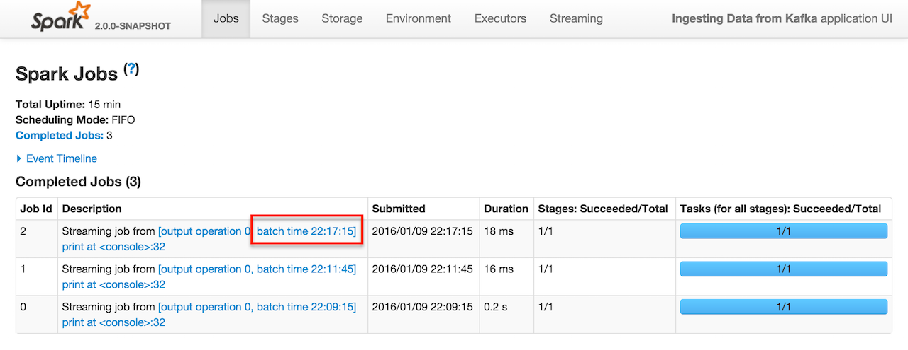
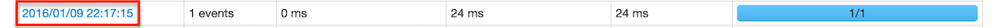
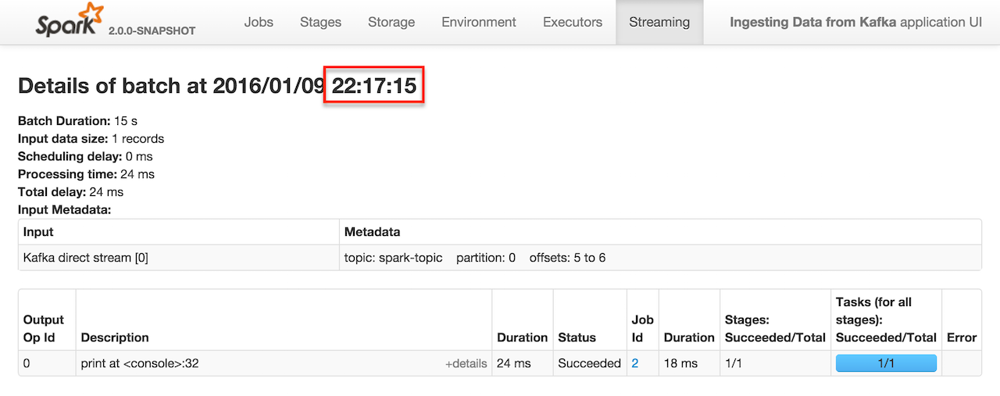

== Ingesting Data from Apache Kafka

Spark Streaming comes with two built-in models of ingesting data from http://kafka.apache.org/[Apache Kafka]:

* <<no-receivers, With no receivers>>
* Using receivers

There is yet another "middle-ground" approach (so-called unofficial since it is not available by default in Spark Streaming):

* https://github.com/dibbhatt/kafka-spark-consumer[Kafka Spark Consumer] -- a high-performance Kafka Consumer for Spark Streaming with support for Apache Kafka 0.10.

=== [[no-receivers]] Data Ingestion with no Receivers

*No-receivers approach* supports the two following modes:

* <<streaming-mode, Streaming mode>> (using link:spark-streaming-kafka-KafkaUtils.adoc#createDirectStream[KafkaUtils.createDirectStream]) that uses a link:spark-streaming-inputdstreams.adoc[input dstream] that polls for records from Kafka brokers on the driver every batch interval and passes the available topic offsets on to executors for processing.
* *Non-streaming mode* (using link:spark-streaming-kafka-KafkaUtils.adoc#createRDD[KafkaUtils.createRDD]) which simply creates a link:spark-streaming-kafka-KafkaRDD.adoc[KafkaRDD] of key-value pairs, i.e. `RDD[(K, V)]` from the records in topics in Kafka.

==== [[streaming-mode]] Streaming mode

You create link:spark-streaming-kafka-DirectKafkaInputDStream.adoc[DirectKafkaInputDStream] using link:spark-streaming-kafka-KafkaUtils.adoc#createDirectStream[KafkaUtils.createDirectStream].

NOTE: Define the types of keys and values in `KafkaUtils.createDirectStream`, e.g. `KafkaUtils.createDirectStream[String, String, StringDecoder, StringDecoder]`, so proper decoders are used to decode messages from Kafka.

You have to specify `metadata.broker.list` or `bootstrap.servers` (in that order of precedence) for your Kafka environment. `metadata.broker.list` is a comma-separated list of Kafka's (seed) brokers in the format of `<host>:<port>`.

NOTE: You can start `DirectKafkaInputDStream` regardless of the status of Kafka brokers as it waits until at least one Kafka broker is available.

[source, scala]
----
val conf = new SparkConf().setMaster("local[*]").setAppName("Ingesting Data from Kafka")
conf.set("spark.streaming.ui.retainedBatches", "5")

// Enable Back Pressure
conf.set("spark.streaming.backpressure.enabled", "true")

val ssc = new StreamingContext(conf, batchDuration = Seconds(5))

// Enable checkpointing
ssc.checkpoint("_checkpoint")

// You may or may not want to enable some additional DEBUG logging
import org.apache.log4j._
Logger.getLogger("org.apache.spark.streaming.dstream.DStream").setLevel(Level.DEBUG)
Logger.getLogger("org.apache.spark.streaming.dstream.WindowedDStream").setLevel(Level.DEBUG)
Logger.getLogger("org.apache.spark.streaming.DStreamGraph").setLevel(Level.DEBUG)
Logger.getLogger("org.apache.spark.streaming.scheduler.JobGenerator").setLevel(Level.DEBUG)

// Connect to Kafka
import org.apache.spark.streaming.kafka.KafkaUtils
import _root_.kafka.serializer.StringDecoder
val kafkaParams = Map("metadata.broker.list" -> "localhost:9092")
val kafkaTopics = Set("spark-topic")
val messages = KafkaUtils.createDirectStream[String, String, StringDecoder, StringDecoder](ssc, kafkaParams, kafkaTopics)

// print 10 last messages
messages.print()

// start streaming computation
ssc.start
----

If `zookeeper.connect` or `group.id` parameters are not set, they are added with their values being empty strings.

In this mode, you will only see jobs submitted (in the *Jobs* tab in link:spark-webui.adoc[web UI]) when a message comes in.

.Complete Jobs in web UI for batch time 22:17:15


It corresponds to *Input size* larger than `0` in the *Streaming* tab in the web UI.

.Completed Batch in web UI for batch time 22:17:15


Click the link in Completed Jobs for a batch and you see the details.

.Details of batch in web UI for batch time 22:17:15


=== [[spark-streaming-kafka-0-10]] `spark-streaming-kafka-0-10` Library Dependency

The new API for both Kafka RDD and DStream is in the `spark-streaming-kafka` artifact. Add the following dependency to sbt project to use the streaming integration:

```
libraryDependencies += "org.apache.spark" %% "spark-streaming-kafka-0-10" % "2.0.1"
```

[TIP]
====
`spark-streaming-kafka-0-10` module is not included in the CLASSPATH of link:../spark-shell.adoc[spark-shell] so you have to start it with link:../spark-submit.adoc#packages[`--packages` command-line option].

```
./bin/spark-shell --packages org.apache.spark:spark-streaming-kafka-0-10_2.11:2.1.0-SNAPSHOT
```
====

NOTE: Replace `2.0.1` or `2.1.0-SNAPSHOT` with available version as found at http://search.maven.org/#search%7Cga%7C1%7Ca%3A%22spark-streaming-kafka-0-10_2.11%22[The Central Repository's search].

=== [[LeaderOffset]] LeaderOffset

`LeaderOffset` is an internal class to represent an offset on the topic partition on the broker that works on a host and a port.

=== Recommended Reading

* http://blog.cloudera.com/blog/2015/03/exactly-once-spark-streaming-from-apache-kafka/[Exactly-once Spark Streaming from Apache Kafka]
