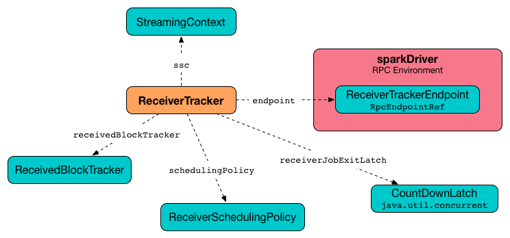

== ReceiverTracker

=== [[introduction]] Introduction

`ReceiverTracker` manages execution of all link:spark-streaming-receivers.adoc[Receivers].

.ReceiverTracker and Dependencies


It uses link:spark-rpc.adoc[RPC environment] for communication with link:spark-streaming-receiversupervisors.adoc[ReceiverSupervisors].

NOTE: `ReceiverTracker` is started when link:spark-streaming-jobscheduler.adoc[JobScheduler] starts.

It can only be started once and only when at least one input receiver has been registered.

`ReceiverTracker` can be in one of the following states:

* `Initialized` - it is in the state after having been instantiated.
* `Started` -
* `Stopping`
* `Stopped`

=== [[starting]] Starting ReceiverTracker (start method)

NOTE: You can only start `ReceiverTracker` once and multiple attempts lead to throwing `SparkException` exception.

NOTE: Starting `ReceiverTracker` when no link:spark-streaming-receiverinputdstreams.adoc[ReceiverInputDStream] has registered does nothing.

When `ReceiverTracker` starts, it first sets <<ReceiverTrackerEndpoint, ReceiverTracker RPC endpoint>> up.

It then launches receivers, i.e. it collects receivers for all registered `ReceiverDStream` and posts them as  <<ReceiverTrackerEndpoint-StartAllReceivers, StartAllReceivers>> to <<ReceiverTrackerEndpoint, ReceiverTracker RPC endpoint>>.

In the meantime, receivers have their ids assigned that correspond to the unique identifier of their `ReceiverDStream`.

You should see the following INFO message in the logs:

```
INFO ReceiverTracker: Starting [receivers.length] receivers
```

A successful startup of `ReceiverTracker` finishes with the following INFO message in the logs:

```
INFO ReceiverTracker: ReceiverTracker started
```

`ReceiverTracker` enters `Started` state.

=== [[cleanupOldBlocksAndBatches]] Cleanup Old Blocks And Batches (cleanupOldBlocksAndBatches method)

CAUTION: FIXME

=== [[hasUnallocatedBlocks]] hasUnallocatedBlocks

CAUTION: FIXME

=== [[ReceiverTrackerEndpoint]] ReceiverTracker RPC endpoint

CAUTION: FIXME

==== [[ReceiverTrackerEndpoint-StartAllReceivers]] StartAllReceivers

`StartAllReceivers(receivers)` is a local message sent by <<ReceiverTracker, ReceiverTracker>> when <<starting, it starts>> (using `ReceiverTracker.launchReceivers()`).

It schedules receivers (using `ReceiverSchedulingPolicy.scheduleReceivers(receivers, getExecutors)`).

CAUTION: FIXME What does `ReceiverSchedulingPolicy.scheduleReceivers(receivers, getExecutors)` do?

It does _some_ bookkeeping.

CAUTION: FIXME What is _the_ bookkeeping?

It finally starts every receiver (using the helper method <<ReceiverTrackerEndpoint-startReceiver, ReceiverTrackerEndpoint.startReceiver>>).

===== [[ReceiverTrackerEndpoint-startReceiver]] ReceiverTrackerEndpoint.startReceiver

CAUTION: FIXME When is the method called?

`ReceiverTrackerEndpoint.startReceiver(receiver: Receiver[_], scheduledLocations: Seq[TaskLocation])` starts a `receiver` link:spark-streaming.adoc#Receiver[Receiver] at the given `Seq[TaskLocation]` locations.

CAUTION: FIXME When the scaladoc says https://github.com/apache/spark/blob/master/streaming/src/main/scala/org/apache/spark/streaming/scheduler/ReceiverTracker.scala#L543[_"along with the scheduled executors"_], does it mean that the executors are already started and waiting for the receiver?!

It defines an internal function (`startReceiverFunc`) to start `receiver` on a worker (in Spark cluster).

Namely, the internal `startReceiverFunc` function checks that the task attempt is `0`.

TIP: Read about `TaskContext` in link:spark-taskscheduler-taskcontext.adoc[TaskContext].

It then starts a link:spark-streaming-receiversupervisors.adoc[ReceiverSupervisor] for `receiver` and keeps awaiting termination, i.e. once the task is run it does so until _a termination message_ comes from _some_ other external source). The task is a long-running task for `receiver`.

CAUTION: FIXME When does `supervisor.awaitTermination()` finish?

Having the internal function, it creates `receiverRDD` - an instance of `RDD[Receiver[_]]` - that uses link:spark-sparkcontext.adoc#makeRDD[SparkContext.makeRDD] with a one-element collection with the only element being `receiver`. When the collection of link:../spark-TaskLocation.adoc[TaskLocation] is empty, it uses exactly one partition. Otherwise, it distributes the one-element collection across the nodes (and potentially even executors) for `receiver`. The RDD has the name `Receiver [receiverId]`.

The Spark job's description is set to `Streaming job running receiver [receiverId]`.

CAUTION: FIXME What does `sparkContext.setJobDescription` actually do and how does this influence Spark jobs? It uses `ThreadLocal` so it assumes that a single thread will do a job?

Having done so, it submits a job (using link:../spark-sparkcontext.adoc#submitJob[SparkContext.submitJob]) on the instance of `RDD[Receiver[_]]` with the function `startReceiverFunc` that runs `receiver`. It has link:../spark-rdd-actions.adoc#FutureAction[SimpleFutureAction] to monitor `receiver`.

[NOTE]
====
The method demonstrates how you could use Spark Core as the distributed computation platform to launch _any_ process on clusters and let Spark handle the distribution.

_Very clever indeed!_
====

When it completes (successfully or not), `onReceiverJobFinish(receiverId)` is called, but only for cases when the tracker is fully up and running, i.e. started. When the tracker is being stopped or has already stopped, the following INFO message appears in the logs:

```
INFO Restarting Receiver [receiverId]
```

And a `RestartReceiver(receiver)` message is sent.

When there was a failure submitting the job, you should also see the ERROR message in the logs:

```
ERROR Receiver has been stopped. Try to restart it.
```

Ultimately, right before the method exits, the following INFO message appears in the logs:

```
INFO Receiver [receiver.streamId] started
```

==== [[ReceiverTrackerEndpoint-StopAllReceivers]] StopAllReceivers

CAUTION: FIXME

==== [[ReceiverTrackerEndpoint-AllReceiverIds]] AllReceiverIds

CAUTION: FIXME

=== [[stopping]] Stopping ReceiverTracker (stop method)

`ReceiverTracker.stop(graceful: Boolean)` stops `ReceiverTracker` only when it is in `Started` state. Otherwise, it does nothing and simply exits.

NOTE: The `stop` method is called while link:spark-streaming-jobscheduler.adoc#stopping[JobScheduler is being stopped].

The state of `ReceiverTracker` is marked `Stopping`.

It then sends the stop signal to all the receivers (i.e. posts <<ReceiverTrackerEndpoint-StopAllReceivers, StopAllReceivers>> to <<ReceiverTrackerEndpoint, ReceiverTracker RPC endpoint>>) and waits *10 seconds* for all the receivers to quit gracefully (unless `graceful` flag is set).

NOTE: The 10-second wait time for graceful quit is not configurable.

You should see the following INFO messages if the `graceful` flag is enabled which means that the receivers quit in a graceful manner:

```
INFO ReceiverTracker: Waiting for receiver job to terminate gracefully
INFO ReceiverTracker: Waited for receiver job to terminate gracefully
```

It then checks whether all the receivers have been deregistered or not by posting <<ReceiverTrackerEndpoint-AllReceiverIds, AllReceiverIds>> to <<ReceiverTrackerEndpoint, ReceiverTracker RPC endpoint>>.

You should see the following INFO message in the logs if they have:

```
INFO ReceiverTracker: All of the receivers have deregistered successfully
```

Otherwise, when there were receivers not having been deregistered properly, the following WARN message appears in the logs:

```
WARN ReceiverTracker: Not all of the receivers have deregistered, [receivers]
```

It stops <<ReceiverTrackerEndpoint, ReceiverTracker RPC endpoint>> as well as <<ReceivedBlockTracker, ReceivedBlockTracker>>.

You should see the following INFO message in the logs:

```
INFO ReceiverTracker: ReceiverTracker stopped
```

The state of `ReceiverTracker` is marked `Stopped`.

=== [[allocateBlocksToBatch]] Allocating Blocks To Batch (allocateBlocksToBatch method)

[source, scala]
----
allocateBlocksToBatch(batchTime: Time): Unit
----

`allocateBlocksToBatch` simply passes all the calls on to <<ReceivedBlockTracker-allocateBlocksToBatch, ReceivedBlockTracker.allocateBlocksToBatch>>, but only when there _are_ link:spark-streaming-receiverinputdstreams.adoc[receiver input streams] registered (in `receiverInputStreams` internal registry).

NOTE: When there are no link:spark-streaming-receiverinputdstreams.adoc[receiver input streams] in use, the method does nothing.

=== [[ReceivedBlockTracker]] ReceivedBlockTracker

CAUTION: FIXME

You should see the following INFO message in the logs when `cleanupOldBatches` is called:

```
INFO ReceivedBlockTracker: Deleting batches [timesToCleanup]
```

==== [[ReceivedBlockTracker-allocateBlocksToBatch]] allocateBlocksToBatch Method

[source, scala]
----
allocateBlocksToBatch(batchTime: Time): Unit
----

`allocateBlocksToBatch` starts by checking whether the internal `lastAllocatedBatchTime` is younger than (after) the current batch time `batchTime`.

If so, it grabs all unallocated blocks per stream (using `getReceivedBlockQueue` method) and creates a map of stream ids and sequences of their `ReceivedBlockInfo`. It then writes the received blocks to *write-ahead log (WAL)* (using `writeToLog` method).

`allocateBlocksToBatch` stores the allocated blocks with the current batch time in `timeToAllocatedBlocks` internal registry. It also sets `lastAllocatedBatchTime` to the current batch time `batchTime`.

If there has been an error while writing to WAL or the batch time is older than `lastAllocatedBatchTime`, you should see the following INFO message in the logs:

```
INFO Possibly processed batch [batchTime] needs to be processed again in WAL recovery
```
