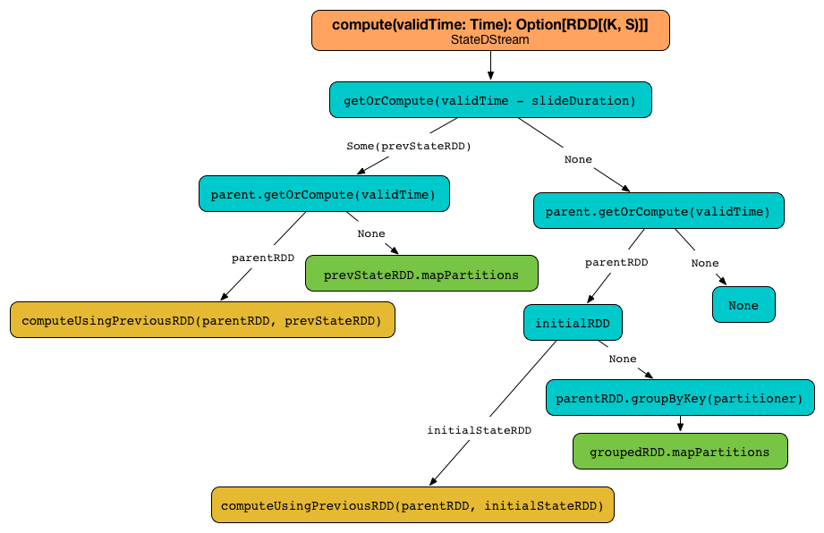

== StateDStream

`StateDStream` is the specialized link:spark-streaming-dstreams.adoc[DStream] that is the result of link:spark-streaming-operators-stateful.adoc#updateStateByKey[updateStateByKey] stateful operator. It is a wrapper around a `parent` key-value pair dstream to build stateful pipeline (by means of `updateStateByKey` operator) and as a stateful dstream enables link:spark-streaming-checkpointing.adoc[checkpointing] (and hence requires some additional setup).

It uses a `parent` key-value pair dstream, <<updateFunc, updateFunc>> update state function, a `partitioner`, a flag whether or not to `preservePartitioning` and an optional key-value pair `initialRDD`.

It works with link:../spark-rdd-StorageLevel.adoc[`MEMORY_ONLY_SER` storage level] enabled.

The only link:spark-streaming-dstreams.adoc#contract[dependency] of `StateDStream` is the input `parent` key-value pair dstream.

The link:spark-streaming-dstreams.adoc#contract[slide duration] is exactly the same as that in `parent`.

It forces link:spark-streaming-checkpointing.adoc[checkpointing] regardless of the current dstream configuration, i.e. the internal link:spark-streaming-dstreams.adoc#checkpointing[mustCheckpoint] is enabled.

When requested to link:spark-streaming-dstreams.adoc#contract[compute a RDD] it first attempts to get the *state RDD* for the previous batch (using link:spark-streaming-dstreams.adoc#getOrCompute[DStream.getOrCompute]). If there is one, `parent` stream is requested for a RDD for the current batch (using link:spark-streaming-dstreams.adoc#getOrCompute[DStream.getOrCompute]). If `parent` has computed one,  <<computeUsingPreviousRDD, computeUsingPreviousRDD(parentRDD, prevStateRDD)>> is called.

CAUTION: FIXME When could `getOrCompute` *not* return an RDD? How does this apply to the StateDStream? What about the parent's `getOrCompute`?

If however `parent` has not generated a RDD for the current batch but the state RDD existed, `updateFn` is called for every key of the state RDD to generate a new state per partition (using link:spark-rdd-transformations.adoc#mapPartitions[RDD.mapPartitions])

NOTE: No input data for already-running input stream triggers (re)computation of the state RDD (per partition).

.Computing stateful RDDs (StateDStream.compute)

If the state RDD has been found, which means that this is the first input data batch, `parent` stream is requested to link:spark-streaming-dstreams.adoc#getOrCompute[getOrCompute] the RDD for the current batch.

Otherwise, when no state RDD exists, `parent` stream is requested for a RDD for the current batch (using link:spark-streaming-dstreams.adoc#getOrCompute[DStream.getOrCompute]) and when no RDD was generated for the batch, no computation is triggered.

NOTE: When the stream processing starts, i.e. no state RDD exists, and there is no input data received, no computation is triggered.

Given no state RDD and with `parent` RDD computed, when `initialRDD` is `NONE`, the input data batch (as `parent` RDD) is grouped by key (using link:spark-rdd-PairRDDFunctions.adoc#groupByKey[groupByKey] with `partitioner`) and then the update state function `updateFunc` is applied to the partitioned input data (using link:spark-rdd-transformations.adoc#mapPartitions[RDD.mapPartitions]) with `None` state. Otherwise, <<computeUsingPreviousRDD, computeUsingPreviousRDD(parentRDD, initialStateRDD)>> is called.

=== [[updateFunc]] updateFunc - State Update Function

The signature of `updateFunc` is as follows:

[source, scala]
----
updateFunc: (Iterator[(K, Seq[V], Option[S])]) => Iterator[(K, S)]
----

It should be read as given a collection of triples of a key, new records for the key, and the current state for the key, generate a collection of keys and their state.

=== [[computeUsingPreviousRDD]] computeUsingPreviousRDD

[source, scala]
----
computeUsingPreviousRDD(parentRDD: RDD[(K, V)], prevStateRDD: RDD[(K, S)]): Option[RDD[(K, S)]]
----

The `computeUsingPreviousRDD` method uses `cogroup` and `mapPartitions` to build the final state RDD.

NOTE: Regardless of the return type `Option[RDD[(K, S)]]` that really allows no state, it will always return _some_ state.

It first performs `cogroup` of `parentRDD` and `prevStateRDD` using the constructor's `partitioner` so it has a pair of iterators of elements of each RDDs per _every_ key.

NOTE: It is acceptable to end up with keys that have no new records per batch, but these keys do have a state (since they were received previously when no state might have been built yet).

[NOTE]
====
The signature of `cogroup` is as follows and applies to key-value pair RDDs, i.e. `RDD[(K, V)]`.

[source, scala]
----
cogroup[W](other: RDD[(K, W)], partitioner: Partitioner): RDD[(K, (Iterable[V], Iterable[W]))]
----
====

It defines an internal update function `finalFunc` that maps over the collection of all the keys, new records per key, and at-most-one-element state per key to build new iterator that ensures that:

1. a state per key exists (it is `None` or the state built so far)
2. the _lazy_ iterable of new records is transformed into an _eager_ sequence.

CAUTION: FIXME Why is the transformation from an Iterable into a Seq so important? Why could not the constructor's <<updateFunc, updateFunc>> accept the former?

With every triple per every key, the internal update function calls the constructor's <<updateFunc, updateFunc>>.

The state RDD is a cogrouped RDD (on `parentRDD` and `prevStateRDD` using the constructor's `partitioner`) with every element per partition mapped over using the internal update function `finalFunc` and the constructor's `preservePartitioning` (through `mapPartitions`).

CAUTION: FIXME Why is `preservePartitioning` important? What happens when `mapPartitions` does not preserve partitioning (which by default it does *not*!)
