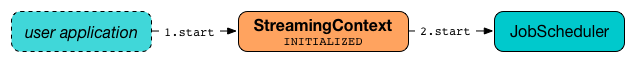
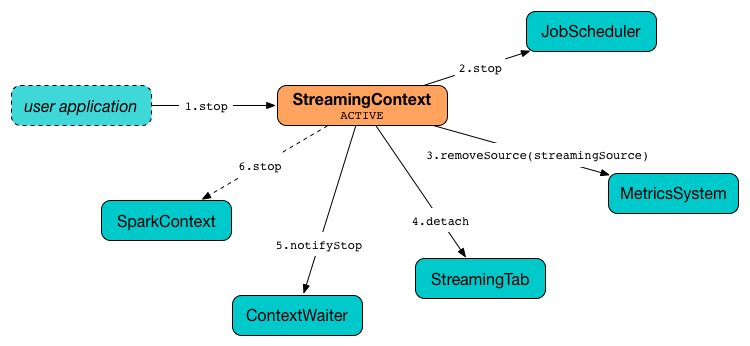

== `StreamingContext` -- The Entry Point to Spark Streaming

`StreamingContext` is the entry point for all Spark Streaming functionality. Whatever you do in Spark Streaming has to start from <<creating-instance, creating an instance of StreamingContext>>.

[source, scala]
----
import org.apache.spark.streaming._
val sc = SparkContext.getOrCreate
val ssc = new StreamingContext(sc, Seconds(5))
----

NOTE: `StreamingContext` belongs to `org.apache.spark.streaming` package.

With an instance of `StreamingContext` in your hands, you can <<creating-receivers, create ReceiverInputDStreams>> or <<checkpoint, set the checkpoint directory>>.

Once streaming pipelines are developed, you <<start, start StreamingContext>> to set the stream transformations in motion. You <<stop, stop>> the instance when you are done.

=== [[creating-instance]] Creating Instance

You can create a new instance of `StreamingContext` using the following constructors. You can group them by whether a StreamingContext constructor creates it from scratch or it is recreated from a checkpoint directory (follow the links for their extensive coverage).

* <<creating-instance-from-scratch, Creating StreamingContext from scratch>>:
** `StreamingContext(conf: SparkConf, batchDuration: Duration)`
** `StreamingContext(master: String, appName: String, batchDuration: Duration, sparkHome: String, jars: Seq[String], environment: Map[String,String])`
** `StreamingContext(sparkContext: SparkContext, batchDuration: Duration)`
* link:spark-streaming-checkpointing.adoc#recreating-streamingcontext[Recreating StreamingContext from a checkpoint file] (where `path` is the <<checkpoint-directory, checkpoint directory>>):
** `StreamingContext(path: String)`
** `StreamingContext(path: String, hadoopConf: Configuration)`
** `StreamingContext(path: String, sparkContext: SparkContext)`

NOTE: `StreamingContext(path: String)` uses link:../spark-SparkHadoopUtil.adoc#conf[SparkHadoopUtil.get.conf].

NOTE: When a StreamingContext is created and link:spark-streaming-settings.adoc#checkpointing[spark.streaming.checkpoint.directory] setting is set, the value gets passed on to <<checkpoint, checkpoint>> method.

==== [[creating-instance-from-scratch]] Creating StreamingContext from Scratch

When you create a new instance of `StreamingContext`, it first checks whether a link:spark-sparkcontext.adoc[SparkContext] or the <<checkpoint-directory, checkpoint directory>> are given (but not both!)

[TIP]
====
`StreamingContext` will warn you when you use `local` or `local[1]` link:spark-deployment-environments.adoc#master-urls[master URLs]:

[options="wrap"]
----
WARN StreamingContext: spark.master should be set as local[n], n > 1 in local mode if you have receivers to get data, otherwise Spark jobs will not get resources to process the received data.
----
====

.StreamingContext and Dependencies
image::../images/streaming-streamingcontext.png[align="center"]

A link:spark-streaming-dstreamgraph.adoc[DStreamGraph] is created.

A link:spark-streaming-jobscheduler.adoc[JobScheduler] is created.

A link:spark-streaming-streaminglisteners.adoc#StreamingJobProgressListener[StreamingJobProgressListener] is created.

link:spark-streaming-webui.adoc[Streaming tab] in web UI is created (when link:spark-webui.adoc#spark.ui.enabled[spark.ui.enabled] is enabled).

A link:spark-streaming-StreamingSource.adoc[StreamingSource] is instantiated.

At this point, `StreamingContext` enters <<states, INITIALIZED>> state.

=== [[creating-receivers]] Creating ReceiverInputDStreams

`StreamingContext` offers the following methods to create link:spark-streaming-receiverinputdstreams.adoc[ReceiverInputDStreams]:

* <<receiverStream, receiverStream(receiver: Receiver[T])>>
* `actorStream[T](props: Props, name: String, storageLevel: StorageLevel = StorageLevel.MEMORY_AND_DISK_SER_2, supervisorStrategy: SupervisorStrategy = ActorSupervisorStrategy.defaultStrategy): ReceiverInputDStream[T]`
* `socketTextStream(hostname: String, port: Int, storageLevel: StorageLevel = StorageLevel.MEMORY_AND_DISK_SER_2): ReceiverInputDStream[String]`
* `socketStream[T](hostname: String, port: Int, converter: (InputStream) => Iterator[T], storageLevel: StorageLevel): ReceiverInputDStream[T]`
* `rawSocketStream[T](hostname: String, port: Int, storageLevel: StorageLevel = StorageLevel.MEMORY_AND_DISK_SER_2): ReceiverInputDStream[T]`

`StreamingContext` offers the following methods to create link:spark-streaming-inputdstreams.adoc[InputDStreams]:

* `queueStream[T](queue: Queue[RDD[T]], oneAtATime: Boolean = true): InputDStream[T]`
* `queueStream[T](queue: Queue[RDD[T]], oneAtATime: Boolean, defaultRDD: RDD[T]): InputDStream[T]`

You can also use two additional methods in `StreamingContext` to build (or better called _compose_) a custom link:spark-streaming-dstreams.adoc[DStream]:

* `union[T](streams: Seq[DStream[T]]): DStream[T]`
* <<transform, transform(dstreams, transformFunc): DStream[T]>>

==== [[receiverStream]] `receiverStream` method

[source, scala]
----
receiverStream[T: ClassTag](receiver: Receiver[T]): ReceiverInputDStream[T]
----

You can register a custom input dstream using `receiverStream` method. It accepts a link:spark-streaming-receivers.adoc[Receiver].

NOTE: You can find an example of a custom `Receiver` in link:spark-streaming-receivers.adoc#custom-receiver[Custom Receiver].

=== [[transform]] `transform` method

[source, scala]
----
transform[T](dstreams: Seq[DStream[_]], transformFunc: (Seq[RDD[_]], Time) => RDD[T]): DStream[T]
----

==== [[transform-example]] `transform` Example

[source, scala]
----
import org.apache.spark.rdd.RDD
def union(rdds: Seq[RDD[_]], time: Time) = {
  rdds.head.context.union(rdds.map(_.asInstanceOf[RDD[Int]]))
}
ssc.transform(Seq(cis), union)
----

=== [[remember]] `remember` method

[source, scala]
----
remember(duration: Duration): Unit
----

`remember` method sets the link:spark-streaming-dstreamgraph.adoc#remember-interval[remember interval] (for the graph of output dstreams). It simply calls link:spark-streaming-dstreamgraph.adoc#remember[DStreamGraph.remember] method and exits.

CAUTION: FIXME figure

=== [[checkpoint-interval]][[checkpointDuration]] Checkpoint Interval

The *checkpoint interval* is an internal property of `StreamingContext` and corresponds to link:spark-streaming-dstreamgraph.adoc#batch-interval[batch interval] or link:spark-streaming-checkpointing.adoc#Checkpoint[checkpoint interval of the checkpoint] (when <<isCheckpointPresent, checkpoint was present>>).

NOTE: The checkpoint interval property is also called *graph checkpointing interval*.

<<validate, checkpoint interval is mandatory>> when <<checkpointDir, checkpoint directory>> is defined (i.e. not `null`).

=== [[checkpointDir]][[checkpoint-directory]] Checkpoint Directory

A *checkpoint directory* is a HDFS-compatible directory where link:spark-streaming-checkpointing.adoc[checkpoints] are written to.

NOTE: _"A HDFS-compatible directory"_ means that it is Hadoop's Path class to handle all file system-related operations.

Its initial value depends on whether the link:spark-streaming-checkpointing.adoc#recreating-streamingcontext[StreamingContext was (re)created from a checkpoint] or not, and is the checkpoint directory if so. Otherwise, it is not set (i.e. `null`).

You can set the checkpoint directory when a <<creating-instance, StreamingContext is created>> or later using <<checkpoint, checkpoint>> method.

Internally, a checkpoint directory is tracked as `checkpointDir`.

TIP: Refer to link:spark-streaming-checkpointing.adoc[Checkpointing] for more detailed coverage.

=== [[initial-checkpoint]][[initialCheckpoint]] Initial Checkpoint

*Initial checkpoint* is the link:spark-streaming-checkpointing.adoc#recreating-streamingcontext[checkpoint (file) this StreamingContext has been recreated from].

The initial checkpoint is specified when a <<creating-instance, StreamingContext is created>>.

[source, scala]
----
val ssc = new StreamingContext("_checkpoint")
----

=== [[isCheckpointPresent]] Marking StreamingContext As Recreated from Checkpoint -- `isCheckpointPresent` method

`isCheckpointPresent` internal method behaves like a flag that remembers whether the `StreamingContext` instance was created from a <<initialCheckpoint, checkpoint>> or not so the other internal parts of a streaming application can make decisions how to initialize themselves (or just be initialized).

`isCheckpointPresent` checks the existence of the <<initialCheckpoint, initial checkpoint>> that gave birth to the StreamingContext.

=== [[checkpoint]] Setting Checkpoint Directory -- `checkpoint` method

[source, scala]
----
checkpoint(directory: String): Unit
----

You use `checkpoint` method to set `directory` as the current <<checkpointDir, checkpoint directory>>.

NOTE: Spark creates the directory unless it exists already.

`checkpoint` uses link:spark-sparkcontext.adoc#hadoopConfiguration[SparkContext.hadoopConfiguration] to get the file system and create `directory` on. The full path of the directory is passed on to link:spark-sparkcontext.adoc#setCheckpointDir[SparkContext.setCheckpointDir] method.

NOTE: Calling `checkpoint` with `null` as `directory` clears the checkpoint directory that effectively disables checkpointing.

NOTE: When <<creating-instance, StreamingContext is created>> and link:spark-streaming-settings.adoc#checkpointing[spark.streaming.checkpoint.directory] setting is set, the value gets passed on to `checkpoint` method.

=== [[start]] Starting `StreamingContext` -- `start` method

[source, scala]
----
start(): Unit
----

`start()` starts stream processing. It acts differently per <<states, state of StreamingContext>> and only <<start-INITIALIZED, INITIALIZED>> state makes for a proper startup.

NOTE: Consult <<states, States>> section in this document to learn about the states of StreamingContext.

==== [[start-INITIALIZED]] Starting in INITIALIZED state

Right after StreamingContext has been instantiated, it enters `INITIALIZED` state in which `start` first checks whether another `StreamingContext` instance has already been started in the JVM. It throws `IllegalStateException` exception if it was and exits.

[options="wrap"]
----
java.lang.IllegalStateException: Only one StreamingContext may be started in this JVM. Currently running StreamingContext was started at [startSite]
----

If no other StreamingContext exists, it performs <<validate, setup validation>> and link:spark-streaming-jobscheduler.adoc#start[starts `JobScheduler`] (in a separate dedicated daemon thread called *streaming-start*).

.When started, StreamingContext starts JobScheduler


It enters <<states, ACTIVE>> state.

It then register the <<stopOnShutdown, shutdown hook stopOnShutdown>> and <<streamingSource, streaming metrics source>>. If link:spark-webui.adoc#spark.ui.enabled[web UI is enabled], it attaches the link:spark-streaming-webui.adoc[Streaming tab].

Given all the above has have finished properly, it is assumed that the StreamingContext started fine and so you should see the following INFO message in the logs:

```
INFO StreamingContext: StreamingContext started
```

==== [[start-ACTIVE]] Starting in ACTIVE state

When in `ACTIVE` state, i.e. <<start-INITIALIZED, after it has been started>>, executing `start` merely leads to the following WARN message in the logs:

```
WARN StreamingContext: StreamingContext has already been started
```

==== [[start-STOPPED]] Starting in STOPPED state

Attempting to start `StreamingContext` in <<states, STOPPED>> state, i.e. <<stop, after it has been stopped>>, leads to the `IllegalStateException` exception:

```
java.lang.IllegalStateException: StreamingContext has already been stopped
```

=== [[stop]][[stopping]] Stopping StreamingContext -- `stop` methods

You stop `StreamingContext` using one of the three variants of `stop` method:

* `stop(stopSparkContext: Boolean = true)`
* `stop(stopSparkContext: Boolean, stopGracefully: Boolean)`

NOTE: The first `stop` method uses link:spark-streaming-settings.adoc[spark.streaming.stopSparkContextByDefault] configuration setting that controls `stopSparkContext` input parameter.

`stop` methods stop the execution of the streams immediately (`stopGracefully` is `false`) or wait for the processing of all received data to be completed (`stopGracefully` is `true`).

`stop` reacts appropriately per the state of `StreamingContext`, but the end state is always <<states, STOPPED>> state with shutdown hook removed.

If a user requested to stop the underlying SparkContext (when `stopSparkContext` flag is enabled, i.e. `true`), link:spark-sparkcontext.adoc#stopping[it is now attempted to be stopped].

==== [[stop-ACTIVE]] Stopping in ACTIVE state

It is only in <<states, ACTIVE>> state when `stop` does more than printing out WARN messages to the logs.

.StreamingContext Stop Procedure


It does the following (in order):

1. link:spark-streaming-jobscheduler.adoc#stopping[JobScheduler is stopped].

2. link:spark-streaming-StreamingSource.adoc[StreamingSource] is removed from link:../spark-MetricsSystem.adoc[MetricsSystem] (using `MetricsSystem.removeSource`)

3. link:spark-streaming-webui.adoc[Streaming tab] is detached (using `StreamingTab.detach`).

4. `ContextWaiter` is `notifyStop()`

5. `shutdownHookRef` is cleared.

At that point, you should see the following INFO message in the logs:

```
INFO StreamingContext: StreamingContext stopped successfully
```

`StreamingContext` enters <<states, STOPPED>> state.

==== [[stop-INITIALIZED]] Stopping in INITIALIZED state

When in <<states, INITIALIZED>> state, you should see the following WARN message in the logs:

```
WARN StreamingContext: StreamingContext has not been started yet
```

`StreamingContext` enters <<states, STOPPED>> state.

==== [[stop-STOPPED]] Stopping in STOPPED state

When in <<states, STOPPED>> state, it prints the WARN message to the logs:

```
WARN StreamingContext: StreamingContext has already been stopped
```

`StreamingContext` enters <<states, STOPPED>> state.

=== [[stopOnShutdown]] `stopOnShutdown` Shutdown Hook

`stopOnShutdown` is a https://docs.oracle.com/javase/8/docs/api/java/lang/Runtime.html#addShutdownHook-java.lang.Thread-[JVM shutdown hook] to clean up after `StreamingContext` when the JVM shuts down, e.g. all non-daemon thread exited, `System.exit` was called or `^C` was typed.

NOTE: It is registered to ShutdownHookManager when <<start-INITIALIZED, StreamingContext starts>>.

NOTE: `ShutdownHookManager` uses `org.apache.hadoop.util.ShutdownHookManager` for its work.

When executed, it first reads link:spark-streaming-settings.adoc[spark.streaming.stopGracefullyOnShutdown] setting that controls <<stop, whether to stop StreamingContext gracefully or not>>. You should see the following INFO message in the logs:

```
INFO Invoking stop(stopGracefully=[stopGracefully]) from shutdown hook
```

With the setting it <<stop, stops StreamingContext>> without stopping the accompanying `SparkContext` (i.e. `stopSparkContext` parameter is disabled).

=== [[validate]] Setup Validation -- `validate` method

[source, scala]
----
validate(): Unit
----

`validate()` method validates configuration of `StreamingContext`.

NOTE: The method is executed when `StreamingContext` is <<start, started>>.

It first asserts that `DStreamGraph` has been assigned (i.e. `graph` field is not `null`) and triggers link:spark-streaming-dstreamgraph.adoc#dstreamgraph-validation[validation of DStreamGraph].

CAUTION: It appears that `graph` could never be `null`, though.

If <<isCheckpointingEnabled, checkpointing is enabled>>, it ensures that <<checkpointDuration, checkpoint interval>> is set and checks whether the current streaming runtime environment can be safely serialized by link:spark-streaming-checkpointing.adoc#Checkpoint-serialize[serializing a checkpoint for fictitious batch time 0] (not link:spark-streaming-dstreamgraph.adoc#zero-time[zero time]).

If link:spark-dynamic-allocation.adoc#isDynamicAllocationEnabled[dynamic allocation is enabled], it prints the following WARN message to the logs:

[options="wrap"]
----
WARN StreamingContext: Dynamic Allocation is enabled for this application. Enabling Dynamic allocation for Spark Streaming applications can cause data loss if Write Ahead Log is not enabled for non-replayable sources like Flume. See the programming guide for details on how to enable the Write Ahead Log
----

=== [[addStreamingListener]] Registering Streaming Listeners -- `addStreamingListener` method

CAUTION: FIXME

=== [[streamingSource]] Streaming Metrics Source -- `streamingSource` Property

CAUTION: FIXME

=== [[states]] States

`StreamingContext` can be in three states:

* `INITIALIZED`, i.e. after <<creating-instance, it was instantiated>>.
* `ACTIVE`, i.e. after <<start-INITIALIZED, it was started>>.
* `STOPPED`, i.e. after <<stop, it has been stopped>>
