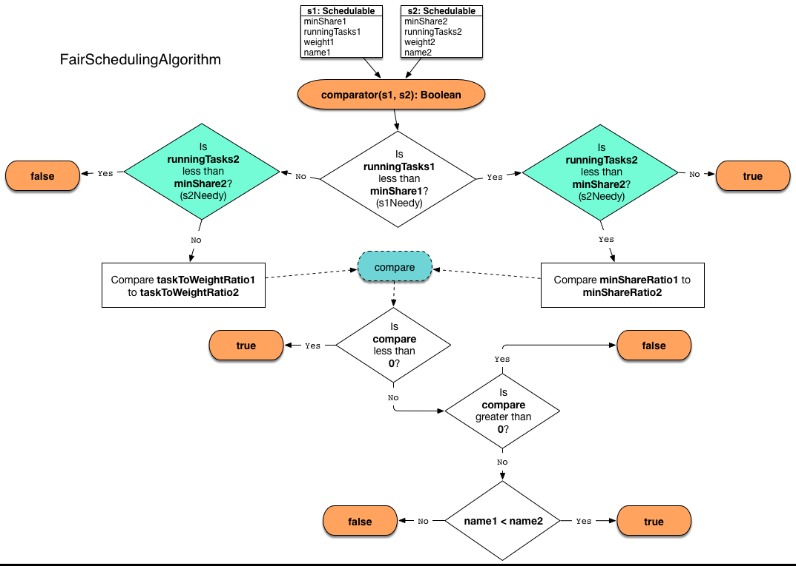

== Schedulable Pool

`Pool` is a link:spark-taskscheduler-schedulable.adoc[Schedulable] entity that represents a tree of link:spark-TaskSetManager.adoc[TaskSetManagers], i.e. it contains a collection of `TaskSetManagers` or the `Pools` thereof.

A `Pool` has a mandatory name, a link:spark-taskscheduler-schedulingmode.adoc[scheduling mode], initial `minShare` and `weight` that are defined when it is created.

NOTE: An instance of `Pool` is created when link:spark-TaskSchedulerImpl.adoc#initialize[TaskSchedulerImpl is initialized].

NOTE: The link:spark-TaskScheduler.adoc#contract[TaskScheduler Contract] and link:spark-taskscheduler-schedulable.adoc#contract[Schedulable Contract] both require that their entities have `rootPool` of type `Pool`.

=== [[increaseRunningTasks]] `increaseRunningTasks` Method

CAUTION: FIXME

=== [[decreaseRunningTasks]] `decreaseRunningTasks` Method

CAUTION: FIXME

=== [[taskSetSchedulingAlgorithm]] `taskSetSchedulingAlgorithm` Attribute

Using the link:spark-taskscheduler-schedulingmode.adoc[scheduling mode] (given when a `Pool` object is created), `Pool` selects <<SchedulingAlgorithm, SchedulingAlgorithm>> and sets `taskSetSchedulingAlgorithm`:

* <<FIFOSchedulingAlgorithm, FIFOSchedulingAlgorithm>> for FIFO scheduling mode.
* <<FairSchedulingAlgorithm, FairSchedulingAlgorithm>> for FAIR scheduling mode.

It throws an `IllegalArgumentException` when unsupported scheduling mode is passed on:

```
Unsupported spark.scheduler.mode: [schedulingMode]
```

TIP: Read about the scheduling modes in link:spark-taskscheduler-schedulingmode.adoc[SchedulingMode].

NOTE: `taskSetSchedulingAlgorithm` is used in <<getSortedTaskSetQueue, getSortedTaskSetQueue>>.

=== [[getSortedTaskSetQueue]] Getting TaskSetManagers Sorted -- `getSortedTaskSetQueue` Method

NOTE: `getSortedTaskSetQueue` is part of the link:spark-taskscheduler-schedulable.adoc#contract[Schedulable Contract].

`getSortedTaskSetQueue` sorts all the link:spark-taskscheduler-schedulable.adoc[Schedulables] in link:spark-taskscheduler-schedulable.adoc#contract[schedulableQueue] queue by a <<SchedulingAlgorithm, SchedulingAlgorithm>> (from the internal <<taskSetSchedulingAlgorithm, taskSetSchedulingAlgorithm>>).

NOTE: It is called when link:spark-TaskSchedulerImpl.adoc#resourceOffers[`TaskSchedulerImpl` processes executor resource offers].

=== [[schedulableNameToSchedulable]] Schedulables by Name -- `schedulableNameToSchedulable` Registry

[source, scala]
----
schedulableNameToSchedulable = new ConcurrentHashMap[String, Schedulable]
----

`schedulableNameToSchedulable` is a lookup table of link:spark-taskscheduler-schedulable.adoc[Schedulable] objects by their names.

Beside the obvious usage in the housekeeping methods like `addSchedulable`, `removeSchedulable`, `getSchedulableByName` from the link:spark-taskscheduler-schedulable.adoc#contract[Schedulable Contract], it is exclusively used in link:spark-SparkContext.adoc#getPoolForName[SparkContext.getPoolForName].

=== [[addSchedulable]] `addSchedulable` Method

NOTE: `addSchedulable` is part of the link:spark-taskscheduler-schedulable.adoc#contract[Schedulable Contract].

`addSchedulable` adds a `Schedulable` to the link:spark-taskscheduler-schedulable.adoc#contract[schedulableQueue] and <<schedulableNameToSchedulable, schedulableNameToSchedulable>>.

More importantly, it sets the `Schedulable` entity's link:spark-taskscheduler-schedulable.adoc#contract[parent] to itself.

=== [[removeSchedulable]] `removeSchedulable` Method

NOTE: `removeSchedulable` is part of the link:spark-taskscheduler-schedulable.adoc#contract[Schedulable Contract].

`removeSchedulable` removes a `Schedulable` from the link:spark-taskscheduler-schedulable.adoc#contract[schedulableQueue] and <<schedulableNameToSchedulable, schedulableNameToSchedulable>>.

NOTE: `removeSchedulable` is the opposite to <<addSchedulable, `addSchedulable` method>>.

=== [[SchedulingAlgorithm]] SchedulingAlgorithm

`SchedulingAlgorithm` is the interface for a sorting algorithm to sort link:spark-taskscheduler-schedulable.adoc[Schedulables].

There are currently two `SchedulingAlgorithms`:

* <<FIFOSchedulingAlgorithm, FIFOSchedulingAlgorithm>> for FIFO scheduling mode.
* <<FairSchedulingAlgorithm, FairSchedulingAlgorithm>> for FAIR scheduling mode.

==== [[FIFOSchedulingAlgorithm]] FIFOSchedulingAlgorithm

`FIFOSchedulingAlgorithm` is a scheduling algorithm that compares `Schedulables` by their `priority` first and, when equal, by their `stageId`.

NOTE: `priority` and `stageId` are part of link:spark-taskscheduler-schedulable.adoc#contract[Schedulable Contract].

CAUTION: FIXME _A picture is worth a thousand words._ How to picture the algorithm?

==== [[FairSchedulingAlgorithm]] FairSchedulingAlgorithm

`FairSchedulingAlgorithm` is a scheduling algorithm that compares `Schedulables` by their `minShare`, `runningTasks`, and `weight`.

NOTE: `minShare`, `runningTasks`, and `weight` are part of link:spark-taskscheduler-schedulable.adoc#contract[Schedulable Contract].

.FairSchedulingAlgorithm


For each input `Schedulable`, `minShareRatio` is computed as `runningTasks` by `minShare` (but at least `1`) while `taskToWeightRatio` is `runningTasks` by `weight`.
