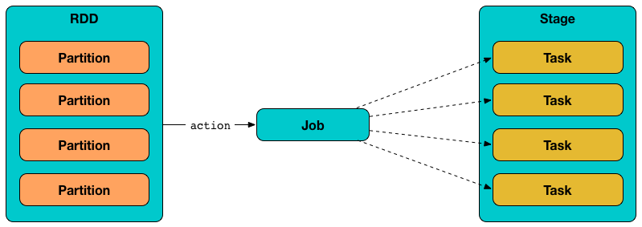

== [[Task]] Task

`Task` (aka _command_) is the smallest individual unit of execution that is launched to compute a link:spark-rdd-Partition.adoc[RDD partition].

.Tasks correspond to partitions in RDD

A task is described by the <<contract, Task contract>> with a single <<runTask, runTask>> to run it and optional <<preferredLocations, placement preferences>> to place the computation on right executors.

There are two concrete implementations of `Task` contract:

* link:spark-taskscheduler-ShuffleMapTask.adoc[ShuffleMapTask] that executes a task and divides the task's output to multiple buckets (based on the task's partitioner).
* link:spark-taskscheduler-ResultTask.adoc[ResultTask] that executes a task and sends the task's output back to the driver application.

The very last stage in a Spark job consists of multiple link:spark-taskscheduler-ResultTask.adoc[ResultTasks], while earlier stages can only be link:spark-taskscheduler-ShuffleMapTask.adoc[ShuffleMapTasks].

CAUTION: FIXME You could have a Spark job with link:spark-taskscheduler-ShuffleMapTask.adoc[ShuffleMapTask] being the last.

Tasks are link:spark-Executor.adoc#launchTask[launched on executors] and <<run, ran when `TaskRunner` starts>>.

In other (more technical) words, a task is a computation on the records in a RDD partition in a stage of a RDD in a Spark job.

NOTE: `T` is the type defined when a <<creating-instance, `Task` is created>>.

[[internal-registries]]
.`Task` Internal Registries and Counters
[cols="1,2",options="header",width="100%"]
|===
| Name
| Description

| [[context]] `context`
| Used when ???

| [[epoch]] `epoch`
| Set for a `Task` when link:spark-TaskSetManager.adoc#creating-instance[`TaskSetManager` is created] and later used when link:spark-executor-TaskRunner.adoc#run[`TaskRunner` runs] and when `DAGScheduler` link:spark-dagscheduler-DAGSchedulerEventProcessLoop.adoc#handleTaskCompletion-Success-ShuffleMapTask[handles a `ShuffleMapTask` successful completion].

| [[_executorDeserializeTime]] `_executorDeserializeTime`
| Used when ???

| [[_executorDeserializeCpuTime]] `_executorDeserializeCpuTime`
| Used when ???

| [[_killed]] `_killed`
| Used when ???

| [[metrics]] `metrics`
| link:spark-taskscheduler-taskmetrics.adoc[TaskMetrics]

Created lazily when <<creating-instance, `Task` is created>> from <<serializedTaskMetrics, serializedTaskMetrics>>.

Used when ???

| [[taskMemoryManager]] `taskMemoryManager`
| link:spark-taskscheduler-taskmemorymanager.adoc[TaskMemoryManager] that manages the memory allocated by the task.

Used when ???

| [[taskThread]] `taskThread`
| Used when ???

|===

A task can only belong to one stage and operate on a single partition. All tasks in a stage must be completed before the stages that follow can start.

Tasks are spawned one by one for each stage and partition.

CAUTION: FIXME What are `stageAttemptId` and `taskAttemptId`?

=== [[contract]] Task Contract

[source, scala]
----
def runTask(context: TaskContext): T
def preferredLocations: Seq[TaskLocation] = Nil
----

NOTE: `Task` is a `private[spark]` contract.

.Task Contract
[cols="1,2",options="header",width="100%"]
|===
| Method
| Description

| [[runTask]] `runTask`
| Used when a <<run, task runs>>.

| [[preferredLocations]] `preferredLocations`
| Collection of link:spark-TaskLocation.adoc[TaskLocations].

Used exclusively when `TaskSetManager` link:spark-TaskSetManager.adoc#addPendingTask[registers a task as pending execution] and link:spark-TaskSetManager.adoc#dequeueSpeculativeTask[dequeueSpeculativeTask].

Empty by default and so no task location preferences are defined that says the task could be launched on any executor.

Defined by the custom tasks, i.e. link:spark-taskscheduler-ShuffleMapTask.adoc#preferredLocations[ShuffleMapTask] and link:spark-taskscheduler-ResultTask.adoc#preferredLocations[ResultTask].
|===

=== [[creating-instance]] Creating Task Instance

`Task` takes the following when created:

* [[stageId]] link:spark-DAGScheduler-Stage.adoc[Stage] ID
* [[stageAttemptId]] Stage attempt ID (different per stage execution re-attempt)
* [[partitionId]] link:spark-rdd-Partition.adoc[Partition] ID
* [[localProperties]] Local `Properties` (defaults to empty properties)
* [[serializedTaskMetrics]] Serialized link:spark-taskscheduler-taskmetrics.adoc[TaskMetrics] (that link:spark-DAGScheduler-Stage.adoc#latestInfo[were part of the owning Stage])
* (optional) [[jobId]] link:spark-dagscheduler-jobs.adoc[Job] ID
* (optional) [[appId]] Application ID
* (optional) [[appAttemptId]] Application attempt ID

`Task` initializes the <<internal-registries, internal registries and counters>>.

=== [[run]] Running Task Thread -- `run` Method

[source, scala]
----
run(
  taskAttemptId: Long,
  attemptNumber: Int,
  metricsSystem: MetricsSystem): T
----

`run` link:spark-blockmanager.adoc#registerTask[registers the task (identified as `taskAttemptId`) with the local `BlockManager`].

NOTE: `run` uses link:spark-sparkenv.adoc#blockManager[`SparkEnv` to access the current `BlockManager`].

`run` link:spark-taskscheduler-TaskContextImpl.adoc#creating-instance[creates a `TaskContextImpl`] that in turn becomes the task's link:spark-taskscheduler-taskcontext.adoc#setTaskContext[TaskContext].

NOTE: `run` is a `final` method and so must not be overriden.

`run` checks <<_killed, _killed>> flag and, if enabled, <<kill, kills the task>> (with `interruptThread` flag disabled).

`run` creates a Hadoop `CallerContext` and sets it.

`run` <<runTask, runs the task>>.

NOTE: This is the moment when the custom ``Task``'s <<runTask, runTask>> is executed.

In the end, `run` link:spark-taskscheduler-TaskContextImpl.adoc#markTaskCompleted[notifies `TaskContextImpl` that the task has completed] (regardless of the final outcome -- a success or a failure).

In case of any exceptions, `run` link:spark-taskscheduler-TaskContextImpl.adoc#markTaskFailed[notifies `TaskContextImpl` that the task has failed]. `run` link:spark-MemoryStore.adoc#releaseUnrollMemoryForThisTask[requests `MemoryStore` to release unroll memory for this task] (for both `ON_HEAP` and `OFF_HEAP` memory modes).

NOTE: `run` uses link:spark-sparkenv.adoc#blockManager[`SparkEnv` to access the current `BlockManager`] that it uses to access link:spark-blockmanager.adoc#memoryStore[MemoryStore].

`run` link:spark-MemoryManager.adoc[requests `MemoryManager` to notify any tasks waiting for execution memory to be freed to wake up and try to acquire memory again].

`run` link:spark-taskscheduler-taskcontext.adoc#unset[unsets the task's `TaskContext`].

NOTE: `run` uses link:spark-sparkenv.adoc#memoryManager[`SparkEnv` to access the current `MemoryManager`].

NOTE: `run` is used exclusively when link:spark-executor-TaskRunner.adoc#run[`TaskRunner` starts]. The `Task` instance has just been deserialized from `taskBytes` that were sent over the wire to an executor. `localProperties` and link:spark-taskscheduler-taskmemorymanager.adoc[TaskMemoryManager] are already assigned.

=== [[states]][[TaskState]] Task States

A task can be in one of the following states (as described by `TaskState` enumeration):

* `LAUNCHING`
* `RUNNING` when the task is being started.
* `FINISHED` when the task finished with the serialized result.
* `FAILED` when the task fails, e.g. when link:spark-TaskRunner-FetchFailedException.adoc[FetchFailedException], `CommitDeniedException` or any `Throwable` occurs
* `KILLED` when an executor kills a task.
* `LOST`

States are the values of `org.apache.spark.TaskState`.

NOTE: Task status updates are sent from executors to the driver through link:spark-ExecutorBackend.adoc[ExecutorBackend].

Task is finished when it is in one of `FINISHED`, `FAILED`, `KILLED`, `LOST`.

`LOST` and `FAILED` states are considered failures.

TIP: Task states correspond to https://github.com/apache/mesos/blob/master/include/mesos/mesos.proto[org.apache.mesos.Protos.TaskState].

=== [[collectAccumulatorUpdates]] Collect Latest Values of (Internal and External) Accumulators -- `collectAccumulatorUpdates` Method

[source, scala]
----
collectAccumulatorUpdates(taskFailed: Boolean = false): Seq[AccumulableInfo]
----

`collectAccumulatorUpdates` collects the latest values of internal and external accumulators from a task (and returns the values as a collection of link:spark-accumulators.adoc#AccumulableInfo[AccumulableInfo]).

Internally, `collectAccumulatorUpdates` link:spark-taskscheduler-TaskContextImpl.adoc#taskMetrics[takes `TaskMetrics`].

NOTE: `collectAccumulatorUpdates` uses <<context, TaskContextImpl>> to access the task's `TaskMetrics`.

`collectAccumulatorUpdates` collects the latest values of:

* link:spark-taskscheduler-taskmetrics.adoc#internalAccums[internal accumulators] whose current value is not the zero value and the `RESULT_SIZE` accumulator (regardless whether the value is its zero or not).

* link:spark-taskscheduler-taskmetrics.adoc#externalAccums[external accumulators] when `taskFailed` is disabled (`false`) or which link:spark-accumulators.adoc#countFailedValues[should be included on failures].

`collectAccumulatorUpdates` returns an empty collection when <<context, TaskContextImpl>> is not initialized.

NOTE: `collectAccumulatorUpdates` is used when link:spark-executor-TaskRunner.adoc#run[`TaskRunner` runs a task] (and sends a task's final results back to the driver).

=== [[kill]] Killing Task -- `kill` Method

[source, scala]
----
kill(interruptThread: Boolean)
----

`kill` marks the task to be killed, i.e. it sets the internal `_killed` flag to `true`.

`kill` calls link:spark-taskscheduler-TaskContextImpl.adoc#markInterrupted[TaskContextImpl.markInterrupted] when `context` is set.

If `interruptThread` is enabled and the internal `taskThread` is available, `kill` interrupts it.

CAUTION: FIXME When could `context` and `interruptThread` not be set?
