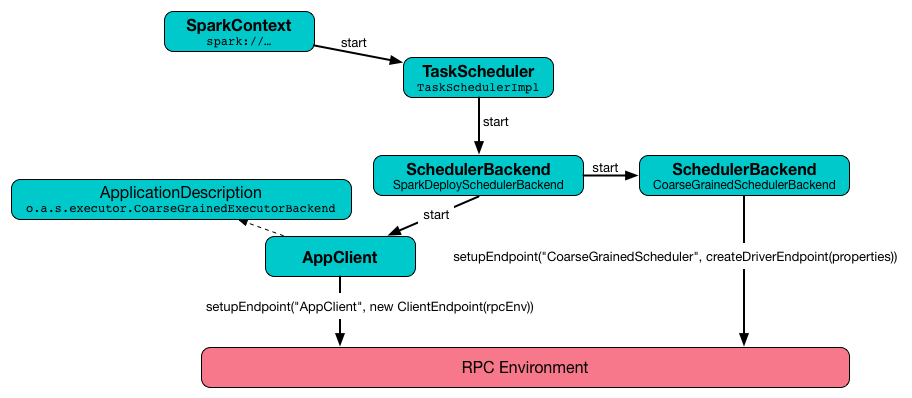
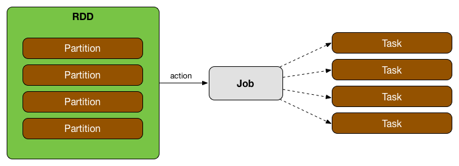
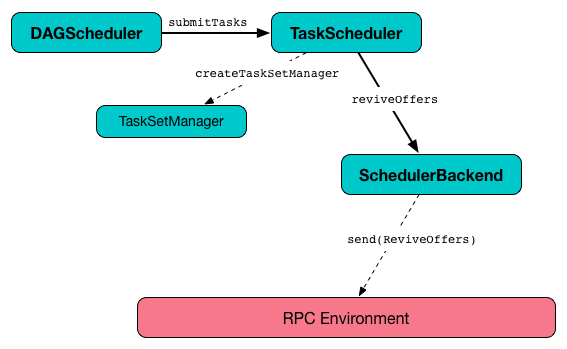

== Task Scheduler

A *Task Scheduler* schedules <<tasks, tasks>> for a link:spark-anatomy-spark-application.adoc[single Spark application] according to <<scheduling-mode, scheduling mode>> (aka *order task policy*).

.TaskScheduler works for a single SparkContext
image::images/sparkstandalone-sparkcontext-taskscheduler-schedulerbackend.png[align="center"]

A Task Scheduler tracks:

* task sets by stage and attempt ids (`taskSetsByStageIdAndAttempt`)
* tasks to taskset managers (`taskIdToTaskSetManager`)
* tasks to executors (`taskIdToExecutorId`)
* the number of tasks running on each executor (`executorIdToTaskCount`)
* the set of executors on each host (`executorsByHost`)
* the set of hosts per rack (`hostsByRack`)
* executor ids to corresponding host (`executorIdToHost`).

CAUTION: FIXME How are these mappings used?

CAUTION: FIXME Why `hasReceivedTask` and `hasLaunchedTask`?

It counts how many tasks have already been scheduled for execution (`nextTaskId`).

A TaskScheduler gets sets of tasks (as <<taskset, TaskSets>>) submitted to it from the link:spark-dagscheduler.adoc[DAGScheduler] for each stage, and is responsible for sending the tasks to the cluster, running them, retrying if there are failures, and mitigating stragglers.

A TaskScheduler emits events to the DAGScheduler.

The base implementation of Task Scheduler in Spark is https://github.com/apache/spark/blob/master/core/src/main/scala/org/apache/spark/scheduler/TaskSchedulerImpl.scala[org.apache.spark.scheduler.TaskSchedulerImpl]. There are two specialized implementations for link:spark-yarn.adoc[Spark on YARN cluster mode] - https://github.com/apache/spark/blob/master/yarn/src/main/scala/org/apache/spark/scheduler/cluster/YarnScheduler.scala[YarnScheduler] and https://github.com/apache/spark/blob/master/yarn/src/main/scala/org/apache/spark/scheduler/cluster/YarnClusterScheduler.scala[YarnClusterScheduler].

The default implementation `TaskSchedulerImpl` can schedule tasks for multiple types of clusters by acting through a link:spark-schedulerbackends.adoc[Scheduler Backend]. It handles common logic, like determining a scheduling order across jobs, waking up to launch speculative tasks, etc.

.TaskScheduler uses SchedulerBackend for different clusters
image::diagrams/taskscheduler-uses-schedulerbackend.png[align="center"]

When a Task Scheduler is started, it starts a Scheduler Backend.

.TaskScheduler.start


DAGScheduler uses <<submitTasks, submitTasks() operation >> to submit a TaskSet to Task Scheduler and can cancel tasks in a stage.

=== [[tasks]] Tasks

A *task* is an individual unit of work (aka a command) that is sent from the driver to an executor to execute.

It is an individual unit of physical execution (computation) that run on a single machine for parts of your Spark application on a data. All tasks in a stage should be completed before moving on to another stage.

.Tasks correspond to partitions in RDD


A task can also be considered a computation in a stage on a partition in a given job attempt.

A Task belongs to a single stage and operates on a single partition (a part of an RDD).

Tasks are spawned one by one for each stage and data partition.

CAUTION: FIXME What are `stageAttemptId` and `taskAttemptId`?

There are two kinds of tasks:

* *ShuffleMapTask* that executes a task and divides the task's output to multiple buckets (based on the task's partitioner). See <<shufflemaptask, ShuffleMapTask>>.
* *ResultTask* that executes a task and sends the task's output back to the driver application.

The very last stage in a job consists of multiple `ResultTasks`, while earlier stages consist of <<shufflemaptask, ShuffleMapTask>>'s.

TaskRunner calls `Task.run` to execute a task.

TaskRunner is a thread that requires a `ExecutorBackend`, task and attempt ids, task name, and serialized version of the task (as `ByteBuffer`).

CAUTION: FIXME What's the cardinality between TaskRunner and Task?

CAUTION: FIXME TaskMemoryManager and task serialization and deserialization

When a `TaskRunner` starts running, it prints out the following INFO to the logs:

```
INFO Running [taskName] (TID [taskId])
```

Informs the `ExecutorBackend` that the task is running and deserializes the task (using globally-configured `Serializer`) and sets the `TaskMemoryManager` for the task.

```
Task [taskId]'s epoch is [task.epoch]
```

TaskRunner sends update of the epoch of the task to `MapOutputTracker`.

CAUTION: FIXME Why is `MapOutputTracker.updateEpoch` needed?

Task runs (with `taskId`, `attemptNumber`, and the globally-configured `MetricsSystem`). When a task finishes, it returns a value and `accumUpdates`.

CAUTION: FIXME What are `accumUpdates`?

The result value is serialized (using the other instance of `Serializer`, i.e. `serializer` - there are two `Serializer` instances in `SparkContext.env`).

A `DirectTaskResult` that contains the serialized result and `accumUpdates` is serialized.

If `maxResultSize` is set and the size of the serialized result exceeds its value, ...FIXME.

```
scala> sc.getConf.get("spark.driver.maxResultSize")
res5: String = 1m

scala> sc.parallelize(0 to 1024*1024+10, 1).collect
...
INFO DAGScheduler: Job 3 failed: collect at <console>:25, took 0.075073 s
org.apache.spark.SparkException: Job aborted due to stage failure: Total size of serialized results of 1 tasks (4.0 MB) is bigger than spark.driver.maxResultSize (1024.0 KB)
  at org.apache.spark.scheduler.DAGScheduler.org$apache$spark$scheduler$DAGScheduler$$failJobAndIndependentStages(DAGScheduler.scala:1430)
  at org.apache.spark.scheduler.DAGScheduler$$anonfun$abortStage$1.apply(DAGScheduler.scala:1418)
  at org.apache.spark.scheduler.DAGScheduler$$anonfun$abortStage$1.apply(DAGScheduler.scala:1417)
  at scala.collection.mutable.ResizableArray$class.foreach(ResizableArray.scala:59)
  at scala.collection.mutable.ArrayBuffer.foreach(ArrayBuffer.scala:48)
  at org.apache.spark.scheduler.DAGScheduler.abortStage(DAGScheduler.scala:1417)
  at org.apache.spark.scheduler.DAGScheduler$$anonfun$handleTaskSetFailed$1.apply(DAGScheduler.scala:799)
  at org.apache.spark.scheduler.DAGScheduler$$anonfun$handleTaskSetFailed$1.apply(DAGScheduler.scala:799)
  at scala.Option.foreach(Option.scala:257)
  at org.apache.spark.scheduler.DAGScheduler.handleTaskSetFailed(DAGScheduler.scala:799)
  at org.apache.spark.scheduler.DAGSchedulerEventProcessLoop.doOnReceive(DAGScheduler.scala:1639)
  at org.apache.spark.scheduler.DAGSchedulerEventProcessLoop.onReceive(DAGScheduler.scala:1598)
  at org.apache.spark.scheduler.DAGSchedulerEventProcessLoop.onReceive(DAGScheduler.scala:1587)
  at org.apache.spark.util.EventLoop$$anon$1.run(EventLoop.scala:48)
  at org.apache.spark.scheduler.DAGScheduler.runJob(DAGScheduler.scala:620)
  at org.apache.spark.SparkContext.runJob(SparkContext.scala:1832)
  at org.apache.spark.SparkContext.runJob(SparkContext.scala:1845)
  at org.apache.spark.SparkContext.runJob(SparkContext.scala:1858)
  at org.apache.spark.SparkContext.runJob(SparkContext.scala:1929)
  at org.apache.spark.rdd.RDD$$anonfun$collect$1.apply(RDD.scala:921)
  at org.apache.spark.rdd.RDDOperationScope$.withScope(RDDOperationScope.scala:150)
  at org.apache.spark.rdd.RDDOperationScope$.withScope(RDDOperationScope.scala:111)
  at org.apache.spark.rdd.RDD.withScope(RDD.scala:310)
  at org.apache.spark.rdd.RDD.collect(RDD.scala:920)
  ... 48 elided
```

If however the size exceeds `akkaFrameSize`, ...FIXME.

As the final check, if the size is acceptable, the following INFO message appears in the logs:

```
INFO Finished [taskName] (TID [taskId]). [resultSize] bytes result sent to driver
```

For example:

```
INFO Executor: Finished task 0.0 in stage 4.0 (TID 4). 953 bytes result sent to driver
```

The result is sent to the driver using `execBackend.statusUpdate(taskId, TaskState.FINISHED, serializedResult)`. FIXME

[CAUTION]
====
FIXME

* What's `execBackend`?
* Review `task.run()`
====

Task can be in one of the states:

* LAUNCHING
* RUNNING
* FINISHED
* FAILED
* KILLED
* LOST

==== [[shufflemaptask]] ShuffleMapTask

A *ShuffleMapTask* divides the elements of an RDD into multiple buckets (based on a partitioner specified in link:spark-rdd-dependencies.adoc#shuffle-dependency[ShuffleDependency]).

==== TaskContextImpl

* stage
* partition
* task attempt
* attempt number
* runningLocally = false

==== TaskMemoryManager

==== TaskMetrics

=== [[taskset]] TaskSet

A *TaskSet* is a set of tasks submitted together to TaskScheduler that belong to a single stage and an attempt. A TaskSet represents the missing partitions of a stage.

The pair of a stage and an attempt uniquely describes a TaskSet and that is what you can see in the logs:

```
TaskSet [stageId].[stageAttemptId]
```

TaskSet has *priority* and *properties*. Priority is used in FIFO scheduling mode. Properties are the properties of the first job in a stage.

CAUTION: FIXME Where are `properties` of a TaskSet used?

A TaskSet contains a fully-independent sequence of tasks that can run right away based on the data that is already on the cluster, e.g. map output files from previous stages, though it may fail if this data becomes unavailable.

TaskSet can be <<submitTasks, submitted>>, i.e. started.

=== [[TaskResultGetter]] TaskResultGetter

FIXME

=== [[scheduling-mode]] Scheduling Modes

Task Scheduler uses a scheduling mode that determines policy to order tasks across a Schedulable's sub-queues.

It is configured by <<settings, spark.scheduler.mode>> setting that can accept the following values:

* *FIFO* - no pools; one root pool with link:spark-tasksetmanager.adoc[TaskSetManager]; lower priority gets Schedulable sooner or earlier stage wins.
* *FAIR* - more advanced FIXME
* *NONE* means no sub-queues

=== TaskSet's priority field and FIFO scheduling

A TaskSet has `priority` field that turns into the *priority* field's value of link:spark-tasksetmanager.adoc[TaskSetManager] (which is a Schedulable).

The `priority` field is used in `FIFOSchedulingAlgorithm` in which equal priorities give stages an advantage (not to say _priority_).

`FIFOSchedulingAlgorithm` is only used for `FIFO` scheduling mode in a `Pool` which is a Schedulable collection of `Schedulable`'s.

Effectively, the `priority` field is the job's id of the first job this stage was part of (for FIFO scheduling).

=== [[speculative-execution]] Speculative execution of tasks

*Speculative tasks* (also *speculatable tasks* or *task strugglers*) are tasks that run slower than most of the all tasks in a job.

*Speculative execution of tasks* is a health-check procedure that checks for tasks to be *speculated*, i.e. running slower in a stage than the median of all successfully completed tasks in a taskset. Such slow tasks will be re-launched in another worker. It will not stop the slow tasks, but run a new copy in parallel.

It is executed periodically by the TaskScheduler for link:spark-cluster.adoc[clustered deployment modes], when link:spark-tasksetmanager.adoc#tasksetmanager-settings[spark.speculation] is enabled (`true`).

With `spark.speculation` enabled, the following INFO message appears in the logs:

```
INFO Starting speculative execution thread
```

It is scheduled using *task-scheduler-speculation* daemon thread pool using `j.u.c.ScheduledThreadPoolExecutor` with core pool size `1`.

It is executed for link:spark-tasksetmanager.adoc#zombie-state[non-zombie TaskSetManagers] with more than one task to execute.

The process computes link:spark-tasksetmanager.adoc#tasksetmanager-settings[spark.speculation.quantile] of all the tasks and checks whether the number is greater than the number of tasks completed successfully.

You can find the DEBUG message in the logs:

```
DEBUG Checking for speculative tasks: minFinished =
```

It then computes the median duration of all the completed task length threshold for speculation to have it multiplied by link:spark-tasksetmanager.adoc#tasksetmanager-settings[spark.speculation.multiplier]. It has to be at least `100`.

In the logs at DEBUG level:

```
DEBUG Task length threshold for speculation:
```

For each active task for which there is only one copy running and the task takes more time than the threshold, it gets marked as *speculatable*.

In the logs at INFO level:

```
INFO Marking task %d in stage %s (on %s) as speculatable because it ran more than %.0f ms
```

The job with speculatable tasks should finish while speculative tasks are running, and it will leave these tasks running - no KILL command yet.

The check procedure is in link:spark-tasksetmanager.adoc[TaskSetManager.checkSpeculatableTasks] method.

1. How does Spark handle repeated results of speculative tasks since there are copies launched?

=== [[submitTasks]] submitTasks

Tasks (as a <<taskset, TaskSet>>) are submitted for execution using `submitTasks(taskSet: TaskSet)` method.

.TaskScheduler.submitTasks


You should see the following INFO message in the logs:

```
INFO TaskSchedulerImpl: Adding task set 0.0 with 8 tasks
```

It creates a new link:spark-tasksetmanager.adoc[TaskSetManager] for the given TaskSet and the acceptable number of task failures.

CAUTION: FIXME There are other steps not included here.

It then calls `backend.reviveOffers()`.

TIP: Use `dag-scheduler-event-loop` thread to step through the code in a debugger.

=== [[resourceOffers]] resourceOffers

`resourceOffers` method is called by a cluster manager to offer resources on slaves.

See link:spark-local.adoc#LocalBackend[LocalBackend] for Spark local mode.

CAUTION: FIXME

=== [[settings]] Settings

* `spark.task.maxFailures` (default: `4` for link:spark-cluster.adoc[cluster mode] and `1` for link:spark-local.adoc[local] except link:spark-local.adoc[local-with-retries]) - The number of individual task failures before giving up on the entire TaskSet and the job afterwards.
+
Internally, it is used in `org.apache.spark.scheduler.TaskSchedulerImpl` to initialize link:spark-tasksetmanager.adoc[TaskSetManager].
* `spark.task.cpus` (default: `1`) - how many CPUs to request per task.
* `spark.scheduler.mode` (default: `FIFO`) can be of any of `FAIR`, `FIFO`, or `NONE`. Refer to <<scheduling-mode, scheduling mode>>.
* `spark.speculation.interval` (default: `100ms`) - how often to check for speculative tasks.
* `spark.starvation.timeout` (default: `15s`) - Threshold above which Spark warns a user that an initial TaskSet may be starved.

=== Misc Findings

CAUTION: FIXME Review `Task.serializeWithDependencies`

It's on dispatcher-event-loop.

`DriverEndpoint.launchTasks` is where tasks get really launched on executors via `LaunchTask`.
