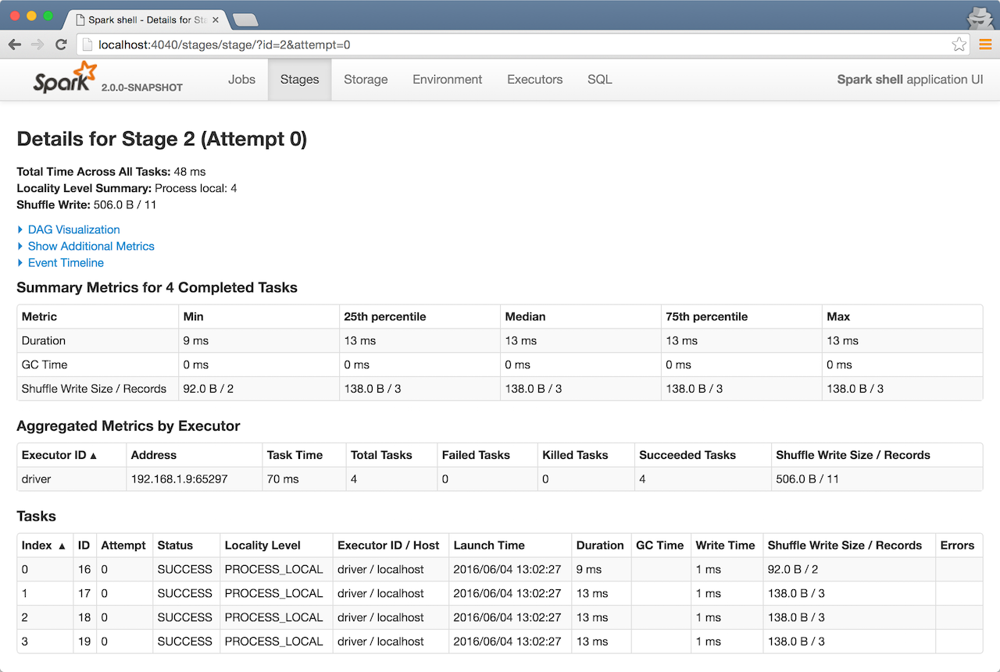
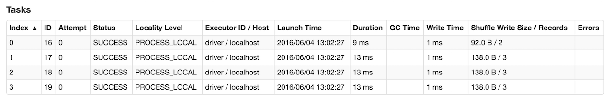
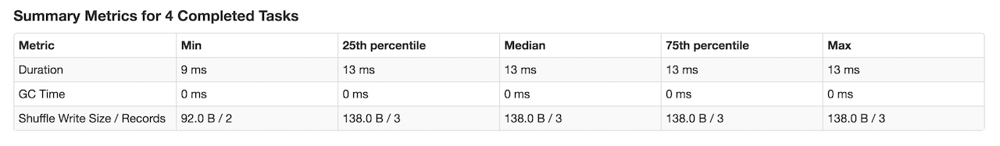
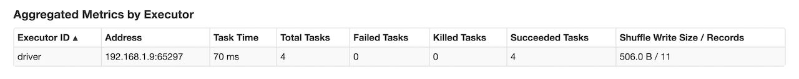

== [[StagePage]] Stage Details

`StagePage` shows the task details for a stage given its id and attempt id.

.Details for Stage

`StagePage` renders a page available under `/stage` URL that requires two <<parameters, request parameters>> -- `id` and `attempt`, e.g. http://localhost:4040/stages/stage/?id=2&attempt=0.

`StagePage` is part of link:spark-webui-StagesTab.adoc[Stages tab].

`StagePage` uses the parent's link:spark-webui-JobProgressListener.adoc[JobProgressListener] and link:spark-webui-RDDOperationGraphListener.adoc[RDDOperationGraphListener] to calculate the <<metrics, metrics>>. More specifically, `StagePage` uses ``JobProgressListener``'s link:spark-webui-JobProgressListener.adoc#stageIdToData[stageIdToData] registry to access the stage for given stage `id` and `attempt`.

`StagePage` uses link:spark-webui-executors-ExecutorsListener.adoc[ExecutorsListener] to display stdout and stderr logs of the executors in <<tasks, Tasks section>>.

=== [[tasks]][[TaskPagedTable]] Tasks Section

.Tasks Section

Tasks paged table displays link:spark-webui-JobProgressListener.adoc#StageUIData[StageUIData] that link:spark-webui-JobProgressListener.adoc#stageIdToData[`JobProgressListener` collected for a stage and stage attempt].

NOTE: The section uses link:spark-webui-executors-ExecutorsListener.adoc[ExecutorsListener] to access stdout and stderr logs for `Executor ID / Host` column.

=== [[summary-task-metrics]] Summary Metrics for Completed Tasks in Stage

The summary metrics table shows the metrics for the tasks in a given stage that have already finished with SUCCESS status and metrics available.

The table consists of the following columns: *Metric*, *Min*, *25th percentile*, *Median*, *75th percentile*, *Max*.

.Summary Metrics for Completed Tasks in Stage

NOTE: All the quantiles are doubles using `TaskUIData.metrics` (sorted in ascending order).

The 1st row is *Duration* which includes the quantiles based on `executorRunTime`.

The 2nd row is the optional *Scheduler Delay* which includes the time to ship the task from the scheduler to executors, and the time to send the task result from the executors to the scheduler. It is not enabled by default and you should select *Scheduler Delay* checkbox under *Show Additional Metrics* to include it in the summary table.

TIP: If Scheduler Delay is large, consider decreasing the size of tasks or decreasing the size of task results.

The 3rd row is the optional *Task Deserialization Time* which includes the quantiles based on `executorDeserializeTime` task metric. It is not enabled by default and you should select *Task Deserialization Time* checkbox under *Show Additional Metrics* to include it in the summary table.

The 4th row is *GC Time* which is the time that an executor spent paused for Java garbage collection while the task was running (using `jvmGCTime` task metric).

The 5th row is the optional *Result Serialization Time* which is the time spent serializing the task result on a executor before sending it back to the driver (using `resultSerializationTime` task metric). It is not enabled by default and you should select *Result Serialization Time* checkbox under *Show Additional Metrics* to include it in the summary table.

The 6th row is the optional *Getting Result Time* which is the time that the driver spends fetching task results from workers. It is not enabled by default and you should select *Getting Result Time* checkbox under *Show Additional Metrics* to include it in the summary table.

TIP: If Getting Result Time is large, consider decreasing the amount of data returned from each task.

If <<spark.sql.unsafe.enabled, Tungsten is enabled>> (it is by default), the 7th row is the optional *Peak Execution Memory* which is the sum of the peak sizes of the internal data structures created during shuffles, aggregations and joins (using `peakExecutionMemory` task metric). For SQL jobs, this only tracks all unsafe operators, broadcast joins, and external sort. It is not enabled by default and you should select *Peak Execution Memory* checkbox under *Show Additional Metrics* to include it in the summary table.

If the stage has an input, the 8th row is *Input Size / Records* which is the bytes and records read from Hadoop or from a Spark storage (using `inputMetrics.bytesRead` and `inputMetrics.recordsRead` task metrics).

If the stage has an output, the 9th row is *Output Size / Records* which is the bytes and records written to Hadoop or to a Spark storage (using `outputMetrics.bytesWritten` and `outputMetrics.recordsWritten` task metrics).

If the stage has shuffle read there will be three more rows in the table. The first row is *Shuffle Read Blocked Time* which is the time that tasks spent blocked waiting for shuffle data to be read from remote machines (using `shuffleReadMetrics.fetchWaitTime` task metric). The other row is *Shuffle Read Size / Records* which is the total shuffle bytes and records read (including both data read locally and data read from remote executors using `shuffleReadMetrics.totalBytesRead` and `shuffleReadMetrics.recordsRead` task metrics). And the last row is *Shuffle Remote Reads* which is the total shuffle bytes read from remote executors (which is a subset of the shuffle read bytes; the remaining shuffle data is read locally). It uses `shuffleReadMetrics.remoteBytesRead` task metric.

If the stage has shuffle write, the following row is *Shuffle Write Size / Records* (using link:spark-taskmetrics-ShuffleWriteMetrics.adoc#bytesWritten[shuffleWriteMetrics.bytesWritten] and link:spark-taskmetrics-ShuffleWriteMetrics.adoc#recordsWritten[shuffleWriteMetrics.recordsWritten] task metrics).

If the stage has bytes spilled, the following two rows are *Shuffle spill (memory)* (using `memoryBytesSpilled` task metric) and *Shuffle spill (disk)* (using `diskBytesSpilled` task metric).

=== [[parameters]] Request Parameters

`id` is...

`attempt` is...

NOTE: `id` and `attempt` uniquely identify the stage in link:spark-webui-JobProgressListener.adoc#stageIdToData[JobProgressListener.stageIdToData] to retrieve `StageUIData`.

`task.page` (default: `1`) is...

`task.sort` (default: `Index`)

`task.desc` (default: `false`)

`task.pageSize` (default: `100`)

`task.prevPageSize` (default: `task.pageSize`)

=== [[metrics]] Metrics

Scheduler Delay is...FIXME

Task Deserialization Time is...FIXME

Result Serialization Time is...FIXME

Getting Result Time is...FIXME

Peak Execution Memory is...FIXME

Shuffle Read Time is...FIXME

Executor Computing Time is...FIXME

Shuffle Write Time is...FIXME

.DAG Visualization
image::images/spark-webui-stage-dagvisualization.png[align="center"]

.Event Timeline
image::images/spark-webui-stage-eventtimeline.png[align="center"]

.Stage Task and Shuffle Stats
image::images/spark-webui-stage-header.png[align="center"]

=== [[aggregated-metrics-by-executor]][[ExecutorTable]] Aggregated Metrics by Executor

`ExecutorTable` table shows the following columns:

* Executor ID
* Address
* Task Time
* Total Tasks
* Failed Tasks
* Killed Tasks
* Succeeded Tasks
* (optional) Input Size / Records (only when the stage has an input)
* (optional) Output Size / Records (only when the stage has an output)
* (optional) Shuffle Read Size / Records (only when the stage read bytes for a shuffle)
* (optional) Shuffle Write Size / Records (only when the stage wrote bytes for a shuffle)
* (optional) Shuffle Spill (Memory) (only when the stage spilled memory bytes)
* (optional) Shuffle Spill (Disk) (only when the stage spilled bytes to disk)

.Aggregated Metrics by Executor

It gets `executorSummary` from `StageUIData` (for the stage and stage attempt id) and creates rows per executor.

It also link:spark-webui-JobProgressListener.adoc#blockManagerIds[requests BlockManagers (from JobProgressListener)] to map executor ids to a pair of host and port to display in Address column.

=== [[accumulators]] Accumulators

Stage page displays the table with link:spark-accumulators.adoc#named[named accumulators] (only if they exist). It contains the name and value of the accumulators.

.Accumulators Section
image::images/spark-webui-stage-accumulators.png[align="center"]

NOTE: The information with name and value is stored in link:spark-accumulators.adoc#AccumulableInfo[AccumulableInfo] (that is available in link:spark-webui-JobProgressListener.adoc#StageUIData[StageUIData]).

=== [[settings]] Settings

.Spark Properties
[options="header",width="100%"]
|===
| Spark Property | Default Value | Description
| [[spark.ui.timeline.tasks.maximum]] `spark.ui.timeline.tasks.maximum` | `1000` |
| [[spark.sql.unsafe.enabled]] `spark.sql.unsafe.enabled` | `true` |
|===
