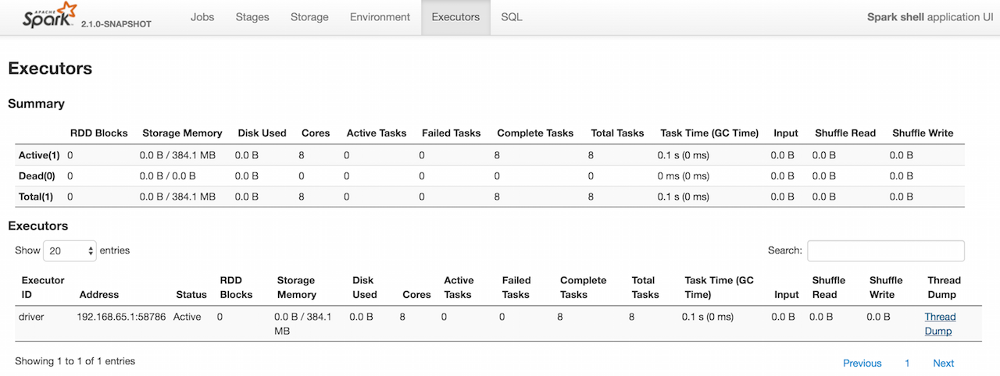

== [[ExecutorsTab]] Executors Tab

*Executors* tab in link:spark-webui.adoc[web UI] shows ...

.Executors Tab in web UI (local mode)

`ExecutorsTab` uses link:spark-webui-executors-ExecutorsListener.adoc[ExecutorsListener] to collect information about executors in a Spark application.

The title of the tab is *Executors*.

You can access the Executors tab under `/executors` URL, e.g. http://localhost:4040/executors.

=== [[ExecutorsPage]] ExecutorsPage

CAUTION: FIXME

=== [[getExecInfo]] `getExecInfo` Method

[source, scala]
----
getExecInfo(
  listener: ExecutorsListener,
  statusId: Int,
  isActive: Boolean): ExecutorSummary
----

`getExecInfo` creates a `ExecutorSummary`.

CAUTION: FIXME

NOTE: `getExecInfo` is used when...FIXME

=== [[ExecutorThreadDumpPage]] ExecutorThreadDumpPage

`ExecutorThreadDumpPage` is enabled or disabled using <<spark_ui_threadDumpsEnabled, spark.ui.threadDumpsEnabled>> setting.

=== [[settings]] Settings

==== [[spark_ui_threadDumpsEnabled]] spark.ui.threadDumpsEnabled

`spark.ui.threadDumpsEnabled` (default: `true`) is to enable (`true`) or disable (`false`) <<ExecutorThreadDumpPage, ExecutorThreadDumpPage>>.
