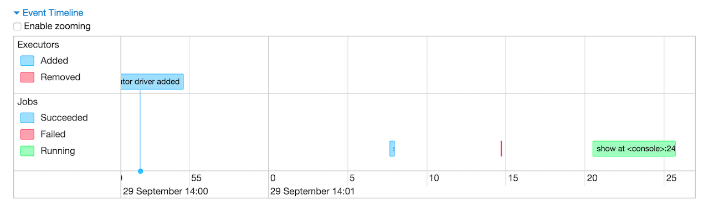
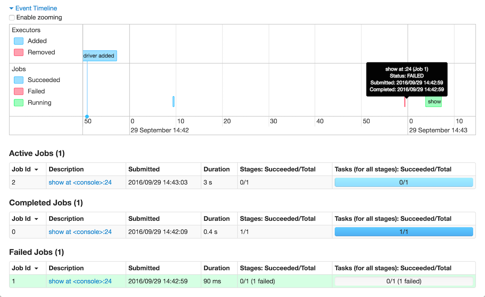
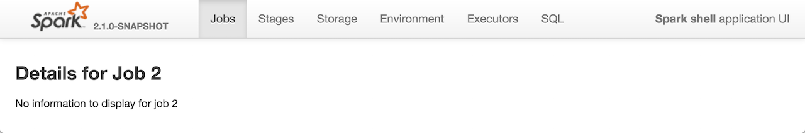

== [[JobsTab]] Jobs Tab

The *Jobs Tab* shows <<AllJobsPage, status of all Spark jobs>> in a Spark application (i.e. a link:spark-SparkContext.adoc[SparkContext]).

.Jobs Tab
image::images/spark-webui-jobs.png[align="center"]

The Jobs tab is available under `/jobs` URL, i.e. http://localhost:4040/jobs.

.Event Timeline in Jobs Tab

The Jobs tab consists of two pages, i.e. <<AllJobsPage, All Jobs>> and <<JobPage, Details for Job>> pages.

Internally, the Jobs Tab is represented by `JobsTab` class that is a custom link:spark-webui-SparkUI.adoc#SparkUITab[SparkUITab] with `jobs` prefix.

NOTE: The Jobs tab uses link:spark-webui-JobProgressListener.adoc[JobProgressListener] to access statistics of job executions in a Spark application to display.

=== [[AllJobsPage]] Showing All Jobs -- `AllJobsPage` Page

`AllJobsPage` is a page (in <<JobsTab, `Jobs` tab>>) that renders a summary, an event timeline, and active, completed, and failed jobs of a Spark application.

TIP: Jobs (in any state) are displayed when their number is greater than `0`.

`AllJobsPage` displays the *Summary* section with the link:spark-webui-SparkUI.adoc#getSparkUser[current Spark user], total uptime, scheduling mode, and the number of jobs per status.

NOTE: `AllJobsPage` uses link:spark-webui-JobProgressListener.adoc[JobProgressListener] for `Scheduling Mode`.

.Summary Section in Jobs Tab
image::images/spark-webui-jobs-summary-section.png[align="center"]

Under the summary section is the *Event Timeline* section.

.Event Timeline in Jobs Tab

NOTE: `AllJobsPage` uses link:spark-webui-executors-ExecutorsListener.adoc[ExecutorsListener] to build the event timeline.

*Active Jobs*, *Completed Jobs*, and *Failed Jobs* sections follow.

.Job Status Section in Jobs Tab
image::images/spark-webui-jobs-status-section.png[align="center"]

Jobs are clickable, i.e. you can click on a job to <<JobPage, see information about the stages of tasks inside it>>.

When you hover over a job in Event Timeline not only you see the job legend but also the job is highlighted in the Summary section.

.Hovering Over Job in Event Timeline Highlights The Job in Status Section

The Event Timeline section shows not only jobs but also executors.

.Executors in Event Timeline
image::images/spark-webui-jobs-timeline-executors.png[align="center"]

TIP: Use link:spark-SparkContext.adoc#dynamic-allocation[Programmable Dynamic Allocation] (using `SparkContext`) to manage executors for demo purposes.

=== [[JobPage]] Details for Job -- `JobPage` Page

When you click a job in <<AllJobsPage, AllJobsPage page>>, you see the *Details for Job* page.

.Details for Job Page
image::images/spark-webui-jobs-details-for-job.png[align="center"]

`JobPage` is a custom `WebUIPage` that shows statistics and stage list for a given job.

Details for Job page is registered under `/job` URL, i.e. `http://localhost:4040/jobs/job/?id=0` and accepts one mandatory `id` request parameter as a job identifier.

When a job id is not found, you should see "No information to display for job ID" message.

."No information to display for job" in Details for Job Page

`JobPage` displays the job's status, group (if available), and the stages per state: active, pending, completed, skipped, and failed.

NOTE: A job can be in a running, succeeded, failed or unknown state.

.Details for Job Page with Active and Pending Stages
image::images/spark-webui-jobs-details-for-job-active-pending-stages.png[align="center"]

.Details for Job Page with Four Stages
image::images/spark-webui-jobs-details-for-job-four-stages.png[align="center"]
