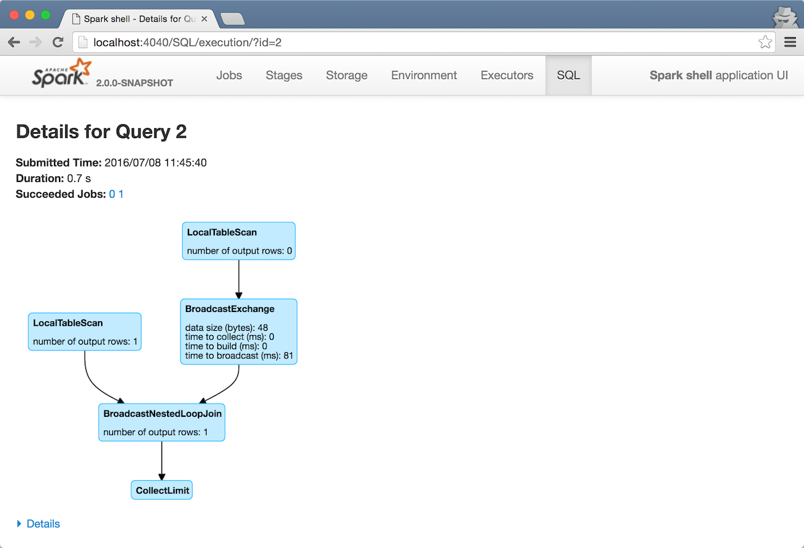
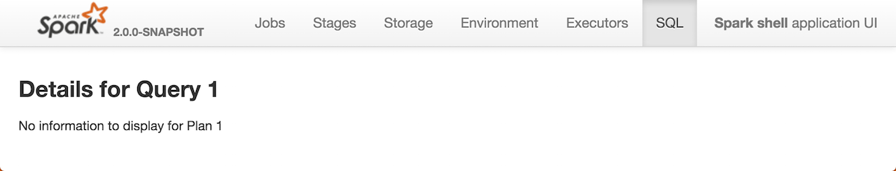

== [[SQLTab]] SQL Tab

*SQL* tab in link:spark-webui.adoc[web UI] displays accumulator values per operator.

CAUTION: FIXME Intro

You can access the SQL tab under `/SQL` URL, e.g. http://localhost:4040/SQL/.

By default, it displays <<AllExecutionsPage, all SQL query executions>>. However, after a query has been selected, the SQL tab <<ExecutionPage, displays the details of the SQL query execution>>.

=== [[AllExecutionsPage]] AllExecutionsPage

`AllExecutionsPage` displays all SQL query executions in a Spark application per state sorted by their submission time reversed.

.SQL Tab in web UI (AllExecutionsPage)
image::images/spark-webui-sql.png[align="center"]

Internally, the page requests link:spark-webui-SQLListener.adoc[SQLListener] for query executions in running, completed, and failed states (the states correspond to the respective tables on the page).

=== [[ExecutionPage]] ExecutionPage

`ExecutionPage` displays SQL query execution details for a given query execution `id`.

NOTE: The `id` request parameter is mandatory.

`ExecutionPage` displays a summary with *Submitted Time*, *Duration*, the clickable identifiers of the *Running Jobs*, *Succeeded Jobs*, and *Failed Jobs*.

It also display a visualization (using link:spark-webui-SQLListener.adoc#getExecutionMetrics[accumulator updates] and the `SparkPlanGraph` for the query) with the expandable *Details* section (that corresponds to `SQLExecutionUIData.physicalPlanDescription`).

.Details for SQL Query in web UI

If there is no information to display for a given query `id`, you should see the following page.

.No Details for SQL Query

Internally, it uses link:spark-webui-SQLListener.adoc[SQLListener] exclusively to get the SQL query execution metrics. It requests link:spark-webui-SQLListener.adoc#getExecution[`SQLListener` for SQL execution data] to display for the `id` request parameter.

=== [[creating-instance]] Creating SQLTab Instance

`SQLTab` is created when link:spark-sql-sparksession.adoc#SharedState[SharedState] is or at the first link:spark-webui-SQLListener.adoc#SparkListenerSQLExecutionStart[SparkListenerSQLExecutionStart] event when link:spark-history-server.adoc[Spark History Server] is used.

.Creating SQLTab Instance
image::images/spark-SQLTab-creating-instance.png[align="center"]

NOTE: `SharedState` represents the shared state across all active SQL sessions.
