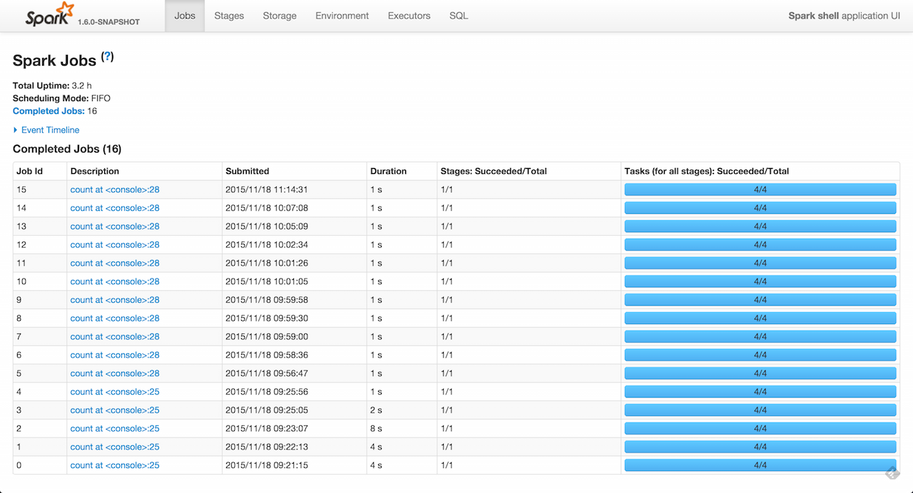

== Web UI -- Spark Application's Web Console

*Web UI* (aka *Application UI* or *webUI* or *Spark UI*) is the web interface of a running Spark application to monitor and inspect Spark job executions in a web browser.

.Welcome page - Jobs page

link:spark-sparkcontext-creating-instance-internals.adoc#ui[Every `SparkContext` launches its own instance of Web UI] which is available at `http://[driver]:4040` by default (the port can be changed using <<spark.ui.port, spark.ui.port>> setting) and will increase if this port is already taken (until an open port is found).

web UI comes with the following tabs (which may not all be visible at once as they are lazily created on demand, e.g. link:spark-streaming/spark-streaming-webui.adoc[Streaming] tab):

1. link:spark-webui-jobs.adoc[Jobs]
2. link:spark-webui-StagesTab.adoc[Stages]
3. link:spark-webui-storage.adoc[Storage] with RDD size and memory use
4. link:spark-webui-environment.adoc[Environment]
5. link:spark-webui-executors.adoc[Executors]
6. link:spark-webui-sql.adoc[SQL]

TIP: You can use the web UI after the application has finished by link:spark-scheduler-listeners-eventlogginglistener.adoc[persisting events using `EventLoggingListener`] and using link:spark-history-server.adoc[Spark History Server].

NOTE: All the information that is displayed in web UI is available thanks to link:spark-webui-JobProgressListener.adoc[JobProgressListener] and other link:spark-SparkListener.adoc#builtin-implementations[SparkListeners]. One could say that web UI is a web layer to Spark listeners.

=== [[settings]] Settings

.Spark Properties
[cols="1,1,2",options="header",width="100%"]
|===
| Spark Property
| Default Value
| Description

| [[spark.ui.enabled]] `spark.ui.enabled`
| `true`
| The flag to control whether the web UI is started (`true`) or not (`false`).

| [[spark.ui.port]] `spark.ui.port`
| `4040`
| The port web UI binds to.

If multiple ``SparkContext``s attempt to run on the same host (it is not possible to have two or more Spark contexts on a single JVM, though), they will bind to successive ports beginning with `spark.ui.port`.

| [[spark.ui.killEnabled]] `spark.ui.killEnabled`
| `true`
| The flag to control whether you can kill stages in web UI (`true`) or not (`false`).

| [[spark.ui.retainedDeadExecutors]] `spark.ui.retainedDeadExecutors`
| `100`
| The maximum number of entries in link:spark-webui-executors-ExecutorsListener.adoc#executorToTaskSummary[executorToTaskSummary] (in `ExecutorsListener`) and link:spark-webui-StorageStatusListener.adoc#deadExecutorStorageStatus[deadExecutorStorageStatus] (in `StorageStatusListener`) internal registries.
|===
