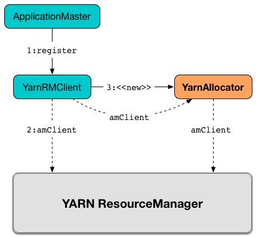
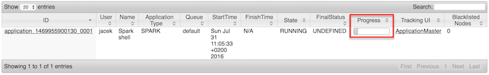

== [[YarnAllocator]] YarnAllocator -- YARN Resource Container Allocator

`YarnAllocator` <<updateResourceRequests, requests resources from a YARN cluster>> (in a form of containers from YARN ResourceManager) and manages the container allocations by <<allocateResources, allocating them to Spark executors>> and <<internalReleaseContainer, releasing them>> when no longer needed by a Spark application.

`YarnAllocator` manages resources using <<amClient, AMRMClient>> (that link:spark-yarn-yarnrmclient.adoc#register[`YarnRMClient` passes in] when <<creating-instance, creating a `YarnAllocator`>>).

.Creating YarnAllocator


`YarnAllocator` is part of the internal state of link:spark-yarn-applicationmaster.adoc#allocator[ApplicationMaster] (via the internal `allocator` reference).

.ApplicationMaster uses YarnAllocator (via allocator attribute)


`YarnAllocator` later <<runAllocatedContainers, launches Spark executors in allocated YARN resource containers>>.

.YarnAllocator Runs ExecutorRunnables in Allocated YARN Containers
image::../images/spark-yarn-YarnAllocator-runAllocatedContainers.png[align="center"]

[[internal-registries]]
.YarnAllocator's Internal Registries and Counters
[cols="1,2",options="header",width="100%"]
|===
| Name
| Description

| [[resource]] `resource`
| The YARN https://hadoop.apache.org/docs/current/api/org/apache/hadoop/yarn/api/records/Resource.html[Resource] that sets capacity requirement (i.e. memory and virtual cores) of a single executor.

NOTE: `Resource` models a set of computer resources in the cluster. Currently both memory and virtual CPU cores (vcores).

Created when <<creating-instance, `YarnAllocator` is created>> and is the sum of <<executorMemory, executorMemory>> and <<memoryOverhead, memoryOverhead>> for the amount of memory and <<executorCores, executorCores>> for the number of virtual cores.

| [[executorIdCounter]] `executorIdCounter`
| Used to set executor id when <<runAllocatedContainers, launching Spark executors in allocated YARN resource containers>>.

Set to the link:spark-yarn-cluster-YarnSchedulerEndpoint.adoc#RetrieveLastAllocatedExecutorId[last allocated executor id] (received through a RPC system when <<creating-instance, `YarnAllocator` is created>>).

| [[targetNumExecutors]] `targetNumExecutors`
| Current desired total number of executors (as YARN resource containers).

Set to the link:spark-yarn-YarnSparkHadoopUtil.adoc#getInitialTargetExecutorNumber[initial number of executors] when <<creating-instance, `YarnAllocator` is created>>.

`targetNumExecutors` is eventually reached after <<updateResourceRequests, `YarnAllocator` updates YARN container allocation requests>>.

May later be changed when <<requestTotalExecutorsWithPreferredLocalities, `YarnAllocator` is requested for total number of executors given locality preferences>>.

Used when <<updateResourceRequests, requesting missing resource containers>> and <<runAllocatedContainers, launching Spark executors in the allocated resource containers>>.

| [[numExecutorsRunning]] `numExecutorsRunning`
| Current number of...FIXME

Used to <<updateResourceRequests, update YARN container allocation requests>> and <<getNumExecutorsRunning, get the current number of executors running>>.

Incremented when <<runAllocatedContainers, launching Spark executors in allocated YARN resource containers>> and decremented when <<killExecutor, releasing a resource container for a Spark executor>>.

| [[currentNodeBlacklist]] `currentNodeBlacklist`
| List of...FIXME

| [[releasedContainers]] `releasedContainers`
| Unneeded containers that are of no use anymore by their globally unique identifier https://hadoop.apache.org/docs/current/api/org/apache/hadoop/yarn/api/records/ContainerId.html[ContainerId] (for a `Container` in the cluster).

NOTE: Hadoop YARN's https://hadoop.apache.org/docs/current/api/org/apache/hadoop/yarn/api/records/Container.html[Container] represents an allocated resource in the cluster. The YARN ResourceManager is the sole authority to allocate any `Container` to applications. The allocated `Container` is always on a single node and has a unique `ContainerId`. It has a specific amount of `Resource` allocated.

| [[allocatedHostToContainersMap]] `allocatedHostToContainersMap`
| Lookup table

| [[allocatedContainerToHostMap]] `allocatedContainerToHostMap`
| Lookup Table

| [[pendingLossReasonRequests]] `pendingLossReasonRequests`
|

| [[releasedExecutorLossReasons]] `releasedExecutorLossReasons`
|

| [[executorIdToContainer]] `executorIdToContainer`
|

| [[numUnexpectedContainerRelease]] `numUnexpectedContainerRelease`
|

| [[containerIdToExecutorId]] `containerIdToExecutorId`
|

| [[hostToLocalTaskCounts]] `hostToLocalTaskCounts`
| Lookup table

| [[failedExecutorsTimeStamps]] `failedExecutorsTimeStamps`
|

| [[executorMemory]] `executorMemory`
|

| [[memoryOverhead]] `memoryOverhead`
|

| [[executorCores]] `executorCores`
|

| [[launchContainers]] `launchContainers`
|

| [[labelExpression]] `labelExpression`
|

| [[nodeLabelConstructor]] `nodeLabelConstructor`
|

| [[containerPlacementStrategy]] `containerPlacementStrategy`
|

| [[launcherPool]] `launcherPool`
| ContainerLauncher Thread Pool

| [[numLocalityAwareTasks]] `numLocalityAwareTasks`
| Number of locality-aware tasks to be used as container placement hint when <<requestTotalExecutorsWithPreferredLocalities, `YarnAllocator` is requested for executors given locality preferences>>.

Set to `0` when <<creating-instance, `YarnAllocator` is created>>.

Used as an input to `containerPlacementStrategy.localityOfRequestedContainers` when <<updateResourceRequests, `YarnAllocator` updates YARN container allocation requests>>.

|===

[TIP]
====
Enable `INFO` or `DEBUG` logging level for `org.apache.spark.deploy.yarn.YarnAllocator` logger to see what happens inside.

Add the following line to `conf/log4j.properties`:

```
log4j.logger.org.apache.spark.deploy.yarn.YarnAllocator=DEBUG
```

Refer to link:../spark-logging.adoc[Logging].
====

=== [[creating-instance]] Creating YarnAllocator Instance

`YarnAllocator` takes the following when created:

. `driverUrl`
. `driverRef` -- link:../spark-RpcEndpointRef.adoc[RpcEndpointRef] to the driver's FIXME
. [[conf]] https://hadoop.apache.org/docs/current/api/org/apache/hadoop/yarn/conf/YarnConfiguration.html[YarnConfiguration]
. `sparkConf` -- link:../spark-SparkConf.adoc[SparkConf]
. [[amClient]] `amClient` https://hadoop.apache.org/docs/current/api/org/apache/hadoop/yarn/client/api/AMRMClient.html[AMRMClient] for `ContainerRequest`
. `ApplicationAttemptId`
. [[securityMgr]] `SecurityManager`
. [[localResources]] `localResources` -- `Map[String, LocalResource]`

All the input parameters for `YarnAllocator` (but `appAttemptId` and `amClient`) are passed directly from the input parameters of `YarnRMClient`.

`YarnAllocator` sets the `org.apache.hadoop.yarn.util.RackResolver` logger to `WARN` (unless set to some log level already).

`YarnAllocator` initializes the <<internal-registries, internal registries and counters>>.

It sets the following internal counters:

* `numExecutorsRunning` to `0`
* `numUnexpectedContainerRelease` to `0L`
* `numLocalityAwareTasks` to `0`
* `targetNumExecutors` to link:spark-yarn-YarnSparkHadoopUtil.adoc#getInitialTargetExecutorNumber[the initial number of executors]

It creates an empty <<failedExecutorsTimeStamps, queue of failed executors>>.

It sets the internal `executorFailuresValidityInterval` to link:spark-yarn-settings.adoc#spark.yarn.executor.failuresValidityInterval[spark.yarn.executor.failuresValidityInterval].

It sets the internal `executorMemory` to link:../spark-Executor.adoc#spark.executor.memory[spark.executor.memory].

It sets the internal `memoryOverhead` to link:spark-yarn-settings.adoc#spark.yarn.executor.memoryOverhead[spark.yarn.executor.memoryOverhead]. If unavailable, it is set to the maximum of 10% of `executorMemory` and `384`.

It sets the internal `executorCores` to link:../spark-Executor.adoc#spark.executor.cores[spark.executor.cores].

It creates the internal `resource` to Hadoop YARN's https://hadoop.apache.org/docs/current/api/org/apache/hadoop/yarn/api/records/Resource.html[Resource] with both `executorMemory + memoryOverhead` memory and `executorCores` CPU cores.

It creates the internal `launcherPool` called *ContainerLauncher* with maximum link:spark-yarn-settings.adoc#spark.yarn.containerLauncherMaxThreads[spark.yarn.containerLauncherMaxThreads] threads.

It sets the internal `launchContainers` to link:spark-yarn-settings.adoc#spark.yarn.launchContainers[spark.yarn.launchContainers].

It sets the internal `labelExpression` to link:spark-yarn-settings.adoc#spark.yarn.executor.nodeLabelExpression[spark.yarn.executor.nodeLabelExpression].

It sets the internal `nodeLabelConstructor` to...FIXME

CAUTION: FIXME nodeLabelConstructor?

It sets the internal `containerPlacementStrategy` to...FIXME

CAUTION: FIXME LocalityPreferredContainerPlacementStrategy?

==== [[getNumExecutorsRunning]] `getNumExecutorsRunning` Method

CAUTION: FIXME

==== [[updateInternalState]] `updateInternalState` Method

CAUTION: FIXME

=== [[killExecutor]] `killExecutor` Method

CAUTION: FIXME

=== [[requestTotalExecutorsWithPreferredLocalities]] Specifying Current Total Number of Executors with Locality Preferences -- `requestTotalExecutorsWithPreferredLocalities` Method

[source, scala]
----
requestTotalExecutorsWithPreferredLocalities(
  requestedTotal: Int,
  localityAwareTasks: Int,
  hostToLocalTaskCount: Map[String, Int],
  nodeBlacklist: Set[String]): Boolean
----

`requestTotalExecutorsWithPreferredLocalities` returns whether the <<targetNumExecutors, current desired total number of executors>> is different than the input `requestedTotal`.

NOTE: `requestTotalExecutorsWithPreferredLocalities` should instead have been called `shouldRequestTotalExecutorsWithPreferredLocalities` since it answers the question whether to request new total executors or not.

`requestTotalExecutorsWithPreferredLocalities` sets the internal <<numLocalityAwareTasks, numLocalityAwareTasks>> and <<hostToLocalTaskCounts, hostToLocalTaskCounts>> attributes to the input `localityAwareTasks` and `hostToLocalTaskCount` arguments, respectively.

If the input `requestedTotal` is different than the internal <<targetNumExecutors, targetNumExecutors>> you should see the following INFO message in the logs:

```
INFO YarnAllocator: Driver requested a total number of [requestedTotal] executor(s).
```

`requestTotalExecutorsWithPreferredLocalities` saves the input `requestedTotal` to be the <<targetNumExecutors, current desired total number of executors>>.

`requestTotalExecutorsWithPreferredLocalities` updates blacklist information to YARN ResouceManager for this application in order to avoid allocating new Containers on the problematic nodes.

CAUTION: FIXME Describe the blacklisting

NOTE: `requestTotalExecutorsWithPreferredLocalities` is executed in response to link:spark-yarn-AMEndpoint.adoc#RequestExecutors[`RequestExecutors` message to `ApplicationMaster`].

=== [[updateResourceRequests]] Adding or Removing Container Requests to Launch Executors -- `updateResourceRequests` Method

[source, scala]
----
updateResourceRequests(): Unit
----

`updateResourceRequests` <<updateResourceRequests-missing-executors, requests new>> or <<updateResourceRequests-cancelling-executor-allocations, cancels outstanding>> executor containers from the link:spark-yarn-introduction.adoc#ResourceManager[YARN ResourceManager].

NOTE: In YARN, you have to request containers for resources first (using link:++https://hadoop.apache.org/docs/current/api/org/apache/hadoop/yarn/client/api/AMRMClient.html#addContainerRequest(T)++[AMRMClient.addContainerRequest]) before calling link:++https://hadoop.apache.org/docs/current/api/org/apache/hadoop/yarn/client/api/AMRMClient.html#allocate(float)++[AMRMClient.allocate].

It gets the list of outstanding YARN's `ContainerRequests` (using the constructor's link:++https://hadoop.apache.org/docs/current/api/org/apache/hadoop/yarn/client/api/AMRMClient.html#getMatchingRequests(org.apache.hadoop.yarn.api.records.Priority, java.lang.String, org.apache.hadoop.yarn.api.records.Resource)++[AMRMClient[ContainerRequest\]]) and aligns their number to current workload.

`updateResourceRequests` consists of two main branches:

1. <<updateResourceRequests-missing-executors, missing executors>>, i.e. when the number of executors allocated already or pending does not match the needs and so there are missing executors.

2. <<updateResourceRequests-cancelling-executor-allocations, executors to cancel>>, i.e. when the number of pending executor allocations is positive, but the number of all the executors is more than Spark needs.

NOTE: `updateResourceRequests` is used when `YarnAllocator` <<allocateResources, requests new resource containers>>.

==== [[updateResourceRequests-missing-executors]] Case 1. Missing Executors

You should see the following INFO message in the logs:

```
INFO YarnAllocator: Will request [count] executor containers, each with [vCores] cores and [memory] MB memory including [memoryOverhead] MB overhead
```

It then splits pending container allocation requests per locality preference of pending tasks (in the internal <<hostToLocalTaskCounts, hostToLocalTaskCounts>> registry).

CAUTION: FIXME Review `splitPendingAllocationsByLocality`

It removes stale container allocation requests (using YARN's link:++https://hadoop.apache.org/docs/current/api/org/apache/hadoop/yarn/client/api/AMRMClient.html#removeContainerRequest(T)++[AMRMClient.removeContainerRequest]).

CAUTION: FIXME Stale?

You should see the following INFO message in the logs:

```
INFO YarnAllocator: Canceled [cancelledContainers] container requests (locality no longer needed)
```

It computes locality of requested containers (based on the internal <<numLocalityAwareTasks, numLocalityAwareTasks>>, <<hostToLocalTaskCounts, hostToLocalTaskCounts>> and <<allocatedHostToContainersMap, allocatedHostToContainersMap>> lookup table).

CAUTION: FIXME Review `containerPlacementStrategy.localityOfRequestedContainers` + the code that follows.

For any new container needed `updateResourceRequests` adds a container request (using YARN's link:++https://hadoop.apache.org/docs/current/api/org/apache/hadoop/yarn/client/api/AMRMClient.html#addContainerRequest(T)++[AMRMClient.addContainerRequest]).

You should see the following INFO message in the logs:

```
INFO YarnAllocator: Submitted container request (host: [host], capability: [resource])
```

==== [[updateResourceRequests-cancelling-executor-allocations]] Case 2. Cancelling Pending Executor Allocations

When there are executors to cancel (case 2.), you should see the following INFO message in the logs:

```
INFO Canceling requests for [numToCancel] executor container(s) to have a new desired total [targetNumExecutors] executors.
```

It checks whether there are pending allocation requests and removes the excess (using YARN's link:++https://hadoop.apache.org/docs/current/api/org/apache/hadoop/yarn/client/api/AMRMClient.html#removeContainerRequest(T)++[AMRMClient.removeContainerRequest]). If there are no pending allocation requests, you should see the WARN message in the logs:

```
WARN Expected to find pending requests, but found none.
```

=== [[handleAllocatedContainers]] Handling Allocated Containers for Executors -- `handleAllocatedContainers` Internal Method

[source, scala]
----
handleAllocatedContainers(allocatedContainers: Seq[Container]): Unit
----

`handleAllocatedContainers` handles allocated YARN containers, i.e. runs Spark executors on matched containers or releases unneeded containers.

NOTE: A YARN https://hadoop.apache.org/docs/current/api/org/apache/hadoop/yarn/api/records/Container.html[Container] represents an allocated resource in the cluster. The allocated `Container` is always on a single node and has a unique `ContainerId`. It has a specific amount of `Resource` allocated.

Internally, `handleAllocatedContainers` <<matchContainerToRequest, matches requests to host, rack, and any host (a container allocation)>>.

If `handleAllocatedContainers` did not manage to allocate some containers, you should see the following DEBUG message in the logs:

```
DEBUG Releasing [size] unneeded containers that were allocated to us
```

`handleAllocatedContainers` <<internalReleaseContainer, releases the unneeded containers>> (if there are any).

`handleAllocatedContainers` <<runAllocatedContainers, runs the allocated and matched containers>>.

You should see the following INFO message in the logs:

```
INFO Received [allocatedContainersSize] containers from YARN, launching executors on [containersToUseSize] of them.
```

NOTE: `handleAllocatedContainers` is used exclusively when `YarnAllocator` <<allocateResources, allocates YARN resource containers for Spark executors>>.

=== [[runAllocatedContainers]] Running ExecutorRunnables (with CoarseGrainedExecutorBackends) in Allocated YARN Resource Containers -- `runAllocatedContainers` Internal Method

[source, scala]
----
runAllocatedContainers(containersToUse: ArrayBuffer[Container]): Unit
----

`runAllocatedContainers` traverses the YARN https://hadoop.apache.org/docs/current/api/org/apache/hadoop/yarn/api/records/Container.html[Container] collection (as the input `containersToUse`) and schedules execution of link:spark-yarn-ExecutorRunnable.adoc[ExecutorRunnables] per YARN container on <<launcherPool, `ContainerLauncher` thread pool>>.

.YarnAllocator Runs ExecutorRunnables in Allocated YARN Containers
image::../images/spark-yarn-YarnAllocator-runAllocatedContainers.png[align="center"]

NOTE: A https://hadoop.apache.org/docs/current/api/org/apache/hadoop/yarn/api/records/Container.html[Container] in YARN represents allocated resources (memory and cores) in the cluster.

Internally, `runAllocatedContainers` increments <<executorIdCounter, executorIdCounter>> internal counter.

NOTE: `runAllocatedContainers` asserts that the amount of memory of a container not less than the <<resource, requested memory for executors>>. And only memory!

You should see the following INFO message in the logs:

```
INFO YarnAllocator: Launching container [containerId] for on host [executorHostname]
```

`runAllocatedContainers` checks if the <<numExecutorsRunning, number of executors running>> is less than the <<targetNumExecutors, number of required executors>>.

If there are executors still missing (and `runAllocatedContainers` is not in <<launchContainers, testing mode>>), `runAllocatedContainers` schedules execution of a link:spark-yarn-ExecutorRunnable.adoc[ExecutorRunnable] on <<launcherPool, `ContainerLauncher` thread pool>> and <<updateInternalState, updates internal state>>. When executing a `ExecutorRunnable` `runAllocatedContainers` first link:spark-yarn-ExecutorRunnable.adoc#creating-instance[creates a `ExecutorRunnable`] and link:spark-yarn-ExecutorRunnable.adoc#run[starts it].

When `runAllocatedContainers` catches a non-fatal exception and you should see the following ERROR message in the logs and immediately link:++https://hadoop.apache.org/docs/current/api/org/apache/hadoop/yarn/client/api/AMRMClient.html#releaseAssignedContainer(org.apache.hadoop.yarn.api.records.ContainerId)++[releases the container] (using the internal <<amClient, AMRMClient>>).

```
ERROR Failed to launch executor [executorId] on container [containerId]
```

If `YarnAllocator` has reached <<targetNumExecutors, target number of executors>>, you should see the following INFO message in the logs:

```
INFO Skip launching executorRunnable as running Executors count: [numExecutorsRunning] reached target Executors count: [targetNumExecutors].
```

NOTE: `runAllocatedContainers` is used exclusively when `YarnAllocator` <<handleAllocatedContainers, handles allocated YARN containers>>.

==== [[internalReleaseContainer]] Releasing YARN Container -- `internalReleaseContainer` Internal Procedure

All unnecessary YARN containers (that were allocated but are either <<handleAllocatedContainers, of no use>> or <<killExecutor, no longer needed>>) are released using the internal `internalReleaseContainer` procedure.

[source, scala]
----
internalReleaseContainer(container: Container): Unit
----

`internalReleaseContainer` records `container` in the internal <<releasedContainers, releasedContainers>> registry and releases it to the link:spark-yarn-introduction.adoc#ResourceManager[YARN ResourceManager] (calling link:++https://hadoop.apache.org/docs/current/api/org/apache/hadoop/yarn/client/api/AMRMClient.html#releaseAssignedContainer(org.apache.hadoop.yarn.api.records.ContainerId)++[AMRMClient[ContainerRequest\].releaseAssignedContainer] using the internal `amClient`).

==== [[matchContainerToRequest]] Deciding on Use of YARN Container -- `matchContainerToRequest` Internal Method

When <<handleAllocatedContainers, `handleAllocatedContainers` handles allocated containers for executors>>, it uses `matchContainerToRequest` to match the containers to `ContainerRequests` (and hence to workload and location preferences).

[source, scala]
----
matchContainerToRequest(
  allocatedContainer: Container,
  location: String,
  containersToUse: ArrayBuffer[Container],
  remaining: ArrayBuffer[Container]): Unit
----

`matchContainerToRequest` puts `allocatedContainer` in `containersToUse` or `remaining` collections per available outstanding `ContainerRequests` that match the priority of the input `allocatedContainer`, the input `location`, and the memory and vcore capabilities for Spark executors.

NOTE: The input `location` can be host, rack, or `*` (star), i.e. any host.

It link:++https://hadoop.apache.org/docs/current/api/org/apache/hadoop/yarn/client/api/AMRMClient.html#getMatchingRequests(org.apache.hadoop.yarn.api.records.Priority, java.lang.String, org.apache.hadoop.yarn.api.records.Resource)++[gets the outstanding `ContainerRequests`] (from the link:spark-yarn-introduction.adoc#ResourceManager[YARN ResourceManager]).

If there are any outstanding `ContainerRequests` that meet the requirements, it simply takes the first one and puts it in the input `containersToUse` collection. It also removes the `ContainerRequest` so it is not submitted again (it uses the internal `AMRMClient[ContainerRequest]`).

Otherwise, it puts the input `allocatedContainer` in the input `remaining` collection.

=== [[processCompletedContainers]] `processCompletedContainers` Method

[source, scala]
----
processCompletedContainers(completedContainers: Seq[ContainerStatus]): Unit
----

`processCompletedContainers` accepts a collection of YARN's https://hadoop.apache.org/docs/current/api/org/apache/hadoop/yarn/api/records/ContainerStatus.html[ContainerStatus]'es.

[NOTE]
====
`ContainerStatus` represents the current status of a YARN `Container` and provides details such as:

* Id
* State
* Exit status of a completed container.
* Diagnostic message for a failed container.
====

For each completed container in the collection, `processCompletedContainers` removes it from the internal <<releasedContainers, releasedContainers>> registry.

It looks the host of the container up (in the internal <<allocatedContainerToHostMap, allocatedContainerToHostMap>> lookup table). The host may or may not exist in the lookup table.

CAUTION: FIXME The host may or may not exist in the lookup table?

The `ExecutorExited` exit reason is computed.

When the host of the completed container has been found, the internal <<numExecutorsRunning, numExecutorsRunning>> counter is decremented.

You should see the following INFO message in the logs:

```
INFO Completed container [containerId] [host] (state: [containerState], exit status: [containerExitStatus])
```

For `ContainerExitStatus.SUCCESS` and `ContainerExitStatus.PREEMPTED` exit statuses of the container (which are not considered application failures), you should see one of the two possible INFO messages in the logs:

```
INFO Executor for container [id] exited because of a YARN event (e.g., pre-emption) and not because of an error in the running job.
```

```
INFO Container [id] [host] was preempted.
```

Other exit statuses of the container are considered application failures and reported as a WARN message in the logs:

```
WARN Container killed by YARN for exceeding memory limits. [diagnostics] Consider boosting spark.yarn.executor.memoryOverhead.
```

or

```
WARN Container marked as failed: [id] [host]. Exit status: [containerExitStatus]. Diagnostics: [containerDiagnostics]
```

The host is looked up in the internal <<allocatedHostToContainersMap, allocatedHostToContainersMap>> lookup table. If found, the container is removed from the containers registered for the host or the host itself is removed from the lookup table when this container was the last on the host.

The container is removed from the internal <<allocatedContainerToHostMap, allocatedContainerToHostMap>> lookup table.

The container is removed from the internal <<containerIdToExecutorId, containerIdToExecutorId>> translation table. If an executor is found, it is removed from the internal <<executorIdToContainer, executorIdToContainer>> translation table.

If the executor was recorded in the internal <<pendingLossReasonRequests, pendingLossReasonRequests>> lookup table, the exit reason (as calculated earlier as `ExecutorExited`) is sent back for every pending RPC message recorded.

If no executor was found, the executor and the exit reason are recorded in the internal <<releasedExecutorLossReasons, releasedExecutorLossReasons>> lookup table.

In case the container was not in the internal <<releasedContainers, releasedContainers>> registry, the internal <<numUnexpectedContainerRelease, numUnexpectedContainerRelease>> counter is increased and a `RemoveExecutor` RPC message is sent to the driver (as specified when <<creating-instance, `YarnAllocator` was created>>) to notify about the failure of the executor.

=== [[allocateResources]] Requesting and Allocating YARN Resource Containers to Spark Executors (and Cancelling Outstanding Containers) -- `allocateResources` Method

[source, scala]
----
allocateResources(): Unit
----

`allocateResources` claims new resource containers from link:spark-yarn-introduction.adoc#ResourceManager[YARN ResourceManager] and cancels any outstanding resource container requests.

NOTE: In YARN, you first have to submit requests for YARN resource containers to link:spark-yarn-introduction.adoc#ResourceManager[YARN ResourceManager] (using link:++https://hadoop.apache.org/docs/current/api/org/apache/hadoop/yarn/client/api/AMRMClient.html#addContainerRequest(T)++[AMRMClient.addContainerRequest]) before claiming them by calling link:++https://hadoop.apache.org/docs/current/api/org/apache/hadoop/yarn/client/api/AMRMClient.html#allocate(float)++[AMRMClient.allocate].

Internally, `allocateResources` <<updateResourceRequests, submits requests for new containers and cancels previous container requests>>.

`allocateResources` then link:++https://hadoop.apache.org/docs/current/api/org/apache/hadoop/yarn/client/api/AMRMClient.html#allocate(float)++[claims the containers] (using the internal reference to YARN's <<amClient, AMRMClient>>) with progress indicator of `0.1f`.

You can see the exact moment in the YARN console for the Spark application with the progress bar at 10%.

.YARN Console after Allocating YARN Containers (Progress at 10%)


`allocateResources` link:++https://hadoop.apache.org/docs/current/api/org/apache/hadoop/yarn/api/protocolrecords/AllocateResponse.html#getAllocatedContainers()++[gets the list of allocated containers] from the link:spark-yarn-introduction.adoc#ResourceManager[YARN ResourceManager].

If the number of allocated containers is greater than `0`, you should see the following DEBUG message in the logs (in stderr on YARN):

```
DEBUG YarnAllocator: Allocated containers: [allocatedContainersSize]. Current executor count: [numExecutorsRunning]. Cluster resources: [availableResources].
```

`allocateResources` <<handleAllocatedContainers, launches executors on the allocated YARN resource containers>>.

`allocateResources` link:++https://hadoop.apache.org/docs/current/api/org/apache/hadoop/yarn/api/protocolrecords/AllocateResponse.html#getCompletedContainersStatuses()++[gets the list of completed containers' statuses from YARN ResourceManager].

If the number of completed containers is greater than `0`, you should see the following DEBUG message in the logs (in stderr on YARN):

```
DEBUG YarnAllocator: Completed [completedContainersSize] containers
```

`allocateResources` <<processCompletedContainers, processes completed containers>>.

You should see the following DEBUG message in the logs (in stderr on YARN):

```
DEBUG YarnAllocator: Finished processing [completedContainersSize] completed containers. Current running executor count: [numExecutorsRunning].
```

NOTE: `allocateResources` is used when `ApplicationMaster` link:spark-yarn-applicationmaster.adoc#registerAM[is registered to the YARN ResourceManager] and link:spark-yarn-applicationmaster.adoc#launchReporterThread[launches progress `Reporter` thread].
