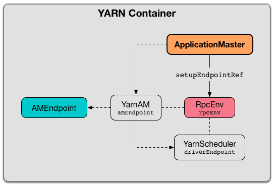

== [[ApplicationMaster]] ApplicationMaster (aka ExecutorLauncher)

`ApplicationMaster` is the link:spark-yarn-introduction.adoc#ApplicationMaster[YARN ApplicationMaster] for a Spark application submitted to a YARN cluster (which is commonly called link:README.adoc[Spark on YARN]).

.ApplicationMaster's Dependencies
image::../images/spark-yarn-ApplicationMaster.png[align="center"]

`ApplicationMaster` is a <<main, standalone application>> that link:spark-yarn-introduction.adoc#NodeManager[YARN NodeManager] runs in a YARN container to manage a Spark application running in a YARN cluster.

[NOTE]
====
From the official documentation of http://hadoop.apache.org/docs/current/hadoop-yarn/hadoop-yarn-site/YARN.html[Apache Hadoop YARN] (with some minor changes of mine):

> The per-application ApplicationMaster is actually a framework-specific library and is tasked with negotiating cluster resources from the YARN ResourceManager and working with the YARN NodeManager(s) to execute and monitor the tasks.
====

`ApplicationMaster` (and `ExecutorLauncher`) is launched as a result of link:spark-yarn-client.adoc#createContainerLaunchContext[`Client` creating a `ContainerLaunchContext`] to launch a Spark application on YARN.

.Launching ApplicationMaster
image::../images/spark-yarn-ApplicationMaster-main.png[align="center"]

NOTE: https://hadoop.apache.org/docs/current/api/org/apache/hadoop/yarn/api/records/ContainerLaunchContext.html[ContainerLaunchContext] represents all of the information needed by the YARN NodeManager to launch a container.

[NOTE]
====
<<ExecutorLauncher, ExecutorLauncher>> is a custom `ApplicationMaster` for link:../spark-deploy-mode.adoc#client[client deploy mode] only for the purpose of easily distinguishing client and cluster deploy modes when using `ps` or `jps`.

[options="wrap"]
----
$ jps -lm

71253 org.apache.spark.deploy.yarn.ExecutorLauncher --arg 192.168.99.1:50188 --properties-file /tmp/hadoop-jacek/nm-local-dir/usercache/jacek/appcache/.../__spark_conf__/__spark_conf__.properties
----
====

When <<creating-instance, created>> `ApplicationMaster` takes a <<client, YarnRMClient>> (to handle communication with link:spark-yarn-introduction.adoc#ResourceManager[YARN ResourceManager] for YARN containers for `ApplicationMaster` and executors).

`ApplicationMaster` uses <<allocator, YarnAllocator>> to manage YARN containers with executors.

[[internal-properties]]
.ApplicationMaster's Internal Properties
[cols="1,1,2",options="header",width="100%"]
|===
| Name
| Initial Value
| Description

| [[amEndpoint]] `amEndpoint`
| (uninitialized)
| link:../spark-RpcEndpointRef.adoc[RpcEndpointRef] to the *YarnAM* RPC endpoint initialized when `ApplicationMaster` <<runAMEndpoint, runAMEndpoint>>.

CAUTION: FIXME When, in a Spark application's lifecycle, does `runAMEndpoint` really happen?

Used exclusively when `ApplicationMaster` <<addAmIpFilter, registers the web UI security filters>> (in <<isClusterMode, `client` deploy mode>> when the driver runs outside `ApplicationMaster`).

| [[client]] `client`
| link:spark-yarn-yarnrmclient.adoc[YarnRMClient]
| Used to <<registerAM, register the `ApplicationMaster` and request containers for executors from YARN>> and later <<unregister, unregister `ApplicationMaster` from YARN ResourceManager>>.

Used to get an <<getAttemptId, application attempt id>> and the link:spark-yarn-yarnrmclient.adoc#getMaxRegAttempts[allowed number of attempts to register `ApplicationMaster`].

Used to <<addAmIpFilter, get filter parameters to secure ApplicationMaster's UI>>.

| [[sparkConf]] `sparkConf`
| New link:../spark-SparkConf.adoc[SparkConf]
| FIXME

| [[finished]] `finished`
| `false`
| Flag to...FIXME

| [[yarnConf]] `yarnConf`
| Hadoop's `YarnConfiguration`
| Flag to...FIXME

Created using link:../spark-SparkHadoopUtil.adoc#newConfiguration[SparkHadoopUtil.newConfiguration]

| [[exitCode]] `exitCode`
| `0`
| FIXME

| [[userClassThread]] `userClassThread`
| (uninitialized)
| FIXME

| [[sparkContextPromise]] `sparkContextPromise`
| `SparkContext` Scala's link:++http://www.scala-lang.org/api/current/scala/concurrent/Promise$.html++[Promise]
| Used only in `cluster` deploy mode (when the driver and `ApplicationMaster` run together in a YARN container) as a communication bus between `ApplicationMaster` and the separate `Driver` thread that <<startUserApplication, runs a Spark application>>.

Used to inform `ApplicationMaster` when a Spark application's `SparkContext` has been initialized successfully or failed.

Non-``null`` value <<runDriver, allows `ApplicationMaster` to access the driver's `RpcEnv`>> (available as <<rpcEnv, rpcEnv>>).

NOTE: A successful initialization of a Spark application's `SparkContext` is when link:spark-yarn-yarnclusterscheduler.adoc#postStartHook[YARN-specific `TaskScheduler`, i.e. `YarnClusterScheduler`, gets informed that the Spark application has started]. _What a clever solution!_

| [[rpcEnv]] `rpcEnv`
| (uninitialized)
a| link:spark-rpc.adoc[RpcEnv] which is:

* `sparkYarnAM` RPC environment from <<runExecutorLauncher-sparkYarnAM, a Spark application submitted to YARN in `client` deploy mode>>.

* `sparkDriver` RPC environment from the <<runDriver-rpcEnv, Spark application submitted to YARN in `cluster` deploy mode>>.

| <<isClusterMode, isClusterMode>>
| `true` (when <<command-line-parameters, `--class` was specified>>)
| Flag...FIXME

| <<maxNumExecutorFailures, maxNumExecutorFailures>>
| FIXME
|
|===

=== [[maxNumExecutorFailures]] `maxNumExecutorFailures` Property

CAUTION: FIXME

Computed using the optional link:spark-yarn-settings.adoc#spark.yarn.max.executor.failures[spark.yarn.max.executor.failures] if set. Otherwise, it is twice link:../spark-Executor.adoc#spark.executor.instances[spark.executor.instances] or link:../spark-dynamic-allocation.adoc#spark.dynamicAllocation.maxExecutors[spark.dynamicAllocation.maxExecutors] (with dynamic allocation enabled) with the minimum of `3`.

=== [[creating-instance]] Creating ApplicationMaster Instance

`ApplicationMaster` takes the following when created:

* [[args]] <<ApplicationMasterArguments, ApplicationMasterArguments>>
* [[client]] link:spark-yarn-yarnrmclient.adoc[YarnRMClient]

`ApplicationMaster` initializes the <<internal-registries, internal registries and counters>>.

CAUTION: FIXME Review the initialization again

=== [[reporterThread]] `reporterThread` Method

CAUTION: FIXME

=== [[launchReporterThread]] Launching Progress Reporter Thread -- `launchReporterThread` Method

CAUTION: FIXME

=== [[sparkContextInitialized]] Setting Internal SparkContext Reference -- `sparkContextInitialized` Method

[source, scala]
----
sparkContextInitialized(sc: SparkContext): Unit
----

`sparkContextInitialized` passes the call on to the `ApplicationMaster.sparkContextInitialized` that sets the internal `sparkContextRef` reference (to be `sc`).

=== [[sparkContextStopped]] Clearing Internal SparkContext Reference -- `sparkContextStopped` Method

[source, scala]
----
sparkContextStopped(sc: SparkContext): Boolean
----

`sparkContextStopped` passes the call on to the `ApplicationMaster.sparkContextStopped` that clears the internal `sparkContextRef` reference (i.e. sets it to `null`).

=== [[addAmIpFilter]] Registering web UI Security Filters -- `addAmIpFilter` Method

[source, scala]
----
addAmIpFilter(): Unit
----

`addAmIpFilter` is a helper method that ...???

It starts by reading Hadoop's environmental variable https://hadoop.apache.org/docs/current/api/org/apache/hadoop/yarn/api/ApplicationConstants.html#APPLICATION_WEB_PROXY_BASE_ENV[ApplicationConstants.APPLICATION_WEB_PROXY_BASE_ENV] that it passes to link:spark-yarn-yarnrmclient.adoc#getAmIpFilterParams[`YarnRMClient` to compute the configuration for the `AmIpFilter` for web UI].

In cluster deploy mode (when `ApplicationMaster` runs with web UI), it sets `spark.ui.filters` system property as `org.apache.hadoop.yarn.server.webproxy.amfilter.AmIpFilter`. It also sets system properties from the key-value configuration of `AmIpFilter` (computed earlier) as `spark.org.apache.hadoop.yarn.server.webproxy.amfilter.AmIpFilter.param.[key]` being `[value]`.

In client deploy mode (when `ApplicationMaster` runs on another JVM or even host than web UI), it simply sends a `AddWebUIFilter` to `ApplicationMaster` (namely to link:spark-yarn-AMEndpoint.adoc[AMEndpoint RPC Endpoint]).

=== [[finish]] `finish` Method

CAUTION: FIXME

=== [[allocator]] allocator Internal Reference to YarnAllocator

`allocator` is the internal reference to link:spark-yarn-YarnAllocator.adoc[YarnAllocator] that `ApplicationMaster` uses to request new or release outstanding containers for executors.

`allocator` is link:spark-yarn-yarnrmclient.adoc#register[created] when <<registerAM, `ApplicationMaster` is registered>> (using the internal <<client, YarnRMClient reference>>).

=== [[main]] Launching ApplicationMaster Standalone Application -- `main` Method

`ApplicationMaster` is started as a standalone application inside a YARN container on a node.

NOTE: `ApplicationMaster` standalone application is launched as a result of link:spark-yarn-client.adoc#createContainerLaunchContext[sending a `ContainerLaunchContext` request] to launch `ApplicationMaster` for a Spark application to YARN ResourceManager.

.Submitting ApplicationMaster to YARN NodeManager
image::../images/spark-yarn-ApplicationMaster-client-submitApplication.png[align="center"]

When executed, `main` first parses <<command-line-parameters, command-line parameters>> and then uses link:../spark-SparkHadoopUtil.adoc#runAsSparkUser[SparkHadoopUtil.runAsSparkUser] to run the main code with a Hadoop `UserGroupInformation` as a thread local variable (distributed to child threads) for authenticating HDFS and YARN calls.

[TIP]
====
Enable `DEBUG` logging level for `org.apache.spark.deploy.SparkHadoopUtil` logger to see what happens inside.

Add the following line to `conf/log4j.properties`:

```
log4j.logger.org.apache.spark.deploy.SparkHadoopUtil=DEBUG
```

Refer to link:../spark-logging.adoc[Logging].
====

You should see the following message in the logs:

```
DEBUG running as user: [user]
```

link:../spark-SparkHadoopUtil.adoc#runAsSparkUser[SparkHadoopUtil.runAsSparkUser] function executes a block that <<creating-instance, creates a `ApplicationMaster`>> (passing the <<ApplicationMasterArguments, ApplicationMasterArguments>> instance and a new link:spark-yarn-yarnrmclient.adoc[YarnRMClient]) and then <<run, runs>> it.

=== [[run]] Running ApplicationMaster -- `run` Method

[source, scala]
----
run(): Int
----

`run` reads the <<getAttemptId, application attempt id>>.

(only <<isClusterMode, in `cluster` deploy mode>>) `run` sets <<cluster-mode-settings, `cluster` deploy mode-specific settings>> and sets the application attempt id (from YARN).

`run` sets a `CallerContext` for `APPMASTER`.

CAUTION: FIXME Why is `CallerContext` required? It's only executed when `hadoop.caller.context.enabled` is enabled and `org.apache.hadoop.ipc.CallerContext` class is on CLASSPATH.

You should see the following INFO message in the logs:

```
INFO ApplicationAttemptId: [appAttemptId]
```

`run` creates a Hadoop https://hadoop.apache.org/docs/current/api/org/apache/hadoop/fs/FileSystem.html[FileSystem] (using the internal <<yarnConf, YarnConfiguration>>).

`run` registers the <<shutdown-hook, cleanup shutdown hook>>.

`run` creates a link:../spark-security.adoc#SecurityManager[SecurityManager].

(only when link:spark-yarn-settings.adoc#spark.yarn.credentials.file[spark.yarn.credentials.file] is defined) `run` link:spark-yarn-ConfigurableCredentialManager.adoc#creating-instance[creates a `ConfigurableCredentialManager`] to link:spark-yarn-ConfigurableCredentialManager.adoc#credentialRenewer[get a `AMCredentialRenewer`] and schedules login from keytab.

CAUTION: FIXME Security stuff begs for more details.

In the end, `run` registers `ApplicationMaster` (with YARN ResourceManager) for the Spark application -- either calling <<runDriver, runDriver>> (in <<isClusterMode, `cluster` deploy mode>>) or <<runExecutorLauncher, runExecutorLauncher>> (for `client` deploy mode).

`run` exits with <<exitCode, `0` exit code>>.

In case of an exception, you should see the following ERROR message in the logs and `run` <<finish, finishes>> with `FAILED` final application status.

```
ERROR Uncaught exception: [exception]
```

NOTE: `run` is used exclusively when `ApplicationMaster` is <<main, launched as a standalone application>> (inside a YARN container on a YARN cluster).

=== [[runExecutorLauncher]] Creating sparkYarnAM RPC Environment and Registering ApplicationMaster with YARN ResourceManager (Client Deploy Mode) -- `runExecutorLauncher` Internal Method

[source, scala]
----
runExecutorLauncher(securityMgr: SecurityManager): Unit
----

[[runExecutorLauncher-sparkYarnAM]]
`runExecutorLauncher` link:../spark-rpc.adoc#create[creates `sparkYarnAM` RPC environment] (on link:spark-yarn-settings.adoc#spark.yarn.am.port[spark.yarn.am.port] port, the internal <<sparkConf, SparkConf>> and `clientMode` enabled).

[TIP]
====
Read the note in link:../spark-rpc.adoc#create[Creating RpcEnv] to learn the meaning of `clientMode` input argument.

`clientMode` is enabled for so-called a client-mode `ApplicationMaster` which is when a Spark application is submitted to YARN in link:../spark-deploy-mode.adoc#client[`client` deploy mode].
====

`runExecutorLauncher` then <<waitForSparkDriver, waits until the driver accepts connections and creates `RpcEndpointRef` to communicate>>.

`runExecutorLauncher` <<addAmIpFilter, registers web UI security filters>>.

CAUTION: FIXME Why is this needed? `addAmIpFilter`

In the end, `runExecutorLauncher` <<registerAM, registers `ApplicationMaster` with YARN ResourceManager and requests resources>> and then pauses until <<reporterThread, reporterThread>> finishes.

NOTE: `runExecutorLauncher` is used exclusively when <<run, `ApplicationMaster` is started>> in <<isClusterMode, `client` deploy mode>>.

=== [[runDriver]] Running Spark Application's Driver and Registering ApplicationMaster with YARN ResourceManager (Cluster Deploy Mode) -- `runDriver` Internal Method

[source, scala]
----
runDriver(securityMgr: SecurityManager): Unit
----

`runDriver` starts a Spark application on a <<userClassThread, separate thread>>, registers `YarnAM` endpoint in the application's `RpcEnv` followed by registering `ApplicationMaster` with YARN ResourceManager. In the end, `runDriver` waits for the Spark application to finish.

Internally, `runDriver` <<addAmIpFilter, registers web UI security filters>> and <<startUserApplication, starts a Spark application>> (on a <<userClassThread, separate Thread>>).

You should see the following INFO message in the logs:

```
INFO Waiting for spark context initialization...
```

[[runDriver-rpcEnv]]
`runDriver` waits link:spark-yarn-settings.adoc#spark.yarn.am.waitTime[spark.yarn.am.waitTime] time till the Spark application's link:../spark-sparkcontext.adoc[SparkContext] is available and accesses the link:../spark-rpc.adoc[current `RpcEnv`] (and saves it as the internal <<rpcEnv, rpcEnv>>).

NOTE: `runDriver` uses link:../spark-sparkenv.adoc#rpcEnv[`SparkEnv` to access the current `RpcEnv`] that the link:../spark-sparkcontext.adoc#env[Spark application's `SparkContext` manages].

`runDriver` <<runAMEndpoint, creates `RpcEndpointRef` to the driver's `YarnScheduler` endpoint and registers `YarnAM` endpoint>> (using link:../spark-driver.adoc#spark_driver_host[spark.driver.host] and link:../spark-driver.adoc#spark_driver_port[spark.driver.port] properties for the driver's host and port and `isClusterMode` enabled).

`runDriver` <<registerAM, registers `ApplicationMaster` with YARN ResourceManager and requests cluster resources>> (using the Spark application's <<rpcEnv, RpcEnv>>, the driver's RPC endpoint reference, `webUrl` if web UI is enabled and the input `securityMgr`).

`runDriver` pauses until the Spark application finishes.

NOTE: `runDriver` uses Java's link:https://docs.oracle.com/javase/8/docs/api/java/lang/Thread.html#join--[Thread.join] on the internal <<userClassThread, Thread>> reference to the Spark application running on it.

If the Spark application has not started in link:spark-yarn-settings.adoc#spark.yarn.am.waitTime[spark.yarn.am.waitTime] time, `runDriver` reports a `IllegalStateException`:

```
SparkContext is null but app is still running!
```

If `TimeoutException` is reported while waiting for the Spark application to start, you should see the following ERROR message in the logs and `runDriver` <<finish, finishes>> with `FAILED` final application status and the error code `13`.

```
ERROR SparkContext did not initialize after waiting for [spark.yarn.am.waitTime] ms. Please check earlier log output for errors. Failing the application.
```

NOTE: `runDriver` is used exclusively when <<run, `ApplicationMaster` is started>> in <<isClusterMode, `cluster` deploy mode>>.

=== [[startUserApplication]] Starting Spark Application (in Separate Driver Thread) -- `startUserApplication` Method

[source, scala]
----
startUserApplication(): Thread
----

`startUserApplication` starts a Spark application as a separate `Driver` thread.

Internally, when `startUserApplication` is executed, you should see the following INFO message in the logs:

```
INFO Starting the user application in a separate Thread
```

`startUserApplication` takes the link:spark-yarn-client.adoc#getUserClasspath[user-specified jars] and maps them to use the `file:` protocol.

`startUserApplication` then creates a class loader to load the main class of the Spark application given the link:spark-yarn-client.adoc#isUserClassPathFirst[precedence of the Spark system jars and the user-specified jars].

`startUserApplication` works on custom configurations for Python and R applications (which I don't bother including here).

`startUserApplication` loads the main class (using the custom class loader created above with the user-specified jars) and creates a reference to the `main` method.

NOTE: The main class is specified as `userClass` in <<ApplicationMasterArguments, ApplicationMasterArguments>> when <<creating-instance, `ApplicationMaster` was created>>.

`startUserApplication` starts a Java https://docs.oracle.com/javase/8/docs/api/java/lang/Thread.html[Thread] (with the name *Driver*) that invokes the `main` method (with the application arguments from `userArgs` from <<ApplicationMasterArguments, ApplicationMasterArguments>>). The `Driver` thread uses the internal <<sparkContextPromise, sparkContextPromise>> to <<runDriver, notify `ApplicationMaster`>> about the execution status of the `main` method (success or failure).

When the main method (of the Spark application) finishes successfully, the `Driver` thread will <<finish, finish>> with `SUCCEEDED` final application status and code status `0` and you should see the following DEBUG message in the logs:

```
DEBUG Done running users class
```

Any exceptions in the `Driver` thread are reported with corresponding ERROR message in the logs, `FAILED` final application status, appropriate code status.

```
// SparkUserAppException
ERROR User application exited with status [exitCode]

// non-SparkUserAppException
ERROR User class threw exception: [cause]
```

NOTE: A Spark application's exit codes are passed directly to <<finish, finish `ApplicationMaster`>> and recorded as <<exitCode, exitCode>> for future reference.

NOTE: `startUserApplication` is used exclusively when `ApplicationMaster` <<runDriver, runs a Spark application's driver and registers itself with YARN ResourceManager>> for `cluster` deploy mode.

=== [[registerAM]] Registering ApplicationMaster with YARN ResourceManager and Requesting YARN Cluster Resources -- `registerAM` Internal Method

[source, scala]
----
registerAM(
  _sparkConf: SparkConf,
  _rpcEnv: RpcEnv,
  driverRef: RpcEndpointRef,
  uiAddress: String,
  securityMgr: SecurityManager): Unit
----

.Registering ApplicationMaster with YARN ResourceManager
image::../images/spark-yarn-ApplicationMaster-registerAM.png[align="center"]

Internally, `registerAM` first takes the application and attempt ids, and creates the URL of link:../spark-history-server.adoc[Spark History Server] for the Spark application, i.e. `[address]/history/[appId]/[attemptId]`, by link:../spark-SparkHadoopUtil.adoc#substituteHadoopVariables[substituting Hadoop variables] (using the internal <<yarnConf, YarnConfiguration>>) in the optional link:spark-yarn-settings.adoc#spark.yarn.historyServer.address[spark.yarn.historyServer.address] setting.

`registerAM` then creates a link:../spark-rpc.adoc#RpcEndpointAddress[RpcEndpointAddress] for the driver's link:../spark-CoarseGrainedSchedulerBackend.adoc#CoarseGrainedScheduler[CoarseGrainedScheduler RPC endpoint] available at link:../spark-driver.adoc#spark.driver.host[spark.driver.host] and link:../spark-driver.adoc#spark.driver.port[spark.driver.port].

`registerAM` link:spark-yarn-ExecutorRunnable.adoc#launchContextDebugInfo[prints YARN launch context diagnostic information (with command, environment and resources) for executors] (with link:../spark-Executor.adoc#spark.executor.memory[spark.executor.memory], link:../spark-Executor.adoc#spark.executor.cores[spark.executor.cores] and dummy `<executorId>` and `<hostname>`)

`registerAM` requests link:spark-yarn-yarnrmclient.adoc#register[`YarnRMClient` to register `ApplicationMaster`] (with YARN ResourceManager) and the internal <<allocator, YarnAllocator>> to link:spark-yarn-YarnAllocator.adoc#allocateResources[allocate required cluster resources] (given placement hints about where to allocate resource containers for executors to be as close to the data as possible).

NOTE: `registerAM` uses `YarnRMClient` that was given when <<creating-instance, `ApplicationManager` was created>>.

In the end, `registerAM` <<launchReporterThread, launches reporter thread>>.

NOTE: `registerAM` is used when `ApplicationMaster` runs a Spark application in <<runDriver, `cluster` deploy mode>> and <<runExecutorLauncher, `client` deploy mode>>.

=== [[command-line-parameters]][[ApplicationMasterArguments]] Command-Line Parameters -- `ApplicationMasterArguments` class

`ApplicationMaster` uses `ApplicationMasterArguments` class to handle command-line parameters.

`ApplicationMasterArguments` is created right after <<main, main>> method has been executed for `args` command-line parameters.

It accepts the following command-line parameters:

* `--jar JAR_PATH` -- the path to the Spark application's JAR file
* `--class CLASS_NAME` -- the name of the Spark application's main class
* `--arg ARG` -- an argument to be passed to the Spark application's main class. There can be multiple `--arg` arguments that are passed in order.
* `--properties-file FILE` -- the path to a custom Spark properties file.
* `--primary-py-file FILE` -- the main Python file to run.
* `--primary-r-file FILE` -- the main R file to run.

When an unsupported parameter is found the following message is printed out to standard error output and `ApplicationMaster` exits with the exit code `1`.

```
Unknown/unsupported param [unknownParam]

Usage: org.apache.spark.deploy.yarn.ApplicationMaster [options]
Options:
  --jar JAR_PATH       Path to your application's JAR file
  --class CLASS_NAME   Name of your application's main class
  --primary-py-file    A main Python file
  --primary-r-file     A main R file
  --arg ARG            Argument to be passed to your application's main class.
                       Multiple invocations are possible, each will be passed in order.
  --properties-file FILE Path to a custom Spark properties file.
```

=== [[localResources]] `localResources` Property

When <<creating-instance, `ApplicationMaster` is instantiated>>, it computes internal `localResources` collection of YARN's https://hadoop.apache.org/docs/current/api/org/apache/hadoop/yarn/api/records/LocalResource.html[LocalResource] by name based on the internal `spark.yarn.cache.*` configuration settings.

[source, scala]
----
localResources: Map[String, LocalResource]
----

You should see the following INFO message in the logs:

```
INFO ApplicationMaster: Preparing Local resources
```

It starts by reading the internal Spark configuration settings (that were earlier set when link:spark-yarn-client.adoc#prepareLocalResources[`Client` prepared local resources to distribute]):

* link:spark-yarn-settings.adoc#spark.yarn.cache.filenames[spark.yarn.cache.filenames]
* link:spark-yarn-settings.adoc#spark.yarn.cache.sizes[spark.yarn.cache.sizes]
* link:spark-yarn-settings.adoc#spark.yarn.cache.timestamps[spark.yarn.cache.timestamps]
* link:spark-yarn-settings.adoc#spark.yarn.cache.visibilities[spark.yarn.cache.visibilities]
* link:spark-yarn-settings.adoc#spark.yarn.cache.types[spark.yarn.cache.types]

For each file name in link:spark-yarn-settings.adoc#spark.yarn.cache.filenames[spark.yarn.cache.filenames] it maps link:spark-yarn-settings.adoc#spark.yarn.cache.types[spark.yarn.cache.types] to an appropriate YARN's https://hadoop.apache.org/docs/current/api/org/apache/hadoop/yarn/api/records/LocalResourceType.html[LocalResourceType] and creates a new YARN https://hadoop.apache.org/docs/current/api/org/apache/hadoop/yarn/api/records/LocalResource.html[LocalResource].

NOTE: https://hadoop.apache.org/docs/current/api/org/apache/hadoop/yarn/api/records/LocalResource.html[LocalResource] represents a local resource required to run a container.

If link:spark-yarn-settings.adoc#spark.yarn.cache.confArchive[spark.yarn.cache.confArchive] is set, it is added to `localResources` as https://hadoop.apache.org/docs/current/api/org/apache/hadoop/yarn/api/records/LocalResourceType.html#ARCHIVE[ARCHIVE] resource type and https://hadoop.apache.org/docs/current/api/org/apache/hadoop/yarn/api/records/LocalResourceVisibility.html#PRIVATE[PRIVATE] visibility.

NOTE: link:spark-yarn-settings.adoc#spark.yarn.cache.confArchive[spark.yarn.cache.confArchive] is set when link:spark-yarn-client.adoc#prepareLocalResources[`Client` prepares local resources].

NOTE: `ARCHIVE` is an archive file that is automatically unarchived by the NodeManager.

NOTE: `PRIVATE` visibility means to share a resource among all applications of the same user on the node.

Ultimately, it removes the cache-related settings from the link:../spark-SparkConf.adoc[Spark configuration] and system properties.

You should see the following INFO message in the logs:

```
INFO ApplicationMaster: Prepared Local resources [resources]
```

=== [[cluster-mode-settings]] Cluster Mode Settings

When in <<isClusterMode, `cluster` deploy mode>>, `ApplicationMaster` sets the following system properties (in <<run, run>>):

* link:../spark-webui.adoc#spark.ui.port[spark.ui.port] to `0`
* link:../spark-SparkConf.adoc#spark.master[spark.master] as `yarn`
* link:../spark-deploy-mode.adoc#spark.submit.deployMode[spark.submit.deployMode] as `cluster`
* link:spark-yarn-settings.adoc#spark.yarn.app.id[spark.yarn.app.id] as YARN-specific application id

CAUTION: FIXME Why are the system properties required? Who's expecting them?

=== [[cluster-mode]][[isClusterMode]] `isClusterMode` Internal Flag

CAUTION: FIXME link:spark-yarn-client.adoc#isClusterMode[Since `org.apache.spark.deploy.yarn.ExecutorLauncher` is used for client deploy mode], the `isClusterMode` flag could be set there (not depending on `--class` which is correct yet not very obvious).

`isClusterMode` is an internal flag that is enabled (i.e. `true`) for link:../spark-deploy-mode.adoc#cluster[cluster mode].

Specifically, it says whether the main class of the Spark application (through <<command-line-parameters, `--class` command-line argument>>) was specified or not. That is how the developers decided to inform `ApplicationMaster` about being run in link:../spark-deploy-mode.adoc#cluster[cluster mode] when link:spark-yarn-client.adoc#createContainerLaunchContext[`Client` creates YARN's `ContainerLaunchContext`] (to launch the `ApplicationMaster` for a Spark application).

`isClusterMode` is used to set <<cluster-mode-settings, additional system properties>> in <<run, run>> and <<runDriver, runDriver>> (the flag is enabled) or <<runExecutorLauncher, runExecutorLauncher>> (when disabled).

Besides, `isClusterMode` controls the <<getDefaultFinalStatus, default final status of a Spark application>> being `FinalApplicationStatus.FAILED` (when the flag is enabled) or `FinalApplicationStatus.UNDEFINED`.

`isClusterMode` also controls whether to set system properties in <<addAmIpFilter, addAmIpFilter>> (when the flag is enabled) or <<addAmIpFilter, send a `AddWebUIFilter` instead>>.

=== [[unregister]] Unregistering ApplicationMaster from YARN ResourceManager -- `unregister` Method

`unregister` unregisters the `ApplicationMaster` for the Spark application from the link:spark-yarn-introduction.adoc#ResourceManager[YARN ResourceManager].

[source, scala]
----
unregister(status: FinalApplicationStatus, diagnostics: String = null): Unit
----

NOTE: It is called from the <<shutdown-hook, cleanup shutdown hook>> (that was registered in `ApplicationMaster` when it <<run, started running>>) and only when the application's final result is successful or it was the last attempt to run the application.

It first checks that the `ApplicationMaster` has not already been unregistered (using the internal `unregistered` flag). If so, you should see the following INFO message in the logs:

```
INFO ApplicationMaster: Unregistering ApplicationMaster with [status]
```

There can also be an optional diagnostic message in the logs:

```
(diag message: [msg])
```

The internal `unregistered` flag is set to be enabled, i.e. `true`.

It then requests link:spark-yarn-yarnrmclient.adoc#unregister[`YarnRMClient` to unregister].

=== [[shutdown-hook]] Cleanup Shutdown Hook

When <<run, `ApplicationMaster` starts running>>, it registers a shutdown hook that <<unregister, unregisters the Spark application from the YARN ResourceManager>> and <<cleanupStagingDir, cleans up the staging directory>>.

Internally, it checks the internal `finished` flag, and if it is disabled, it <<finish, marks the Spark application as failed with `EXIT_EARLY`>>.

If the internal `unregistered` flag is disabled, it <<unregister, unregisters the Spark application>> and <<cleanupStagingDir, cleans up the staging directory>> afterwards only when the final status of the ApplicationMaster's registration is `FinalApplicationStatus.SUCCEEDED` or the link:README.adoc#multiple-application-attempts[number of application attempts is more than allowed].

The shutdown hook runs after the SparkContext is shut down, i.e. the shutdown priority is one less than SparkContext's.

The shutdown hook is registered using Spark's own `ShutdownHookManager.addShutdownHook`.

=== [[ExecutorLauncher]] ExecutorLauncher

`ExecutorLauncher` comes with no extra functionality when compared to `ApplicationMaster`. It serves as a helper class to run `ApplicationMaster` under another class name in link:spark-deploy-mode.adoc#client[client deploy mode].

With the two different class names (pointing at the same class `ApplicationMaster`) you should be more successful to distinguish between `ExecutorLauncher` (which is really a `ApplicationMaster`) in link:spark-deploy-mode.adoc#client[client deploy mode] and the `ApplicationMaster` in link:spark-deploy-mode.adoc#cluster[cluster deploy mode] using tools like `ps` or `jps`.

NOTE: Consider `ExecutorLauncher` a `ApplicationMaster` for client deploy mode.

=== [[getAttemptId]] Obtain Application Attempt Id -- `getAttemptId` Method

[source, scala]
----
getAttemptId(): ApplicationAttemptId
----

`getAttemptId` returns YARN's `ApplicationAttemptId` (of the Spark application to which the container was assigned).

Internally, it queries YARN by means of link:spark-yarn-yarnrmclient.adoc#getAttemptId[YarnRMClient].

=== [[waitForSparkDriver]] Waiting Until Driver is Network-Accessible and Creating RpcEndpointRef to Communicate -- `waitForSparkDriver` Internal Method

[source, scala]
----
waitForSparkDriver(): RpcEndpointRef
----

`waitForSparkDriver` waits until the driver is network-accessible, i.e. accepts connections on a given host and port, and returns a `RpcEndpointRef` to the driver.

When executed, you should see the following INFO message in the logs:

```
INFO yarn.ApplicationMaster: Waiting for Spark driver to be reachable.
```

`waitForSparkDriver` takes the driver's host and port (using <<ApplicationMasterArguments, ApplicationMasterArguments>> passed in when <<creating-instance, `ApplicationMaster` was created>>).

CAUTION: FIXME `waitForSparkDriver` expects the driver's host and port as the 0-th element in `ApplicationMasterArguments.userArgs`. Why?

`waitForSparkDriver` tries to connect to the driver's host and port until the driver accepts the connection but no longer than link:spark-yarn-settings.adoc#spark.yarn.am.waitTime[spark.yarn.am.waitTime] setting or <<finished, finished>> internal flag is enabled.

You should see the following INFO message in the logs:

```
INFO yarn.ApplicationMaster: Driver now available: [driverHost]:[driverPort]
```

While `waitForSparkDriver` tries to connect (while the socket is down), you can see the following ERROR message and `waitForSparkDriver` pauses for 100 ms and tries to connect again (until the `waitTime` elapses).

```
ERROR Failed to connect to driver at [driverHost]:[driverPort], retrying ...
```

Once `waitForSparkDriver` could connect to the driver, `waitForSparkDriver` sets link:../spark-driver.adoc#spark.driver.host[spark.driver.host] and link:../spark-driver.adoc#spark.driver.port[spark.driver.port] properties to `driverHost` and `driverPort`, respectively (using the internal <<sparkConf, SparkConf>>).

In the end, `waitForSparkDriver` <<runAMEndpoint, runAMEndpoint>>.

If `waitForSparkDriver` did not manage to connect (before `waitTime` elapses or <<finished, finished>> internal flag was enabled), `waitForSparkDriver` reports a `SparkException`:

```
Failed to connect to driver!
```

NOTE: `waitForSparkDriver` is used exclusively when client-mode `ApplicationMaster` <<runExecutorLauncher, creates the `sparkYarnAM` RPC environment and registers itself with YARN ResourceManager>>.

=== [[runAMEndpoint]] Creating RpcEndpointRef to Driver's YarnScheduler Endpoint and Registering YarnAM Endpoint -- `runAMEndpoint` Internal Method

[source, scala]
----
runAMEndpoint(host: String, port: String, isClusterMode: Boolean): RpcEndpointRef
----

`runAMEndpoint` sets up a link:../spark-RpcEndpointRef.adoc[RpcEndpointRef] to the driver's `YarnScheduler` endpoint and registers *YarnAM* endpoint.

NOTE: `sparkDriver` RPC environment when the driver lives in YARN cluster (in `cluster` deploy mode)

.Registering YarnAM Endpoint


Internally, `runAMEndpoint` link:../spark-rpc.adoc#setupEndpointRefByURI[gets a `RpcEndpointRef`] to the driver's `YarnScheduler` endpoint (available on the `host` and `port`).

NOTE: `YarnScheduler` RPC endpoint is registered when the link:spark-yarn-yarnschedulerbackend.adoc#creating-instance[Spark coarse-grained scheduler backends for YARN are created].

`runAMEndpoint` then link:../spark-rpc.adoc#setupEndpoint[registers the RPC endpoint] as *YarnAM* (and link:spark-yarn-AMEndpoint.adoc[AMEndpoint] implementation with ``ApplicationMaster``'s <<rpcEnv, RpcEnv>>, `YarnScheduler` endpoint reference, and `isClusterMode` flag).

NOTE: `runAMEndpoint` is used when `ApplicationMaster` <<waitForSparkDriver, waits for the driver>> (in client deploy mode) and <<runDriver, runs the driver>> (in cluster deploy mode).
