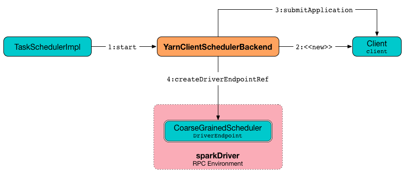

== [[YarnClientSchedulerBackend]] `YarnClientSchedulerBackend` -- SchedulerBackend for YARN in Client Deploy Mode

`YarnClientSchedulerBackend` is the link:spark-yarn-yarnschedulerbackend.adoc[YarnSchedulerBackend] used when a Spark application is link:../spark-submit.adoc[submitted to a YARN cluster] in link:../spark-deploy-mode.adoc#client[`client` deploy mode].

NOTE: `client` deploy mode is the default deploy mode of Spark applications submitted to a YARN cluster.

`YarnClientSchedulerBackend` submits a Spark application when <<start, started>> and <<waitForApplication, waits for the Spark application>> until it finishes (successfully or not).

[[internal-properties]]
.YarnClientSchedulerBackend's Internal Properties
[cols="1,1,2",options="header",width="100%"]
|===
| Name
| Initial Value
| Description

| [[client]] `client`
| (undefined)
| link:spark-yarn-client.adoc[Client] to submit and monitor a Spark application (when `YarnClientSchedulerBackend` <<start, is started>>).

Created when `YarnClientSchedulerBackend` <<start, is started>> and stopped when <<stop, `YarnClientSchedulerBackend` stops>>.

| [[monitorThread]] `monitorThread`
| (undefined)
| <<MonitorThread, MonitorThread>>

|===

[TIP]
====
Enable `DEBUG` logging level for `org.apache.spark.scheduler.cluster.YarnClientSchedulerBackend` logger to see what happens inside `YarnClientSchedulerBackend`.

Add the following line to `conf/log4j.properties`:

```
log4j.logger.org.apache.spark.scheduler.cluster.YarnClientSchedulerBackend=DEBUG
```

Refer to link:../spark-logging.adoc[Logging].
====

[TIP]
====
Enable `DEBUG` logging level for `org.apache.hadoop` logger to see what happens inside Hadoop YARN.

Add the following line to `conf/log4j.properties`:

```
log4j.logger.org.apache.hadoop=DEBUG
```

Refer to link:../spark-logging.adoc[Logging].

Use with caution though as there will be a flood of messages in the logs every second.
====

=== [[start]] Starting YarnClientSchedulerBackend -- `start` Method

[source, scala]
----
start(): Unit
----

NOTE: `start` is part of link:../spark-SchedulerBackend.adoc#contract[SchedulerBackend contract] executed when link:../spark-TaskSchedulerImpl.adoc#start[`TaskSchedulerImpl` starts].

`start` creates <<client, Client>> (to communicate with YARN ResourceManager) and link:spark-yarn-client.adoc#submitApplication[submits a Spark application] to a YARN cluster.

After the application is launched, `start` starts a <<monitorThread, MonitorThread>> state monitor thread. In the meantime it also calls the supertype's `start`.

.Starting YarnClientSchedulerBackend


Internally, `start` takes link:../spark-driver.adoc#spark.driver.host[spark.driver.host] and link:../spark-driver.adoc#spark.driver.port[spark.driver.port] properties for the driver's host and port, respectively.

If link:spark-webui.adoc#spark.ui.enabled[web UI is enabled], `start` sets link:../spark-driver.adoc#spark.driver.appUIAddress[spark.driver.appUIAddress] as `webUrl`.

You should see the following DEBUG message in the logs:

```
DEBUG YarnClientSchedulerBackend: ClientArguments called with: --arg [hostport]
```

NOTE: `hostport` is link:../spark-driver.adoc#spark_driver_host[spark.driver.host] and link:../spark-driver.adoc#spark_driver_port[spark.driver.port] properties separated by `:`, e.g. `192.168.99.1:64905`.

`start` creates a link:spark-yarn-client.adoc#ClientArguments[ClientArguments] (passing in a two-element array with `--arg` and `hostport`).

[[totalExpectedExecutors]]
`start` sets the link:spark-yarn-yarnschedulerbackend.adoc#totalExpectedExecutors[total expected number of executors] to link:spark-yarn-YarnSparkHadoopUtil.adoc#getInitialTargetExecutorNumber[the initial number of executors].

CAUTION: FIXME Why is this part of subtypes since they both set it to the same value?

`start` creates a <<client, Client>> (with the link:spark-yarn-client.adoc#ClientArguments[ClientArguments] and `SparkConf`).

`start` link:spark-yarn-client.adoc#submitApplication[submits the Spark application to YARN] (through <<client, Client>>) and  link:spark-yarn-yarnschedulerbackend.adoc#bindToYarn[saves `ApplicationId`] (with undefined `ApplicationAttemptId`).

`start` starts link:spark-yarn-yarnschedulerbackend.adoc#start[YarnSchedulerBackend] (that in turn starts the top-level link:../spark-CoarseGrainedExecutorBackend.adoc#start[CoarseGrainedSchedulerBackend]).

CAUTION: FIXME Would be very nice to know why `start` does so in a NOTE.

`start` <<waitForApplication, waits until the Spark application is running>>.

(only when link:spark-yarn-settings.adoc#spark.yarn.credentials.file[spark.yarn.credentials.file] is defined) `start` link:spark-yarn-YarnSparkHadoopUtil.adoc#startCredentialUpdater[starts `ConfigurableCredentialManager`].

CAUTION: FIXME Why? Include a NOTE to make things easier.

`start` <<asyncMonitorApplication, creates>> and starts <<monitorThread, monitorThread>> (to monitor the Spark application and stop the current `SparkContext` when it stops).

=== [[stop]] stop

`stop` is part of the link:../spark-SchedulerBackend.adoc#contract[SchedulerBackend Contract].

It stops the internal helper objects, i.e. `monitorThread` and `client` as well as "announces" the stop to other services through `Client.reportLauncherState`. In the meantime it also calls the supertype's `stop`.

`stop` makes sure that the internal `client` has already been created (i.e. it is not `null`), but not necessarily started.

`stop` stops the internal `monitorThread` using `MonitorThread.stopMonitor` method.

It then "announces" the stop using link:spark-yarn-client.adoc#reportLauncherState[Client.reportLauncherState(SparkAppHandle.State.FINISHED)].

Later, it passes the call on to the suppertype's `stop` and, once the supertype's `stop` has finished, it calls link:spark-yarn-YarnSparkHadoopUtil.adoc#stopExecutorDelegationTokenRenewer[YarnSparkHadoopUtil.stopExecutorDelegationTokenRenewer] followed by link:spark-yarn-client.adoc#stop[stopping the internal client].

Eventually, when all went fine, you should see the following INFO message in the logs:

```
INFO YarnClientSchedulerBackend: Stopped
```

=== [[waitForApplication]] Waiting Until Spark Application Runs -- `waitForApplication` Internal Method

[source, scala]
----
waitForApplication(): Unit
----

`waitForApplication` waits until the current application is running (using link:spark-yarn-client.adoc#monitorApplication[Client.monitorApplication]).

If the application has `FINISHED`, `FAILED`, or has been `KILLED`, a `SparkException` is thrown with the following message:

```
Yarn application has already ended! It might have been killed or unable to launch application master.
```

You should see the following INFO message in the logs for `RUNNING` state:

```
INFO YarnClientSchedulerBackend: Application [appId] has started running.
```

NOTE: `waitForApplication` is used when `YarnClientSchedulerBackend` <<start, is started>>.

=== [[asyncMonitorApplication]] asyncMonitorApplication

[source, scala]
----
asyncMonitorApplication(): MonitorThread
----

`asyncMonitorApplication` internal method creates a separate daemon <<MonitorThread, MonitorThread>> thread called "Yarn application state monitor".

NOTE: `asyncMonitorApplication` does not start the daemon thread.

=== [[MonitorThread]] MonitorThread

`MonitorThread` internal class is to monitor a Spark application submitted to a YARN cluster in client deploy mode.

When started, `MonitorThread` requests <<client, Client>>> to link:spark-yarn-client.adoc#monitorApplication[monitor a Spark application] (with `logApplicationReport` disabled).

NOTE: `Client.monitorApplication` is a blocking operation and hence it is wrapped in `MonitorThread` to be executed on a separate thread.

When the call to `Client.monitorApplication` has finished, it is assumed that the application has exited. You should see the following ERROR message in the logs:

```
ERROR Yarn application has already exited with state [state]!
```

That leads to stopping the current `SparkContext` (using link:../spark-SparkContext.adoc#stop[SparkContext.stop]).
