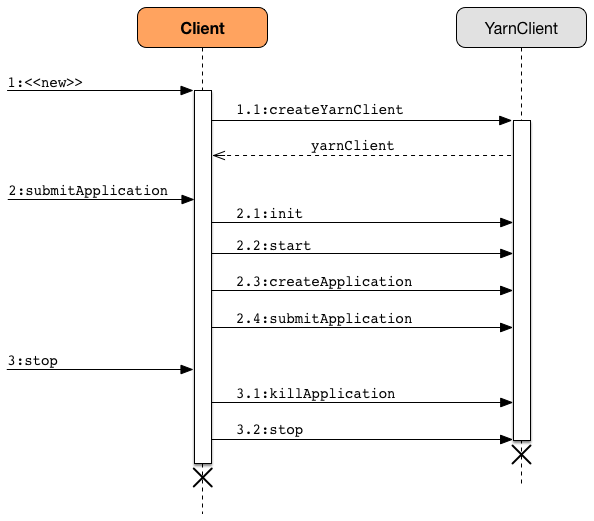

== [[Client]] Client

`Client` is a handle to a YARN cluster to submit link:spark-yarn-applicationmaster.adoc[ApplicationMaster] (that represents a Spark application submitted to a YARN cluster).

.Client and Hadoop's YarnClient Interactions


Depending on the <<isClusterMode, deploy mode>> it uses link:spark-yarn-applicationmaster.adoc[ApplicationMaster] or ApplicationMaster's wrapper link:spark-yarn-applicationmaster.adoc#ExecutorLauncher[ExecutorLauncher] by their class names in a <<createContainerLaunchContext, ContainerLaunchContext>> (that represents all of the information needed by the YARN NodeManager to launch a container).

NOTE: `Client` was initially used as a <<main, standalone application>> to link:../spark-submit.adoc#submit[submit Spark applications] to a YARN cluster, but is currently considered obsolete.

[[internal-properties]]
.Client's Internal Properties
[cols="1,1,2",options="header",width="100%"]
|===
| Name
| Initial Value
| Description

| [[executorMemoryOverhead]] `executorMemoryOverhead`
| link:spark-yarn-settings.adoc#spark.yarn.executor.memoryOverhead[spark.yarn.executor.memoryOverhead] and falls back to link:spark-yarn-YarnSparkHadoopUtil.adoc#MEMORY_OVERHEAD_FACTOR[10%] of the link:../spark-Executor.adoc#spark.executor.memory[spark.executor.memory] or link:spark-yarn-YarnSparkHadoopUtil.adoc#MEMORY_OVERHEAD_MIN[384] whatever is larger.
| FIXME

NOTE: link:spark-yarn-YarnSparkHadoopUtil.adoc#MEMORY_OVERHEAD_FACTOR[10%] and link:spark-yarn-YarnSparkHadoopUtil.adoc#MEMORY_OVERHEAD_MIN[384] are constants and cannot be changed.

|===

[TIP]
====
Enable `INFO` or `DEBUG` logging level for `org.apache.spark.deploy.yarn.Client` logger to see what happens inside.

Add the following line to `conf/log4j.properties`:

```
log4j.logger.org.apache.spark.deploy.yarn.Client=DEBUG
```

Refer to link:../spark-logging.adoc[Logging].
====

=== [[isUserClassPathFirst]] `isUserClassPathFirst` Method

CAUTION: FIXME

=== [[getUserClasspath]] `getUserClasspath` Method

CAUTION: FIXME

=== [[ClientArguments]] `ClientArguments`

CAUTION: FIXME

=== [[setupLaunchEnv]] Setting Up Environment to Launch ApplicationMaster Container -- `setupLaunchEnv` Method

CAUTION: FIXME

=== [[launcherBackend]] `launcherBackend` Property

`launcherBackend`...FIXME

=== [[loginFromKeytab]] `loginFromKeytab` Method

CAUTION: FIXME

=== [[creating-instance]] Creating Client Instance

Creating an instance of `Client` does the following:

* Creates an internal instance of `YarnClient` (using `YarnClient.createYarnClient`) that becomes `yarnClient`.

* Creates an internal instance of `YarnConfiguration` (using `YarnConfiguration` and the input `hadoopConf`) that becomes `yarnConf`.

* Sets the internal `isClusterMode` that says whether link:../spark-deploy-mode.adoc#spark.submit.deployMode[spark.submit.deployMode] is link:../spark-deploy-mode.adoc#cluster[cluster deploy mode].

[[amMemory]]
* Sets the internal `amMemory` to link:../spark-driver.adoc#spark_driver_memory[spark.driver.memory] when `isClusterMode` is enabled or link:spark-yarn-settings.adoc#spark.yarn.am.memory[spark.yarn.am.memory] otherwise.

* Sets the internal `amMemoryOverhead` to link:spark-yarn-settings.adoc#spark.yarn.driver.memoryOverhead[spark.yarn.driver.memoryOverhead] when `isClusterMode` is enabled or link:spark-yarn-settings.adoc#spark.yarn.am.memoryOverhead[spark.yarn.am.memoryOverhead] otherwise. If neither is available, the maximum of 10% of `amMemory` and `384` is chosen.

* Sets the internal `amCores` to link:../spark-driver.adoc#spark_driver_cores[spark.driver.cores] when `isClusterMode` is enabled or link:spark-yarn-settings.adoc#spark.yarn.am.cores[spark.yarn.am.cores] otherwise.

* Sets the internal `executorMemory` to link:../spark-Executor.adoc#spark.executor.memory[spark.executor.memory].

* Sets the internal <<executorMemoryOverhead, executorMemoryOverhead>> to link:spark-yarn-settings.adoc#spark.yarn.executor.memoryOverhead[spark.yarn.executor.memoryOverhead]. If unavailable, it is set to the maximum of 10% of `executorMemory` and `384`.

* Creates an internal instance of link:spark-yarn-ClientDistributedCacheManager.adoc[ClientDistributedCacheManager] (as `distCacheMgr`).

* Sets the variables: `loginFromKeytab` to `false` with `principal`, `keytab`, and `credentials` to `null`.

* Creates an internal instance of `LauncherBackend` (as <<launcherBackend, launcherBackend>>).

* Sets the internal `fireAndForget` flag to the result of `isClusterMode` and not link:spark-yarn-settings.adoc#spark.yarn.submit.waitAppCompletion[spark.yarn.submit.waitAppCompletion].

* Sets the internal variable `appId` to `null`.

* Sets the internal `appStagingBaseDir` to link:spark-yarn-settings.adoc#spark.yarn.stagingDir[spark.yarn.stagingDir] or the home directory of Hadoop.

=== [[submitApplication]] Submitting Spark Application to YARN -- `submitApplication` Method

[source, scala]
----
submitApplication(): ApplicationId
----

`submitApplication` submits a Spark application (represented by link:spark-yarn-applicationmaster.adoc[ApplicationMaster]) to a YARN cluster (i.e. to the link:spark-yarn-introduction.adoc#ResourceManager[YARN ResourceManager]) and returns the application's https://hadoop.apache.org/docs/current/api/org/apache/hadoop/yarn/api/records/ApplicationId.html[ApplicationId].

NOTE: `submitApplication` is also used in the currently-deprecated <<run, Client.run>>.

Internally, it executes `LauncherBackend.connect` first and then executes `Client.setupCredentials` to set up credentials for future calls.

It then https://hadoop.apache.org/docs/current/api/org/apache/hadoop/service/AbstractService.html#init(org.apache.hadoop.conf.Configuration)[inits] the internal <<yarnClient, yarnClient>> (with the internal `yarnConf`) and https://hadoop.apache.org/docs/current/api/org/apache/hadoop/service/AbstractService.html#start()[starts] it. All this happens using Hadoop API.

CAUTION: FIXME How to configure `YarnClient`? What is YARN's `YarnClient.getYarnClusterMetrics`?

You should see the following INFO in the logs:

```
INFO Client: Requesting a new application from cluster with [count] NodeManagers
```

It then https://hadoop.apache.org/docs/current/api/org/apache/hadoop/yarn/client/api/YarnClient.html#createApplication()[YarnClient.createApplication()] to create a new application in YARN and obtains the application id.

The `LauncherBackend` instance changes state to SUBMITTED with the application id.

CAUTION: FIXME Why is this important?

`submitApplication` verifies whether the cluster has resources for the link:spark-yarn-applicationmaster.adoc[ApplicationManager] (using <<verifyClusterResources, verifyClusterResources>>).

It then <<createContainerLaunchContext, creates YARN `ContainerLaunchContext`>> followed by <<createApplicationSubmissionContext, creating YARN `ApplicationSubmissionContext`>>.

You should see the following INFO message in the logs:

```
INFO Client: Submitting application [appId] to ResourceManager
```

`submitApplication` submits the new YARN `ApplicationSubmissionContext` for link:spark-yarn-applicationmaster.adoc[ApplicationMaster] to YARN (using Hadoop's https://hadoop.apache.org/docs/current/api/org/apache/hadoop/yarn/client/api/YarnClient.html#submitApplication(org.apache.hadoop.yarn.api.records.ApplicationSubmissionContext)[YarnClient.submitApplication]).

It returns the YARN https://hadoop.apache.org/docs/current/api/org/apache/hadoop/yarn/api/records/ApplicationId.html[ApplicationId] for the Spark application (represented by link:spark-yarn-applicationmaster.adoc[ApplicationMaster]).

NOTE: `submitApplication` is used when `Client` <<run, runs>> or link:spark-yarn-client-yarnclientschedulerbackend.adoc#start[`YarnClientSchedulerBackend` is started].

=== [[createApplicationSubmissionContext]] Creating YARN ApplicationSubmissionContext -- `createApplicationSubmissionContext` Method

[source, scala]
----
createApplicationSubmissionContext(
  newApp: YarnClientApplication,
  containerContext: ContainerLaunchContext): ApplicationSubmissionContext
----

`createApplicationSubmissionContext` creates YARN's https://hadoop.apache.org/docs/current/api/org/apache/hadoop/yarn/api/records/ApplicationSubmissionContext.html[ApplicationSubmissionContext].

NOTE: YARN's `ApplicationSubmissionContext` represents all of the information needed by the link:spark-yarn-introduction.adoc#ResourceManager[YARN ResourceManager] to launch the link:spark-yarn-applicationmaster.adoc[ApplicationMaster] for a Spark application.

`createApplicationSubmissionContext` uses YARN's https://hadoop.apache.org/docs/current/api/org/apache/hadoop/yarn/client/api/YarnClientApplication.html[YarnClientApplication] (as the input `newApp`) to create a `ApplicationSubmissionContext`.

`createApplicationSubmissionContext` sets the following information in the `ApplicationSubmissionContext`:

[align="center"]
|===
| The name of the Spark application | link:../spark-SparkConf.adoc#spark.app.name[spark.app.name] configuration setting or `Spark` if not set
| Queue (to which the Spark application is submitted) | link:spark-yarn-settings.adoc#spark.yarn.queue[spark.yarn.queue] configuration setting
| `ContainerLaunchContext` (that describes the `Container` with which the `ApplicationMaster` for the Spark application is launched) | the input `containerContext`
| Type of the Spark application | `SPARK`
| Tags for the Spark application | link:spark-yarn-settings.adoc#spark.yarn.tags[spark.yarn.tags] configuration setting
| Number of max attempts of the Spark application to be submitted. | link:spark-yarn-settings.adoc#spark.yarn.maxAppAttempts[spark.yarn.maxAppAttempts] configuration setting
| The `attemptFailuresValidityInterval` in milliseconds for the Spark application | link:spark-yarn-settings.adoc#spark.yarn.am.attemptFailuresValidityInterval[spark.yarn.am.attemptFailuresValidityInterval] configuration setting
| Resource Capabilities for link:spark-yarn-applicationmaster.adoc[ApplicationMaster] for the Spark application | See <<resource, Resource Capabilities for ApplicationMaster -- Memory and Virtual CPU Cores>> section below
| Rolled Log Aggregation for the Spark application | See <<LogAggregationContext, Rolled Log Aggregation Configuration for Spark Application>> section below
|===

You will see the DEBUG message in the logs when the setting is not set:

```
DEBUG spark.yarn.maxAppAttempts is not set. Cluster's default value will be used.
```

==== [[resource]] Resource Capabilities for ApplicationMaster -- Memory and Virtual CPU Cores

NOTE: YARN's https://hadoop.apache.org/docs/current/api/org/apache/hadoop/yarn/api/records/Resource.html[Resource] models a set of computer resources in the cluster. Currently, YARN supports resources with memory and virtual CPU cores capabilities only.

The requested YARN's `Resource` for the link:spark-yarn-applicationmaster.adoc[ApplicationMaster] for a Spark application is the sum of `amMemory` and `amMemoryOverhead` for the memory and `amCores` for the virtual CPU cores.

Besides, if link:spark-yarn-settings.adoc#spark.yarn.am.nodeLabelExpression[spark.yarn.am.nodeLabelExpression] is set, a new YARN https://hadoop.apache.org/docs/current/api/org/apache/hadoop/yarn/api/records/ResourceRequest.html[ResourceRequest] is created (for the `ApplicationMaster` container) that includes:

[align="center"]
|===
|Resource Name| `*` (star) that represents no locality.
|Priority| `0`
|Capability| The resource capabilities as defined above.
|Number of containers| `1`
|Node label expression| link:spark-yarn-settings.adoc#spark.yarn.am.nodeLabelExpression[spark.yarn.am.nodeLabelExpression] configuration setting
|ResourceRequest of AM container| link:spark-yarn-settings.adoc#spark.yarn.am.nodeLabelExpression[spark.yarn.am.nodeLabelExpression] configuration setting
|===

It sets the resource request to this new YARN `ResourceRequest` detailed in the table above.

==== [[LogAggregationContext]] Rolled Log Aggregation for Spark Application

NOTE: YARN's https://hadoop.apache.org/docs/current/api/org/apache/hadoop/yarn/api/records/LogAggregationContext.html[LogAggregationContext] represents all of the information needed by the link:spark-yarn-introduction.adoc#NodeManager[YARN NodeManager] to handle the logs for an application.

If link:spark-yarn-settings.adoc#spark.yarn.rolledLog.includePattern[spark.yarn.rolledLog.includePattern] is defined, it creates a YARN https://hadoop.apache.org/docs/current/api/org/apache/hadoop/yarn/api/records/LogAggregationContext.html[LogAggregationContext] with the following patterns:

[align="center"]
|===
|Include Pattern|link:spark-yarn-settings.adoc#spark.yarn.rolledLog.includePattern[spark.yarn.rolledLog.includePattern] configuration setting
|Exclude Pattern|link:spark-yarn-settings.adoc#spark.yarn.rolledLog.excludePattern[spark.yarn.rolledLog.excludePattern] configuration setting
|===

==== [[verifyClusterResources]] Verifying Maximum Memory Capability of YARN Cluster -- `verifyClusterResources` Internal Method

[source, scala]
----
verifyClusterResources(newAppResponse: GetNewApplicationResponse): Unit
----

`verifyClusterResources` is a private helper method that <<submitApplication, submitApplication>> uses to ensure that the Spark application (as a set of link:spark-yarn-applicationmaster.adoc[ApplicationMaster] and executors) is not going to request more than the maximum memory capability of the YARN cluster. If so, it throws an `IllegalArgumentException`.

`verifyClusterResources` queries the input  https://hadoop.apache.org/docs/current/api/org/apache/hadoop/yarn/api/protocolrecords/GetNewApplicationResponse.html[GetNewApplicationResponse] (as `newAppResponse`) for the maximum memory.

[options="wrap"]
----
INFO Client: Verifying our application has not requested more than the maximum memory capability of the cluster ([maximumMemory] MB per container)
----

If the maximum memory capability is above the required executor or link:spark-yarn-applicationmaster.adoc[ApplicationMaster] memory, you should see the following INFO message in the logs:

[options="wrap"]
----
INFO Client: Will allocate AM container, with [amMem] MB memory including [amMemoryOverhead] MB overhead
----

If however the executor memory (as a sum of link:../spark-Executor.adoc#spark.executor.memory[spark.executor.memory] and link:spark-yarn-settings.adoc#spark.yarn.executor.memoryOverhead[spark.yarn.executor.memoryOverhead] settings) is more than the maximum memory capability, `verifyClusterResources` throws an `IllegalArgumentException` with the following message:

[options="wrap"]
----
Required executor memory ([executorMemory]+[executorMemoryOverhead] MB) is above the max threshold ([maximumMemory] MB) of this cluster! Please check the values of 'yarn.scheduler.maximum-allocation-mb' and/or 'yarn.nodemanager.resource.memory-mb'.
----

If the link:spark-yarn-applicationmaster.adoc[required memory for `ApplicationMaster`] is more than the maximum memory capability, `verifyClusterResources` throws an `IllegalArgumentException` with the following message:

[options="wrap"]
----
Required AM memory ([amMemory]+[amMemoryOverhead] MB) is above the max threshold ([maximumMemory] MB) of this cluster! Please increase the value of 'yarn.scheduler.maximum-allocation-mb'.
----

==== [[createContainerLaunchContext]] Creating YARN ContainerLaunchContext to Launch ApplicationMaster -- `createContainerLaunchContext` Internal Method

[source, scala]
----
createContainerLaunchContext(newAppResponse: GetNewApplicationResponse): ContainerLaunchContext
----

NOTE: The input `GetNewApplicationResponse` is Hadoop YARN's https://hadoop.apache.org/docs/current/api/org/apache/hadoop/yarn/api/protocolrecords/GetNewApplicationResponse.html[GetNewApplicationResponse].

When <<submitApplication, a Spark application is submitted to YARN>>, it calls the private helper method `createContainerLaunchContext` that creates a YARN link:https://hadoop.apache.org/docs/current/api/org/apache/hadoop/yarn/api/records/ContainerLaunchContext.html[ContainerLaunchContext] request for link:spark-yarn-introduction.adoc#NodeManager[YARN NodeManager] to launch link:spark-yarn-applicationmaster.adoc[ApplicationMaster] (in a container).

When called, you should see the following INFO message in the logs:

```
INFO Setting up container launch context for our AM
```

It gets at the application id (from the input `newAppResponse`).

It calculates the path of the application's staging directory.

CAUTION: FIXME What's `appStagingBaseDir`?

It does a _custom_ step for a Python application.

It <<setupLaunchEnv, sets up an environment to launch `ApplicationMaster` container>> and <<prepareLocalResources, prepareLocalResources>>. A `ContainerLaunchContext` record is created with the environment and the local resources.

The JVM options are calculated as follows:

* `-Xmx` (that <<amMemory, was calculated when the Client was created>>)
* `-Djava.io.tmpdir=` - FIXME: `tmpDir`
+
CAUTION: FIXME `tmpDir`?

* Using `UseConcMarkSweepGC` when `SPARK_USE_CONC_INCR_GC` is enabled.
+
CAUTION: FIXME `SPARK_USE_CONC_INCR_GC`?

* In cluster deploy mode, ...FIXME

* In client deploy mode, ...FIXME
+
CAUTION: FIXME

* `-Dspark.yarn.app.container.log.dir=`...FIXME

* Perm gen size option...FIXME

`--class` is set if in cluster mode based on `--class` command-line argument.

CAUTION: FIXME

If `--jar` command-line argument was specified, it is set as `--jar`.

In cluster deploy mode, link:spark-yarn-applicationmaster.adoc[org.apache.spark.deploy.yarn.ApplicationMaster] is created while in client deploy mode it is link:spark-yarn-applicationmaster.adoc#ExecutorLauncher[org.apache.spark.deploy.yarn.ExecutorLauncher].

If `--arg` command-line argument was specified, it is set as `--arg`.

The path for `--properties-file` is <<buildPath, built based on `YarnSparkHadoopUtil.expandEnvironment(Environment.PWD), LOCALIZED_CONF_DIR, SPARK_CONF_FILE`>>.

The entire `ApplicationMaster` argument line (as `amArgs`) is of the form:

```
[amClassName] --class [userClass] --jar [userJar] --arg [userArgs] --properties-file [propFile]
```

The entire command line is of the form:

CAUTION: FIXME `prefixEnv`? How is `path` calculated? `ApplicationConstants.LOG_DIR_EXPANSION_VAR`?

```
[JAVA_HOME]/bin/java -server [javaOpts] [amArgs] 1> [LOG_DIR]/stdout 2> [LOG_DIR]/stderr
```

The command line to launch a `ApplicationMaster` is set to the `ContainerLaunchContext` record (using `setCommands`).

You should see the following DEBUG messages in the logs:

```
DEBUG Client: ===============================================================================
DEBUG Client: YARN AM launch context:
DEBUG Client:     user class: N/A
DEBUG Client:     env:
DEBUG Client:         [launchEnv]
DEBUG Client:     resources:
DEBUG Client:         [localResources]
DEBUG Client:     command:
DEBUG Client:         [commands]
DEBUG Client: ===============================================================================
```

A link:spark-security.adoc#SecurityManager[SecurityManager] is created and set as the application's ACLs.

CAUTION: FIXME `setApplicationACLs`? Set up security tokens?

NOTE: `createContainerLaunchContext` is used when `Client` <<submitApplication, submits a Spark application to a YARN cluster>>.

==== [[prepareLocalResources]] `prepareLocalResources` Method

CAUTION: FIXME

[source, scala]
----
prepareLocalResources(
  destDir: Path,
  pySparkArchives: Seq[String]): HashMap[String, LocalResource]
----

`prepareLocalResources` is...FIXME

CAUTION: FIXME Describe `credentialManager`

When called, `prepareLocalResources` prints out the following INFO message to the logs:

```
INFO Client: Preparing resources for our AM container
```

CAUTION: FIXME What's a delegation token?

`prepareLocalResources` then link:spark-yarn-ConfigurableCredentialManager.adoc#obtainCredentials[obtains security tokens from credential providers and gets the nearest time of the next renewal] (for renewable credentials).

After all the security delegation tokens are obtained and only when there are any, you should see the following DEBUG message in the logs:

```
DEBUG Client: [token1]
DEBUG Client: [token2]
...
DEBUG Client: [tokenN]
```

CAUTION: FIXME Where is `credentials` assigned?

If <<loginFromKeytab, a keytab is used to log in>> and the nearest time of the next renewal is in the future, `prepareLocalResources` sets the internal link:spark-yarn-settings.adoc#spark.yarn.credentials.renewalTime[spark.yarn.credentials.renewalTime] and link:spark-yarn-settings.adoc#spark.yarn.credentials.updateTime[spark.yarn.credentials.updateTime] times for renewal and update security tokens.

It gets the replication factor (using link:spark-yarn-settings.adoc#spark.yarn.submit.file.replication[spark.yarn.submit.file.replication] setting) or falls back to the default value for the input `destDir`.

NOTE: The replication factor is only used for <<copyFileToRemote, copyFileToRemote>> later. Perhaps it should not be mentioned here (?)

It creates the input `destDir` (on a HDFS-compatible file system) with `0700` permission (`rwx------`), i.e. inaccessible to all but its owner and the superuser so the owner only can read, write and execute. It uses Hadoop's https://hadoop.apache.org/docs/current/api/org/apache/hadoop/fs/Path.html#getFileSystem(org.apache.hadoop.conf.Configuration)[Path.getFileSystem] to access Hadoop's https://hadoop.apache.org/docs/current/api/org/apache/hadoop/fs/FileSystem.html[FileSystem] that owns `destDir` (using the constructor's `hadoopConf` -- Hadoop's Configuration).

TIP: See https://hadoop.apache.org/docs/current/api/org/apache/hadoop/fs/FileSystem.html[org.apache.hadoop.fs.FileSystem] to know a list of HDFS-compatible file systems, e.g. http://aws.amazon.com/s3/[Amazon S3] or https://azure.microsoft.com/[Windows Azure].

If <<loginFromKeytab, a keytab is used to log in>>, ...FIXME

CAUTION: FIXME `if (loginFromKeytab)`

If the link:spark-yarn-settings.adoc#spark.yarn.archive[location of the single archive containing Spark jars (spark.yarn.archive)] is set, it is <<distribute, distributed>> (as ARCHIVE) to `__spark_libs__`.

Else if the link:spark-yarn-settings.adoc#spark.yarn.jars[location of the Spark jars (spark.yarn.jars)] is set, ...FIXME

CAUTION: FIXME Describe `case Some(jars)`

If neither link:spark-yarn-settings.adoc#spark.yarn.archive[spark.yarn.archive] nor link:spark-yarn-settings.adoc#spark.yarn.jars[spark.yarn.jars] is set, you should see the following WARN message in the logs:

```
WARN Client: Neither spark.yarn.jars nor spark.yarn.archive is set, falling back to uploading libraries under SPARK_HOME.
```

It then finds the directory with jar files under `SPARK_HOME` (using `YarnCommandBuilderUtils.findJarsDir`).

CAUTION: FIXME `YarnCommandBuilderUtils.findJarsDir`

And all the jars are zipped to a temporary archive, e.g. `__spark_libs__2944590295025097383.zip` that is `distribute` as `ARCHIVE` to `__spark_libs__` (only when they differ).

If a user jar (`--jar`) was specified on command line, the jar is `distribute` as `FILE` to `__app__.jar`.

It then <<distribute, distributes>> additional resources specified in SparkConf for the application, i.e. jars (under link:spark-yarn-settings.adoc#spark.yarn.dist.jars[spark.yarn.dist.jars]), files (under link:spark-yarn-settings.adoc#spark.yarn.dist.files[spark.yarn.dist.files]), and archives (under link:spark-yarn-settings.adoc#spark.yarn.dist.archives[spark.yarn.dist.archives]).

NOTE: The additional files to distribute can be defined using link:spark-submit.adoc[spark-submit] using command-line options link:spark-submit.adoc#jars[--jars], link:spark-submit.adoc#files[--files], and link:spark-submit.adoc#archives[--archives].

CAUTION: FIXME Describe `distribute`

It sets link:spark-yarn-settings.adoc#spark.yarn.secondary.jars[spark.yarn.secondary.jars] for the jars that have localized path (non-local paths) or their path (for local paths).

It link:spark-yarn-ClientDistributedCacheManager.adoc#updateConfiguration[updates Spark configuration] (with internal configuration settings using the internal `distCacheMgr` reference).

CAUTION: FIXME Where are they used? It appears they are required for link:spark-yarn-applicationmaster.adoc#localResources[`ApplicationMaster` when it prepares local resources], but what is the sequence of calls to lead to `ApplicationMaster`?

It uploads `__spark_conf__.zip` to the input `destDir` and sets link:spark-yarn-settings.adoc#spark.yarn.cache.confArchive[spark.yarn.cache.confArchive]

It <<createConfArchive, creates configuration archive>> and `copyFileToRemote(destDir, localConfArchive, replication, force = true, destName = Some(LOCALIZED_CONF_ARCHIVE))`.

CAUTION: FIXME `copyFileToRemote(destDir, localConfArchive, replication, force = true, destName = Some(LOCALIZED_CONF_ARCHIVE))`?

It link:spark-yarn-ClientDistributedCacheManager.adoc#addResource[adds a cache-related resource] (using the internal `distCacheMgr`).

CAUTION: FIXME What resources? Where? Why is this needed?

Ultimately, it clears the cache-related internal configuration settings -- link:spark-yarn-settings.adoc#spark.yarn.cache.filenames[spark.yarn.cache.filenames], link:spark-yarn-settings.adoc#spark.yarn.cache.sizes[spark.yarn.cache.sizes], link:spark-yarn-settings.adoc#spark.yarn.cache.timestamps[spark.yarn.cache.timestamps], link:spark-yarn-settings.adoc#spark.yarn.cache.visibilities[spark.yarn.cache.visibilities], link:spark-yarn-settings.adoc#spark.yarn.cache.types[spark.yarn.cache.types], link:spark-yarn-settings.adoc#spark.yarn.cache.confArchive[spark.yarn.cache.confArchive] -- from the `SparkConf` configuration since they are internal and should not "pollute" the web UI's environment page.

The `localResources` are returned.

CAUTION: FIXME How is `localResources` calculated?

NOTE: It is exclusively used when <<createContainerLaunchContext, Client creates a `ContainerLaunchContext` to launch a `ApplicationMaster` container>>.

==== [[createConfArchive]] Creating ++__spark_conf__.zip++ Archive With Configuration Files and Spark Configuration -- `createConfArchive` Internal Method

[source, scala]
----
createConfArchive(): File
----

`createConfArchive` is a private helper method that <<prepareLocalResources, prepareLocalResources>> uses to create an archive with the local config files -- `log4j.properties` and `metrics.properties` (before distributing it and the other files for link:spark-yarn-applicationmaster.adoc[ApplicationMaster] and executors to use on a YARN cluster).

The archive will also contain all the files under `HADOOP_CONF_DIR` and `YARN_CONF_DIR` environment variables (if defined).

Additionally, the archive contains a `__spark_conf__.properties` with the current link:../spark-SparkConf.adoc[Spark configuration].

The archive is a temporary file with the `__spark_conf__` prefix and `.zip` extension with the files above.

==== [[copyFileToRemote]] Copying File to Remote File System -- `copyFileToRemote` Method

[source, scala]
----
copyFileToRemote(
  destDir: Path,
  srcPath: Path,
  replication: Short,
  force: Boolean = false,
  destName: Option[String] = None): Path
----

`copyFileToRemote` is a `private[yarn]` method to copy `srcPath` to the remote file system `destDir` (if needed) and return the destination path resolved following symlinks and mount points.

NOTE: It is exclusively used in <<prepareLocalResources, prepareLocalResources>>.

Unless `force` is enabled (it is disabled by default), `copyFileToRemote` will only copy `srcPath` when the source (of `srcPath`) and target (of `destDir`) file systems are the same.

You should see the following INFO message in the logs:

```
INFO Client: Uploading resource [srcPath] -> [destPath]
```

`copyFileToRemote` copies `srcPath` to `destDir` and sets `644` permissions, i.e. world-wide readable and owner writable.

If `force` is disabled or the files are the same, `copyFileToRemote` will only print out the following INFO message to the logs:

```
INFO Client: Source and destination file systems are the same. Not copying [srcPath]
```

Ultimately, `copyFileToRemote` returns the destination path resolved following symlinks and mount points.

=== [[populateClasspath]] Populating CLASSPATH for ApplicationMaster and Executors -- `populateClasspath` Method

[source, scala]
----
populateClasspath(
  args: ClientArguments,
  conf: Configuration,
  sparkConf: SparkConf,
  env: HashMap[String, String],
  extraClassPath: Option[String] = None): Unit
----

`populateClasspath` is a `private[yarn]` helper method that populates the CLASSPATH (for <<setupLaunchEnv, ApplicationMaster>> and link:spark-yarn-ExecutorRunnable.adoc#prepareEnvironment[executors]).

NOTE: The input `args` is `null` when link:spark-yarn-ExecutorRunnable.adoc#prepareEnvironment[preparing environment for `ExecutorRunnable`] and the constructor's `args` for `Client`.

It merely <<addClasspathEntry, adds the following entries to the CLASSPATH key in the input `env`>>:

1. The optional `extraClassPath` (which is first <<getClusterPath, changed to include paths on YARN cluster machines>>).
+
NOTE: `extraClassPath` corresponds to link:../spark-driver.adoc#spark_driver_extraClassPath[spark.driver.extraClassPath] for the driver and link:../spark-Executor.adoc#spark.executor.extraClassPath[spark.executor.extraClassPath] for executors.

2. YARN's own `Environment.PWD`
3. `\\__spark_conf__` directory under YARN's `Environment.PWD`

4. If the _deprecated_ link:spark-yarn-settings.adoc#spark.yarn.user.classpath.first[spark.yarn.user.classpath.first] is set, ...FIXME
+
CAUTION: FIXME

5. `\\__spark_libs__/*` under YARN's `Environment.PWD`

6. (unless the optional link:spark-yarn-settings.adoc#spark.yarn.archive[spark.yarn.archive] is defined) All the `local` jars in link:spark-yarn-settings.adoc#spark.yarn.jars[spark.yarn.jars] (which are first <<getClusterPath, changed to be paths on YARN cluster machines>>).

7. All the entries from YARN's `yarn.application.classpath` or `YarnConfiguration.DEFAULT_YARN_APPLICATION_CLASSPATH` (if `yarn.application.classpath` is not set)

8. All the entries from YARN's `mapreduce.application.classpath` or `MRJobConfig.DEFAULT_MAPREDUCE_APPLICATION_CLASSPATH` (if `mapreduce.application.classpath` not set).

9. link:README.adoc#SPARK_DIST_CLASSPATH[SPARK_DIST_CLASSPATH] (which is first <<getClusterPath, changed to include paths on YARN cluster machines>>).

[TIP]
====
You should see the result of executing `populateClasspath` when you enable `DEBUG` logging level for the `org.apache.spark.deploy.yarn.Client` logger, i.e.

```
DEBUG Client:     env:
DEBUG Client:         CLASSPATH -> {{PWD}}<CPS>{{PWD}}/__spark_conf__<CPS>{{PWD}}/__spark_libs__/*<CPS>$HADOOP_CONF_DIR<CPS>$HADOOP_COMMON_HOME/share/hadoop/common/*<CPS>$HADOOP_COMMON_HOME/share/hadoop/common/lib/*<CPS>$HADOOP_HDFS_HOME/share/hadoop/hdfs/*<CPS>$HADOOP_HDFS_HOME/share/hadoop/hdfs/lib/*<CPS>$HADOOP_YARN_HOME/share/hadoop/yarn/*<CPS>$HADOOP_YARN_HOME/share/hadoop/yarn/lib/*<CPS>$HADOOP_MAPRED_HOME/share/hadoop/mapreduce/*<CPS>$HADOOP_MAPRED_HOME/share/hadoop/mapreduce/lib/*
```
====

==== [[getClusterPath]] Changing Path to be YARN NodeManager-aware -- `getClusterPath` Method

[source, scala]
----
getClusterPath(conf: SparkConf, path: String): String
----

`getClusterPath` replaces any occurences of link:spark-yarn-settings.adoc#spark.yarn.config.gatewayPath[spark.yarn.config.gatewayPath] in `path` to the value of link:spark-yarn-settings.adoc#spark.yarn.config.replacementPath[spark.yarn.config.replacementPath].

==== [[addClasspathEntry]] Adding CLASSPATH Entry to Environment -- `addClasspathEntry` Method

[source, scala]
----
addClasspathEntry(path: String, env: HashMap[String, String]): Unit
----

`addClasspathEntry` is a private helper method to link:spark-yarn-YarnSparkHadoopUtil.adoc#addPathToEnvironment[add the input `path` to `CLASSPATH` key in the input `env`].

==== [[distribute]] Distributing Files to Remote File System -- `distribute` Internal Method

[source, scala]
----
distribute(
  path: String,
  resType: LocalResourceType = LocalResourceType.FILE,
  destName: Option[String] = None,
  targetDir: Option[String] = None,
  appMasterOnly: Boolean = false): (Boolean, String)
----

`distribute` is an internal helper method that <<prepareLocalResources, prepareLocalResources>> uses to find out whether the input `path` is of `local:` URI scheme and return a localized path for a non-`local` path, or simply the input `path` for a local one.

`distribute` returns a pair with the first element being a flag for the input `path` being local or non-local, and the other element for the local or localized path.

For local `path` that was not distributed already, `distribute` <<copyFileToRemote, copies the input `path` to remote file system>> (if needed) and link:spark-yarn-ClientDistributedCacheManager.adoc#addResource[adds `path` to the application's distributed cache].

=== [[buildPath]] Joining Path Components using Path.SEPARATOR -- `buildPath` Method

[source, scala]
----
buildPath(components: String*): String
----

`buildPath` is a helper method to join all the path `components` using the directory separator, i.e. https://hadoop.apache.org/docs/current/api/org/apache/hadoop/fs/Path.html#SEPARATOR[org.apache.hadoop.fs.Path.SEPARATOR].

=== [[isClusterMode]] `isClusterMode` Internal Flag

`isClusterMode` is an internal flag that says whether the Spark application runs in link:spark-deploy-mode.adoc#cluster[cluster] or link:spark-deploy-mode.adoc#client[client] deploy mode. The flag is enabled for `cluster` deploy mode, i.e. `true`.

NOTE: Since a Spark application requires different settings per deploy mode, `isClusterMode` flag effectively "splits" `Client` on two parts per deploy mode -- one responsible for `client` and the other for `cluster` deploy mode.

CAUTION: FIXME Replace the internal fields used below with their true meanings.

.Internal Attributes of `Client` per Deploy Mode (`isClusterMode` flag)
[align="center",cols="1,2,2"options="header"]
|===
| Internal attribute | cluster deploy mode | client deploy mode
| `amMemory` | link:../spark-driver.adoc#spark_driver_memory[spark.driver.memory] | link:spark-yarn-settings.adoc#spark.yarn.am.memory[spark.yarn.am.memory]
| `amMemoryOverhead` | link:spark-yarn-settings.adoc#spark.yarn.driver.memoryOverhead[spark.yarn.driver.memoryOverhead] | link:spark-yarn-settings.adoc#spark.yarn.am.memoryOverhead[spark.yarn.am.memoryOverhead]
| `amCores` | link:../spark-driver.adoc#spark_driver_cores[spark.driver.cores] | link:spark-yarn-settings.adoc#spark.yarn.am.cores[spark.yarn.am.cores]
| `javaOpts` | link:../spark-driver.adoc#spark_driver_extraJavaOptions[spark.driver.extraJavaOptions] | link:spark-yarn-settings.adoc#spark.yarn.am.extraJavaOptions[spark.yarn.am.extraJavaOptions]
| `libraryPaths` | link:../spark-driver.adoc#spark_driver_extraLibraryPath[spark.driver.extraLibraryPath] and link:../spark-driver.adoc#spark_driver_libraryPath[spark.driver.libraryPath] | link:spark-yarn-settings.adoc#spark.yarn.am.extraLibraryPath[spark.yarn.am.extraLibraryPath]
| link:spark-yarn-applicationmaster.adoc#command-line-parameters[`--class` command-line argument for `ApplicationMaster`] | `args.userClass` |
| Application master class | link:spark-yarn-applicationmaster.adoc[org.apache.spark.deploy.yarn.ApplicationMaster] | link:spark-yarn-applicationmaster.adoc[org.apache.spark.deploy.yarn.ExecutorLauncher]
|===

When the `isClusterMode` flag is enabled, the <<yarnClient, internal reference to YARN's `YarnClient`>> is used to stop application.

When the `isClusterMode` flag is enabled (and link:spark-yarn-settings.adoc#spark.yarn.submit.waitAppCompletion[spark.yarn.submit.waitAppCompletion] is disabled), so is `fireAndForget` internal flag.

=== [[SPARK_YARN_MODE]] `SPARK_YARN_MODE` flag

`SPARK_YARN_MODE` flag controls...FIXME

NOTE: Any environment variable with the `SPARK_` prefix is propagated to all (remote) processes.

CAUTION: FIXME Where is `SPARK_` prefix rule enforced?

NOTE: `SPARK_YARN_MODE` is a system property (i.e. available using `System.getProperty`) and a environment variable (i.e. available using `System.getenv` or `sys.env`). See link:spark-yarn-YarnSparkHadoopUtil.adoc[YarnSparkHadoopUtil].

It is enabled (i.e. `true`) when link:spark-sparkcontext-creating-instance-internals.adoc#SPARK_YARN_MODE[SparkContext is created for Spark on YARN in client deploy mode], when <<setupLaunchEnv, `Client` sets up an environment to launch `ApplicationMaster` container>> (and, what is currently considered deprecated, <<main, a Spark application was deployed to a YARN cluster>>).

CAUTION: FIXME Why is this needed? `git blame` it.

`SPARK_YARN_MODE` flag is checked when link:spark-yarn-YarnSparkHadoopUtil.adoc#get[YarnSparkHadoopUtil] or link:../varia/spark-hadoop.adoc#get[SparkHadoopUtil] are accessed.

It is cleared later when <<stop, Client is requested to stop>>.

=== [[yarnClient]] Internal Hadoop's YarnClient -- `yarnClient` Property

[source, scala]
----
val yarnClient = YarnClient.createYarnClient
----

`yarnClient` is a private internal reference to Hadoop's https://hadoop.apache.org/docs/current/api/org/apache/hadoop/yarn/client/api/YarnClient.html[YarnClient] that `Client` uses to <<submitApplication, create and submit a YARN application>> (for your Spark application),  <<launcherBackend, killApplication>>.

`yarnClient` is inited and started when <<submitApplication, `Client` submits a Spark application to a YARN cluster>>.

`yarnClient` is stopped when <<stop, `Client` stops>>.

=== [[main]] Launching Client Standalone Application -- `main` Method

`main` method is invoked while a Spark application is being deployed to a YARN cluster.

NOTE: It is executed by link:spark-submit.adoc#submit[spark-submit] with `--master yarn` command-line argument.

[NOTE]
====
When you start the `main` method when starting the `Client` standalone application, say using `./bin/spark-class org.apache.spark.deploy.yarn.Client`, you will see the following WARN message in the logs unless you set `SPARK_SUBMIT` system property.

```
WARN Client: WARNING: This client is deprecated and will be removed in a future version of Spark. Use ./bin/spark-submit with "--master yarn"
```
====

`main` turns <<SPARK_YARN_MODE, SPARK_YARN_MODE flag>> on.

It then instantiates link:../spark-SparkConf.adoc[SparkConf], parses command-line arguments (using <<ClientArguments, ClientArguments>>) and passes the call on to <<run, Client.run>> method.

=== [[stop]] Stopping Client (with LauncherBackend and YarnClient) -- `stop` Method

[source, scala]
----
stop(): Unit
----

`stop` closes the internal <<launcherBackend, LauncherBackend>> and stops the internal <<yarnClient, YarnClient>>.

It also clears <<SPARK_YARN_MODE, SPARK_YARN_MODE flag>> (to allow switching between cluster types).

=== [[run]] Running Client -- `run` Method

`run` <<submitApplication, submits a Spark application>> to a link:spark-yarn-introduction.adoc[YARN ResourceManager] (RM).

If `LauncherBackend` is not connected to a RM, i.e. `LauncherBackend.isConnected` returns `false`, and `fireAndForget` is enabled, ...FIXME

CAUTION: FIXME When could `LauncherBackend` lost the connection since it was connected in <<submitApplication, submitApplication>>?

CAUTION: FIXME What is `fireAndForget`?

Otherwise, when `LauncherBackend` is connected or `fireAndForget` is disabled, <<monitorApplication, monitorApplication>> is called. It returns a pair of `yarnApplicationState` and `finalApplicationStatus` that is checked against three different state pairs and throw a `SparkException`:

* `YarnApplicationState.KILLED` or `FinalApplicationStatus.KILLED` lead to `SparkException` with the message "Application [appId] is killed".

* `YarnApplicationState.FAILED` or `FinalApplicationStatus.FAILED` lead to `SparkException` with the message "Application [appId] finished with failed status".

* `FinalApplicationStatus.UNDEFINED` leads to `SparkException` with the message "The final status of application [appId] is undefined".

CAUTION: FIXME What are `YarnApplicationState` and `FinalApplicationStatus` statuses?

=== [[monitorApplication]] `monitorApplication` Method

[source, scala]
----
monitorApplication(
  appId: ApplicationId,
  returnOnRunning: Boolean = false,
  logApplicationReport: Boolean = true): (YarnApplicationState, FinalApplicationStatus)
----

`monitorApplication` continuously reports the status of a Spark application `appId` every link:spark-yarn-settings.adoc#spark.yarn.report.interval[spark.yarn.report.interval] until the application state is one of the following https://hadoop.apache.org/docs/current/api/org/apache/hadoop/yarn/api/records/YarnApplicationState.html[YarnApplicationState]:

* `RUNNING` (when `returnOnRunning` is enabled)
* `FINISHED`
* `FAILED`
* `KILLED`

NOTE: It is used in <<run, run>>, link:spark-yarn-client-yarnclientschedulerbackend.adoc#waitForApplication[YarnClientSchedulerBackend.waitForApplication] and `MonitorThread.run`.

It gets the application's report from the link:spark-yarn-introduction.adoc#ResourceManager[YARN ResourceManager] to obtain https://hadoop.apache.org/docs/current/api/org/apache/hadoop/yarn/api/records/YarnApplicationState.html[YarnApplicationState] of the link:spark-yarn-applicationmaster.adoc[ApplicationMaster].

TIP: It uses Hadoop's `YarnClient.getApplicationReport(appId)`.

Unless `logApplicationReport` is disabled, it prints the following INFO message to the logs:

```
INFO Client: Application report for [appId] (state: [state])
```

If `logApplicationReport` and DEBUG log level are enabled, it prints report details every time interval to the logs:

```
16/04/23 13:21:36 INFO Client:
	 client token: N/A
	 diagnostics: N/A
	 ApplicationMaster host: N/A
	 ApplicationMaster RPC port: -1
	 queue: default
	 start time: 1461410495109
	 final status: UNDEFINED
	 tracking URL: http://japila.local:8088/proxy/application_1461410200840_0001/
	 user: jacek
```

For INFO log level it prints report details only when the application state changes.

When the application state changes, `LauncherBackend` is notified (using `LauncherBackend.setState`).

NOTE: The application state is an instance of Hadoop's `YarnApplicationState`.

For states `FINISHED`, `FAILED` or `KILLED`, <<cleanupStagingDir, cleanupStagingDir>> is called and the method finishes by returning a pair of the current state and the final application status.

If `returnOnRunning` is enabled (it is disabled by default) and the application state turns `RUNNING`, the method returns a pair of the current state `RUNNING` and the final application status.

NOTE: <<cleanupStagingDir, cleanupStagingDir>> won't be called when `returnOnRunning` is enabled and an application turns RUNNING. _I guess it is likely a left-over since the Client is deprecated now_.

The current state is recorded for future checks (in the loop).

=== [[cleanupStagingDir]] `cleanupStagingDir` Method

`cleanupStagingDir` clears the staging directory of an application.

NOTE: It is used in <<submitApplication, submitApplication>> when there is an exception and <<monitorApplication, monitorApplication>> when an application finishes and the method quits.

It uses link:spark-yarn-settings.adoc#spark.yarn.stagingDir[spark.yarn.stagingDir] setting or falls back to a user's home directory for the staging directory. If link:spark-yarn-settings.adoc#spark.yarn.preserve.staging.files[cleanup is enabled], it deletes the entire staging directory for the application.

You should see the following INFO message in the logs:

```
INFO Deleting staging directory [stagingDirPath]
```

=== [[reportLauncherState]] `reportLauncherState` Method

[source, scala]
----
reportLauncherState(state: SparkAppHandle.State): Unit
----

`reportLauncherState` merely passes the call on to `LauncherBackend.setState`.

CAUTION: What does `setState` do?
