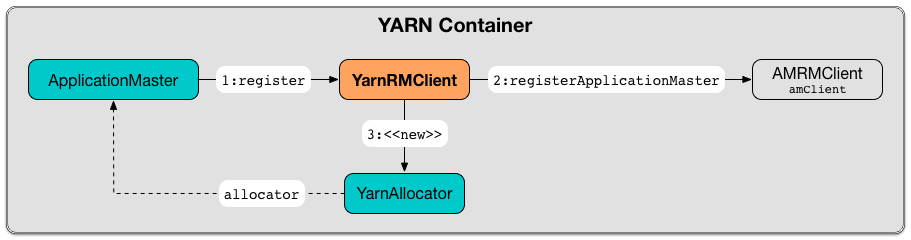

== [[YarnRMClient]] YarnRMClient

`YarnRMClient` is responsible for <<register, registering>> and <<unregister, unregistering>> a Spark application (in the form of link:spark-yarn-applicationmaster.adoc[ApplicationMaster]) with link:spark-yarn-introduction.adoc#ResourceManager[YARN ResourceManager] (and hence _RM_ in the name).

.Registering ApplicationMaster with YARN ResourceManager


`YarnRMClient` is just a wrapper for https://hadoop.apache.org/docs/current/api/org/apache/hadoop/yarn/client/api/AMRMClient.html[AMRMClient[ContainerRequest\]] that is started when <<register, registering `ApplicationMaster`>> (and never stopped explicitly!).

`YarnRMClient` tracks the <<getAttemptId, application attempt identifiers>> and the <<getMaxRegAttempts, maximum number of attempts to register `ApplicationMaster`>>.

[[internal-registries]]
.YarnRMClient's Internal Registries and Counters
[cols="1,2",options="header",width="100%"]
|===
| Name
| Description

| [[amClient]] `amClient`
| https://hadoop.apache.org/docs/current/api/org/apache/hadoop/yarn/client/api/AMRMClient.html[AMRMClient] using `ContainerRequest` for YARN ResourceManager.

Created (initialized and started) when `YarnRMClient` <<register, registers `ApplicationMaster`>>.

Used when `YarnRMClient` <<register, creates a `YarnAllocator`>> (after registering `ApplicationMaster`) and to <<unregister, unregister `ApplicationMaster`>>.

| [[uiHistoryAddress]] `uiHistoryAddress`
|

| [[registered]] `registered`
| Flag to say whether <<register, `YarnRMClient` is connected to YARN ResourceManager>> (i.e. `true`) or not. Disabled by default. Used when <<unregister, unregistering `ApplicationMaster`>>.
|===

[TIP]
====
Enable `INFO` logging level for `org.apache.spark.deploy.yarn.YarnRMClient` logger to see what happens inside.

Add the following line to `conf/log4j.properties`:

```
log4j.logger.org.apache.spark.deploy.yarn.YarnRMClient=INFO
```

Refer to link:../spark-logging.adoc[Logging].
====

=== [[register]] Registering ApplicationMaster with YARN ResourceManager (and Creating YarnAllocator) -- `register` Method

[source, scala]
----
register(
  driverUrl: String,
  driverRef: RpcEndpointRef,
  conf: YarnConfiguration,
  sparkConf: SparkConf,
  uiAddress: String,
  uiHistoryAddress: String,
  securityMgr: SecurityManager,
  localResources: Map[String, LocalResource]): YarnAllocator
----

`register` creates a <<amClient, AMRMClient>>, initializes it (using the input https://hadoop.apache.org/docs/current/api/org/apache/hadoop/yarn/conf/YarnConfiguration.html[YarnConfiguration]) and starts immediately.

NOTE: `AMRMClient` is used in YARN to register an application's `ApplicationMaster` with the YARN ResourceManager.

[TIP]
====
`register` connects to YARN ResourceManager using the following design pattern:

[source, scala]
----
val amClient: AMRMClient[ContainerRequest] = AMRMClient.createAMRMClient()
amClient.init(conf)
amClient.start()
----
====

`register` saves the input `uiHistoryAddress` as <<uiHistoryAddress, uiHistoryAddress>>.

You should see the following INFO message in the logs (in stderr in YARN):

```
INFO YarnRMClient: Registering the ApplicationMaster
```

`register` then uses <<amClient, AMRMClient>> to link:++https://hadoop.apache.org/docs/current/api/org/apache/hadoop/yarn/client/api/AMRMClient.html#registerApplicationMaster(java.lang.String, int, java.lang.String)++[register the Spark application's `ApplicationMaster`] (using the local hostname, the port `0` and the input `uiAddress`).

NOTE: The input `uiAddress` is the web UI of the Spark application and is specified using the link:spark-yarn-applicationmaster.adoc#runDriver[SparkContext] (when the application runs in `cluster` deploy mode) or using link:../spark-driver.adoc#spark.driver.appUIAddress[spark.driver.appUIAddress] property.

<<registered, registered>> flag is enabled.

In the end, `register` link:spark-yarn-YarnAllocator.adoc#creating-instance[creates a new `YarnAllocator`] (using the input parameters of `register` and the internal <<amClient, AMRMClient>>).

NOTE: `register` is used exclusively when link:spark-yarn-applicationmaster.adoc#registerAM[`ApplicationMaster` registers itself] with the YARN ResourceManager.

=== [[unregister]] Unregistering ApplicationMaster from YARN ResourceManager -- `unregister` Method

[source, scala]
----
unregister(status: FinalApplicationStatus, diagnostics: String = ""): Unit
----

`unregister` unregisters the ApplicationMaster of a Spark application.

It basically checks that <<register, `ApplicationMaster` is registered>> and only when it is requests the internal link:++https://hadoop.apache.org/docs/current/api/org/apache/hadoop/yarn/client/api/AMRMClient.html#unregisterApplicationMaster(org.apache.hadoop.yarn.api.records.FinalApplicationStatus, java.lang.String, java.lang.String)++[AMRMClient to unregister].

`unregister` is called when link:spark-yarn-applicationmaster.adoc#unregister[`ApplicationMaster` wants to unregister].

=== [[getMaxRegAttempts]] Maximum Number of Attempts to Register ApplicationMaster -- `getMaxRegAttempts` Method

[source, scala]
----
getMaxRegAttempts(sparkConf: SparkConf, yarnConf: YarnConfiguration): Int
----

`getMaxRegAttempts` uses link:../spark-SparkConf.adoc[SparkConf] and YARN's https://hadoop.apache.org/docs/current/api/org/apache/hadoop/yarn/conf/YarnConfiguration.html[YarnConfiguration] to read configuration settings and return the maximum number of application attempts before link:spark-yarn-applicationmaster.adoc[ApplicationMaster] registration with YARN is considered unsuccessful (and so the Spark application).

It reads YARN's `yarn.resourcemanager.am.max-attempts` (available as https://hadoop.apache.org/docs/current/api/org/apache/hadoop/yarn/conf/YarnConfiguration.html#RM_AM_MAX_ATTEMPTS[YarnConfiguration.RM_AM_MAX_ATTEMPTS]) or falls back to https://hadoop.apache.org/docs/current/api/org/apache/hadoop/yarn/conf/YarnConfiguration.html#DEFAULT_RM_AM_MAX_ATTEMPTS[YarnConfiguration.DEFAULT_RM_AM_MAX_ATTEMPTS] (which is `2`).

The return value is the minimum of the configuration settings of YARN and Spark.

=== [[getAttemptId]] Getting ApplicationAttemptId of Spark Application -- `getAttemptId` Method

[source, scala]
----
getAttemptId(): ApplicationAttemptId
----

`getAttemptId` returns YARN's `ApplicationAttemptId` (of the Spark application to which the container was assigned).

Internally, it uses YARN-specific methods like link:spark-yarn-YarnSparkHadoopUtil.adoc#getContainerId[ConverterUtils.toContainerId] and https://hadoop.apache.org/docs/current/api/index.html?org/apache/hadoop/yarn/client/api/YarnClient.html[ContainerId.getApplicationAttemptId].

=== [[getAmIpFilterParams]] `getAmIpFilterParams` Method

CAUTION: FIXME
