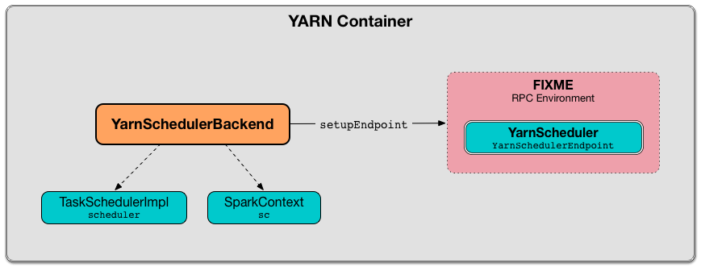

== [[YarnSchedulerBackend]] YarnSchedulerBackend -- Foundation for Coarse-Grained Scheduler Backends for YARN

`YarnSchedulerBackend` is a link:../spark-CoarseGrainedSchedulerBackend.adoc[CoarseGrainedSchedulerBackend] that acts as the foundation for the concrete deploy mode-specific Spark scheduler backends for YARN, i.e. link:spark-yarn-client-yarnclientschedulerbackend.adoc[YarnClientSchedulerBackend] and link:spark-yarn-cluster-yarnclusterschedulerbackend.adoc[YarnClusterSchedulerBackend] for link:../spark-deploy-mode.adoc#client[`client` deploy mode] and link:../spark-deploy-mode.adoc#cluster[`cluster` deploy mode], respectively.

`YarnSchedulerBackend` registers itself as <<yarnSchedulerEndpointRef, `YarnScheduler` RPC endpoint>> in the RPC Environment.

.YarnSchedulerBackend in YARN Container


`YarnSchedulerBackend` is ready to accept task launch requests right after the <<sufficientResourcesRegistered, sufficient executors are registered>> (that varies on dynamic allocation being enabled or not).

NOTE: With no extra configuration, `YarnSchedulerBackend` is ready for task launch requests when 80% of all the requested executors are available.

NOTE: `YarnSchedulerBackend` is an `private[spark]` abstract class and is never created directly (but only indirectly through the concrete implementations link:spark-yarn-client-yarnclientschedulerbackend.adoc[YarnClientSchedulerBackend] and link:spark-yarn-cluster-yarnclusterschedulerbackend.adoc[YarnClusterSchedulerBackend]).

[[internal-properties]]
.YarnSchedulerBackend's Internal Properties
[cols="1,1,2",options="header",width="100%"]
|===
| Name
| Initial Value
| Description

| [[minRegisteredRatio]] `minRegisteredRatio`
a| Ratio for minimum number of registered executors to claim `YarnSchedulerBackend` is ready for task launch requests.

* `0.8` (when link:../spark-CoarseGrainedSchedulerBackend.adoc#spark.scheduler.minRegisteredResourcesRatio[spark.scheduler.minRegisteredResourcesRatio] property is undefined)

* link:../spark-CoarseGrainedSchedulerBackend.adoc#minRegisteredRatio#minRegisteredRatio[minRegisteredRatio] from the parent `CoarseGrainedSchedulerBackend`

| Minimum expected number of executors that is used to ensure that <<sufficientResourcesRegistered, sufficient resources are available>> (and start accepting task launch requests).

| [[yarnSchedulerEndpoint]] `yarnSchedulerEndpoint`
| link:spark-yarn-cluster-YarnSchedulerEndpoint.adoc[YarnSchedulerEndpoint] object
|

| [[yarnSchedulerEndpointRef]] `yarnSchedulerEndpointRef`
| link:../spark-RpcEndpointRef.adoc[RPC endpoint reference] to <<yarnSchedulerEndpoint, `YarnScheduler` RPC endpoint>>
| link:../spark-rpc.adoc#setupEndpoint[Created] when <<creating-instance, `YarnSchedulerBackend` is created>>.

| [[totalExpectedExecutors]] `totalExpectedExecutors`
| `0`
| Total expected number of executors that is used to ensure that <<sufficientResourcesRegistered, sufficient resources are available>> (and start accepting task launch requests).

Updated to the final value when Spark on YARN starts (in  link:spark-yarn-client-yarnclientschedulerbackend.adoc#totalExpectedExecutors[client mode] or link:spark-yarn-cluster-yarnclusterschedulerbackend.adoc#totalExpectedExecutors[cluster mode]).

| [[askTimeout]] `askTimeout`
| FIXME
| FIXME

| [[appId]] `appId`
| FIXME
| FIXME

| [[attemptId]] `attemptId`
| (undefined)
| YARN's https://hadoop.apache.org/docs/current/api/org/apache/hadoop/yarn/api/records/ApplicationAttemptId.html[ApplicationAttemptId] of a Spark application.

Only defined in link:../spark-deploy-mode.adoc#cluster[`cluster` deploy mode].

Set when link:spark-yarn-cluster-yarnclusterschedulerbackend.adoc#start[YarnClusterSchedulerBackend starts] (and <<bindToYarn, bindToYarn>> is called) using YARN's `ApplicationMaster.getAttemptId`.

Used for <<applicationAttemptId, applicationAttemptId>> which is part of link:spark-SchedulerBackend.adoc#contract[SchedulerBackend Contract].

| [[shouldResetOnAmRegister]] `shouldResetOnAmRegister`
|
| Controls link:spark-yarn-cluster-YarnSchedulerEndpoint.adoc#RegisterClusterManager[whether to reset `YarnSchedulerBackend` when another `RegisterClusterManager` RPC message arrives] and allows resetting internal state after the initial ApplicationManager failed and a new one was registered (that can only happen in link:../spark-deploy-mode.adoc#client[`client` deploy mode]).

Disabled (i.e. `false`) when <<creating-instance, YarnSchedulerBackend is created>>

|===

=== [[reset]] Resetting YarnSchedulerBackend -- `reset` Method

NOTE: `reset` is part of link:../spark-CoarseGrainedSchedulerBackend.adoc#contract[CoarseGrainedSchedulerBackend Contract].

`reset` link:../spark-CoarseGrainedSchedulerBackend.adoc#reset[resets] the parent `CoarseGrainedSchedulerBackend` scheduler backend and link:../spark-ExecutorAllocationManager.adoc[ExecutorAllocationManager] (accessible by `SparkContext.executorAllocationManager`).

=== [[doRequestTotalExecutors]] `doRequestTotalExecutors` Method

[source, scala]
----
def doRequestTotalExecutors(requestedTotal: Int): Boolean
----

NOTE: `doRequestTotalExecutors` is part of the link:../spark-CoarseGrainedSchedulerBackend.adoc#doRequestTotalExecutors[CoarseGrainedSchedulerBackend Contract].

.Requesting Total Executors in YarnSchedulerBackend (doRequestTotalExecutors method)
image::../images/spark-YarnSchedulerBackend-doRequestTotalExecutors.png[align="center"]

`doRequestTotalExecutors` simply sends a blocking link:spark-yarn-cluster-YarnSchedulerEndpoint.adoc#RequestExecutors[RequestExecutors] message to <<yarnSchedulerEndpointRef, YarnScheduler RPC Endpoint>> with the input `requestedTotal` and the internal `localityAwareTasks` and `hostToLocalTaskCount` attributes.

CAUTION: FIXME The internal attributes are already set. When and how?

=== [[start]] Starting the Backend -- `start` Method

`start` creates a `SchedulerExtensionServiceBinding` object (using `SparkContext`, `appId`, and `attemptId`) and starts it (using `SchedulerExtensionServices.start(binding)`).

NOTE: A `SchedulerExtensionServices` object is created when <<creating-instance, `YarnSchedulerBackend` is initialized>> and available as `services`.

Ultimately, it calls the parent's link:../spark-CoarseGrainedExecutorBackend.adoc#start[CoarseGrainedSchedulerBackend.start].

[NOTE]
====
`start` throws `IllegalArgumentException` when the internal `appId` has not been set yet.

```
java.lang.IllegalArgumentException: requirement failed: application ID unset
```
====

=== [[stop]] Stopping the Backend -- `stop` Method

`stop` calls the parent's link:../spark-CoarseGrainedExecutorBackend.adoc#requestTotalExecutors[CoarseGrainedSchedulerBackend.requestTotalExecutors] (using `(0, 0, Map.empty)` parameters).

CAUTION: FIXME Explain what `0, 0, Map.empty` means after the method's described for the parent.

It calls the parent's link:../spark-CoarseGrainedExecutorBackend.adoc#stop[CoarseGrainedSchedulerBackend.stop].

Ultimately, it stops the internal `SchedulerExtensionServiceBinding` object (using `services.stop()`).

CAUTION: FIXME Link the description of `services.stop()` here.

=== [[bindToYarn]] Recording Application and Attempt Ids -- `bindToYarn` Method

[source, scala]
----
bindToYarn(appId: ApplicationId, attemptId: Option[ApplicationAttemptId]): Unit
----

`bindToYarn` sets the internal `appId` and `attemptId` to the value of the input parameters, `appId` and `attemptId`, respectively.

NOTE: <<start, start>> requires `appId`.

=== [[applicationAttemptId]] Requesting YARN for Spark Application's Current Attempt Id -- `applicationAttemptId` Method

[source, scala]
----
applicationAttemptId(): Option[String]
----

NOTE: `applicationAttemptId` is part of link:spark-SchedulerBackend.adoc#contract[SchedulerBackend Contract].

`applicationAttemptId` requests the internal YARN's <<attemptId, ApplicationAttemptId>> for the Spark application's link:++https://hadoop.apache.org/docs/current/api/org/apache/hadoop/yarn/api/records/ApplicationAttemptId.html#getAttemptId--++[current attempt id].

=== [[creating-instance]] Creating YarnSchedulerBackend Instance

NOTE: This section is only to take notes about the required components to instantiate the base services.

`YarnSchedulerBackend` takes the following when created:

. link:../spark-TaskSchedulerImpl.adoc[TaskSchedulerImpl]
. link:../spark-SparkContext.adoc[SparkContext]

`YarnSchedulerBackend` initializes the <<internal-properties, internal properties>>.

=== [[sufficientResourcesRegistered]] Checking if Enough Executors Are Available -- `sufficientResourcesRegistered` Method

[source, scala]
----
sufficientResourcesRegistered(): Boolean
----

NOTE: `sufficientResourcesRegistered` is part of the link:../spark-CoarseGrainedSchedulerBackend.adoc#contract[CoarseGrainedSchedulerBackend contract] that makes sure that sufficient resources are available.

`sufficientResourcesRegistered` is positive, i.e. `true`, when link:../spark-CoarseGrainedSchedulerBackend.adoc#totalRegisteredExecutors[totalRegisteredExecutors] is exactly or above <<minRegisteredRatio, minRegisteredRatio>> of <<totalExpectedExecutors, totalExpectedExecutors>>.
